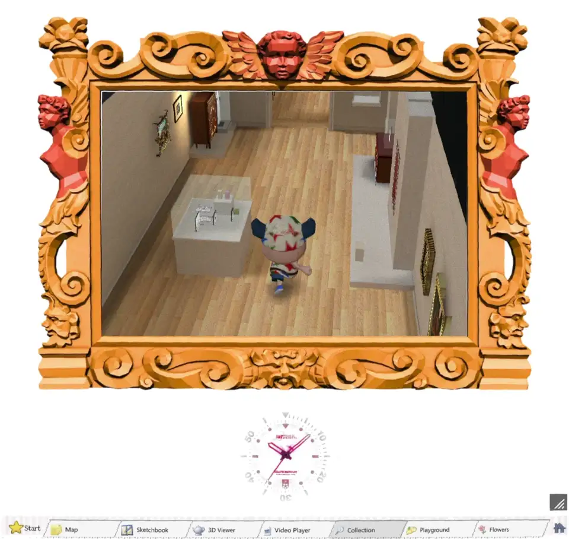

# RISD Museum Playground

A browser game for looking around the RISD Museum collection. It opens as a desktop with seven tabs: Map, Sketchbook, 3D Viewer, Video Player, Collection, Playground and Flowers. The recordings below show three of them running.

The game is made in [Godot 4.7](https://godotengine.org) and exported to the web. The museum rooms are rebuilt from walkthrough footage of the real galleries, and the sculptures are 3D scans.

> [!WARNING]
> This is a work in progress.

## Collection

You walk the museum as a small visitor. Click a work and the visitor goes over to it and its label comes up. Click again and the piece fills the screen so you can look closely. The clips below are cut from one walk, recorded on the [`room/runtime`](https://github.com/Reid-Surmeier/risd-godot/tree/room/runtime) branch.

Setting off from the first room:

The Main Hall, with a stop at Thomas Lawrence's portrait of Lady Sarah Ingestre:

The medieval room:

The European gallery, and a Spanish Crucifixion on its east wall:

A Piranesi print at the other end of the same gallery:

[Download the whole walk (1:52, MP4)](https://github.com/Reid-Surmeier/risd-godot/raw/main/docs/media/collection.mp4)

## Sketchbook

There is a paint box, a palette for mixing colours, and a book to draw in. A framed painting and a turning 3D scan sit next to the page as reference. Each of these is a window you can drag and resize.

[Download the full recording (1:17, MP4)](https://github.com/Reid-Surmeier/risd-godot/raw/main/docs/media/sketchbook.mp4)

## 3D Viewer

