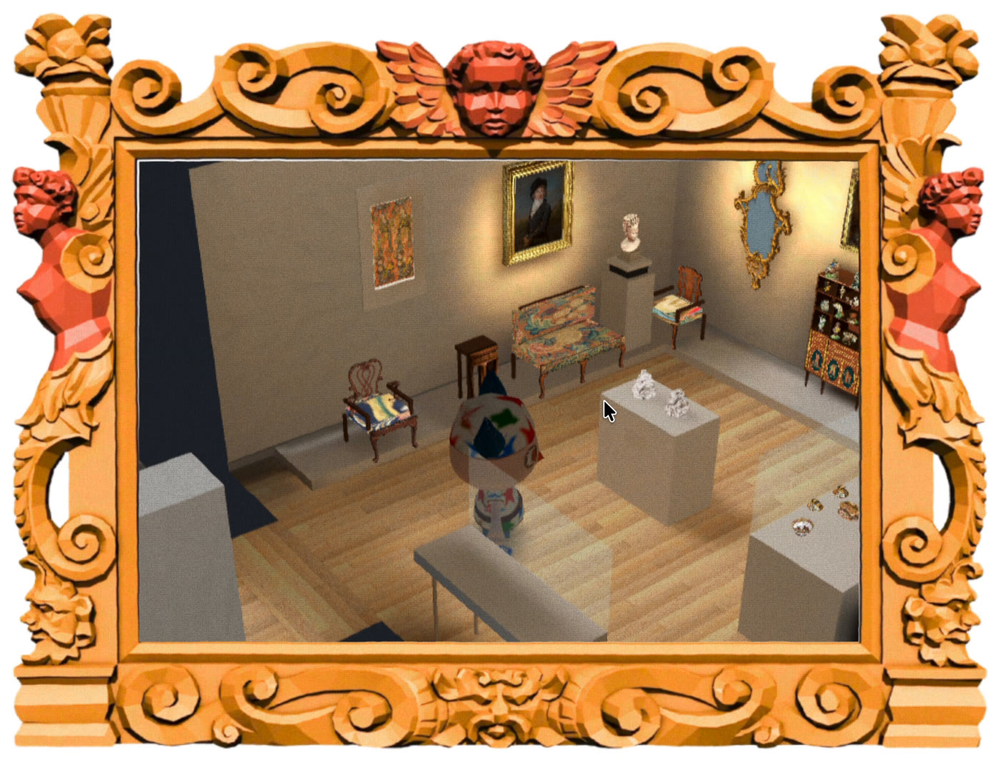
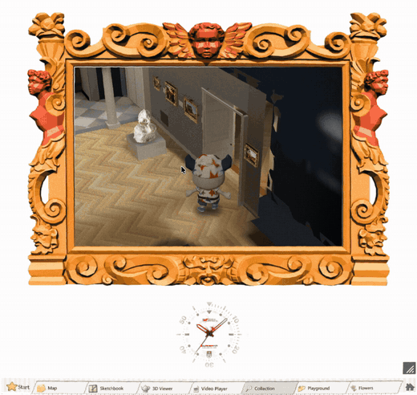
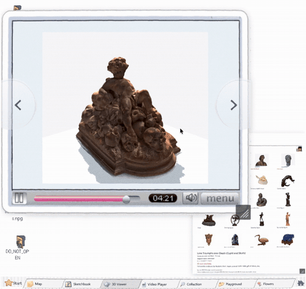

# RISD Godot

RISD Godot is a browser game for exploring the RISD Museum collection. It runs as a small desktop of seven tabs — Map, Sketchbook, 3D Viewer, Video Player, Collection, Playground and Flowers — where an object in the collection is something you can find, walk up to, turn around, draw from and keep.

It is built in [Godot 4.7](https://godotengine.org) and exported to the web. The museum rooms are rebuilt from walkthrough footage of the real galleries, and the sculptures are 3D scans.

> [!WARNING]
> This is a work in progress. The three videos below show what runs today; the To-Do list says what does not.

## To-Do

- [x] Desktop with seven tabs, running in the browser
- [x] 3D Viewer: turn and zoom scanned sculptures
- [x] Sketchbook: paint in a book beside a framed painting and a live 3D scan
- [x] Collection: walk eleven connected museum rooms as a visitor character
- [x] Click a work to read its label, walk up to it and zoom in (176 of 177 works pass the automated walk-through)
- [x] Visitor character with walk, sprint, jump and footstep sound
- [ ] Merge the connected museum into `main` — it lives on [`room/runtime`](https://github.com/Reid-Surmeier/risd-godot/tree/room/runtime); `main` still carries the earlier single gallery ([#238](https://github.com/Reid-Surmeier/risd-godot/issues/238))
- [ ] Pass the museum review — [round 2](https://github.com/Reid-Surmeier/risd-godot/blob/room/runtime/docs/releases/v0.1.0/museum-review/round-2.md) ended "not done"; fixes since then have not been re-reviewed
- [ ] Room, doorway and hanging measurements — 21 of 23 Main Hall paintings hung more than 10 cm off the footage
- [ ] Missing architecture: the Skylight Gallery's stair and landings, the marble hall's upper floor, and the unfinished doorway stubs
- [ ] The chandelier cannot be selected; some close-up views are blocked by a case or wall
- [ ] Gallery lighting: in round 2 the floor was still brighter than the art in seven rooms (re-lit since, not re-reviewed)
- [ ] Sitting on benches
- [ ] Faster first load — the browser build downloads about 470 MB ([#141](https://github.com/Reid-Surmeier/risd-godot/issues/141))
- [ ] Footstep sound timing confirmed on devices other than the development machine ([#235](https://github.com/Reid-Surmeier/risd-godot/issues/235))
- [ ] Cover art and logo

## Demos

Each preview is a short loop of the game running. The full recordings are MP4 files in [`docs/media/`](docs/media).

### Collection: walk the museum

[](https://github.com/Reid-Surmeier/risd-godot/raw/main/docs/media/collection.mp4)

[Download the full recording (1:52, MP4)](https://github.com/Reid-Surmeier/risd-godot/raw/main/docs/media/collection.mp4)

- Connected rooms rebuilt from footage of the RISD Museum, seen from a dollhouse camera that cuts away the near walls
- Click any work: the visitor walks over, the label opens, and a second click fills the screen with the piece for a close look
- Paintings, frames and labels come from the museum's collection records
- Recorded from the [`room/runtime`](https://github.com/Reid-Surmeier/risd-godot/tree/room/runtime) branch

### Sketchbook: draw from the collection

[](https://github.com/Reid-Surmeier/risd-godot/raw/main/docs/media/sketchbook.mp4)

[Download the full recording (1:17, MP4)](https://github.com/Reid-Surmeier/risd-godot/raw/main/docs/media/sketchbook.mp4)

- A paint box, a mixing palette and a book you draw in
- A framed painting and a turning 3D scan can sit beside the page as reference
- Every panel is a window that can be dragged and resized

### 3D Viewer: turn the sculptures around

[](https://github.com/Reid-Surmeier/risd-godot/raw/main/docs/media/3d-viewer.mp4)

[Download the full recording (0:43, MP4)](https://github.com/Reid-Surmeier/risd-godot/raw/main/docs/media/3d-viewer.mp4)

- 3D scans of museum sculptures, lit and turnable from every side
- Zoom close enough to read tool marks and paint
- A catalogue window picks the piece; its record shows underneath

## Code

The game is one Godot project split into modules. Each module keeps a small public interface that the rest of the game talks to, plus the tests that define when it is done.

| Where | What |
| --- | --- |
| [`MODULES.md`](MODULES.md) | The map of the codebase — read it first |
| `modules/shell/` | The desktop and its seven tabs |
| `modules/sketchbook/`, `modules/sculpture_viewer/`, `modules/atlas/`, … | One module per tab |
| `modules/collection_data/` | Artwork search and saved works |
| `testing/`, `review/` | Test harnesses and release review records |
| [`docs/adr/`](docs/adr) | Design decisions |

## Run it

Use Godot 4.7.2 with matching Web export templates.

```bash
godot --headless --editor --import --path .   # import a fresh checkout
godot --path .                                # open the game
scripts/check.sh                              # module map, seams, lint, project import
scripts/export-web.sh                         # browser build in build/web/
```

The browser build needs the collection server beside it for artwork search:

```bash
npm ci --ignore-scripts
RISD_SEARCH_PORT=8142 npm run collection:serve -- build/web
```

## Inspirations & Acknowledgments

- [RISD Museum](https://risdmuseum.org) — the collection, its records and the galleries themselves
- Animal Crossing — the dollhouse camera, the museum and the way the visitor moves
- [Godot Engine](https://godotengine.org)
- [Ruffle](https://ruffle.rs) — plays the Flowers tab
- [tldraw](https://tldraw.dev) and [Mixbox](https://scrtwpns.com/mixbox/) — drawing and paint mixing in the Sketchbook

## License

No license has been chosen yet. Artwork images and records belong to their sources; bundled third-party code keeps its own license.
