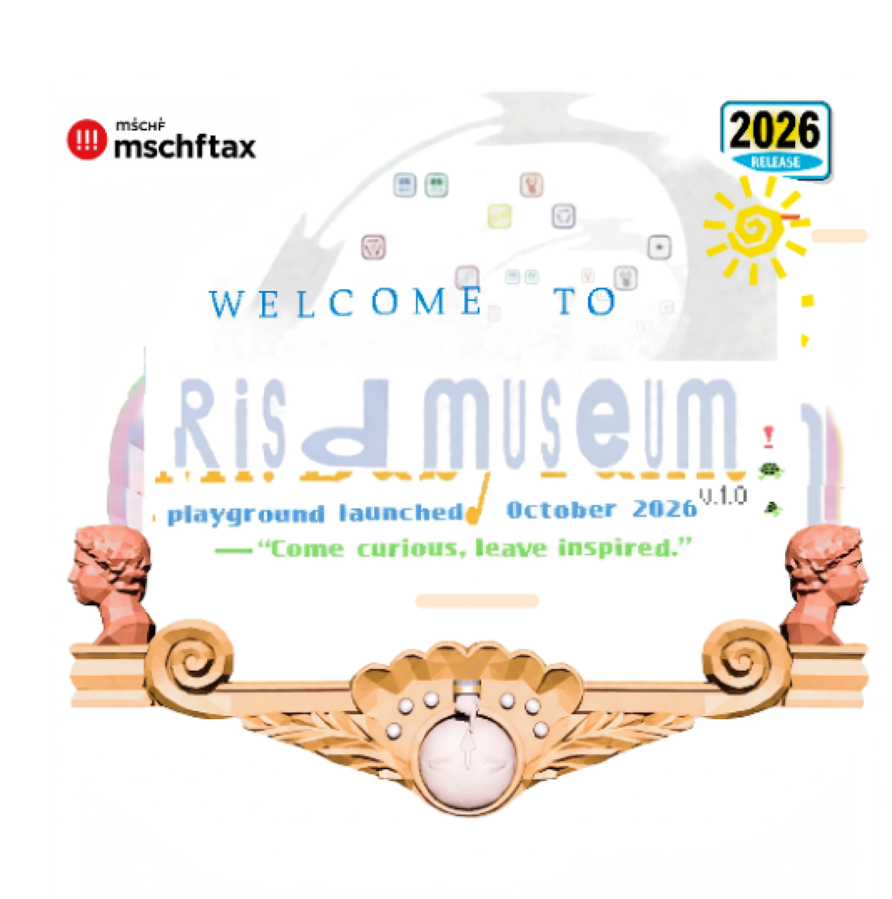
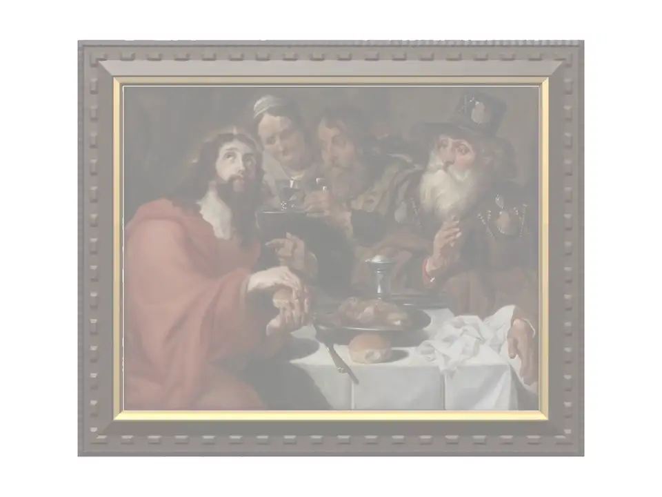
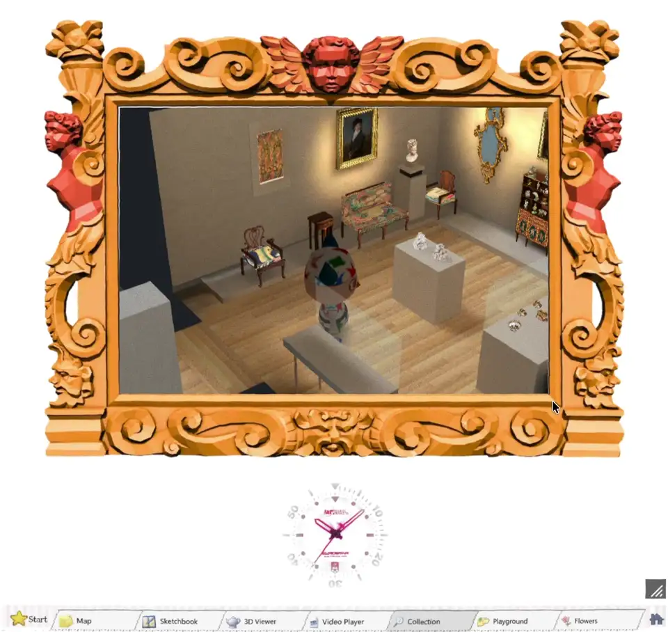
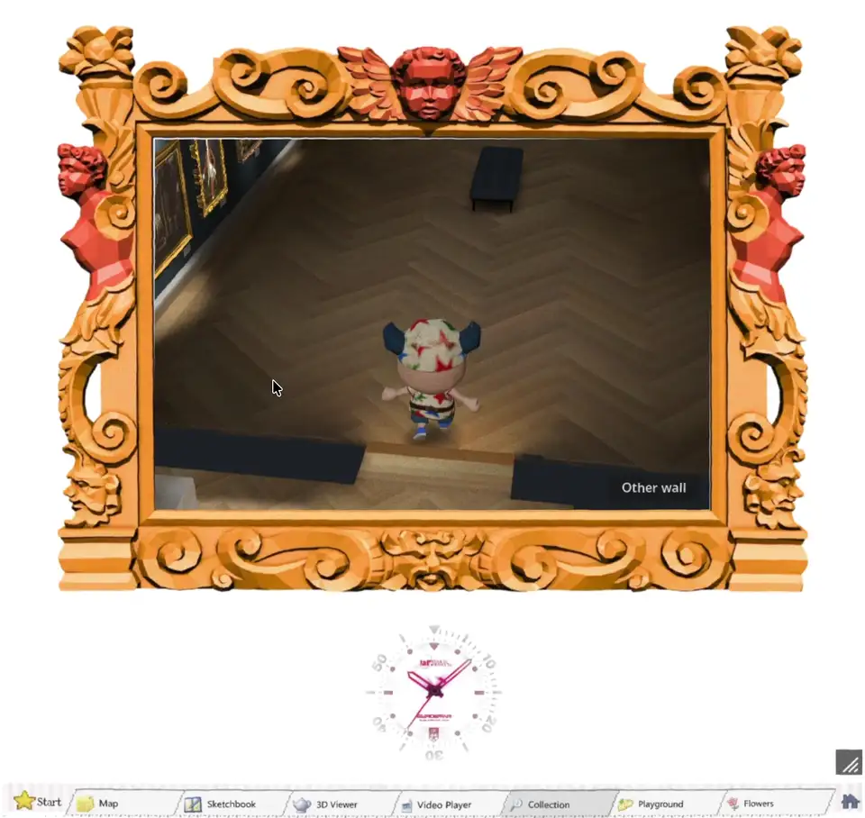
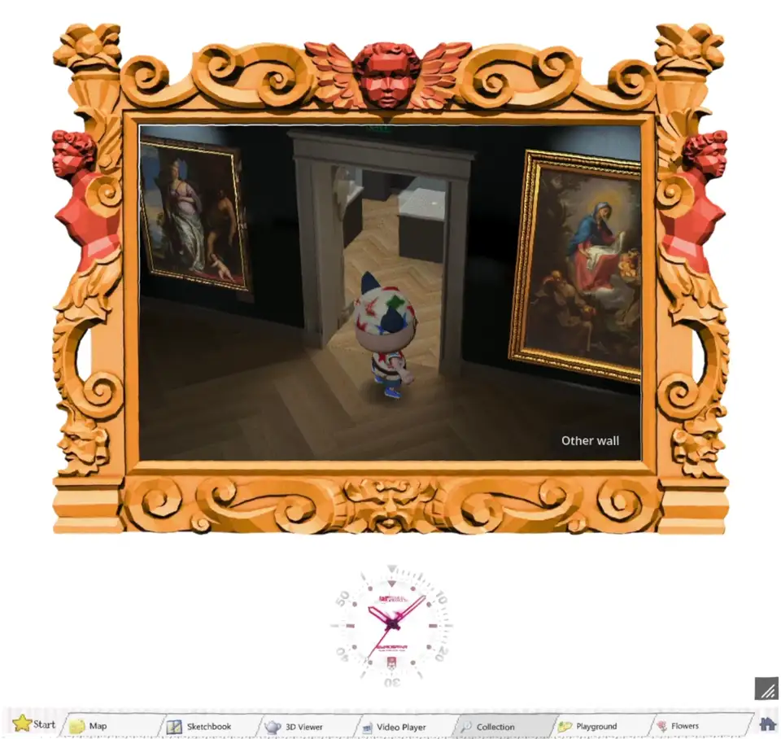
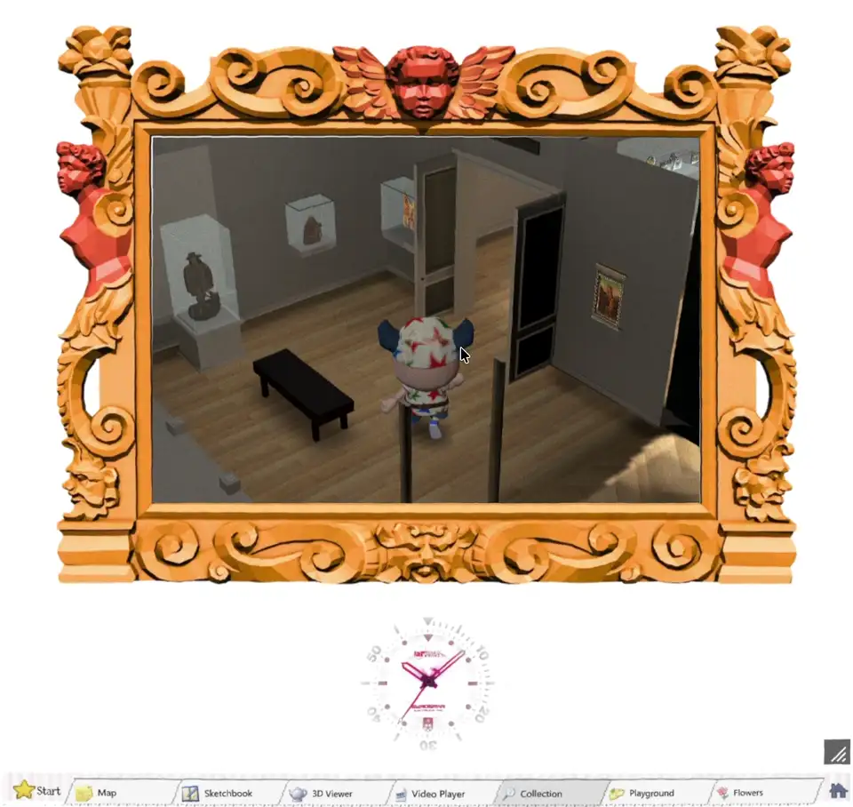
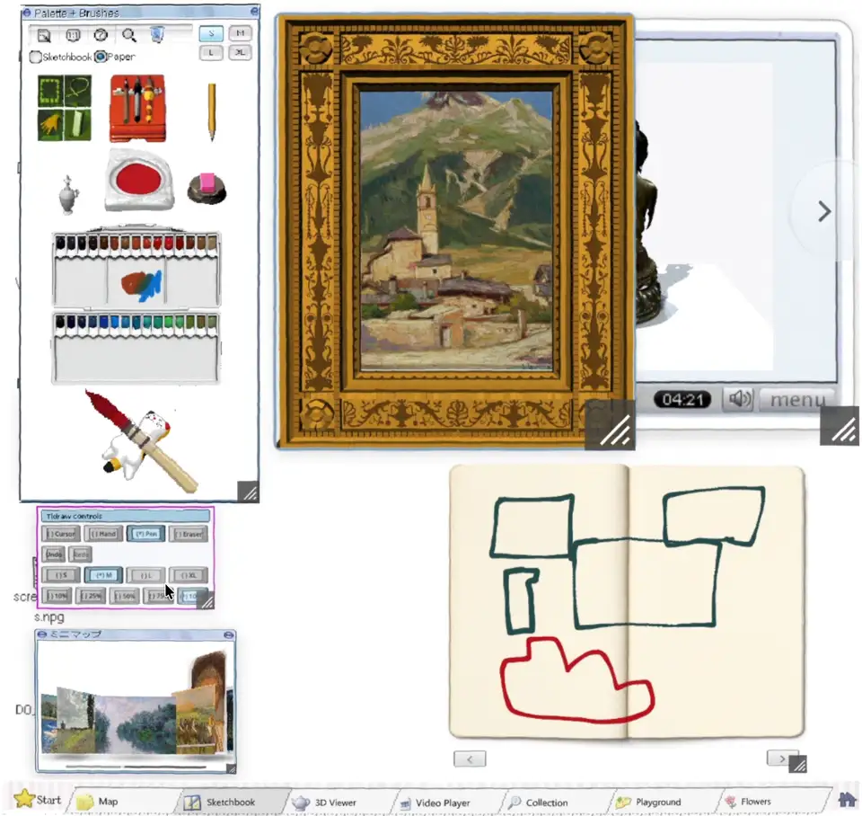
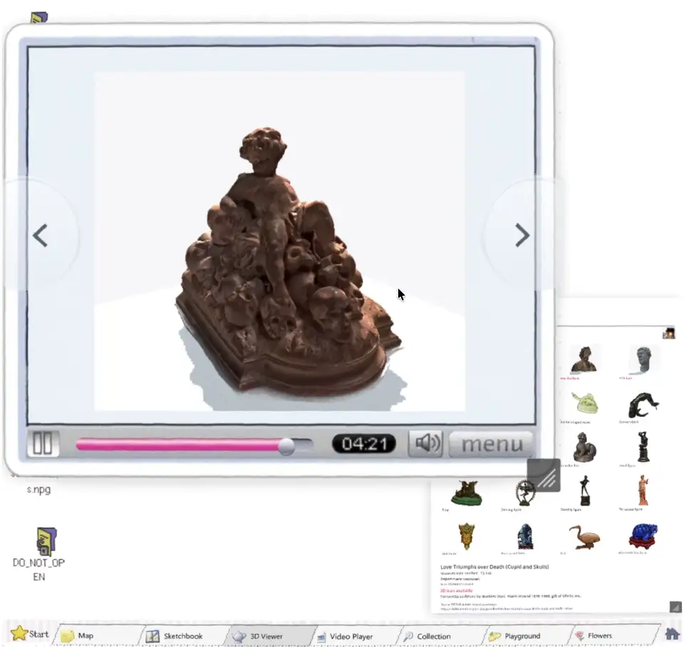

  

# RISD Museum Playground

RISD Museum Playground is a browser game for exploring the RISD Museum collection. It contains playable modes, including walking the replica of the RISD Museum's physical location, a draw mode which allows you to draw digitally from paintings and sculptures, and a 3D sculpture viewer tab for viewing a selection of 3D scans.

The game also has more pages that are currently still under development and will be added soon.

The following are some demos of current drafts of each of the tabs.

> [!WARNING]
> This is a work in progress.

The Main Hall, with a stop at Thomas Lawrence's portrait of Lady Sarah Ingestre:

The medieval room:

The European gallery, and a Spanish Crucifixion on its east wall:

[Download the whole walk (1:52, MP4)](https://github.com/Reid-Surmeier/risd-godot/raw/main/docs/media/collection.mp4)

## Sketchbook

[Download the full recording (1:17, MP4)](https://github.com/Reid-Surmeier/risd-godot/raw/main/docs/media/sketchbook.mp4)

## 3D Viewer

