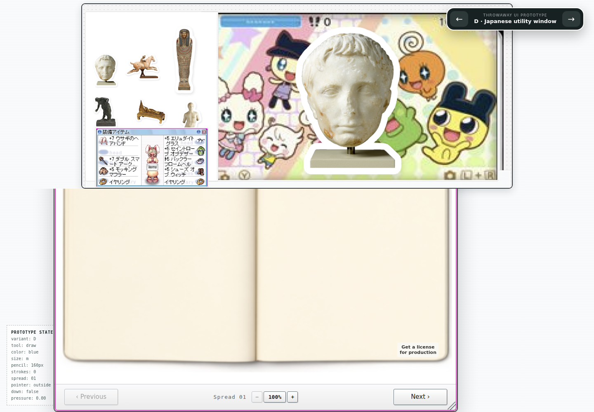
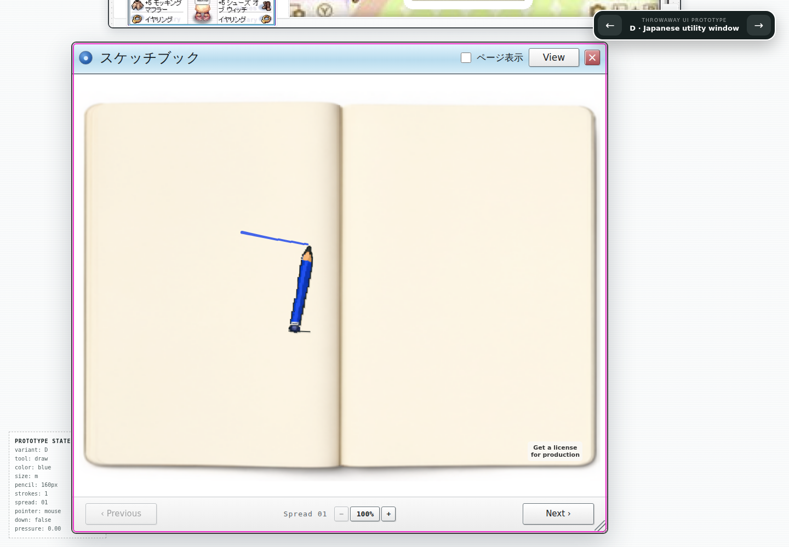

# Remove the clipped drawing viewport — Issue #16

Comparison evidence for the owner's September 6 clipping report. Baseline: `f28f8c6`.

The previous layout pinned the reference header above a short independent scroller. Scrolling to the book footer left 224–268 px of the upper book behind that viewport's clipping edge. Earlier tests checked element dimensions without testing whether the paper could actually be reached through its ancestors.

Variant D now uses one page scroll. The header remains above the book in the layout and can scroll out of view. The book participates in normal layout so resizing changes the page's scrollable height. The 980×900 window and 952×714 fitted book are unchanged; the same screenshot remains the header source.

The new regression first failed at 1440×1000 and 2048×1080, then passed after the CSS correction. It scrolls to the footer and checks the title, full book, footer, and actual pointer access to the upper paper. The live 1440×1000 replay placed the whole window between y=76 and y=976, drew a stroke, and reported no browser runtime errors. The final screenshot was inspected visually.

Final verification: full browser suite 34/34 passed through Tailscale (1.4 minutes); `npm run prototype:kidpix:check`, `scripts/check.sh`, and `git diff --check` passed. No paid generation or artwork changes.
