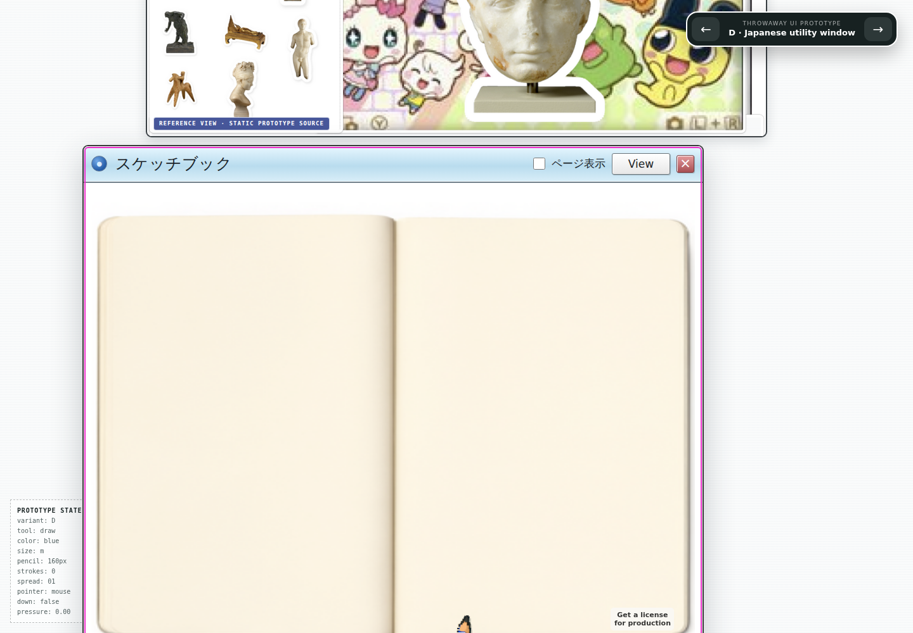
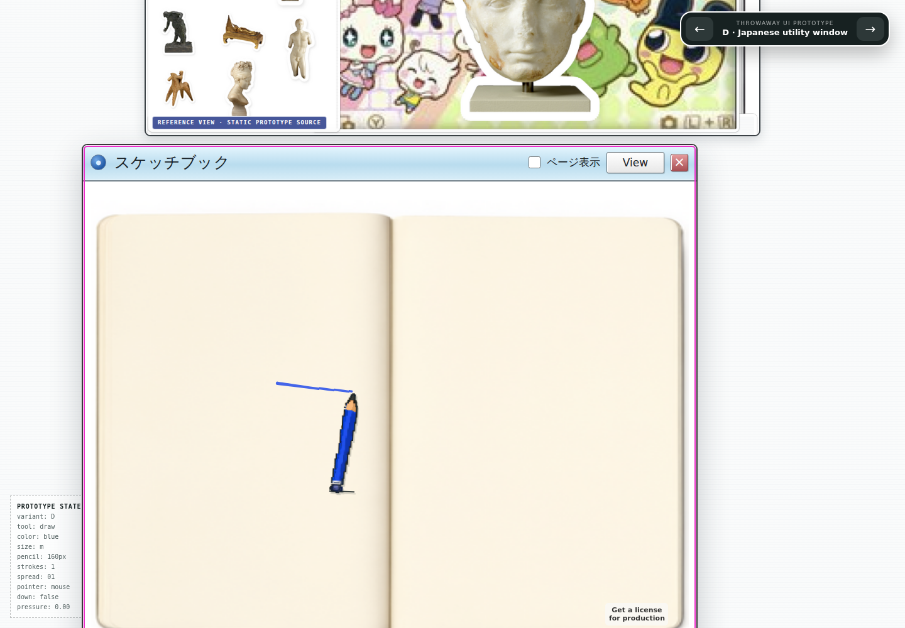

# Pencil alignment and responsiveness — Issue #16

Comparison evidence, captured September 6, 2026. No generated artwork changed; no paid calls.
Baseline: `116be69033545df09fa199445a28edc95ee1fb80`.

Before: the pencil is displaced into the filtered/clipped book area.



After: the graphite tip follows the actual stroke endpoint, including the first stroke after scrolling.



The gutter filter made a fixed cursor relative to the drawing surface instead of the viewport. A body portal isolates it from that filter and from the other variants' window transforms. The animation now pivots on the graphite tip. Pointer movement updates the cursor element directly; changes to pointer status still update the diagnostics. The editor's throttled viewport measurement also caused a 191 px first-stroke jump after scrolling in D (73 px in E); refreshing its bounds at pointer-down fixes that without measuring on every move.

Measured with Chromium at 1440×1000, using the existing software-rendering test settings:

| Check | Before | After |
| --- | ---: | ---: |
| D pencil displacement in initial hover replay | 388 px | under 3 px |
| Workspace commits during 30 hover events, D and E | 30 | 0 |
| JavaScript time during 60 hover events | 249 ms | 17 ms |
| Main-thread task time during the same hover replay | 820 ms | 568 ms |

Timing is one same-host diagnostic comparison, not a frame-rate or cross-device guarantee. The regression tests assert the eliminated workspace rerenders rather than a machine-dependent time threshold. The final Tailscale drawing replay measured a transformed graphite hotspot error of 0.004 px, a stroke-origin error of 0.18 px, and zero browser runtime errors; the screenshot above was inspected visually.

Regression command from the repository root:

```bash
PLAYWRIGHT_BASE_URL=https://windows-wsl.taile06c45.ts.net/risd-sketchbook-qwen-01a0544b/ npm --prefix prototypes/kidpix-tldraw run test:browser -- --workers=1 --output=/tmp/risd-pencil-final-suite
```

Final verification: 32/32 browser tests passed through Tailscale (1.3 minutes), `npm run prototype:kidpix:check` passed, `scripts/check.sh` passed, and `git diff --check` passed. New tests first failed on the original cursor displacement, per-event workspace commits, and immediate post-scroll stroke displacement. Existing coverage still passes for all five variants, 50 strokes, touch, resize, zoom, erasing, and drawn page-turn restoration.
