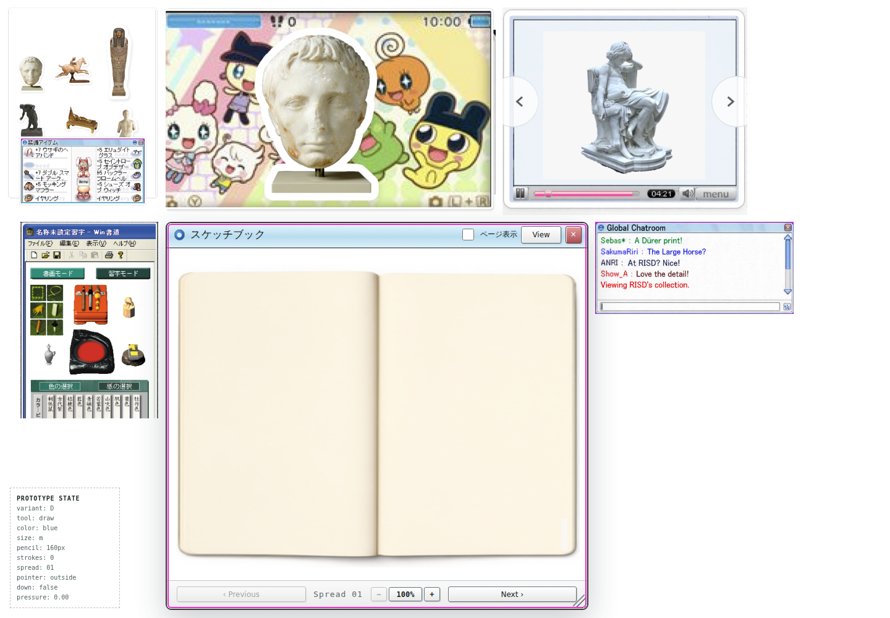
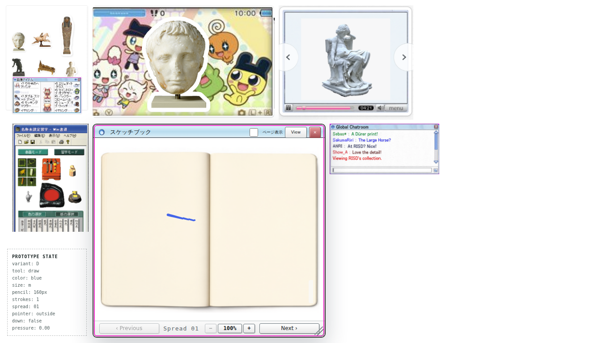

# Fit desktop to the screen — Issue #16

The owner reported excessive zoom and requested removal of the bottom prototype switcher. The desktop now fits both available width and height, reducing the previous layout to about 70% at 1440×1000. The book retains its proportions, drawing, zoom and resize grip. Variant D no longer displays the switcher or reserves its bottom strip. Source PNGs are unchanged.

The implementation scales actual layout sizes instead of transforming the drawing surface, keeping pointer coordinates in CSS pixels. Resizing the browser refits the composition; resizing the book by hand still enlarges it deliberately.

Verification: full Tailscale browser suite 36/36 passed (`/tmp/risd-fit-full`); after the final footer fit adjustment, seven focused cursor/layout/resize checks passed (`/tmp/risd-fit-controls`). Those include no desktop overflow at 1440×1000, 2048×1080 and 1366×768, complete footer controls and no prototype switcher. TypeScript, `scripts/check.sh`, and `git diff --check` passed. Browser preview returned HTTP 200 with zero page errors; a real stroke committed after browser resizing. Both screenshots were inspected visually. No paid calls.
