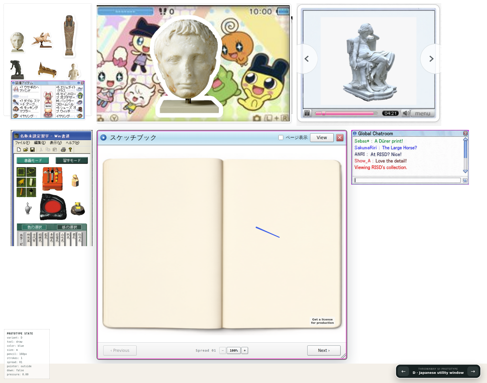
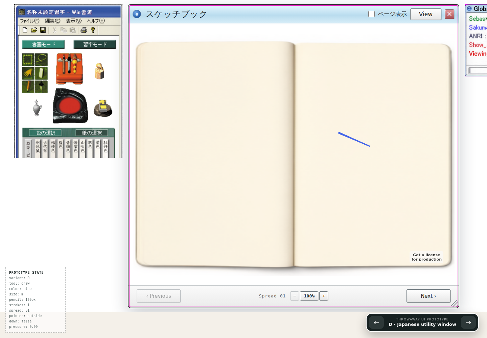

# Four-panel Sketchbook desktop — Issue #16

[Owner orientation](orientation-source.png). [Previous layout](../clipping-fix/after.png). The four owner images are unchanged; hashes and source paths are in `prototypes/kidpix-tldraw/public/desktop-panels.provenance.json`. Ordinary Git stores these source references and comparison screenshots. The 1905×1500 evidence viewport shows the whole desktop; the 1905×1280 geometry test matches the orientation reference viewport.

The museum grid, head reference and statue player sit above the live book, with calligraphy left and chat right. The book remains 980×900 with a 952×714 fitted stage. One desktop scroll preserves this size on narrower screens. Prototype navigation has its own bottom strip so it cannot intercept the book resize grip. The four supplied panels are static artwork; no chat, playback or palette behavior is claimed. No generation or paid calls.

Verification on September 8, 2026:

- Tailscale browser HTTP 200, no page errors, and a real pointer stroke committed; see `browser.json`.
- Full browser run: 34/35 passed; the 1440 px whole-book check caught 34 px of title clipping from excess bottom padding. After removing that padding, all four affected layout and resize checks passed (`/tmp/risd-desktop-geometry`). The other 31 tests passed in the full run, including cursor alignment/performance, spread restoration, zoom, touch and 50 strokes.
- `npm run prototype:kidpix:check`: passed.
- `scripts/check.sh`: checks passed.
- `git diff --check`: passed.
- Four source PNG hashes verified byte-for-byte. Screenshots inspected visually for orientation, proportions and clipping.

Browser command: `PLAYWRIGHT_BASE_URL=https://windows-wsl.taile06c45.ts.net/risd-sketchbook-qwen-01a0544b/ npm --prefix prototypes/kidpix-tldraw run test:browser -- --workers=1 --output=/tmp/risd-desktop-verified`. Focused correction used `--grep 'whole unchanged book|all four supplied|refits a wider'` with output `/tmp/risd-desktop-geometry`.
