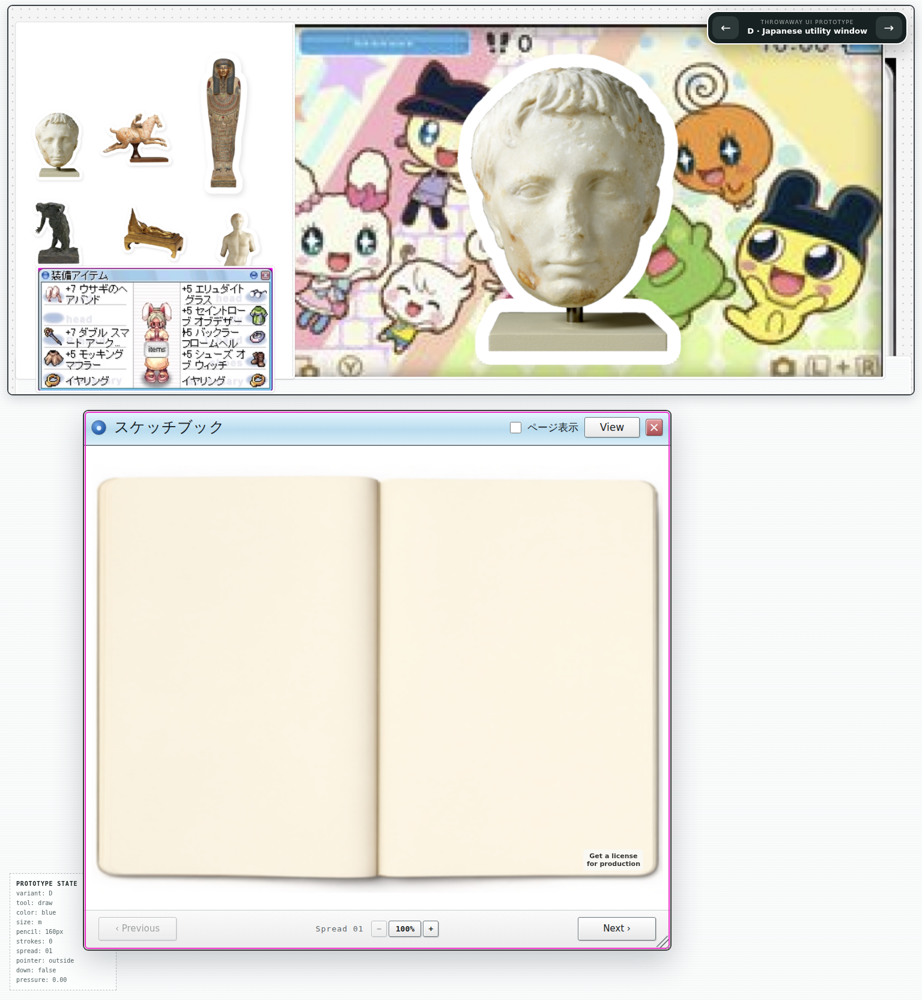
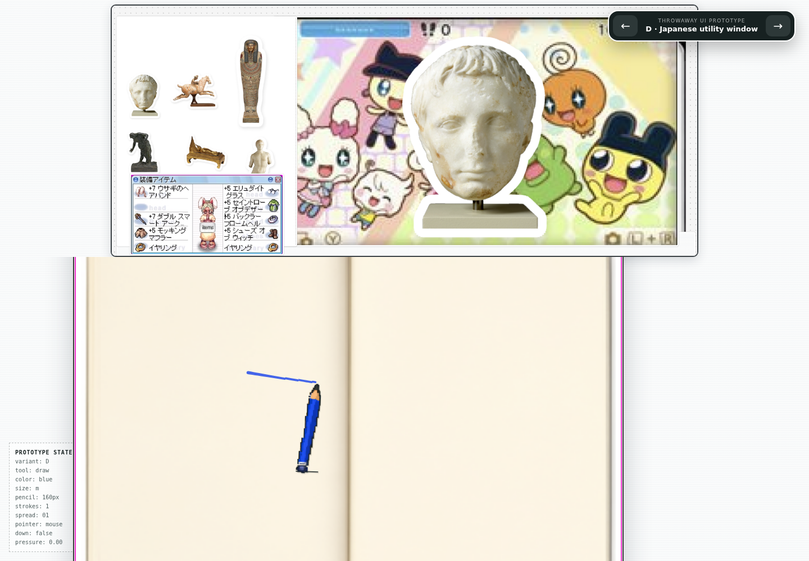

# Fixed reference header — Issue #16

Comparison evidence for the September 6 owner layout correction. Baseline: `1623214` on the Sketchbook prototype branch.

Variant D displays the upper 1535×660 region of the owner's screenshot as a fixed header. The screenshot is copied byte-identically to `public/header-layout-source.png`, with provenance beside it; the visible region is selected using CSS, without image generation or pixel edits. The drawing pane scrolls independently. Header scaling is capped at 45% of viewport height so shorter screens retain usable drawing space.

The sketchbook dimensions are unchanged: a 980×900 window and a 952×714 fitted book at the 1440×1000 test viewport. The same book dimensions were measured at 1535×1664. Zoom, resize, page turns, drawing state, and the pencil fixes remain in place. Other variants retain their original headers.

**Still pending:** the requested icon animation's source file or URL. The existing reference and supplied screenshot are still images; no unrelated motion was substituted. The owner was asked which animation to use.

Verification: the new geometry test first failed against the old header, then passed. The full browser suite passed 33/33 through the existing Tailscale URL; TypeScript check, `scripts/check.sh`, and `git diff --check` passed. Both screenshots were inspected. Live drawing completed with no browser runtime errors. Test gestures now scroll the paper into view below the fixed header before drawing. No paid calls.
