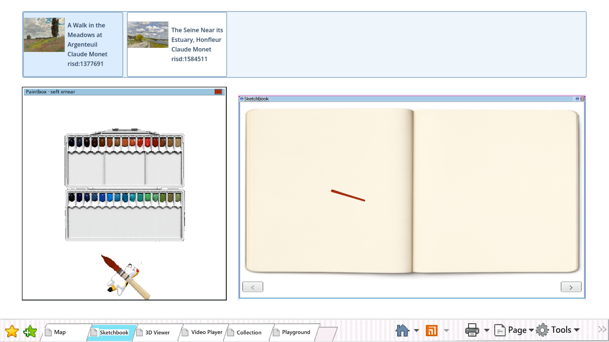
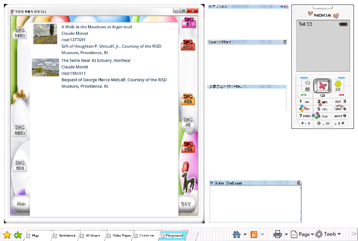
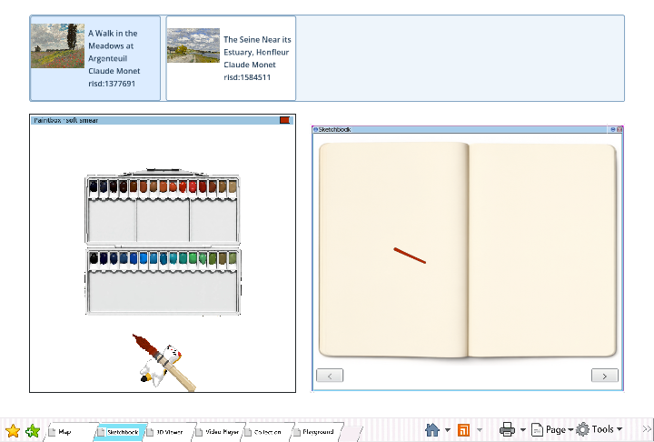
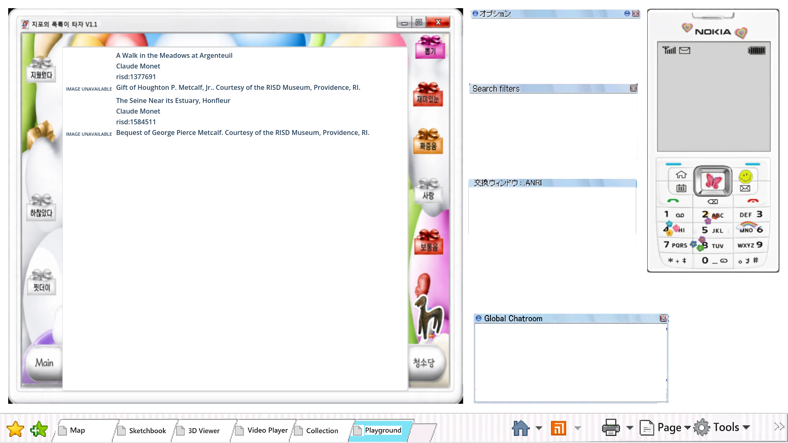
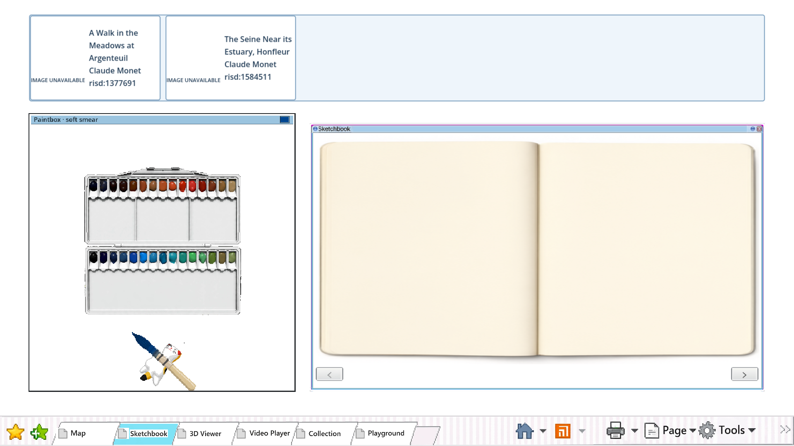

# Browser-local RISD saves












Exact tested builds: save in `5133271.html`, then reopen in corrected `c15e184.html` on the retained
`risd-desktop-godot-f57d02de` origin.

The Playwright journey opened two game pages, saved a different RISD artwork from each at the same
time, verified both committed records and images in Playground and Sketchbook, closed Chrome, then
reopened the same browser profile on the newer build and verified both records again. `report.json`
records the IDs, destinations, restart and build-update results, and zero unexpected browser errors.
The same journey forces denied, quota, aborted, corrupt and newer-version storage failures and checks
that each leaves the committed document unchanged and never reports `Saved`.
On the corrected build it selects a saved reference, chooses pigment, paints, changes reference,
turns forward and back, switches Tabs, and verifies the reference, stroke, pigment and spread remain.
It blocks image requests and verifies that both destinations retain artwork metadata and show
`IMAGE UNAVAILABLE`. The same journey passes at 720×486; `report-720x486.json` records that run.

The pinned `/risd-collection-browser/index.html` landing-path proof remains blocked by issue #77:
the approved share tool publishes only session-suffixed paths and forbids hand-written Tailscale
mounts. These results prove same-origin browser restart and SHA upgrade behavior without claiming
that unresolved fixed-path publication requirement.

Run:

```bash
PLAYWRIGHT_MODULE=/path/to/playwright/index.mjs \
  node modules/collection_data/playtest/saves_browser.mjs OLD_URL OUT_DIR NEW_URL
```
