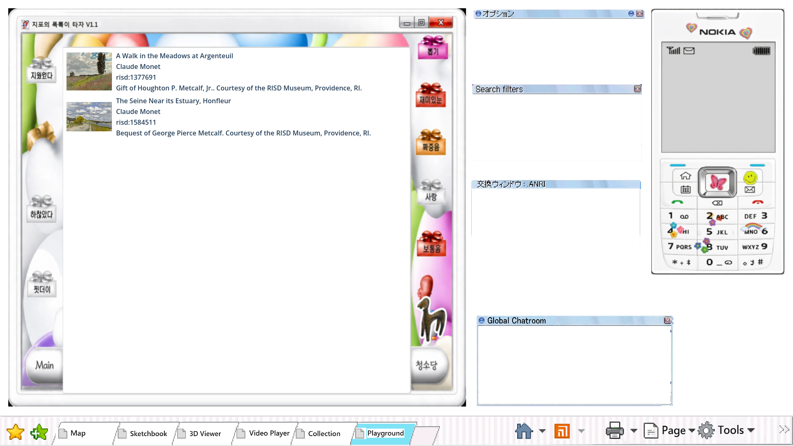
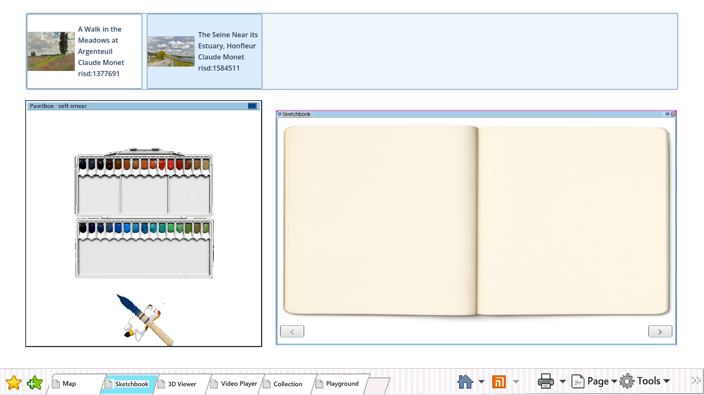
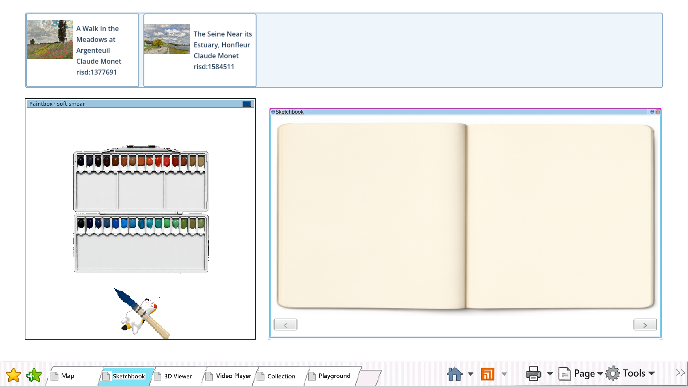

# Browser-local RISD saves







Exact tested builds: save in `5133271.html`, then reopen in corrected `59bac9d.html` on the retained
`risd-desktop-godot-f57d02de` origin.

The Playwright journey opened two game pages, saved a different RISD artwork from each at the same
time, verified both committed records and images in Playground and Sketchbook, closed Chrome, then
reopened the same browser profile on the newer build and verified both records again. `report.json`
records the IDs, destinations, restart and build-update results, and zero unexpected browser errors.
The same journey forces denied, quota, aborted, corrupt and newer-version storage failures and checks
that each leaves the committed document unchanged and never reports `Saved`.

Run:

```bash
PLAYWRIGHT_MODULE=/path/to/playwright/index.mjs \
  node modules/collection_data/playtest/saves_browser.mjs OLD_URL OUT_DIR NEW_URL
```
