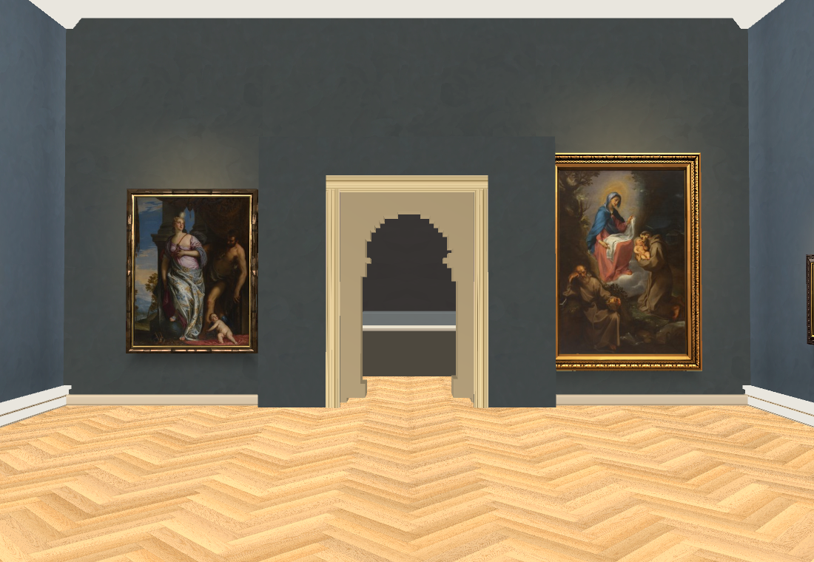
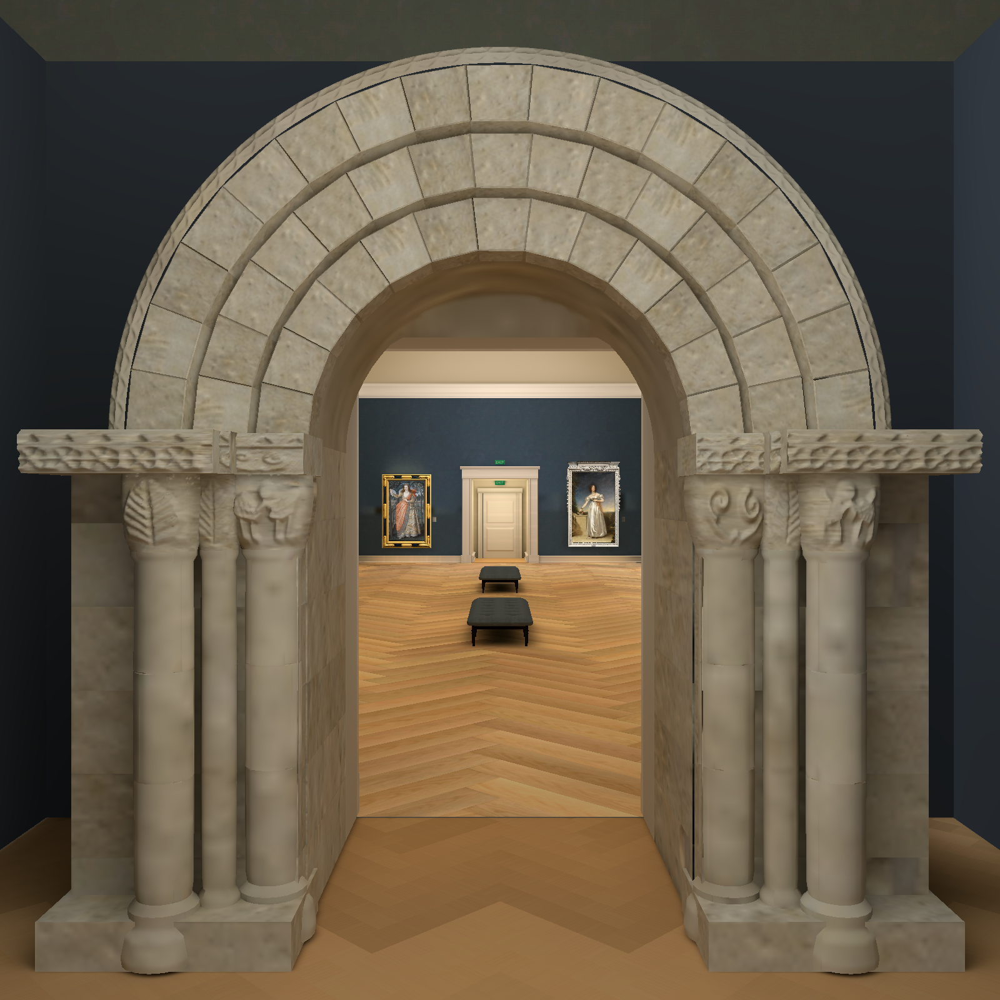
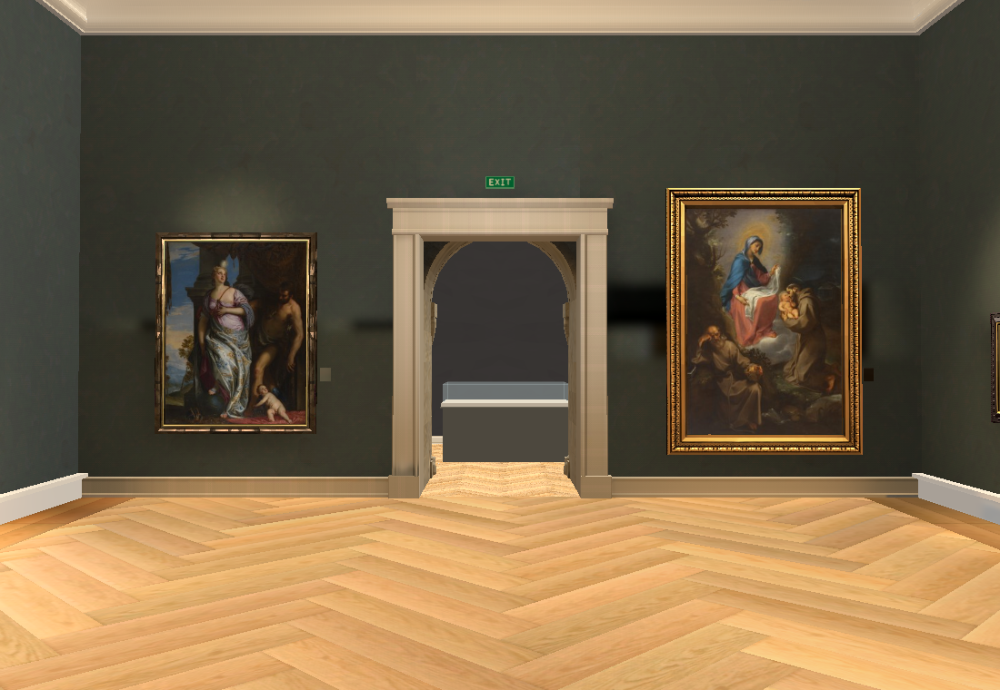
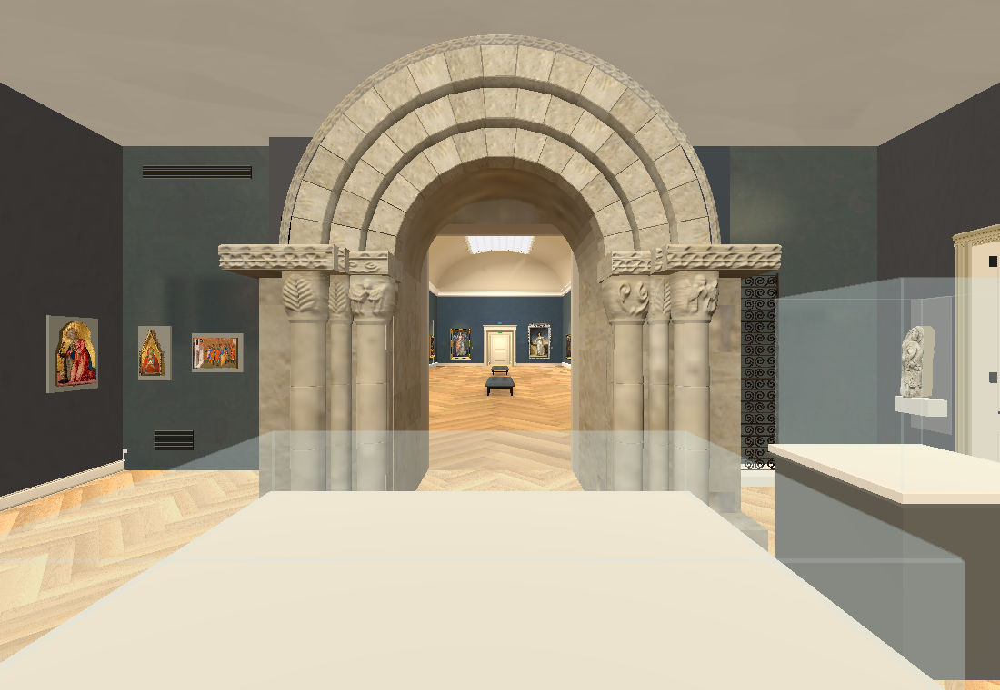

# Collection main-build attachment checkpoint — 2026-10-01

The previous v47/v48 progress report overstated Main Hall preservation. Those demos used a stripped Hall from an older commit. The current build at `317b8f3b8dac0f9811d396bcb0260c7187f93f11` has the deeper stone portal, EXIT sign, native floor, tufted benches, vestibule and newer camera/cutaway controls. Claude Opus 5.5 independently confirmed the difference in OPUS-REVIEW.md.

Concrete work: archived 362 original Main Hall source files and verified their hashes; rendered the actual saved Hall; made a separate attachment trial retaining 133 of 139 native meshes, hiding six adjoining placeholder-room meshes. New-room bake paths are separate from the Main Hall saved bake. This trial does not integrate the production Collection factory or preserve the full main-build controls. It is not a verified connected museum build.

Checks: scripts/check.sh and git diff --check pass. Owning Shell playtest is 46/50 with the four previously recorded failures. Native RTX trial passes with antialiasing disabled; CPU trial passes with 2× MSAA. The RTX 2× MSAA trial failed with a D3D12 device removal. Far-door vestibule overlap, continuous traversal, cutaway and new-room lighting remain unresolved. No v49 browser export is approved; the existing v47 playable link remains the older demo.

Three exact Claude Opus 5.5 workers ran in isolated worktrees. Main-build review accepted and worker reused for a Collection adapter. Seated Woman 67.089 helper/checks accepted as a low polygon trial, copied into this prototype, and worker reused for modern room layout review. Oval Villon frame correction is still active. Sculpture rear/depths and case metres are provisional; gold surface is plain, not a new Muse result. Source review found two modern windows, not three, and an adjoining doorway on the Cézanne wall, not the window wall. Those topology corrections still need implementation.

Spend this review: $0. Previous three modern-frame Muse passes cost $0.03; project recorded total remains $0.84 actual / $0.85 conservative. No paid retries.

Next action: accept the oval-frame patch and main-build adapter; correct the modern room from the source review; attach and bake rooms separately in a local copy of the complete main build, then inspect native and browser traversal. Full ten-video reconstruction, all object inventory, stair destinations and source-calibrated room positions remain unfinished. Heartbeat remains disabled. 3D Viewer unchanged.

## Follow-up at 13:30 UTC

Accepted and copied the oval-frame patch; its 21 checks pass, with zero original oval-painting pixels changed. Native front inspected: rectangular reveal removed; box recess still painted and crop/width provisional. Seated Woman 67.089/case installed and dimensions/closure checked independently. One new OpenRouter Muse bronze surface pass, run-aa2645a69d7e5d2d83b1f306, confirmed actual $0.01; cumulative $0.85 actual / $0.86 conservative. Native software render of textured figure inspected; rear/limb form and offsets unaccepted. RTX render failed even with MSAA off, so antialiasing alone is not a proven cause. Raw failure logs retained.

Accepted Opus continuous-pan review: entry shares the Braque/Villon wall; two windows and figure on their adjacent wall; doorway shares the Cézanne wall. Source strips/plan in ../opus-modern-layout-review-20261001/. Worker reused to implement that quarter-turn with paired openings and no room overlap. No metric acceptance.

Accepted main-build Control adapter as a draft, with reports and runnable checks in ../opus-main-build-adapter-20261001/. Its 19-leg loop passes; 78/87 old traversal expectations agree, all 13 blocked trials agree. Nine differences remain recorded; far-door/group changes use the existing white cover. Added art detail opening and measured frame time remain unfinished. Full-app local preview created via its recipe, with only preview demo.gd and export preset changed among original tracked files; real build remains untouched. Root reran headless adapter check successfully, with 12 resource-leak errors at teardown (not a clean zero-error run). Native full-app inspection now running. No new playable build published.

## 2026-10-01 13:37 UTC — actual Collection factory rendered

Full-app v50b mounted the adapter through the actual main-build demo.tscn factory and captured Hall, medieval, grey and pre-correction modern rooms with unchanged UI. Software native run exited 0 without runtime errors. Root inspected all four images. Added rooms remain unbaked; floor darkness and cutaway/case visuals need the next render. RTX still fails intermittently even with MSAA off. Modern-layout worker remains active; next action is review/apply its patch, bake only additions, then native/browser traversal. The standalone adapter harness passes functional assertions but reports teardown leaks; normal full-app capture is clean.

## 2026-10-01 13:53 UTC — scoped prototype checkpoint
Collection-only prototype for issues178/181/182/183; heartbeat disabled, main session owns implementation. Corrected earlier Main Hall preservation claim: v47/v48 reused a stale stripped Hall. Actual build/v0.1.0 at317b8f3b8dac0f9811d396bcb0260c7187f93f11 is now the reference;362 original Hall files checked byte-identical,139 native baked meshes retained by full-app adapter,23 artworks. Real demo.tscn Collection factory rendered Hall/medieval/grey/pre-correction-modern with original controls, frame, clock, tabs, character and shaders. Software native capture exits0 with no runtime errors. Production checkout remains tracked-clean and untouched.

Actual Claude Opus5.5 workers reviewed Main Hall, delivered one adapter, corrected Villon oval backing, built a SeatedWoman/case trial, reviewed the6387 interior pan and delivered its four-file layout patch. Exact BASE/result hashes and delivery evidence verified before applying. Headless adapter retains Hall geometry/material/layers/lightmap/camera/control behavior and walks19legs;78/87 prior trials agree,9 discrepancies retained (native portal posts and far vestibule transition),no claim of continuous metric connectivity. Headless harness reports teardown resource leaks; ordinary full-app native capture is clean. Root modern interior check passes; unchanged BASE fails34 checks. Root inspected new native two-window wall/case/second-doorway views. Landing anchor remains wrong: independent9.5/43.5s wides show perpendicular doorway planes; source identity/order review active, refit next. Exact metres, rear sculpture coverage, frame fidelity and all-objects flags remain false. No point clouds used.

New single-output OpenRouter meta/muse-image bronze surface for catalogue67.089, run-aa2645a69d7e5d2d83b1f306, objective muse-eee9d65045609a306d10, native SHA2561de65113068b8523bf9f5b5ccdf231f47c93eaf481b9b0938d8bc14523983c9d, actual$0.010000. Official front photographs0/1 supplied; bronze/gold-wash medium and71.1x20.3x24.1cm checked. Quiet ochre patina visually inspected and installed on closed14-shell/344-triangle catalogue-bounded blockout; rear/pose depth unaccepted. Provider returned1600square despite1024 request; no exact-size claim, no retry. Run state confirms actual cost; compact receipt spendState unknown retained verbatim.74 new outputs plus prior$0.11:$0.85 actual/$0.86 conservative. Three v48 frame receipts/native outputs/full archives also checkpointed; Villon official oval pixels protected, obsolete rectangular reveal removed, rim/profile fidelity provisional.

Repository scripts/check.sh and diff checks pass. Owning Shell46/50 with four recorded prior failures; full film/log saved. RTX D3D12 device removal also occurred with MSAA off; unresolved, software fallback verified. Added-room bake and new browser export not yet verified. Addition-only bake paths exclude native Hall; full-app copy recipe now relocates text-serialized lightmap paths and preserves EXR array importer, conversion checked against1486-user existing data. No production integration, ticket closure or full map completion. All50 original pending paths rechecked unchanged; original21 PROVENANCE lines remain unstaged. Next: correct landing wall order from wide-video evidence, bake additions separately, inspect full-app native/browser traversal, then remaining room/object/video coverage. Evidence docs/evidence/collection-reconstruction/main-build-attachment-review-20261001/ and Opus review folders.
