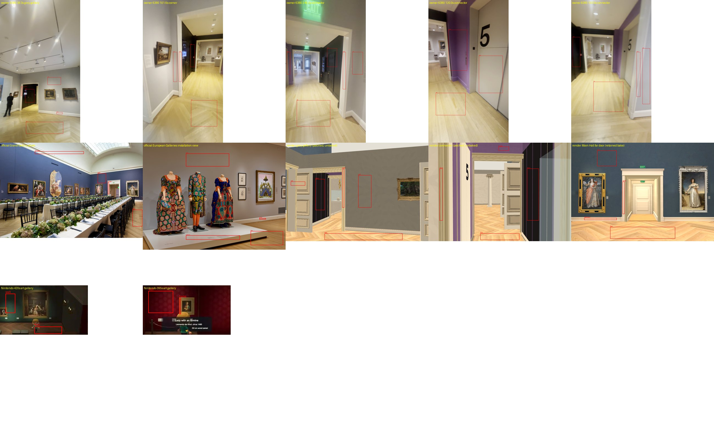
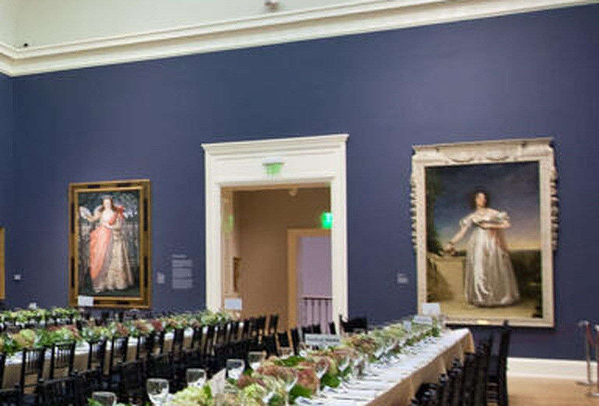
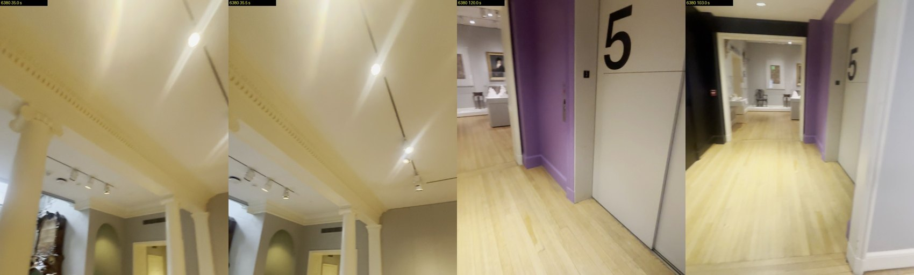
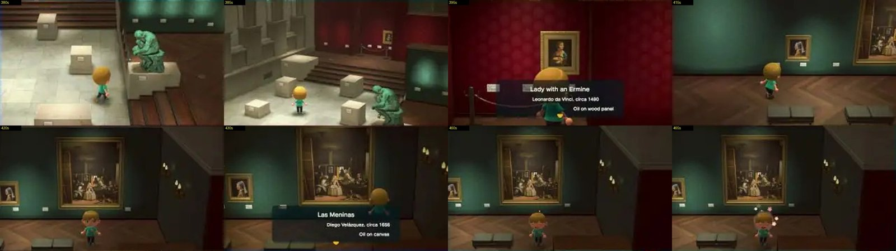

# Collection rooms: what the first-party sources say about architecture and materials

Research for Issues #178 / #181 / #182 / #183, 2026-10-01, for root to act on. Nothing was built or changed: this folder is new and nothing outside it was written. Public pages and media only; nothing behind a login was opened. No paid call, no GPU, no nested worker. The research skill asks for a background agent; this dispatch forbids one, so I read the sources myself.

The independent reviewer (dispatch `ctx_0d0e4713ee59`) writes a separate SOURCES.md with a layout and style verdict. This one is the builder's side: what to change, where, from what to what. It is a style pass. It accepts no map, fidelity or metre.

## The fixes, ranked

Targets are root's current files (`prepare_remodel.py` sha `9547e6b62062`, `remodel_room.gd` sha `742b07d90cd0`). The floor shader, the Hall and every painting file stay as they are.

| | Fix | Where | Now | Should be | Evidence |
| --- | --- | --- | --- | --- | --- |
| 1 | **Make door casings, door leaves and baseboards neutral white** | `prepare_remodel.py` lines 574–583 (architrave and baseboard strips) and 344–348 (door-leaf panels): add the tone step the plaster loop on line 564 already uses | Architrave texture `#e9dbb6`, door leaf `#e5d8bc`: yellow-cream with strong stripes, 22 % warmer than the grey wall | The same hue as the wall, about twice its brightness; near `#e6e4de`, stripes reduced | Finding 1 |
| 2 | **One black wall, floor to ceiling** | `remodel_room.gd` `build_grey_gallery`, lines 352–355 | Four 0.49 × 2.9 m black quads with purple showing between and 0.6 m of purple above | One black face the wall's full 2.15 × 3.5 m; keep panel joints as thin lines if wanted | Finding 5 |
| 3 | **Give the columns their beam and end pilasters** | `remodel_room.gd` `build_grey_gallery` after line 403, and the `column_sides` header in `build_rooms` (line 307) | Two shafts with capitals under a plain grey wall header | A cream beam across the opening with a projecting top moulding, and a flat pilaster against each end wall, same cream as the shafts | Finding 7 |
| 4 | **Slim the door casings** | `remodel_room.gd` `build_rooms` lines 313 and 318 | 0.16 m wide each side | About 0.10 m, keeping the 0.38 m reveal | Finding 4 |
| 5 | **A small white label beside each painting** | `remodel_room.gd` where each `Painting` is placed (grey gallery first) | None in the new rooms; the Hall has them | About 0.15 × 0.22 m, its centre 0.63 m from the painting's centre and a little below it | Finding 8 |

Leave alone: the floor shader and its honey tone, the grey wall colour, the purple, and the Hall. Reasons are in findings 2, 3 and 6.

## Sources

Retrieval times, status codes and hashes are in `snapshots/manifest.json` and `snapshots/film-previews.json`. Root's own snapshots (`public-source-snapshots-20261001/manifest.json`) are reused, not duplicated.

| | Source | Date of the thing shown | What it gives | Limit |
| --- | --- | --- | --- | --- |
| A | Owner's videos, `IMG_6380.MOV` (sha `eaf7a7853b6c`) at 1.6, 35.0, 35.5, 38.3, 101.6, 103.0, 120.0, 240.3, 247.5 s; `IMG_6381.MOV` at 91.0 s | 2026, current hang | The rooms being built | Phone HLG video decoded without tone mapping; colours are relative only |
| B | `https://risdmuseum.org/rent-museum`, image `…/2018-07/page_special event_20171005_Gala_v_03.jpg` (root snapshot `grand-gallery-event.jpg`) | File name says 2017-10-05; unverified | Grand Gallery: far door, cornice, floor, wall | Event set-up, historical |
| C | `https://risdmuseum.org/exhibitions-events/exhibitions/european-galleries`, image `https://risdmuseum.cdn.picturepark.com/v/C0mjdbNd/` | "On view 09-02-2017 through" (no end date given) | A professionally lit European gallery wall, baseboard, floor, labels, vent | Which of the 11 galleries is not stated; historical hang |
| D | `https://risdmuseum.org/art-design/projects-publications/articles/object-lessons` (dated 07.27.2018) and its four Vimeo films: 221606953 (2017-06-14), 221636728 (2017-06-14), 223645614 (2017-06-29), 251342847 (2018-01-16) | 2017–2018 | Object close-ups | **None shows a gallery room**: they are filmed in a studio, storage, an office and the café |
| E | `https://vimeo.com/risdmuseum`: 267263973 "Preview for Students + Educators coming on Group Visits" (2018-04-30), 583887035 "RISD Museum for College Students" (2021-08-06) | 2018, 2021 | What appears to be the Grand Gallery (blue wall, the white-dress portrait) at 82–84 s and 105–108 s of the 2018 film | 426 × 240 preview frames; the 2021 film is colour-tinted. "Faculty Guide Video" (444384622) returned 401 and was not opened |
| F | `https://www.instagram.com/risdmuseum/` | Fetched 2026-10-01 | Nothing usable | Without a login the page gives the twelve newest posts, described as images of text. Nothing further was opened |
| G | `https://play.nintendo.com/media/videos/animal-crossing-new-horizons-museum-scavenger-hunt/`, video `https://www.youtube.com/watch?v=ut0TNSximc4` (Play Nintendo, published 2026-08-08, 663 s) | 2026 | The game's art gallery at 380–465 s | Read from YouTube's own storyboard, one 320 × 180 frame every 5 s |
| H | `https://www.nintendo.com/us/store/products/animal-crossing-new-horizons-switch/`, seven product screenshots | Current page | Two interiors | No museum among them |

Not used: the spring-2020 faculty on-view document in root's snapshot. It is historical and says nothing about finishes. No creator was named by the owner, so no creator's work is cited.

Films D, E and G were read from the preview frames each player publishes (Vimeo's sprite sheet through the public embed, YouTube's storyboard). A direct download was tried once; Vimeo asked for a login and YouTube refused, and I did not pursue either. No video file was downloaded.

## Findings

Each has what was seen, then what I conclude. Colours are the median of a hand-placed patch; `measure.py` draws every patch on `patches.jpg` and writes `colours.json`. Because each camera has its own exposure and white balance, the useful numbers compare a surface with the white trim **in the same image**.

### 1. Trim is neutral white; ours is yellow cream

Seen:

| Image | Trim | Wall | Trim red/blue | Wall red/blue |
| --- | --- | --- | --- | --- |
| A, 101.6 s | `#e2dac8` | `#beb6a8` | 1.13 | 1.13 |
| A, 38.3 s | `#d3cdc1` | `#97948a` | 1.09 | 1.09 |
| A, 103.0 s | `#c0bdbc` | `#bababd` | 1.02 | 0.98 |
| C, official | `#b29b85` | `#82705e` | 1.34 | 1.38 |
| Our architrave texture / grey wall albedo | `#e9dbb6` | `#a3a19b` | 1.28 | 1.05 |

In every source the trim and the wall have the same hue and differ only in brightness. Ours differ by 22 %. The door-leaf texture is `#e5d8bc` (1.22) and both carry strong stripes (brightness spread 26 and 36–39 on a 0–255 scale; the plaster textures are 2.6). The baseboard texture is already neutral (`#d9d2c7`, 1.09).

Concluded: the architrave strip was taken from a cream door frame in Rockefeller (`door-architrave-source.json`, 188.25 s) and is used on every door. Neutralising it and the door leaves is the largest single visible gain. The Hall's own trim bakes to a warm cream (`#f0d6b6`); that is the Hall's lighting and stays.

### 2. Grey walls: the colour is already right

Seen: the wall is 0.48 to 0.67 as bright as the trim in A and 0.49 in C. Our grey wall albedo against the trim is about 0.5.

Concluded: no change to `Color("b6b4ad")`. The taupe in the unbaked renders is the warm preview light, not the material; judge it after the bake, which already uses neutral light in this room. The faint diagonal creases in the plaster texture are not in any source; lowering the `.22` contrast on line 564 is optional and minor.

### 3. Floor warmth: keep the Hall recipe

Seen: against the trim, the floor is 1.5 times warmer in A (red/blue 1.62–1.65 against 1.09–1.13), 1.6 times in B and C, and 0.40 to 0.66 as bright. In the Hall's saved bake it is 1.4 times warmer and 0.93 as bright. In C and in the connector (A, 103.0 and 120.0 s) the boards are straight strips; the grey gallery and the Hall are herringbone, as built.

Concluded: the rooms use the Hall's `floor_oak.gdshader` unchanged, with the owner-requested honey tone, so they match the Hall by construction. Against the trim our floor reads only 1.25 times warmer, and brighter than the trim, because the trim is yellow and dark. Fix 1 brings that to about 1.5 without touching the floor. When baking, keep the floor no brighter against the trim than it is in the Hall.

### 4. Door casings are slim and plain; the Hall's door is the grand one

Seen: in A (101.6 s, 240.3 s) the connector's casings are a narrow stepped white moulding, 0.09 to 0.11 m wide by the grey-register fit, with a plain head and a deep white reveal. In B the Hall's far door has a wide flat casing, about 0.27 m if the opening is 1.9 m, under a tall frieze and projecting cornice. The Hall has a heavy plaster cornice below its cove; the grey gallery (A, 38.3 s) meets its flat ceiling with no cornice.

Concluded: the built 0.16 m casings sit between the two. Slim them to about 0.10 m in the new rooms and leave the Hall door's hood as it is. Add no cornice to the grey gallery.

In this 2017 photo the room beyond the door is tan and the space beyond that is lilac with a railing. In 2026 that room is grey. Do not take wall colours for the new rooms from it.

### 5. The connector's south wall is black from floor to ceiling

Seen (A, 103.0 s, 240.3 s, 247.5 s): a continuous neutral charcoal wall, `#30332f` where lit, 0.01 to 0.05 of the trim, with a black door and a screen set into it. It runs to the ceiling, and a black band continues over the Rockefeller-side opening. Ours is the right darkness (`#1b1717`, 0.02) but is four separate panels with purple between and above.

Concluded: fix 2. The band over the far opening is a possible follow-up, not ranked.

### 6. Purple and the elevator: leave them

Seen (A, 120.0 s): the purple is on the north side around the elevator, baseboard painted the same purple. Corrected by the white beside it, its red/blue is 0.86; our purple texture is 0.86. The elevator is one wide pale-grey door, with the black "5" painted large on the panel beside it.

Concluded: hue matches; no change. A purple baseboard on that wall would be a small extra.

### 7. The columns carry a beam

Seen (A, 35.0 and 35.5 s): the two columns support a deep cream beam across the whole opening, with a row of dentils under its top moulding and a flat soffit. A pilaster with the same capital stands against the wall at the end. Shafts are smooth, not fluted.

Concluded: fix 3. A plain cream beam and pilasters first; the dentil row needs a texture and can follow.

### 8. Frames and labels

Seen: C shows a small white label to the right of each frame at about mid-height, and A (1.6 s) shows the same beside the Courbet: about 0.15 × 0.22 m, its centre 0.63 m from the canvas centre and 0.17 m below it, by the canvas scale. The Hall's bake has such labels; the new rooms have none. Frames in A, B and C are each different (gilt, carved, black). Nintendo's gallery (G, 395–465 s) gives every painting a plain gold frame and a white placard at one height.

Concluded: fix 5. The per-painting frames are already closer to the museum than Nintendo's uniform ones; keep them.

### 9. Sculpture, metal and ivory

Seen: in A (17–18 s, 247.5 s) and `IMG_6381` 91.0 s a white marble bust on a white plinth stands on the connector's axis and is the first thing seen from the doorway. In G (380–385 s) each sculpture is one colour on a pale stone block with a small plaque, and reads from across the room.

Concluded: the bust is not built and belongs to root's object work, not this list. I did not study the medieval metalwork or ivories against sources in this pass.

### 10. What the Nintendo footage shows

Seen (G, 380–465 s): deep saturated walls (teal `#263227`, crimson `#4b060f`), each with a soft pool of light behind the painting and darker toward the corners; a dark warm wood floor (`#372517`) with a visible but low-contrast plank pattern; plain gold frames; white placards; wall sconces; a high camera looking down. H's two interiors show plank floors with clear joints and flat, softly lit walls.

Concluded: three things carry over without copying its palette. A soft light pool behind each work, which the bake's painting spots already aim at. Low-contrast surfaces with clean joints, which fix 1's stripe reduction helps. One clear material per object. I make no claim about Nintendo's engine, polygon counts or shaders; none is published in these sources.

## Not established

- The barn painting's identity, the column spacing, room heights and every metre: unchanged from the earlier reports.
- Whether C's gallery is the grey French gallery.
- Any colour in absolute terms. The owner's video is HLG; the official photos are lit and graded.
- Current (2026) official photographs of these rooms: none found in the sources named.

## Files

- `SOURCES.md`: this report. `colours.json`, `patches.jpg`: every measured patch.
- `measure.py`: the measurement. `fetch.py`: one recorded fetch.
- `snapshots/`: fetched pages (gzipped), film metadata, the official installation image, and `manifest.json`.
- `crops/`: four small reference images cited above.
