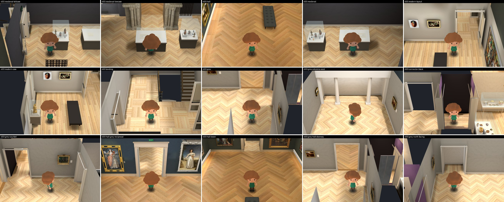
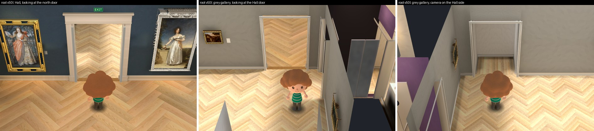
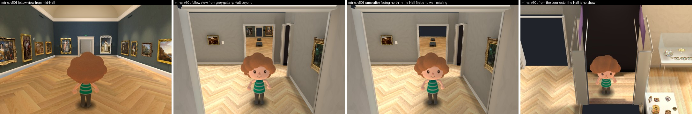
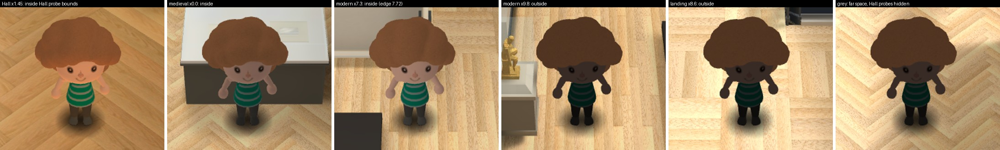
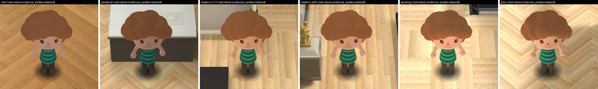
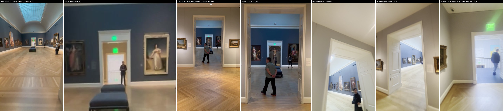
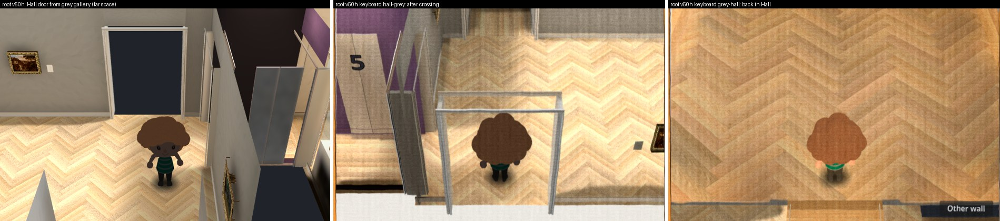
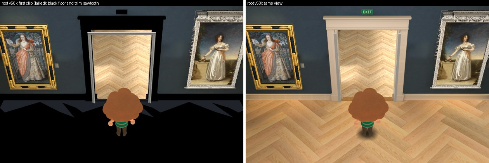

# Contiguous Hall door and visitor lighting: independent review

Reviewer report, 2026-10-01. Follow-up of commit `00f857d5`, Collection prototype only, Issues #178 / #181 / #182 / #183.

I changed no implementation. Everything I wrote is in this folder. Root's workspace, the Main build, the 3D Viewer, the ingestion folder and the original videos were only read. No paid call, no generation, no bake. Before READY I ran no Godot, browser or GPU: the lighting diagnosis comes from reading the saved bake files with a small Python reader, the engine's source, and root's own captures. After READY I ran one CPU capture on a private copy of the frozen app.

**Every metric and full-map flag stays false. The connected map is unfinished.** Nothing here measures a room.

## Verdict

**Scoped acceptance of the lighting and Hall-door rendering fixes in the frozen build `v49j` / `v50l`. This is not an approval of the door's architecture, of the map, or of the browser build.**

1. **The visitor is lit in every room, and the Hall looks exactly as it did.** The Hall view in `v50l` matches `v50h` pixel for pixel outside the visitor's moving arm, and the visitor's face colour is identical.
2. **The Hall door is open and lit from both sides**, in root's views and in five more I captured myself.
3. **Two rendering defects remain in `v50l`**, both small, both seen in my own captures: the Hall's end wall can go missing when looking back down the Hall from the grey gallery in follow view, and the Hall is not drawn from the connector.
4. **The door's shape is still provisional:** a 0.38 m jamb where the footage shows a reveal of 0.7 to 1.0 m with two folded leaves.

## The frozen build, after READY



| Check | Result |
| --- | --- |
| Root's frozen manifest (`frozen-root-sha256-v50l.json`), 10 files | All 10 hash-equal on disk |
| `v50l` uses the frozen walk script | `main_build_walk.gd` in the app is `e16c8643…`, the frozen hash |
| Main Hall files in `v50l` | 362 of 362 hash-equal to the Main build at `317b8f3b8dac` (`full-app-static-v50l.json`) |
| Room scripts in `v50l` against `v49j` | Equal after the path prefix; `geometry.json` identical |
| `v49j` addition bake | 352 probes, 1,661 tetrahedra, 1 black probe, 1,217 users (`probe-addition-v49j.json`) |
| `v50l` text copy of the bake | 352 probes, 3,168 SH colours, 1,661 tetrahedra, 4,267 BSP nodes, 1,217 users; positions and light equal to `v49j` (`probe-v50l-tres-check.json`). `v50h` and `v50i` had 0 |
| Visitor in root's 15 views | Lit in all 15 (`root-v50l-visitor-by-room.jpg`) |
| Hall view, `v50h` against `v50l` | Mean difference 0.0; largest difference 13 of 255 inside an 82 x 31 px box at the visitor's arm (`hall-visitor-colour-compare.json`) |
| Hall visitor's face colour | `v50h` (190.8, 122.3, 82.2); `v50j`, two fields blended (168.5, 124.7, 106.0); `v50l` (190.8, 122.3, 82.2) |
| Root's keyboard test, 10 crossings, tolerance 0.08 m unchanged | 10 of 10; both Hall crossings 0.06 m |
| Root's `main_build_check` | No failure; 352 probes; 1,298 tunnel triangles removed |
| Root's `architecture_check` on `v49j` | No failure; 19 casings, 1 leaf, 3 lift features |
| Root's ten video masters | Re-hashed by root in `original-videos-reverified.json`; I hashed `verified/IMG_6380.MOV` myself and it agrees |

Root's checks are root's. The rows about probes, Hall files, pixels and colours are mine.

### The door in `v50l`



- **From the Hall:** casing, crown, skirting, EXIT sign, threshold and floor are all there and lit. The tunnel and its closed leaf are gone. The grey gallery's floor shows through the opening.
- **From the grey gallery:** the Hall's floor shows through the opening. No dark void.
- **Camera on the Hall side, visitor in the grey gallery:** the Hall's far wall is cut away, so the visitor is in view.
- The pale strips just inside the Hall's casing are the grey gallery's jamb, which stands 0.19 m into the Hall.

### Five more views, captured by me



Captured on a private copy of `v50l` (since deleted), software rendering, with `capture_follow_views.gd`. The script places the visitor and camera directly; it does not press keys.

- **Follow view from the middle of the Hall:** the door shows the lit grey room and the piano door beyond it. This is the view `IMG_6344` 23.0 s shows. No pop-in at a distance.
- **Follow view from the grey gallery, looking back down the Hall:** the Hall is drawn, with its benches and its end wall.
- **The same, after the dollhouse camera faced north in the Hall first: the Hall's end wall is missing** and the background shows instead. The Main build fades that wall out for a north-facing camera and never fades it back while the visitor is in a far room. A player who walks north into the grey gallery, switches to the follow view and turns round will see it. Smallest fix, in the walk's grey-gallery branch: set the fade for layer 8 back to 1 and give those meshes their original material.
- **From the connector:** the grey gallery's Hall door is a dark opening, because the Hall is drawn only while the visitor is in the grey gallery. Smallest fix: drop the room-name test so every far room draws the Hall.

One flaw in my own capture record: the `cutaway_alpha` column in `native-follow-views.json` shows the final value in every row, because the script stored a reference. The two images are the evidence; the only difference between those two runs is which way the dollhouse camera faced beforehand.


## Findings and verdicts

| # | Finding | Verdict |
| --- | --- | --- |
| 1 | Dark visitor: the full app's copy of the addition bake had no light probes | Cause proven from files. Fixed by root in the converter. `v50l` has all 352 probes; visitor lit in all 15 views |
| 2 | Restoring the probes changes the visitor inside the retained Hall | Predicted from the probe data, then seen in root's `v50j`. Fixed by root: one probe field at a time. `v50l` Hall visitor equals `v50h` |
| 3 | Hall door, source: one thick opening, no second door in it | Source conclusion. The Main build's 2.6 m cream tunnel with a closed door is not what the footage shows |
| 4 | Hall door, as rendered: dark from both sides in `v50h` | Cause: each side's camera left the other side out. Fixed by root in the adapter. Accepted as rendering in `v50l`, with the two defects above |
| 5 | Root's first clip (`v50k`) turned the Hall floor and door trim black and cut a sawtooth into the floor | Failed evidence, withdrawn by root. Cause proven from engine source. `v50l`: floor, trim and threshold intact and lit |
| 6 | Lift panels and the "5" now belong to the connector's north wall | Accepted in code. In `v50l` the panels go with the cut wall |
| 7 | Piano leaf belongs to the piano header, its six panels to the leaf | Accepted in code |
| 8 | Slim 0.10 m casing only at the grey gallery, connector and piano door | First version was incomplete at one door; root's inward-face rule fixes it. Root's check passes on `v49j`; I did not capture that door |
| 9 | Hall / grey crossing keeps position, held keys and heading | Accepted in code. Root's 10 of 10 at the unchanged tolerance |
| 10 | Reveal depth at the Hall door | Open. Built 0.38 m; the footage reads 0.7 to 1.0 m. Needs its own fit |

## 1. Why the visitor was dark



Root's `v50h` captures, cropped. Three visitors are lit and three are the same flat dark figure.

- **The visitor carries no light of its own.** In the Main build it is lit only by the bake's probe field (`visitor159/visitor.gd`: a dynamic mesh with a small constant glow, 0.25, hair 0.6). The Main build's baked scene has zero runtime lights, and so does the addition's (`room.tscn`: 0 light nodes in both).
- **The addition's bake has a good probe field.** `main-build-extension-v49h/addition_baked/room.lmbake`: 352 probes, 1,661 tetrahedra, 1 black probe, 1,274 users (`probe-addition-v49h.json`).
- **The full app's copy had none.** `main-build-rooms-v50h/collection_rooms/addition_baked/room.tres`: `points`, `sh`, `tetrahedra` and `bsp` are all empty (`root-v50h-room-tres-probe-data.txt`). `v50i` was the same.
- **Cause.** `make_local_fullapp.py` turned the binary bake into text by running `relocate_lightmap.gd` with `godot --headless`. A bake resource keeps its probe arrays only inside the renderer, and the headless renderer returns empty arrays (Godot 4.7.2, `servers/rendering/dummy/storage/light_storage.h` 195 to 198). The script checked only the user count.
- **Effect.** With no probes the engine also empties the probe bounds (`scene/3d/lightmap_gi.cpp` 237 to 250), so the addition's bake never reaches the visitor. The visitor was lit only where the **Hall's** probe bounds happen to reach (Hall metres x -5.67 to 7.72, z -28.99 to 6.70), and nowhere in the far rooms, where the Main build hides the Hall's field.
- **The images agree with that, place by place.** Modern gallery at x 7.3: lit. Modern gallery at x 9.8: dark. Landing at x 8.6: dark. Grey gallery: dark. Medieval room and Hall: lit.

It was not the Main build's white test-room capture (its bounds end 20 m from the grey gallery) and not a light's cull mask (there are no lights).

**Fix, done by root:** the converter now runs with a real renderer and stops if the probes are empty or differ after saving.

## 2. The Hall visitor must keep the Hall's own light



- The addition's probe bounds cover the Hall as well. The engine blends every probe field whose bounds hold the visitor, weighted by how central the visitor is in each (`renderer_scene_cull.cpp` 2061).
- In the middle of the Hall that gives the addition 0.94 and the Hall's own bake 0.26. The visitor's light would go from (0.32, 0.20, 0.09) to about (0.21, 0.18, 0.17): a third less red, almost twice the blue (`probe-hall-main-build.json`, `probe-addition-v49h.json`).
- Root's `v50j` shows it: the Hall visitor is paler and greyer than in `v50h` (first tile of both sheets).

**Fix, done by root:** in `main_build_walk.gd`, the Hall's field is used while the visitor stands in the Hall, the addition's while it stands in an added room, and the white test-room field is off.

## 3. The Hall door in the footage



Read by eye from the original videos: `collection-expansion/verified/IMG_6380.MOV` and the two earlier Hall walkthroughs, `walkthrough/IMG_6343.MOV` and `IMG_6344.MOV`. (The `IMG_6378` to `IMG_6380.MOV` files one level up are 0-byte download placeholders, not the masters; root pointed me to `verified/`.)

- **One opening.** `IMG_6343` 0.5 s (from the grey gallery, on the door's axis) and `IMG_6380` 99.0 and 106.5 s: a single thick cased opening. Both leaves are folded flat against the two sides of that one reveal. The blue Hall is directly beyond. There is no second door inside the reveal.
- **The "second doorway" exists, and it is the piano door.** `IMG_6344` 23.0 s, from the Hall: inside the Hall door there is a warm lit room and then a smaller open bright doorway with its own EXIT sign. That is the piano door on the grey gallery's north wall, on the same axis (EXIT sign above it: `IMG_6380` 14.0 s). It is open and lit. It is not a closed panelled leaf.
- **What the Main build did.** `walk4._far_end` builds "a fully modeled cream vestibule": a 2.65 m tunnel ending in a closed white leaf with a second EXIT sign. It folds the reveal, the grey gallery and the piano door into one tunnel. As a stand-in for a room that did not exist yet it was reasonable. With the grey gallery built, the tunnel stands inside it.
- **Depth of the real reveal, not a measurement.** In `IMG_6343` 0.5 s the opening is 497 px wide and 860 px high on the grey face and 420 to 442 px wide and 755 px high at the Hall end: a ratio of 1.12 to 1.18 (`source-reveal-measure-6343-6344.jpg`). A 2.65 m reveal would need the camera 15 to 22 m away in a room about 6 m deep. For an iPhone main lens the same ratio gives **0.7 to 1.0 m**, and no more than about 1.2 m. A folded leaf, half the door's width, covers the reveal's side from end to end, which agrees.

**Advice given to root:** drop, by a render-only clip in the adapter, what is not in the footage (the tunnel past the wall, its rear backing, the closed leaf with its casing, the rear EXIT sign). Keep the Hall's own face of the wall. Do not edit any Main build file. Record the 0.7 to 1.0 m reveal as an open fit: it means moving the far rooms north by about that much, which moves a seam.

## 4. Why the door was dark from both sides



- **From the grey gallery** the opening showed flat background. In the far rooms the camera did not draw the Hall's layers.
- **From the Hall** the opening showed the cream tunnel and its closed leaf. The camera did not draw the far rooms.
- Crossing the wall line swapped the whole picture, and the background changed from slate to cream.

**Fixes, done by root in `main_build_walk.gd`:** the Hall camera draws the far rooms; the grey gallery's camera draws the Hall, with the Hall's far wall cut away when the camera stands on the Hall side; one background colour; the tunnel is clipped from the live Hall meshes.

## 5. The first clip broke the Hall, and why



Root's first `v50k` capture of the Hall looking at the door, which root keeps as a negative:

- The Hall **floor was black**, and so were the door casing, crown, skirting and EXIT sign. Walls and paintings were fine.
- The floor's edge along the far wall was a **sawtooth**.

Causes, both read from source before root confirmed them:

1. **Black.** Giving a baked mesh a new mesh resource makes the engine build a new geometry instance with no lightmap (`RendererSceneCull::instance_set_base` calls `set_use_lightmap(RID(), ...)`). A `LightmapGI` assigns its users only when it enters the tree or its data is set. Fix: set the Hall `LightmapGI`'s `light_data` to null and back after the clip (root's choice; I checked `LightmapGI::set_light_data` does a full reassignment).
2. **Sawtooth.** The clip also took the Hall floor, whose mesh runs past the wall and is cut per pixel by its shader. Every herringbone plank crossing the wall line was deleted. Fix: skip meshes whose material has `floor_z_limits`.
3. **Threshold.** The oak door threshold spans the wall line by 0.12 m each way and would have gone too. Fix: clip at 0.19 m past the wall, not at the wall.

I also predicted, from the code, that the grey gallery's camera hid the wrong Hall wall when looking north, so the 6 m blue wall would stand in front of the visitor. Root changed the rule before capturing.

## 6 to 9. The follow-up of `00f857d5`, read in code

- **Lift panels and "5"** (`remodel_room.gd`, `build_grey_gallery`): both panels and the number are reparented to the body tagged `purple elevator-5 connector:north`. That wall has no opening, so it is one body. The walk hides every child of a cut-away wall, so they go with it. Open item 4 of my last report is closed in code.
- **Piano leaf:** the leaf is reparented to `piano-stair threshold study limit:south:header` after the group shift, so it keeps its place; the six panel faces are now children of the leaf in the leaf's own coordinates, at the same positions as before. The "pale upright" from my last report had this cause.
- **Casing width:** 0.10 m for the grey gallery, connector and piano threshold, 0.16 m elsewhere. In root's first version both rooms of a doorway still built both faces, so at the Rockefeller / connector door the 0.16 m casing sat on top of the 0.10 m one on the connector side. Root's later change builds only the room's own inward face: each face now has one casing of its own room's width, and the grey gallery no longer puts a casing on the Hall's face of the Hall door.
- **Crossing:** between the Hall and the grey gallery the walk now only switches space; position, heading, velocity and held keys are untouched. Walkable strip: 0.8 m wide on the door axis, from 0.2 m inside the Hall to 0.35 m inside the grey gallery, then the room rule. I found no gap and no place where the two rules disagree.

## Still open

- **Reveal depth and leaves.** Built: a 0.38 m jamb. Footage: 0.7 to 1.0 m, with both leaves folded inside. Not built, not fitted.
- **The jamb's Hall-side half.** The grey gallery's jamb is centred on the wall line, so 0.19 m of it stands on the Hall side, just outside the Hall's own opening edge and about 0.07 m proud of the Hall's casing. Visible in `v50l` as two pale strips inside the casing.
- **Hall drawn only from the grey gallery.** Seen in `v50l`, from the connector.
- **Hall's end wall missing in follow view** after facing north. Seen in `v50l`.
- **Browser build.** Not run by anyone in this round.
- **Rockefeller / west gallery door** still changes room group with a white flash.
- **Everything my last report left open** that this follow-up did not touch: connector details, the bust, the barn painting, placard gaps, pilaster collision, every metre.

## Added at the coordinator's request: Saint Roch 21.398, integration judgment

Read-only look at the builder's delivery in `collection-opus-villon-frame/docs/evidence/collection-reconstruction/opus-saint-roch-asset-20261001` and its helper `saint_roch_asset.gd`. I did not run it. I read the report, the helper, `checks.json`, the check log and four comparison sheets, and re-hashed the delivery.

**Judgment: no integration blocker for a provisional install of the flat-colour version, with every completion flag left false. The Muse-sheet version should not go into the room as it is.**

- **Why not the sheet.** The game looks down on the room from about 42 degrees and from the quarters. That is where the sheet breaks: in the builder's own `compare-high.jpg` the base top carries black wedges and white slivers and the legs and dog are streaked; the rear quarter has black streaks across the base. Straight on from the front it looks good, but the room never shows it straight on. The sheet's back is also pale where official photograph 2 is dark.
- **Why the flat version is fine as a stand-in.** 40 closed solids, 1,446 triangles, catalogue height 1.054 m, clean from every angle, colours taken as medians from official photograph 0 (colour values, not a photograph used as a texture). All four accepted flags are false on the node.
- **What I verified.** 51 of 51 resolvable hashes in the delivery's `SHA256.json` agree. The helper is byte-identical in the builder's module folder, the evidence folder and root's copy (`98d60755…`); the reused `seated_woman_asset.gd` equals root's (`7b17a507…`). `checks.json`: no failures.
- **Needed when installing, none of them blockers:**
  1. Add `saint_roch_asset.gd` to the helper list `prepare_remodel.py` copies (line 543); it preloads `seated_woman_asset.gd` from the same folder.
  2. The figure has no collision. Build the plinth with `solid(..., true)` so the walk treats it as an obstacle.
  3. Keep the acrylic hood transparent so the bake skips it, as it does for the other cases.
  4. Rebake: the new meshes shift the baked surface names.
  5. Cite the installation frames the builder lists (`IMG_6383` 18.3 s and 62.0 s) where the placement is written.
- **Only if the sheet is used later:** load it as an imported texture (the check loads it as a raw image, which Godot warns will not survive an export), and record the sheet and its padded copy in `modules/shell/PROVENANCE.md`.
- **Still not accepted, as the builder says:** likeness, his left side (no source), width and depth (could be a third off), the base's shape, the dog, plinth and hood sizes, placement.

## Where I was wrong during this review

1. My first message to root said the empty addition bake still reached the visitor and dimmed it in the Hall and medieval room. Wrong: with no probes the engine empties the bounds, so that bake does not reach the visitor at all. I corrected it within minutes; cause and fix were unchanged.
2. I first took `IMG_6344` 176 s for the north door. It is the south door, with the medieval crucifix beyond. The north door is at 23.0 s.

## Files

- `REPORT.md`, `SHA256.json`
- `lmbake_probe.py`: reads a `.lmbake` and samples it the way the engine does. `visitor-points.json`, `probe-addition-v49h.json`, `probe-hall-main-build.json`, `probe-white-main-build.json`
- Frozen build: `probe-addition-v49j.json`, `probe-v50l-tres-check.json`, `full-app-static-v50l.json`, `hall-visitor-colour-compare.json`
- My native captures: `capture_follow_views.gd`, `native-follow-views.jpg`, `.json`, `.log`, five `native-*.png`
- Root's captures, cropped or tiled: `root-v50h-visitor-by-room.jpg`, `root-v50j-visitor-by-room.jpg`, `root-v50l-visitor-by-room.jpg`, `root-v50l-native-15-views.jpg`, `root-v50h-hall-door-both-sides.jpg`, `root-v50l-hall-door-both-sides.jpg`, `root-v50k-failed-vs-v50l.jpg`, `root-v50h-room-tres-probe-data.txt`
- Source frames: `source-reciprocal-hall-door.jpg`, `source-reveal-measure-6343-6344.jpg`, `source-6343-0.5s.jpg`, `source-6344-23.0s.jpg`, `source-6380-14.0s.jpg`, `source-6380-99.0s.jpg`, `source-6380-106.5s.jpg`

```bash
godot --display-driver x11 --rendering-method gl_compatibility --path <private copy of v50l> --script capture_follow_views.gd -- <output folder>
python3 lmbake_probe.py <room.lmbake> [--offset -5.55 0 -28.1] --points visitor-points.json --out <out.json>
```
