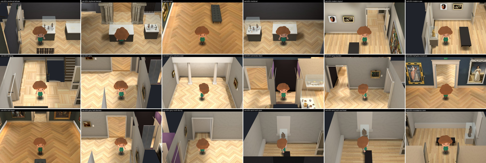
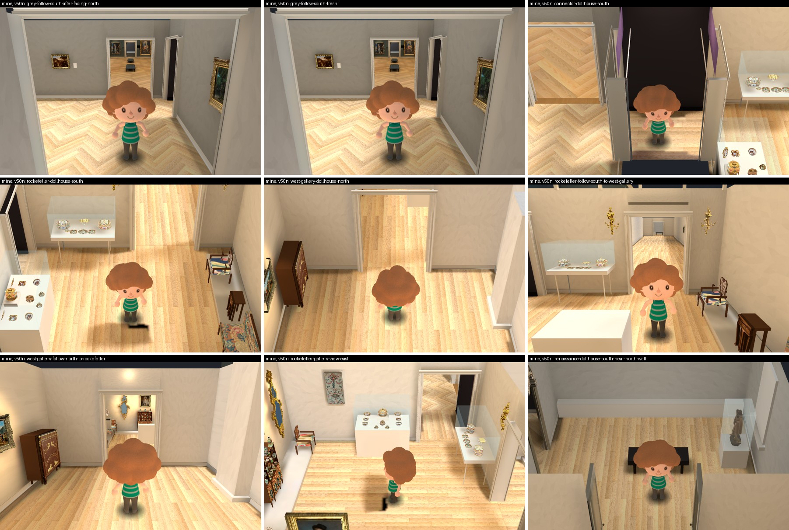
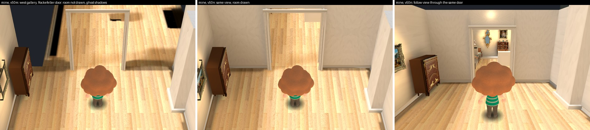
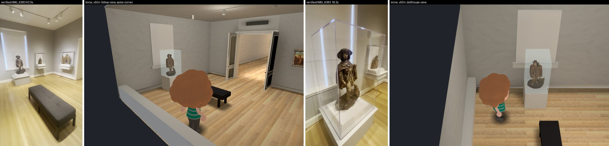

# Follow-view fixes, group doors and Saint Roch install: independent review

Reviewer report, 2026-10-01. Collection prototype only, Issues #178 / #181 / #182 / #183. It follows my review of `v49j` / `v50l` in `opus-contiguous-hall-review-20261001`.

I changed no implementation. Everything I wrote is in this folder. Root's workspace, the Main build, the 3D Viewer, the ingestion folder and the original videos were only read. No paid call, no generation, no bake, no nested worker. I ran Godot only after READY, on CPU, on private copies of root's frozen apps inside my own worktree; both copies are deleted.

**Every metric, map and fidelity flag stays false. The connected map is unfinished.** Nothing here measures a room or a case.

## Verdict

**Scoped acceptance of the frozen build `v49l` / `v50n`: the four rendering and movement fixes, and the provisional flat Saint Roch install. This is not an approval of the map, of the sculpture's likeness, of any metre, or of the browser build.**

1. **The Hall's end wall no longer goes missing** when looking back down the Hall from a far room after facing north.
2. **Every far room draws the Hall.** From the connector, the grey gallery's Hall door shows the Hall floor.
3. **Crossing between the two room groups is continuous**: position, held key and heading carry through, there is no white flash, and since `v50n` the room beyond the door is drawn from both sides.
4. **Saint Roch is installed as a provisional stand-in**: the flat-colour figure on a white floor plinth in front of the shuttered west window, under a clear hood, facing into the room. The plinth stops the walk. All of its flags are false.
5. **Root went through two builds in this round.** `v50m` had two visible problems, one found by root and one by me. Both are fixed in `v50n`.

## The frozen build `v49l` / `v50n`



| Check | Result |
| --- | --- |
| Root's frozen manifest (`frozen-root-sha256-v50n.json`), 12 files | All 12 hash-equal on disk |
| `v50n` uses the frozen walk script | `main_build_walk.gd` in the app is `186d7e48…`, the frozen hash |
| Main Hall files in `v50n` | 362 of 362 hash-equal to the Main build at `317b8f3b8dac` (`full-app-static-v50n.json`) |
| Room scripts in `v50n` against `v49l` | Equal after the path prefix; `geometry.json` identical |
| `v49l` addition bake | 352 probes, 1,661 tetrahedra, 1 black probe, 1,229 users (`probe-addition-v49l.json`) |
| `v50n` text copy of the bake | 352 probes, 1,661 tetrahedra, 1,229 users; positions and light equal to `v49l` (`probe-v50n-tres-check.json`) |
| Hall view, `v50h` against `v50n` | Mean difference 0.0; largest 13 of 255 at the visitor's moving arm; face colour identical, (190.8, 122.3, 82.2) (`hall-view-v50h-vs-v50n.json`) |
| Root's keyboard test, 12 crossings, tolerance 0.08 m unchanged | 12 of 12; the two new Rockefeller / west gallery crossings 0.08 m, the two Hall crossings 0.06 m |
| Root's `main_build_check` on `v50n` | No failure; 352 probes; 1,298 tunnel triangles removed |
| Root's negative control, the same kind of check on the old `v50l` | Fails with 7 expected failures: 5 far rooms without the Hall or with a faded end wall, 2 group crossings |
| Root's `architecture_check` on `v49l` | No failure; 19 casings, 1 grille, 1 leaf, 3 lift features, 1 Saint Roch |
| Root's archived logs (`v50n-final-logs.json`), 9 files | All 9 archive hashes agree. The keyboard log carries one teardown error ("resources still in use"), which root records and does not call clean |

Root's checks are root's. The rows about hashes, probes, Hall files and pixels are mine.

## What I captured myself

`review_views.gd` and `review_plinth.gd`, run on a private copy of `v50n` with software rendering. The scripts place the visitor and camera directly; the walks press no real key but put a key into the walk's held-key table and step the walk by hand at 30 frames a second.



| Check | Result in `v50n` |
| --- | --- |
| Follow view from the grey gallery looking down the Hall, after the dollhouse camera faced north in the Hall | Hall end wall drawn; fade for that wall 1.0; 16 of 16 of its meshes on their original material. Same picture as the fresh case |
| Dollhouse view from the connector | The grey gallery's Hall door shows lit Hall floor |
| West gallery looking through the Rockefeller door, dollhouse and follow view | Rockefeller's walls and furniture are drawn |
| Rockefeller looking through the same door, follow view | The west gallery recedes beyond the door |
| Renaissance room, camera north of the north wall | No bar across the visitor |
| Four held-key walks: Rockefeller to west gallery and back, Hall to grey gallery and back | One change of space each; largest step 0.040 m, which is the walk's own limit; flash 0.0 throughout; heading unchanged; key still held at the end |
| Walking into the plinth from the east, north and south | Stops 0.33 m, 0.30 m and 0.30 m from its face |
| Saint Roch node | On a body with collision; turned 90 degrees, facing east; `visual_fidelity_accepted`, `placement_accepted`, `rear_fidelity_accepted`, `survey_metres_accepted` all false |
| Inventory | `saint_roch`: `muse_sheet_used` false, `placement_accepted`, `case_metres_accepted`, `fine_fidelity_accepted` all false. Every top-level `…accepted` and `…complete` flag false |

Data: `v50n/native-review.json`, `v50n/native-plinth.json`.

## The two problems in `v50m`



1. **The room beyond a group door was not drawn** (mine). In `v50m` the crossing itself was already continuous, but from the west gallery the Rockefeller room showed as dark void at the sides of the opening, and the shared baked floor carried the black footprints and shadows of furniture that was not being drawn. The room appeared 0.3 m past the door line. Root now draws both groups from both sides and tests the walls of both for cutting away.
2. **A dark bar hung across the visitor in the Renaissance room** (root's). Root traced it by ray to the ventilation grille over the north door, which no wall owned, so it stayed when that wall was cut away. I read the code and agree. It is now a child of the north wall's header. Same cause as the lift panels and the piano leaf earlier.

Root also took my note that, in the unbaked draft lighting only, the new crossing set the ambient light to zero where the Main build uses 0.6.

## Saint Roch against the sources



Sources: `verified/IMG_6383.MOV` at 18.3 s and 62.0 s, the four official photographs, and the Renaissance inventory report (`source-saint-roch-installation-and-official.jpg`).

**Agrees in kind**

- Polychromed wood figure, not bronze, on a white floor plinth in front of the shuttered window, under a clear hood, facing into the room.
- Dog at his left, broad hat, short cape. He is centred on the window.
- Height 1.054 m is the catalogue's.
- Plinth height 0.68 m: at 62.0 s the plinth is about 0.64 of the figure's height by eye, which gives about 0.68 m.

**Differs or is by eye**

- **Hood height.** The built hood ends 0.17 m above the hat. At 18.3 s the hood rises well above the hat. That frame is a close wide-angle view from below, so I give no number, but the built hood is very likely too short.
- **Plinth.** The real one has a stepped foot and a label on its front. Width 0.70 m is by eye.
- **The figure.** A block study: no face, folds, fingers or paint losses. From the game's cameras it reads as a small brown figure in a hat with a dog, which is what a stand-in needs.
- **The rest of that wall.** The footage shows wall-hung cases to the right of the window (the Pietà among them). They are not built.

The Muse sheet is not used. I advised against it last round because the game looks down from the quarters, where the sheet smears; root installed the flat version.

## Still open

- **Door shape at the Hall.** A 0.38 m jamb where the footage shows a reveal of 0.7 to 1.0 m with two folded leaves. Unchanged this round.
- **Hood height, plinth size and plinth detail** for Saint Roch; his likeness; his left side, which has no source.
- **Baked footprints of cut-away furniture.** When a floor-standing case is hidden because it stands between the camera and the visitor, its dark baked footprint stays on the floor. Seen at Rockefeller's central pedestal in my captures. It predates this round and was not part of it.
- **The rest of the Renaissance room**, the connector's details, every metre, the browser build, and the map as a whole.

## Where my own run fell short

- My first plinth test started the visitor inside the bench's clearance, so the walk snapped it elsewhere and the result meant nothing. I reran it from three valid starts; only the rerun is reported. The first result is kept in `v50m/native-review-v50m.json`.
- I spent one extra run establishing that the dark bars on the Rockefeller floor were not the visitor's own foot shadows (`v50m/native-bars-v50m.json`). I did not prove node by node that they are baked footprints; that reading rests on where they sit and on their disappearing once the furniture is drawn.

## Files

- `REPORT.md`, `SHA256.json`
- Scripts: `review_views.gd`, `review_plinth.gd`
- `v50n/`: fifteen `native-*.png`, `native-review.json`, `native-plinth.json`, two logs
- `v50m/`: the same runs on the earlier frozen build, with the scripts as they were then
- Sheets: `native-doors-and-groups-v50n.jpg`, `native-saint-roch-v50n.jpg`, `native-group-door-v50m-vs-v50n.jpg`, `saint-roch-source-vs-v50n.jpg`, `root-v50n-native-18-views.jpg`
- Static checks: `full-app-static-v50n.json`, `probe-addition-v49l.json`, `probe-v50n-tres-check.json`, `hall-view-v50h-vs-v50n.json`
- Source frames: `source-6383-18.3s.jpg`, `source-6383-62.0s.jpg`, `source-saint-roch-installation-and-official.jpg`

```bash
godot --display-driver x11 --rendering-method gl_compatibility --path <private copy of v50n> --script review_views.gd -- <output folder>
godot --display-driver x11 --rendering-method gl_compatibility --path <private copy of v50n> --script review_plinth.gd -- <output folder>
```
