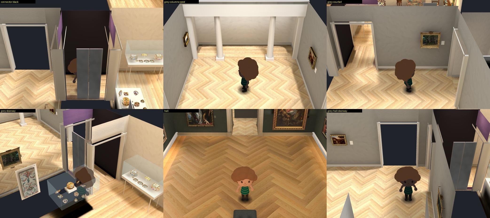
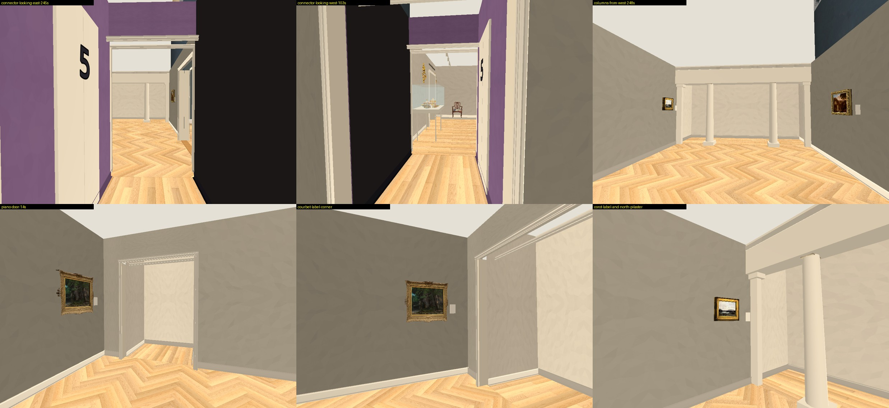
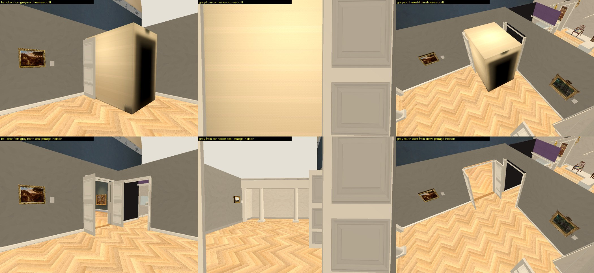
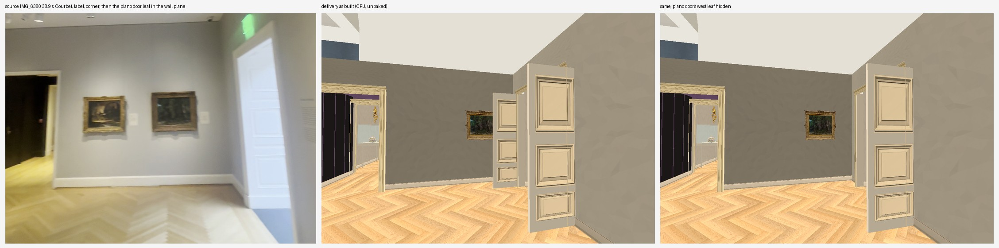
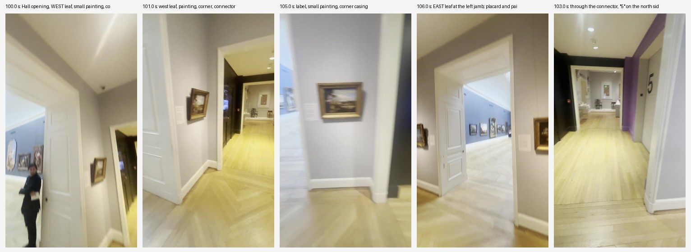
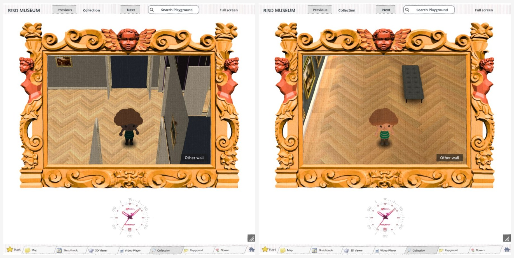

# Grey register implementation: independent review

Reviewer report, 2026-10-01, in two parts: the first review of the settled four files, and a follow-up on the frozen build `v49h` / `v50h`. Collection prototype only, Issues #178 / #181 / #182 / #183.
I changed no implementation. Everything I wrote is in this folder. Root's workspace, the main build, the ingestion folder and the other workers' trees were only read. No paid call, no GPU, no bake, no nested worker, no git change. CPU only.

**Every metric and full-map flag stays false.** Nothing here measures a room. Camera positions and focal lengths are unknown, so no picture in this report establishes a metre.

## Verdict

**Scoped acceptance of the source corrections in the frozen build `v49h` / `v50h`. This is not an approval of the map, the lighting or the Hall integration.**

1. **Seven corrections now match the footage** and are accepted in kind (order, side, look), not in metres. They are listed under "Accepted".
2. **Five things are not accepted** and stay open: the Hall-to-grey keyboard crossing, the Hall doorway's two-sided view, the dark visitor, the lift doors' ownership, and the casing change reaching rooms I did not check.
3. **The Main Hall itself is untouched:** 139 retained meshes, 23 works, 362 of 362 files hash-equal, in my scratch build and in root's full app.
4. **I corrected myself three times during this review.** The corrections are listed at the end of the follow-up so nobody relies on the earlier wording.

## Follow-up review: frozen `v49h` / `v50h`

Root confirmed these as frozen:

| | sha256 |
| --- | --- |
| `prepare_remodel.py` | `c0e49250e4e196581fb6196b123eff1b5ad159365802022b2a0c1e6b4b7a4076` |
| `remodel_room.gd` | `065f64be1bb7523ac5492baf1c0c316b5ab50099cfa605d3256a8ec8434806fe` |
| `remodel_review.gd` | `96892186deae035569cb404b945152f4446ecc84e0030be725002c631e5c6365` (unchanged) |
| `remodel_bake.gd` | `228d60ec285044d0c3254adc51f778f0ac0787e6d2aa19b68c5673a7175746fa` (unchanged) |
| `retained_hall_room.gd` (root's helper) | `aaddae22e31781f35a95a0ab1991a2e15537d8cbd9a4c4afaf219012791e18b8` |

What the footage shows is written up separately in `SOURCES.md`.

### What I looked at



Root's baked full-app views of `v50h` (above), and my own unbaked CPU captures of a scratch build of the same sources (below). The scratch captures hide the Hall's old passage, as the full app's grey camera does.



### Accepted, against the footage

| Correction | Source | Built now |
| --- | --- | --- |
| Piano door: no west leaf | `IMG_6380` 13.5 s, 38.9 s, 1.6 s: bare casing beside the Courbet | Gone, with its collision slab and six panel faces |
| Piano door: east leaf in the reveal | 14.0 to 15.0 s: foot on the stair-hall carpet | Leaf box `x 6.56..6.62`, `z -5.12..-4.17`, north of the wall |
| Hall door: no leaf on the gallery floor | 100.0, 106.0, 107.0 s: both leaves folded into the reveal | Both gallery-side leaves removed; the flag `grey_gallery_hall_reveal_leaves_built` is false |
| Connector south wall black from floor to ceiling | 102.0 to 104.0 s, 240.0 to 247.0 s | One face 2.15 x 3.5 m in place of four panels 2.9 m tall; black baseboard |
| Connector north wall purple to the floor | 244.0 to 246.0 s | Purple baseboard |
| Beam and end pilasters at the columned opening | 16.0 to 18.0 s, 248.0 to 249.0 s | Beam across the 6.0 m opening, a pilaster and cap at each end |
| A placard to the right of each of the three paintings | 1.6 s, 14.5 to 30.0 s, 90.0 to 96.0 s | Three blank proxies, right of the Courbet, Corot and Bertin |

With the leaves gone, **none of the 20 west-wall points that are in plain view in the source frames is hidden** from the delivery's two source cameras. In the settled delivery the leaves hid several.

### Checks on the frozen sources

My scratch build of the frozen four files, prepared with root's retained-Hall helper, CPU only:

| Check | Result |
| --- | --- |
| Rooms equal the settled delivery's, which equal `plan.json` | Passed |
| Floor triangles: 5,390 in 1,617 meshes, clockwise front and stored normal both up | Passed |
| Main Hall: 139 retained meshes, 23 work tags, 362 of 362 files as prepared, 343 of 343 non-import files after the runs, same attachment point | Passed |
| Prototype walk: 171 of 174 result rows (87 trials, each with a walk row and a camera row); the three failures are the same three as on the baseline | Passed, no regression |
| Hall door, piano door, connector and columned opening walked both ways | Passed |
| What changed against the settled delivery (`followup-diff.log`): 2,889 nodes identical, 152 removed, 168 added, all of them the changes above, root's case objects, or casings | Grey gallery and connector read one by one; the rest grouped by look |
| My original comparison against the baseline (`compare-followup.log`): 33 pass, 4 fail, 6 unverified | The 4 failures are the 4 intended changes: one black face for four, one leaf for four, the leaf's faces north of the wall, casings rebuilt in other rooms |
| My frozen `check_landing.gd` from the earlier landing delivery | Passed |
| Bake prepare on CPU: 1,274 surfaces, no error; the bake scene holds no Hall mesh | Passed |
| Root's `v50h` full app, static: 362 of 362 Hall files, `geometry.json` and all four scripts equal to my scratch build after the path prefix | Passed (`full-app-static-v50h.json`) |
| All metric and full-map flags | False |

Two different walk tests exist and both stand: my **prototype** walks (171 of 174) and root's **native keyboard** walks in the full app (8 of 10, below).

### Not accepted: five open items

1. **Hall to grey gallery by keyboard fails in the full app.** Root's own `keyboard.json` for `v50h`: 8 of 10 pass. `hall-grey` stops 0.10 m from its target and `grey-hall` 0.40 m from its target (tolerance 0.08 m). Both end in the right space. The same crossing passes both ways in the prototype. Cause not established.
2. **The Hall doorway does not show the room on the other side.** From the grey gallery it is a flat dark opening. From the Hall it shows the Hall's own old passage, 1.9 m wide and 2.65 m long, where the grey gallery now is. The footage shows the Hall's blue wall and paintings through that door (106.0 s).
3. **The visitor is nearly black** in root's grey gallery and landing views, and normally lit in the Hall, medieval and modern views.
4. **The two lift-door panels are not owned by the connector's north wall.** When that wall is cut away they stay standing and cover the visitor (root's `connector-black` view). Next fix: make them and the "5" children of that wall's visual, as the black face already is.
5. **The slimmer 0.10 m casing now applies to every opening in the added rooms**, 17 opening sides outside the grey gallery and connector. I checked it against footage only for the grey gallery, the connector and the piano door. Next fix: limit it to those, or source the others.

### Smaller things, also not accepted

- **A pale upright stands in the foreground of the grey view** (root's `grey-hall-doorway` and standard grey views). Most likely the piano door's leaf, which no wall owns. Same class as item 4. Not verified.
- **The three placards float 0.06 m off the wall** and sit at a fixed 0.63 m from the painting's centre, so the gap is 0.07 m at the Courbet and 0.25 m at the Corot. In the footage the gap is small and even.
- **Beam and pilasters have no collision.** Each pilaster reaches 0.30 m into the opening.
- **The piano leaf overlaps its jamb by 0.03 m.**
- **Lift doors stand 0.045 m proud** of the purple wall; in the footage the panel is flush or recessed.
- **Not built:** the connector's lower white ceiling and downlights, screen, black door, fire pull, extinguisher and EXIT signs; the bust on its plinth; the barn painting; the placard and small painting west of the Hall door; the wall text beside the piano door; the stair hall beyond the piano door and beyond the columns.
- **Every metre.** In particular the depth of both door reveals, built 0.38 m and about one leaf width in the footage.

### The Hall's old passage



- The retained Hall carries its own north-door passage: `Surface121` to `Surface123` and parts of `Surface118` to `Surface120`, a closed box at `x 4.6..6.5`, `z -0.85..1.8` (`capture-hall-passage.log`). Only `Surface006` to `Surface011` are hidden.
- **In the prototype project it is drawn inside the grey gallery**, in front of the Hall door (top row above). It has no collision, so every walk passes through it.
- **In the full app it is not drawn there.** The grey camera's cull mask (5056) leaves out the Hall's layer. Root's baked grey views confirm it.
- It does not shade the bake: the bake scene is built from copies that skip retained Hall meshes.
- It is what the Hall door shows from the Hall side (open item 2).

### Where I was wrong during this review

1. I first told root both west leaves were wrong, then that the Hall door's west leaf should stay. **Both Hall leaves and the piano east leaf are folded into the reveals.** No leaf stands on the gallery floor.
2. I reported the Hall's passage to root as a blocker. **It is not drawn in the full app's grey gallery.** I withdrew that the same hour.
3. My physics-only checks could not see either problem: leaves and passage are a matter of what is drawn. The captures found them.

## First review: the settled four files

Kept as written earlier the same day, with two passages marked as superseded.

### Verdict at that time

1. **The settled four files do what the fit's plan says, and nothing else moved.** My own comparison passes 38 checks and fails none; six items are unverified and listed below.
2. **One thing is wrong and should be corrected before the bake: the piano door's west leaf.** It stands 0.66 m in front of the west wall and covers the north end of the Courbet. The source has the Courbet, its label and the corner in plain view there.
3. ~~The Hall door's west leaf should stay.~~ **Superseded by the follow-up:** the leaf exists but is folded into the door reveal, not standing in the gallery.
4. **The actual full app is not finished.** Root's `main-build-rooms-v50e` has the delivered geometry and an untouched Hall, and its unbaked captures look right, but there is no addition bake and no browser run yet. That part of the review is open.

### What I reviewed

| | sha256 |
| --- | --- |
| `prepare_remodel.py` (settled) | `2ac1eb0095e0bcced07b35b3043cd99a21a51182e61d9285b017604a4085cf05` |
| `remodel_room.gd` (settled) | `24c41899ba14fc1b6844ae65c22f142c68205c2a6f3d9cba01f553b99d21a045` |
| `remodel_review.gd` (settled) | `96892186deae035569cb404b945152f4446ecc84e0030be725002c631e5c6365` |
| `remodel_bake.gd` (settled) | `228d60ec285044d0c3254adc51f778f0ac0787e6d2aa19b68c5673a7175746fa` |

Root confirmed these as the settled delivery. The baseline is root's landing state (`0dda4d99…`, `e46f6fa6…`, `aa519d52…`, `5aa7a7d8…`). Full hashes of every input and output are in `SHA256.json`.

### The one correction



- **Source.** `IMG_6380` 38.9 s (the fit's frame A2) and 1.6 s (C1): Courbet, label, a strip of bare wall, the corner, and then a white panelled leaf to the right of the corner, in or near the plane of the north wall.
- **Built.** The loop in `build_grey_gallery` puts a 0.95 m leaf at 90 degrees on both jambs of both doors. The piano door's west one is at x 4.51, z -4.2 to -3.25: 0.66 m in front of the west wall, overlapping the Courbet's frame (z -3.57 to -2.55) by 0.32 m.
- **Why it cannot be a camera artefact.** A leaf there hides the corner from any viewpoint with `zc < 1.44 * xc - 9.74` in room metres. For a viewpoint opposite the two paintings that is every position more than about 1.3 m from the wall. The source camera is at least about 4 m from it for any focal length from 770 px up (the 1.02 m frame is 193 px wide).
- **Also seen in root's own full-app capture** of v50e: the leaf stands beside the Courbet.
- **Smallest change.** In that loop, skip the west leaf at the piano door (`z < 0` and the lower x) together with its six panel faces. One collision slab and seven nodes go. No trial depends on it: `grey_piano_*` walk x 5.55.
- **What stays unknown.** Whether the leaf in the source is the west leaf closed in the wall plane or something else, and the swing of the east leaf. A closed west leaf would halve the opening and need the piano trials re-aimed, so I do not recommend building it until the north wall is fitted (`IMG_6380` 14 to 31 s).

Do this before the bake: it changes the surface count.

### The Hall door's west leaf (superseded)

**This section is wrong about the side the leaves stand on.** I read the frames below as "open into the room". The enlargement in the follow-up shows both leaves folded back into the reveal. The numbers about the built leaf are still what was built in the settled delivery.



- `IMG_6380` 100.0 and 101.0 s: Hall opening, a white leaf, the small painting, then the corner and the connector door. That is a leaf on the **west** jamb, open into the grey gallery.
- 106.0 s, from the other side: a leaf on the **east** jamb, with a placard and the small painting on the wall to the west.
- So the door has two leaves open into the room, as built.
- As built that leaf is 0.63 m off the west wall, overlaps the connector doorway by 0.625 m, and a visitor on the door axis clears it by **0.075 m**. The connector and loop walks pass.
- From both of the delivery's source cameras it hides the corner return and the south jamb, which are visible in the 38.3 s frame. With the built numbers they are visible only when the sight line is more than 55 degrees off the wall normal. The 38.3 s frame is at about 40 degrees if the focal length is 1150 px and 57 degrees if it is 770 px. **Not settled.**
- In `IMG_6381` 91.0 s, a different video, the corner is visible in a near-frontal view. A 90-degree west leaf would hide it. Door leaves move between videos; I draw no conclusion from that frame.
- **Next step, not a fix:** measure the strip of south wall between the Hall door and the corner from `IMG_6380` 100 to 107 s, using the Hall doorway's own 2.0 m width as the ruler. It is 0.70 m as built and carries a placard and a small painting in the source, neither built. Do not move a wall to clear the view.

### Passed

From `compare_builds.py` on dumps of the baseline and the delivery, both prepared with root's retained-Hall helper (`compare-delivery.log`, exit 0):

- **Plan.** The six changed rooms and the Hall equal `plan.json`; the other six rooms are identical to the baseline; all 26 opening sides have exactly one partner (13 pairs); no two rooms overlap.
- **Inside the fit's ranges.** Corner return 0.30 m (0.15 to 0.45), clear width 1.84 m (1.6 to 2.1), west wall 6.00 m (5.4 to 6.6), Courbet 1.14 m from the north-west corner (1.05 to 1.25).
- **Flags.** `metric_accepted`, `calibrated_room_metric`, `physical_loop_accepted`, `connector_length_accepted` all false; barn painting not built and flagged.
- **What moved.** 226 Rockefeller objects moved exactly 2.20 m and one door vent 2.58 m with the door. 1,505 nodes in the medieval, Renaissance, landing and modern rooms did not move at all. Nothing is left in the vacated connector slot or north of the moved walls.
- **Coupled objects.** Four black panels on the connector's south face; lift doors and "5" on its north face; Corot on the moved north wall; Bertin unmoved; two columns inside the Ionic opening; the European gallery's west wall keeps the source order (secretary 3.05, Delacroix 4.35, Fetti 8.8, Goltzius 14.7).
- **Floors.** All 5,390 floor triangles in 1,617 meshes have an upward clockwise front face and an upward stored normal. I test the winding as well as the normal, because root found that the normal alone can pass on a black floor.
- **Main Hall.** 139 retained meshes; frame or canvas textures for all 23 works in its `works.json` are on retained meshes (counted from the scene, not from the file); 362 of 362 source files hash-equal as prepared and 343 of 343 non-import files after the runs; same attachment point.
- **Walk.** 87 trials, 84 pass, no regression against the baseline; connector, Rockefeller east door, piano door, Ionic opening, Hall door and European door pass both ways; 22 trial rows were re-aimed.
- **Review cameras.** All 37 changed or new views stand inside a room, outside every solid, with a clear first half of their sight line.
- **Bake lights**, read back from the CPU prepare step: same counts as the baseline (26 fills, 15 spots, 237 probes), each inside a room and below its ceiling; none outside the changed rooms moved.
- **Landing regression.** My frozen `check_landing.gd` from the earlier delivery still passes on this build (`landing-regression.log`, exit 0).
- **Root's current tree.** Root has since added case objects to two of the files. Against the delivery: rooms equal, every delivery node unmoved, 34 objects added in the medieval room, no walk regression (`root-current-vs-delivery.json`).

#### Controls

- **Negative:** the baseline compared with itself fails 16 of these checks, exit 1 (`negative-control-baseline.log`), including the floor test (48 wrong fronts, 3,316 down or missing normals).
- **Positive for the fit:** its own `fit.py --check` passes in a scratch copy with its inputs unchanged.
- **Independent of the fit's camera:** `cross_ratio.py` rereads the west wall with no principal point or focal length. It gives corner to casing 0.19 and 0.21 m, corner to Courbet centre 4.83 and 4.89 m, Courbet to north-west corner 1.14 and 1.12 m, whole wall 6.02 m: the fit's numbers. It uses the fit's picks, so it checks the arithmetic and the camera assumption, not the picks. I compared the picks with my own on 3x zooms of the 38.3 s frame; they agree within about 3 px.
- **The worker's own check:** 55 of its 56 checks reproduce in a scratch mirror (`worker-check-reproduction.log`). The one that fails is "root's four files still equal the recorded baseline", which stopped being true when root applied the delivery.

### The worker's checker rules

I read `check.py` against the geometry and the source rather than its score.

- The six register rules match `plan.json`. I re-derived each number.
- "Every object moved by exactly its expected shift" uses a table of shifts written from the patch. It proves the patch is exact and that nothing else moved; it does not prove any shift is right. My comparison reaches the same moves without that table.
- The floor rule is root's diagnostic, which reads stored normals only. It passes here and so does my winding test.
- "23 paintings" counts entries in `works.json`, a file. The scene agrees.
- The baseline rule above is time-dependent and should be dropped or pinned to a copy.

### Unverified

- **Door clear width.** The published 1.84 m counts an 18 px cream band north of the dark opening as jamb. Read to the dark edge instead, the same picks give 1.71 and 1.79 m. Both are inside the fit's range, and the centre moves by under 0.1 m.
- **Column spacing.** Built 1.6, 2.8, 1.6 m across a 6.0 m opening. `IMG_6380` 248.0 s shows two columns with a wider middle bay and the south one near the connector axis, which agrees in kind. Not measured.
- **European gallery.** Fetti, both piers, Goltzius and the far door leaves keep their old z; the secretary and Delacroix moved 2.2 m. Order is right. No source reviewed fixes any of them in metres.
- **Lift doors.** The "5" on the north side is supported by `IMG_6380` 103.0 s. The lift doors themselves are in no frame I looked at.
- **Three walk trials** fail on the baseline and the delivery alike at root's retained-Hall portal guard: `loop_16`, `medieval_between_cases_clear`, `medieval_stairs_aisle_clear`.
- **Review cameras** were checked by ray, not by eye, apart from the captures here.
- **Not built, seen in the source:** the barn painting; the placard and small painting west of the Hall door; the connector's screen, black door, fire pull, extinguisher and EXIT sign; the bust on its plinth on the connector axis in front of the Ionic opening.

### The actual full app



Root's `main-build-rooms-v50e`, read only (`full-app-static.json`):

- 362 of 362 Hall files hash-equal to the main-build reference at `317b8f3b8dac`.
- `geometry.json` is byte-identical to the one my scratch build of the delivery emits.
- `remodel_review.gd` and `remodel_bake.gd` equal the delivery apart from the `collection_rooms/` path prefix; `remodel_room.gd` differs only by root's case additions.
- Root's two unbaked captures, which I looked at: the grey gallery's herringbone floor is lit, the connector doorway is at the corner beside the Hall-door wall, the Hall is not drawn in that space, and the Hall view keeps its oak, bench and paintings. (True of the full app, whose grey camera leaves the Hall's layer out. In the prototype project the Hall's old passage is drawn there; see the follow-up.)

**Open:** `addition_baked/` is empty, so there is no baked look, no baked cutaway and no browser run to review. I did not run the full app myself.

## Files

- `REPORT.md`, `SOURCES.md`, `SHA256.json`
- Follow-up: `followup_diff.py`, `followup-diff.json` and `.log`; `compare-followup.json` and `.log`; `landing-regression-followup.json` and `.log`; `full_app_static.py`, `full-app-static-v50h.json`; `capture_followup.gd`, `capture-followup.jpg`; `capture_hall_passage.gd`, `capture-hall-passage-in-grey-gallery.jpg`, `capture-hall-passage.log`
- Root's `v50h` evidence, copied: `root-v50h-baked-views.jpg`, `root-v50h-keyboard-views.jpg`, `root-v50h-keyboard.json`
- Source sheets: `source-piano-door-east-leaf-6380-14s.jpg`, `source-hall-door-leaves-in-reveal-6380-100-107s.jpg`, `source-hall-door-leaves-6380-100-106s.jpg`, `source-connector-6380.jpg`, `source-connector-baseboards-6380.jpg`, `source-north-wall-and-columns-6380-14-30s.jpg`, `source-south-wall-6380.jpg`
- First review: `dump_scene.gd`, `compare_builds.py`, `compare-delivery.json` and `.log`, `negative-control-baseline.json` and `.log`; `cross_ratio.py`, `cross-ratio.txt`; `capture.gd`, `capture_sheets.py`, four `capture-*.jpg`; `landing-regression.json` and `.log`, `worker-check-reproduction.log`, `root-current-vs-delivery.json`; `full-app-static.json`, `root-v50e-fullapp-grey-and-hall.jpg`

```bash
godot --headless --fixed-fps 60 --path <prepared retained-Hall project> -s dump_scene.gd -- --report=<dump.json> --walk
python3 followup_diff.py <settled delivery dump> <frozen dump> <out.json>
python3 compare_builds.py <baseline dump> <frozen dump> <plan.json> <out.json> [<baseline room.tscn> <frozen room.tscn>]
python3 full_app_static.py <full app folder> <prepared retained-Hall project> <out.json>
```
