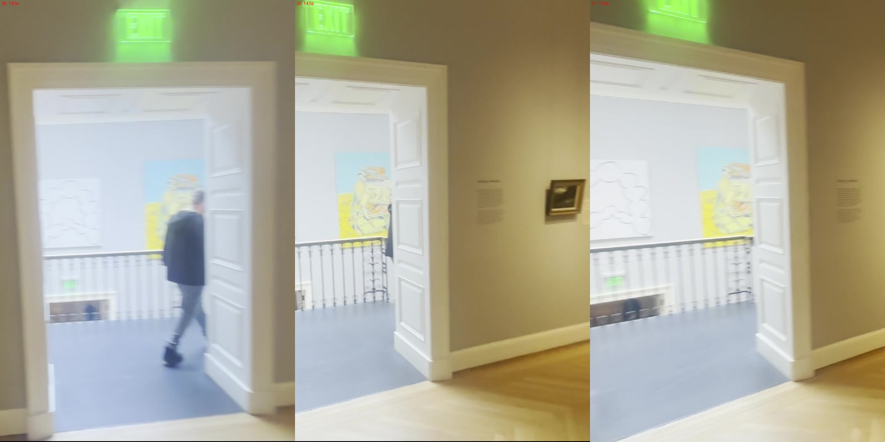
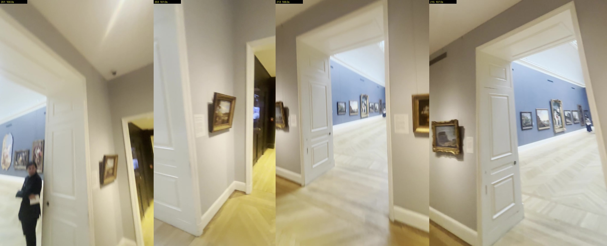
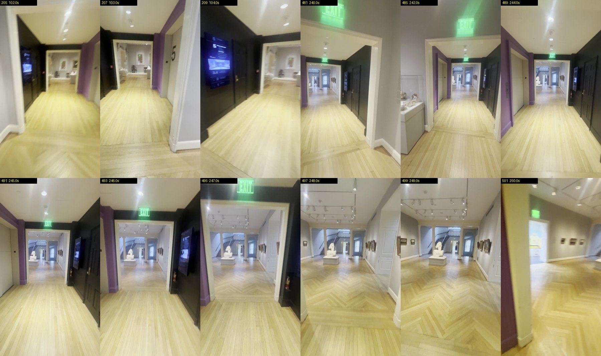
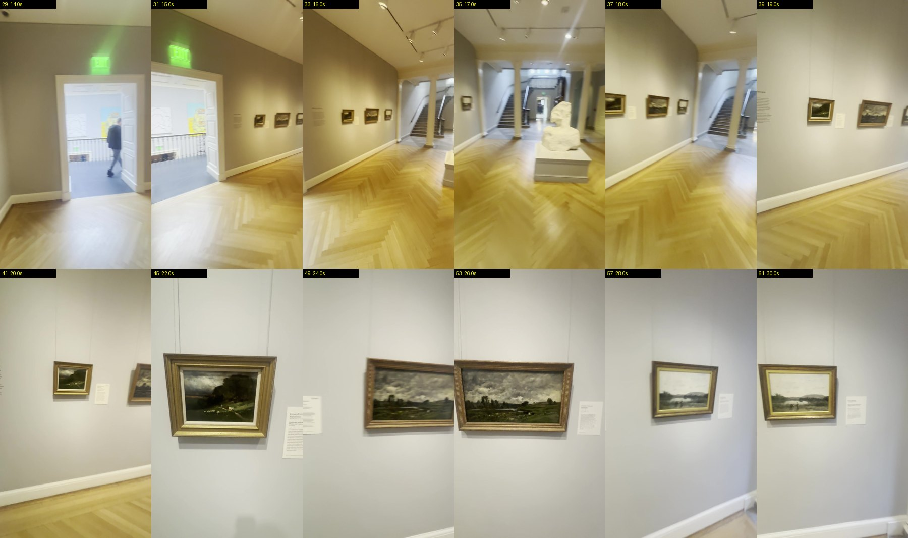
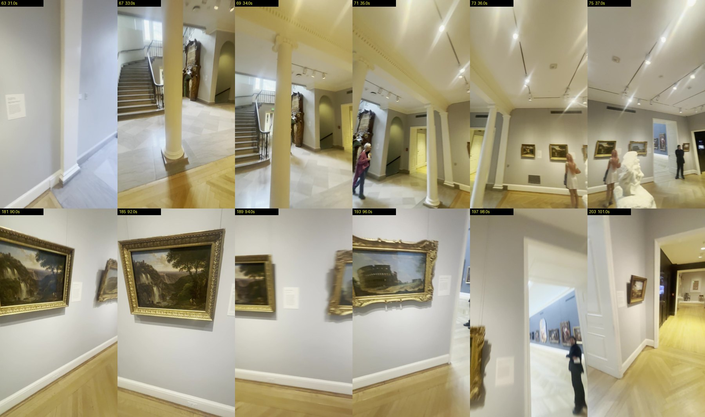

# What the footage shows, for the next grey-gallery pass

Reviewer notes, 2026-10-01. Written while root built the follow-up versions, so that the next build is judged against the footage and not against its own description.

Everything here is read by eye from `survey-2fps/IMG_6380` (frame N is at (N - 1) / 2 seconds, frames turned upright). It gives **order, side and look**. It gives **no metres**: the camera's focal length and eye height are unknown.

## The main correction: no door leaf stands on the gallery floor

All three open leaves the footage shows are folded back **into the door reveals**. The walls are thick: each reveal is about as deep as a leaf is wide, with a panelled soffit.

### Piano door

- **14.0 / 14.5 / 15.0 s (frames 29 to 31).** One white panelled leaf is open at the **east** jamb. Its foot stands on the **blue stair-hall carpet**, inside the reveal, and it runs away from the camera, north. Nothing stands on the herringbone in front of the door.
- **13.5 s (frame 28).** The west casing sits bare beside the Courbet. No leaf on that side.

### Hall door

- **100.0 s (frame 201).** The west leaf's **knob is on its far-left edge**, a person stands in the reveal beside it, and the casing head passes in front of its top. Its free edge points into the Hall. If it stood in the gallery its free edge would be on the right, nearer the camera.
- **106.0 and 107.0 s (frames 213, 215).** The east leaf's foot line **rises away from the casing into the opening**, and its top sits under the reveal's soffit.
- **247.0 and 248.0 s.** From the connector doorway the east leaf is seen face-on at the right, inside the reveal.
- I first read these frames as "leaves open into the room". That was wrong, and I told root to keep the leaves on that reading. The enlargement settles it.

### What that means for the build

- **Built in the settled delivery.** Four leaves, each 0.95 m **into the grey gallery** (`x 4.48..4.54` and `x 6.56..6.62`; `z -4.22..-3.27` at the piano door and `z 0.85..1.80` at the Hall door, read back from the scene).
- **Piano door.** Drop the west leaf. Put the east leaf and its panel faces on the north side: centre `z -4.2 - 0.45`.
- **Hall door.** No leaf on the gallery side. The built reveal is 0.38 m and the other side is the retained Hall, so there is nowhere honest to put a 0.95 m leaf until that wall's depth is fitted.
- This also explains what I could not settle earlier: the corner is in plain view at 38.3 s and in `IMG_6381` 91.0 s, and at 247.0 s a leaf covers about a sixth of the connector doorway, where the built west leaf covers 37 percent of it.
- How deep the reveals are is not measured.

## Casings, baseboards and door leaves

Frames: 14.0 to 15.0 s, 100.0 to 106.0 s, 240.0 to 248.0 s.

- Casings are **flat white painted boards with a small outer moulding**, narrow against the opening (roughly a twelfth of the door's clear width at the piano door). No pediment, no dark wood.
- The piano door's wall is **thick**: the reveal is about as deep as a leaf is wide, with two recessed panels in its soffit.
- Gallery baseboards are **white**, about a casing's width tall, continuous round every grey wall.
- **Connector baseboards take the wall's colour:** black under the black wall (104.0 s), purple under the purple wall (244.0 to 246.0 s). See `source-connector-baseboards-6380.jpg`.
- Leaves are **white, three recessed panels** stacked (tall, middle, short at the bottom), with a small dark knob or pull at mid-height (106.0 s).
- A green **EXIT** sign hangs above the piano door on the gallery side (14.0 s), above the connector doorway on the connector side at the grey end (246.0, 247.0 s), and inside the connector at the Rockefeller end (240.0 to 245.0 s).

## The connector

- **South wall: black, floor to ceiling, one continuous face** (102.0 to 104.0 s looking west; 240.0 to 247.0 s looking east). On it, from the Rockefeller end: a wall screen with a small "5" at its top left, a **black panelled door** with a brass knob, a red fire pull, and a fire extinguisher near the grey end. The black turns the corner onto a short return at the Rockefeller end (240.0 s).
- **North wall: purple**, with a pale flush panel or lift door carrying a large black **"5"** and a small dark call plate beside it (103.0 s, 244.0 s).
- **Ceiling: white**, lower than the galleries, with a single row of recessed downlights.
- **Floor:** boards run the length of the connector. The grey gallery's herringbone starts at the threshold (102.0 s, 247.0 s).
- Both ends have the same narrow white casing as the gallery doors.

## The columned opening at the east end

Frames: 16.0 to 18.0 s, 248.0 to 249.0 s.

- **Two round white columns** on low bases carry a **beam with a moulded cornice** across the whole opening, under the gallery ceiling.
- A **flat pilaster stands at each end** of the beam, against the wall, the same height as the columns.
- The shafts look plain. I cannot tell the capital type at this resolution, so "Ionic" stays the plan's name and not a finding.
- Beyond: the marble stair hall, with a stair rising to the left. In front, on the connector's axis: a white bust on a white plinth.
- Ceiling track lights run in rows across the gallery (16.0 s, 248.0 s).

## Labels

Frames: 14.5 to 30.0 s (north wall), 90.0 to 96.0 s and 105.0 to 106.0 s (south wall).

- Every painting has **one white portrait-format placard**, hung **to the right of the frame**, with its top near the middle of the frame's height. It is about a third to a half of a small frame's width.
- The small painting in the south-west corner, beside the Hall door, has its placard on its **left** (105.0 s), the side away from the corner casing.
- Between the piano door and the first landscape there is a block of **grey wall text set straight on the wall**, with no panel behind it (14.5, 15.0 s).
- Paintings on the north wall hang from **two thin wires** that run up to a picture rail (22.0 to 30.0 s).

## South wall

- Vent grilles sit low and high on the south wall (36.0, 37.0 s).

## What these frames do not settle

- Any distance. In particular: how deep the two door reveals are and how wide the casings are.
- Whether the piano door has a second leaf folded out of sight on the west side of the reveal.
- The column capitals and the beam's exact profile.
- Colours. The phone's white balance shifts from frame to frame (the same wall reads grey-green at 14.0 s and lilac at 22.0 s).
