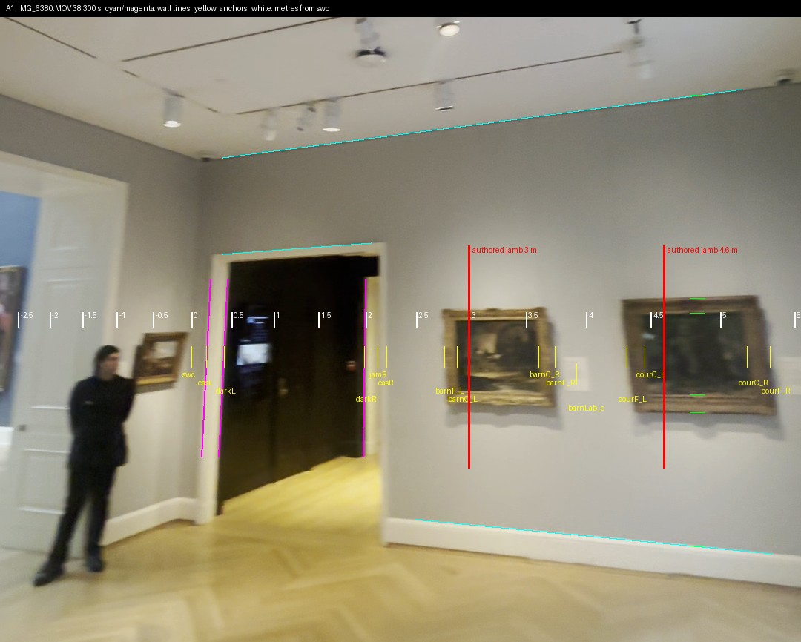
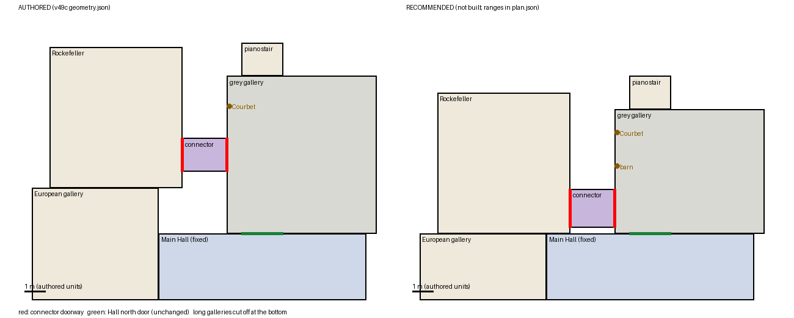
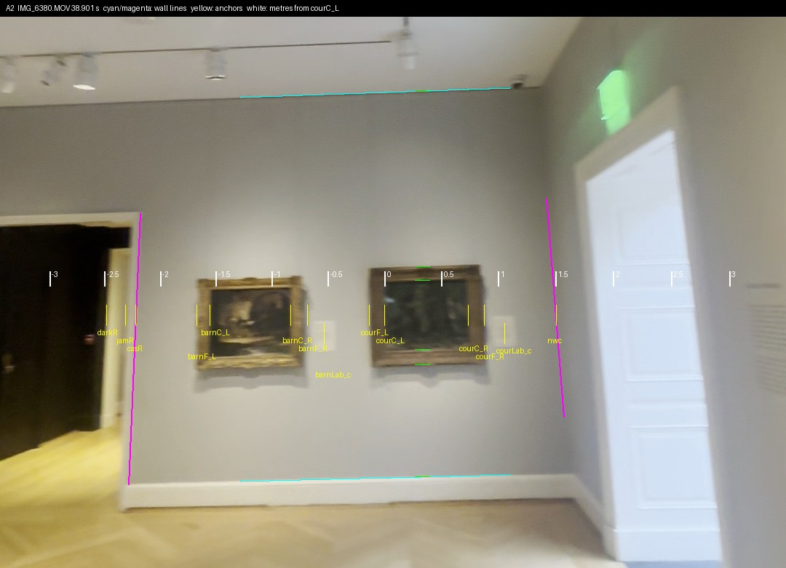
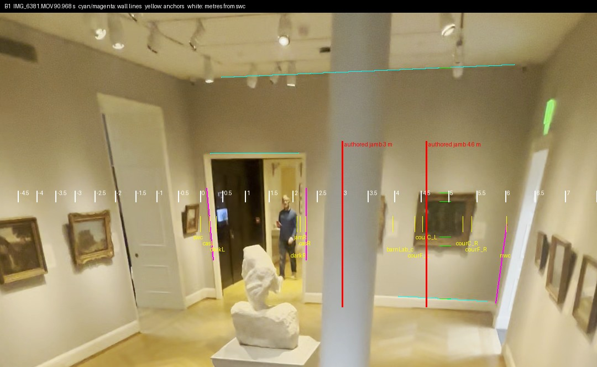
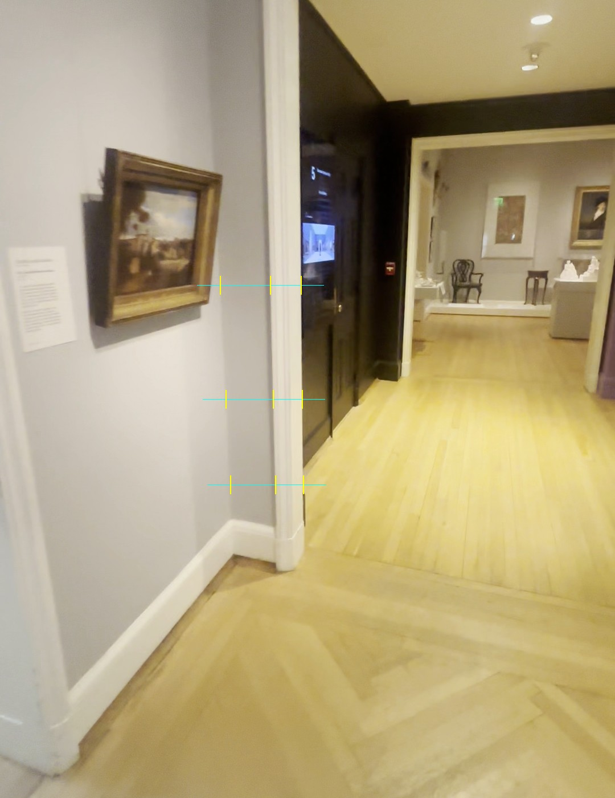
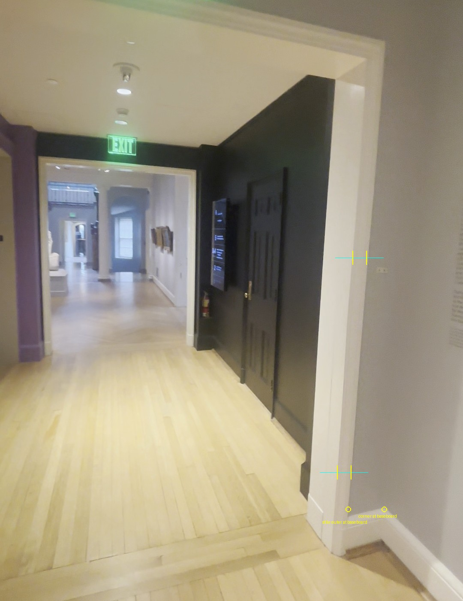

# Grey gallery: where the purple connector's doorway really is

Follow-up to defect D3 of the accepted review (`../opus-remaining-architecture-review-20261001/REVIEW.md`), for Issues #178 / #181 / #182 / #183, 2026-10-01. Evidence and a plan only. No code, bake, asset, interface, error type or acceptance test was touched; nothing was written outside this folder; the root workspace, the ingestion folder and the Main Hall were only read. No paid call, no GPU, no nested worker, no git change.

## Answer

1. **The doorway is in the south-west corner.** Its clear opening starts 0.30 m from the corner (0.15 to 0.45) and is 1.84 m wide (1.6 to 2.1). As built it starts 3.0 m from the corner and is 1.6 m wide. The doorway's centre is 2.58 m from where it should be.
2. **The west wall is about 6.0 m long (5.4 to 6.6), not 7.6 m.** The door, the barn painting and the Courbet fill it; the built wall has 1.6 m too much.
3. **The Rockefeller end of the connector is a corner door too.** So Rockefeller's south wall sits on the Hall's north-wall line, give or take 0.3 m. Rockefeller moves 2.2 m toward the Hall end, not the 3.0 m the review's arithmetic gave, and the European gallery becomes 26.3 m, the same length as the Hall.
4. These are planar fits scaled by one catalogue canvas. They are good enough to place a doorway and two paintings. They are not a calibrated room metric; `metric_accepted`, `calibrated_room_metric`, `physical_loop_accepted` and `connector_length_accepted` all stay false.

The red lines are where the built doorway's two jambs would fall on the real wall: one on the barn painting, one on the Courbet. White ticks are metres from the corner.





## What was measured

Three different things, kept apart as the coordinator asked.

- **Fitted**: the median reading in the fit view, `IMG_6380` at 38.3 s and 38.9 s (one camera position, panning).
- **Held-out error**: the same quantity read in `IMG_6381` at 90.97 s, a different video shot from the marble stair, minus the fitted value. That view was not used to choose anything in the fit view.
- **Anchor interval**: how far each reading moves when my eye-picked anchors are jittered (3 px on an edge, 5 px on the corner creases, 1.5 px on line ends; about 95 %). It says how well I can point at a blurred edge. It is not an accuracy.

Metres along the west wall.

| | Fitted | Held-out view | Held-out error | Anchor interval, fit view | Anchor interval, held-out view | Built |
| --- | --- | --- | --- | --- | --- | --- |
| Corner to outer edge of casing | 0.19 | 0.21 | +0.02 | 0.08–0.30 | 0.09–0.34 | – |
| Corner to clear opening, south edge | 0.28 | 0.33 | +0.05 | 0.15–0.41 | 0.17–0.49 | 3.0 |
| Clear width | 1.84 | 1.83 | −0.01 | 1.69–2.01 | 1.57–2.13 | 1.6 |
| Corner to clear opening, north edge | 2.12 | 2.15 | +0.03 | 1.96–2.30 | 1.89–2.48 | 4.6 |
| Corner to Courbet centre | 4.82 | 4.90 | +0.08 | 4.53–5.16 | 4.36–5.57 | 6.15 |
| Courbet centre to north-west corner | 1.14 | 1.12 | −0.01 | 1.04–1.25 | 0.98–1.29 | 1.45 |
| Whole wall | 5.96 | 6.02 | +0.06 | 5.64–6.31 | 5.36–6.83 | 7.6 |
| Courbet frame width (not the ruler) | 1.02 | 1.03 | +0.01 | 0.95–1.10 | 0.90–1.20 | – |

The held-out error is at most 0.08 m. The anchor intervals are several times wider than that, and the corner-to-casing interval in particular is mostly the eye-picked corner crease: the two views agree to 0.02 m on a quantity I can only point at to about 0.1 m. The barn painting is hidden by a column in the held-out view; its frame starts 0.56 and 0.55 m past the casing in the two fit frames.

A third reading of the Courbet-to-corner distance, from two metres away at 1.6 s, gives 1.20 (anchor interval 1.14–1.27), 0.06 m more than the fit view. The three wall-length chains give 5.96, 6.02 and 6.02.





### How

`fit.py` does not rebuild the room and uses no point cloud. For each frame it takes the wall's own long straight lines (ceiling, baseboard, door head; casing and corner uprights), works out from them how the wall is turned to the camera, and reads positions along the wall. The Courbet canvas (0.733 m wide, RISD 43.571) then sets the scale. The existing `medieval-panel-fit.py` pattern (four canvas corners, inverse homography) is reused only to show where it breaks.

Anchors were read from 7-pixel-wide intensity profiles and 2x to 4x zooms of the native frames, then drawn back on the frames and looked at. Every anchor is in `picks.json` and on the overlays.

### Checks that could have failed

`python3 fit.py --check` asserts all of these.

- Held-out error under 0.10 m on every shared quantity (largest 0.08 m).
- The Courbet's gilt frame, which is not the ruler, comes out 1.02, 1.01, 1.03 and 1.02 m wide in the four frames.
- The canvas height, also not used, comes back as 0.58 to 0.60 m against 0.597 m.
- The barn painting's canvas is 0.72 m wide in both frames that show it.
- The built 3.0 m of wall south of the door and the built 7.6 m wall are outside the 95 % range of every reading.

## Where the method fails

1. **A catalogue canvas is not a frame.** The Courbet's frame is 1.02 m across. Read as the 0.733 m canvas, it shrinks every distance to 72 % and the wall reads 4.3 m. In a blurred frame the dark inner slope of the gilt frame also reads as canvas; I placed the canvas edge using the sharp close frame as a guide.
2. **The canvas alone cannot carry the perspective over a long reach.** Four corners of a 115-pixel canvas, read to 2 pixels, put the doorway 2.0 to 3.7 m away. With the wall's lines the same frame gives 2.4 to 2.8 m. At two metres and a 0.85 m reach the canvas alone does hold (1.20 against 1.20 m).
3. **The anchor intervals cover pick noise and focal length only.** They do not cover the sight edge hiding up to a centimetre of canvas per side (ruler up to 3 % long), the frames standing about 8 cm proud of the wall (up to 5 cm on a painting's position), or the pan blur of 5 to 8 pixels in the 38 s frames. The plan's ranges are widened for these.
4. **The corner crease is the weakest anchor.** It is a soft tonal edge, given 5 pixels. It moves the corner-to-door numbers by about 0.04 m.
5. **Heights are not established.** Baseboard top to ceiling reads 3.3, 3.4 and 3.6 m in the three views. The Courbet's centre is about 1.35 m above the baseboard top, so roughly 1.55 m above the floor against 1.8 m built; I would not move it on this alone.

The lens: the wall's long lines stay straight to within a pixel and a half over 500 to 700 pixels, so I found no bending to correct. The focal length is not established (values from 770 to 1500 px were tried). Positions along the wall do not depend on it; heights do, by a few percent.

## The corner at both ends

No ruler is in these two frames, so widths are in units of the door's own casing stile (about 0.10 m in the fits above).

- Grey side, `IMG_6380` 101.6 s: corner to casing is 1.6 stiles at three heights. The fits above give 0.19 and 0.21 m.
- Rockefeller side, `IMG_6380` 240.3 s: the room's south-east corner is 2.6 stiles from the casing. The wall beyond it carries the wall text and is Rockefeller's south wall.
- The connector's black south wall runs flush from one south jamb to the other.





So the two south walls differ by about one stile, roughly 0.1 m, read without metres. I put the limit at 0.3 m.

## What can be off and still be right

| | Target | Acceptable | Built error |
| --- | --- | --- | --- |
| Corner return beside the door | 0.30 m | 0.15–0.45; never wide enough to hang a picture | 3.0 m |
| Clear width | 1.84 m | 1.6–2.1; the built 1.6 m leaf is at the edge | – |
| Doorway centre along the wall | 1.22 m from the corner | ± 0.15 m | 2.58 m |
| Casing to barn frame | 0.55 m | ± 0.10 m | – |
| Courbet centre to north-west corner | 1.15 m | 1.05–1.25 | 0.30 m |
| West wall | 6.0 m | 5.4–6.6 | 1.6 m |
| Rockefeller south wall against the Hall's north wall | level | ± 0.3 m | 2.2 m |

## Plan

Numbers and ranges are in `plan.json`. Coordinates are the built `geometry.json` frame (x east, z south). The Hall and the grey gallery's south and west wall lines do not move. No painting, frame or mesh file changes; only placements.

**Step 1, the register (this is D3).**

1. One interval, `[-0.34, 1.50]`, replaces `[-2.8, -1.2]` in four places: `rooms[7].openings.west`, the connector's z bounds and both its openings, and `rooms[0].openings.east`. The connector becomes 1.84 m wide and its south wall lies on the Hall's north-wall line, which is where the video has the black panels.
2. Rockefeller's z bounds go from `[-7.2, -0.4]` to `[-5.0, 1.8]`. Everything inside it moves 2.2 m with it. Its east door ends up 0.30 m from its south-east corner instead of 0.8 m.
3. The European gallery's north end goes from -0.4 to 1.8. Objects placed from the Rockefeller door (`IMG_6385`) move 2.2 m; objects placed from the far end (`IMG_6384`, `IMG_6386`) stay. I did not sort them one by one. The unaccepted 9.25 m stretch shrinks to 7.05 m.

**Step 2, the wall length (same files, do it in the same change).**

4. The grey gallery's north wall goes from z -5.8 to about -4.2. The Ionic threshold and the piano-stair threshold follow. The Courbet goes to z -3.06 (from -4.35) and the barn painting, when built, to z -1.45.
5. Not measured here and needing a look before they move: the two free columns' spacing, and the Corot and the piano-door leaf on the north wall.

**Where it lands in root's files** (read only; another worker is in the landing and medieval block of the same generator, so this goes after that).

| File | What changes |
| --- | --- |
| `prepare_remodel.py`, the coupled-loop block | per-room `dz` for rooms 0, 6, 7, 8, 9 and room 1's north bound; the `rooms[0]` east opening and `rooms[6]` literals; trial remap for `right_door_*`, `purple_grey_*`, `grey_piano_*`, the Rockefeller trials and `start`; the `route` waypoints through the connector (z -2 becomes 0.58) and Rockefeller |
| `remodel_room.gd` | `shift_new(first, Vector3(-1.95,0,0))` for the west group gains the z term, with the European gallery's far-end objects held back; in `build_grey_gallery` the black panels (z -1.27), elevator pair and "5" (z -2.73, -2.69), columns, the three paintings and the door leaves |
| `remodel_bake.gd` | `corrected()` and the light, spot and probe lists that pass through it |
| `remodel_review.gd` | the walk starts and every named view on the z -2 axis or inside Rockefeller |

The generator already asserts that shared openings agree and that no two rooms overlap. With these numbers Rockefeller touches the Hall along z 1.8 and does not enter it. Rockefeller, the connector, the European gallery and the grey gallery all need a new bake; the Hall's does not change. Walk the connector both ways and re-check the pink and gold service cases, since the door moves 0.38 m south relative to Rockefeller's own walls.

## Not established

- **The connector's length.** The built 2.15 m is what was left after the loop was closed, and its south wall holds a screen, a door leaf and an extinguisher. If it is longer, Rockefeller and everything west of the Hall move west together; that does not change anything above.
- With zero-thickness walls, 1.15 m of Rockefeller's south wall coincides with the Hall's north wall. That is a consequence of the unmeasured connector length, not something seen.
- Rockefeller's own depth (6.8 m) and the European gallery's length. 26.3 m is what the register gives, not a measurement.
- Ceiling height, hang heights, and the columns' spacing.
- The barn painting has no catalogue match, so its 0.72 m canvas width is a measurement here, not a check.

## Files and how to check

```bash
python3 docs/evidence/collection-reconstruction/opus-grey-register-fit-20261001/fit.py --check
```

It re-hashes the six frames, refits, redraws the overlays and `plan.png`, rewrites `fit.json`, and ends with `CHECK PASSED: 6 groups`. System Python with numpy, Pillow and OpenCV; about ten seconds.

| Frame | Video (sha256) | Seconds | Used for | Frame sha256 |
| --- | --- | --- | --- | --- |
| `A1` | 6380 `eaf7a7853b6c` | 38.300 | fit: corner, door, barn, Courbet | `e017f171aeb3` |
| `A2` | 6380 | 38.901 | fit: door edge, barn, Courbet, north-west corner | `8cfddcbcfab0` |
| `B1` | 6381 `12df06479e7d` | 90.968 | held out: whole wall (stored upside down as decoded) | `527b61d626e6` |
| `C1` | 6380 | 1.600 | close: Courbet to north-west corner | `a38577155ef9` |
| `D1` | 6380 | 101.601 | ratios: grey-side corner | `e21b421966e6` |
| `F1` | 6380 | 240.268 | ratios: Rockefeller-side corner | `d026a5d385ad` |

- `decode.sh`: the exact CPU decode of each frame from `collection-expansion/verified/`. The top-level `IMG_6379.MOV` and `IMG_6380.MOV` in the ingestion folder are empty and `IMG_6381.MOV` is cut short; only `verified/` matches the manifest hashes.
- `picks.json`: every anchor. `fit.json`: every estimate with its range, the ratio frames, the failure cases and the flags. `plan.json`: the recommended numbers.
- `overlays/`, `plan.png`: the pictures above. `SHA256SUMS`, `SHA256.json`: hashes.
- Built geometry read from `main-build-extension-v49c/geometry.json`, sha256 `d59bdada01ef…72b78f3`. The review read another build's copy (`7e0c504d…40b6b`); the grey-gallery numbers it quotes are the same as here.

`scripts/check.sh` was not run: it imports the Godot project and writes outside this folder, and this adds no runtime code. `git diff --check` is clean.

## Next action

Apply steps 1 and 2 together in root's generator after the landing and medieval-axis change lands, then compare a render from the 38.3 s camera position against `overlays/A1.jpg` before baking.
