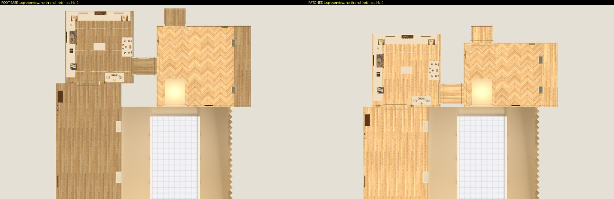
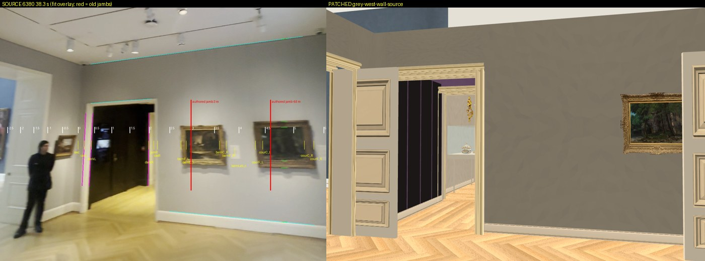
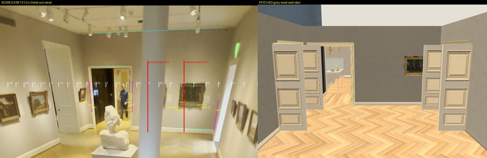
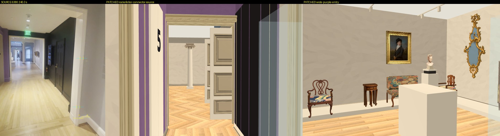
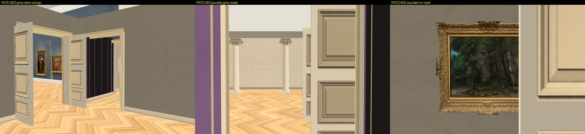

# Grey register: the connector doorway moved to its corner, in the prototype

Implements steps 1 and 2 of `../opus-grey-register-fit-20261001/plan.json` for Issues #178 / #181 / #182 / #183, 2026-10-01, plus the floor fix root asked for during the run. Four source files changed and this folder added; nothing else. Root's workspace, the ingestion folder and the Main Hall were only read. No git change, no paid call, no GPU, no nested worker.

## What it is now

1. **The connector doorway is in the corner at both ends.** Grey gallery, connector and Rockefeller share one doorway, z -0.34 to 1.50, leaving 0.30 m of wall beside it at the grey gallery's south-west corner.
2. **Rockefeller and everything in it sit 2.2 m further south**, with its south wall on the Hall's north-wall line. The European gallery starts on that line and is 26.3 m.
3. **The grey gallery is 6.0 m along its west wall instead of 7.6 m.** The Courbet is 4.86 m from the south-west corner. The piano and Ionic thresholds follow the north wall.
4. **Board and basket floors now face up** (root's fix, taken line for line from root's verified trial).
5. Every metre is still provisional. `metric_accepted`, `calibrated_room_metric`, `physical_loop_accepted` and `connector_length_accepted` are false in `geometry.json`. The barn painting is not built.





## Checked

`python3 check.py SCRATCH` passes **56 of 56**, exit 0, in about three minutes on CPU. It prepares root's base and the patched sources with root's own `prepare_main_build_extension.py`, runs both headless, and compares them. Results are in `results.json`.

- **Plan.** No two rooms overlap and all 26 opening sides have the identical opening on the other side, in both builds. The six register statements hold on the patched build and all six fail on root base. The seven other rooms are unchanged in `geometry.json`.
- **What was actually built**, object by object against root base (411 top-level objects, same order). 280 nodes moved exactly 2.2 m; 28 moved 1.6 m with the north wall; the Courbet's 5 moved 1.29 m; the elevator pair and its "5" moved 2.46 m with their wall; one vent moved 2.58 m to stay over the door. 1,353 nodes did not move at all, and no mesh, collision shape, rotation, texture or catalogue tag changed outside the walls of the six changed rooms. That covers the landing, the modern room, the medieval room, both apostles and the lion.
- **Doorway in collision**, read from the built wall boxes: grey west and Rockefeller east both leave -0.34 to 1.50; both connector headers span it.
- **Walk**, with the scene's own capsule, 240 results: all 16 trials across the connector, grey, piano, Ionic, Hall, European and Rockefeller joins pass; all 13 blocked trials (cases, benches, door leaves, grille, stair-void guard) still block; landing, modern and medieval-door trials pass as before. In the plain prototype project every trial and the loop in both directions pass.
- **Negative controls.** The patched trials walked in root base fail 41 results root base otherwise passes, including both connector crossings and both Rockefeller door crossings. Root base fails root's floor diagnostic (9,948 wrong normals); the patched build has none.
- **Main Hall.** All 362 files hash-equal as prepared; 139 native meshes, node for node identical to root base; 23 paintings in its `works.json`; the Hall worktree is at `317b8f3b8dac` with no tracked change.

### Four results fail in root base and here alike

In the retained-Hall project, `loop_16`, `loop_back_16`, `medieval_between_cases_clear` and `medieval_stairs_aisle_clear` fail in both builds at the same positions. Each crosses the collision guard `retained_hall_room.gd` puts beside the stone portal (x 3.46 to 4.6 and 6.5 to 7.64, z 28.54 to 30.31). None is in a room this change touches. So the capsule loop is complete in the plain project and one leg short in the retained-Hall project, exactly as it was before.

## What changed, by file

Against root's files as received (`base-source/`): 85 lines added, 36 removed. `four-source.patch` applies to `base-source/` and reproduces the four files.

| File | Change |
| --- | --- |
| `prepare_remodel.py` | One doorway interval in four places; Rockefeller, European gallery, grey gallery and the two thresholds' bounds; trial remap; route through the corner door and north of the pink case; a `grey_register` record with the flags |
| `remodel_room.gd` | Rockefeller's contents shifted as a group; connector panels, elevator pair and "5"; north column; Courbet, Corot; piano door leaves; ceiling rails and two vents; the Delacroix; root's floor fix in `panel()` |
| `remodel_bake.gd` | `corrected()` and the Delacroix spot |
| `remodel_review.gd` | `moved()`, the connector and grey cameras, and three new source-relative cameras |

## Assumptions

- **European gallery.** The secretary and the Delacroix moved 2.2 m: both were read from the Rockefeller door (`IMG_6385`). The Fetti, both piers, the Goltzius and the far door leaves **keep their old z**. They were read mid-gallery or from the far end (`IMG_6386`) and nothing fixes them to either end. Their places are unaccepted, as before.
- **Columns.** The south column stays; the north one keeps its 1.6 m from the moved north wall. By eye, the source at 247.5 and 248.5 s has the south column near the connector axis, which is why it stays. Their spacing is unmeasured.
- **Corot and the piano door** ride the north wall with their positions along it unchanged.
- **The connector's EXIT sign and extinguisher** are in the video but were never built, so there was nothing to move.
- **No heights changed.** The Courbet stays at 1.8 m and no ceiling moved, as instructed.

## Looked at

Rendered with Mesa llvmpipe on CPU (`logs/*-render.log`, exit 0, 104 views). I inspected the sheets in `renders/`.







The corner door, the black wall through it, the "5" on the purple side, the Courbet by the north-west corner and Rockefeller's corner door all read as in the source. Three things to know:

1. **The Hall door's west leaf stands 0.66 m in front of the southern third of the connector doorway.** The source has that leaf there too (247.5 s, 101.6 s), but with more wall between the Hall door and the corner than the 0.7 m built. The route clears it by 0.075 m.
2. **The piano door's west leaf overlaps the Courbet's frame by 0.3 m seen square-on**, 0.66 m in front of the wall and not touching. The Courbet's place is measured; the piano door's place on the north wall is not, and by eye the source has that door closer to the corner than the 0.7 m built.
3. **In the retained-Hall project the Hall's own far-door vestibule is drawn inside the grey gallery's south-west corner**, in root base as well (`renders/7-retained-hall-vestibule.jpg`). Root's walk script hides the Hall in that space. The connector door is now right beside it.

Texture and render notes from these unbaked views: the grey walls show a creased, faceted plaster pattern and a warm taupe where the source is smooth cool grey; the door casings and leaves render in striped beige where the source is flat white; the four black panels have purple showing between and above them where the source wall is black to the ceiling; the oak is a saturated orange against the source's pale blond; the columns have no beam over them.

## Not verified

- **No lightmap was baked.** The bake script's prepare step runs (exit 0, 1,255 surfaces) and every fill light and probe it places is inside a room, but surface names have changed and any saved addition bake no longer matches.
- No browser export, no full-app run, no keyboard test, and the production Collection factory is untouched.
- `scripts/check.sh` was not run: it imports the whole repository, and this checkout carries a stale `walk4.gd`.

## For root

1. Verify the hashes below, apply `four-source.patch` (or copy the four files), and rebake.
2. In the actual full app, look back at the Hall from inside the connector and the grey gallery's south-west corner, to confirm the Hall's vestibule is never drawn there.
3. Decide the two door leaves in item 1 and 2 above from the source; I left both as authored.
4. The four baseline walk failures belong to the portal guards in `retained_hall_room.gd`.
5. When the gallery is fitted, place the Fetti, piers and Goltzius; and the barn painting when it has a match (centre z -1.45 on the grey west wall).

## Files and codes

| File | Root baseline sha256, bytes | Patched sha256, bytes |
| --- | --- | --- |
| `prepare_remodel.py` | `0dda4d993766…402da4`, 50,888 | `2ac1eb0095e0…85cf05`, 53,101 |
| `remodel_room.gd` | `e46f6fa68752…5752a0`, 70,695 | `24c41899ba14…21a045`, 71,994 |
| `remodel_review.gd` | `aa519d52f96b…11e7de`, 15,305 | `96892186deae…5c6365`, 15,979 |
| `remodel_bake.gd` | `5aa7a7d8712f…1ddd77`, 11,748 | `228d60ec2850…5746fa`, 11,973 |

My four paths had no pending change before root's versions were copied in, and root's four files still equal the recorded baseline at the end of the run.

| Command | Exit |
| --- | --- |
| `check.py` (56 checks) | 0 |
| `py_compile prepare_remodel.py`; Godot `--check-only` on the three scripts | 0; 0, 0, 0 |
| Walk: patched retained, root base retained, patched plain, base with patched trials | 1, 1, 0, 1 |
| Root's floor diagnostic: patched retained, patched plain, root base | 0, 0, 1 |
| Bake prepare step; three render runs | 0; 0, 0, 0 |
| `git diff --check` on the four files | 0 |

The two walk exits of 1 are the four baseline failures above; the third is the negative control.

```bash
python3 docs/evidence/collection-reconstruction/opus-grey-register-implementation-20261001/check.py /tmp/some-new-folder
```

- `base-source/`: root's four files as received, with `SHA256SUMS` and `BYTES`. `four-source.patch`: the change.
- `check.py`, `register_check.gd`, `bake_positions.gd`: the checks. `root-floor-normal-check.gd`: root's diagnostic, copied unchanged.
- `results.json`: every check with its detail. `logs/`: walk results per run, both `geometry.json` files, floor, bake-prepare and render logs.
- `renders/`: the seven sheets. `SHA256.json`: hashes of everything here.

Godot 4.7.2 stable, headless with `--fixed-fps 60`.
