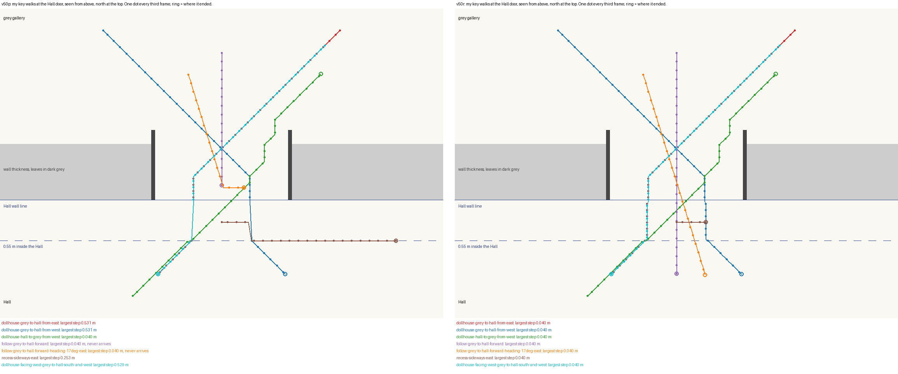
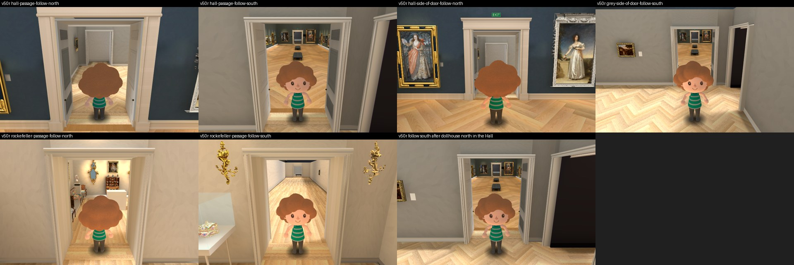
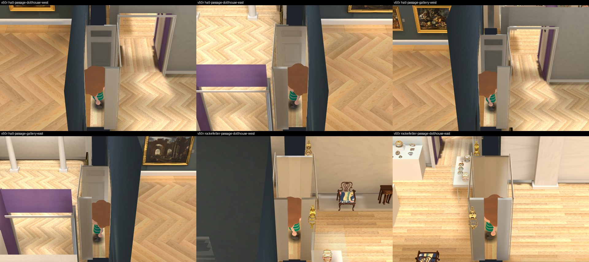
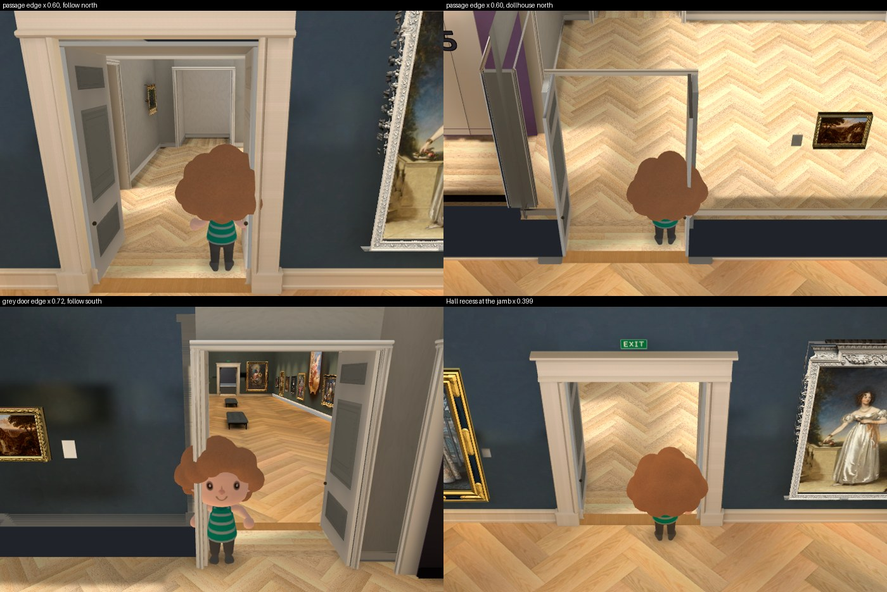

# Hall door walking fix: independent review of `v50r`

Reviewer report, 2026-10-01. Collection prototype only, Issues #178 / #181 / #182 / #183. It follows my review of `v50o` and `v50p` in `opus-hall-renaissance-review-20261001`, where I reported F4 (the follow view could not walk from the grey gallery into the Hall) and F5 (a 0.53 m jump on diagonal crossings).

I changed no implementation. Everything I wrote is in this folder. Root's workspace, the Main build, the 3D Viewer, the ingestion folder and the video masters were only read. No paid call, no generation, no bake, no GPU, no nested worker. I ran Godot only on private copies of root's frozen `v50r` and `v50p` apps in my scratch folder, with the software renderer (`llvmpipe` in all four logs).

**Every metre, placement, map and fidelity flag stays false. This is not an approval of the map, of any metre or placement, of any object's likeness, or of the browser or GPU build.** `v50r` installs no new object.

## Verdict

| Item | Result on `v50r` |
| --- | --- |
| F4, follow view, grey gallery to Hall, key held | **Fixed.** Forward, backward, off centre and at an angle all arrive |
| F5, diagonal crossings, two keys held | **Fixed.** Largest step 0.040 m in the dollhouse and gallery views, both ways, also with the camera turned a quarter |
| F1, Hall leaves cut away | **Kept.** Both leaves are still cutaway bodies and still go in all four side-on views |
| Anything else changed | **No.** One script, two rules. Bake, probes, geometry and the 362 Main files are equal |
| Short taps in the follow view, grey gallery to Hall | **Still fails** from most starting points. Already so before `v50r`; not in root's 16 tests |
| A floor click, grey gallery to Hall | **Still fails.** Already so before `v50r`; not in root's 16 tests |

**Accepted in scope: holding keys now walks through the Hall door both ways in every view, with no jump.** Taps and clicks from the grey side into the Hall do not, and root has said it is working on them.

## What it looks like

My key walks at the Hall door drawn from above, `v50p` on the left and `v50r` on the right. The long straight segments on the left are the jumps; the two rings stranded in the wall's thickness are the follow-view walks that never arrived.







## The change

`v50r` differs from `v50p` in `main_build_walk.gd` only, plus root's new test `passage_keyboard_check.gd`.

- **F4.** The strip that carries a visitor across the Hall's wall line used to end 0.2 m inside the Hall. It now ends 0.55 m inside, where the Hall's own floor rule takes over. The follow view aims 0.4 m ahead, so its aim point no longer falls off the end.
- **F5.** While the visitor is in the Hall's door recess, sideways movement is held to 0.399 m either side of the centre until it is 0.55 m into the Hall. The Hall's own rule then never sees a visitor outside its 0.4 m doorway and never snaps it forward. Root's first try used 0.4, which rounds to just over 0.4 as a stored number and failed; root kept that failure on record as `v50q`.
- The Main build's walk file is not touched.

## My own key walks

Real key events through `Input.parse_input_event`, then the walk stepped by hand at 30 frames a second, on my private copies. A walk passes when it arrives, changes space once at most, never steps more than 0.040 m, shows no flash, keeps its heading, and the key is delivered and released.

| Group | Walks | `v50p` | `v50r` |
| --- | --- | --- | --- |
| Follow view, Hall door, grey gallery to Hall: forward, backward, 0.3 m off centre, 17 degrees either way | 5 | 0 pass. All stop about 0.2 m short and stay | **5 pass** |
| Follow view, Hall door, Hall to grey gallery: forward, backward, 17 degrees | 3 | 3 pass | **3 pass** |
| Follow view, Rockefeller door, both ways, forward and backward | 4 | 4 pass | **4 pass** |
| Two keys, dollhouse and gallery views, grey gallery to Hall from either side | 4 | 0 pass. 0.53 m jump | **4 pass** |
| Two keys, dollhouse and gallery views, Hall to grey gallery from either side | 4 | 4 pass | **4 pass** |
| Two keys, both views, Rockefeller door both ways | 4 | 4 pass | **4 pass** |
| Two keys with the camera turned a quarter, Hall door both ways | 2 | 1 pass. 0.53 m jump the other way | **2 pass** |
| Sideways only, standing in the Hall's door recess | 2 | 0 pass. Jumps 0.25 and 0.45 m, then slides off along the wall | **2 pass.** Stops at the jamb |
| Out of the recess into the Hall on a diagonal | 1 | 0 pass. 0.06 m step | **1 pass** |
| Straight, dollhouse, both doors both ways | 4 | 4 pass | **4 pass** |
| Along the Hall's north wall past its door | 1 | 1 pass | **1 pass** |
| **Total** | **34** | **21 pass, 13 fail** | **34 pass** |

Root's own 16 fixtures, which I read and did not rerun: 16 of 16 on `v50r` with a largest step of 0.040 m; 10 of 16 fail on `v50p`; 8 of 16 fail on `v50q`. Root's original 12 crossings were rerun on `v50r` and still pass. My walks start further from the door than root's and come at it from more directions, and they agree.

## Still failing: taps and clicks into the Hall

Both were already so in `v50p`, and by the unchanged code in `v50n`. Neither is in root's 16 tests, which hold the key down.

| Input | `v50p` | `v50r` |
| --- | --- | --- |
| **Short taps, follow view, grey gallery to Hall**, from three starting points, six taps each | 0 of 3 arrive | **1 of 3 arrive.** The other two stop at z -26.38 and -26.74 and five more taps do nothing |
| Short taps, Hall to grey gallery, two starting points | 2 of 2 arrive | 2 of 2 arrive |
| Short taps, Rockefeller door, both ways | 2 of 2 arrive | 2 of 2 arrive |
| **A floor click from the grey gallery on the Hall floor** | Walks to z -26.70, inside the wall's thickness, and stops. A second click does nothing | **The same** |
| A floor click from the Hall on the grey gallery floor | Stops at z -26.46 inside the passage. A second click arrives | The same |
| A floor click, Rockefeller door, both ways | Arrives in one click | Arrives in one click |

- **Taps.** A tap asks for a 1.0 m step. From anywhere in the last 0.45 m before the Hall line, the point 1.0 m ahead lies past the end of the door strip, so the step is refused and the visitor does not move. Holding the key from the same spot does get through.
- **Clicks.** From an added room, a clicked point is pulled to the nearest place inside an added room. The Hall is not one, so a click on the Hall floor becomes a walk to the middle of the passage.
- My clicks call the walk's own `_walk_to` with the floor point, which is what a real click does after it finds the floor. I did not send mouse events.

Root asked for the script: it is `review_passage.gd` in this folder, functions `taps` and `click`.

## Unchanged from `v50p`

| Check | Result |
| --- | --- |
| Frozen set `frozen-root-sha256-v50r.json`, 19 files | All 19 hash-equal on root's live tree and in `frozen-source-v50r.tar.gz` when I checked. Root has since begun editing its tree for the next candidate |
| Against the `v50p` set | The walk changed; `passage_keyboard_check.gd` is new; the other 17 are the same |
| The walk inside the `v50r` app | Equals the frozen hash |
| App files, `v50p` against `v50r` | 2,371 each. Four differ: the walk, its id file, the recorded hash of the walk, and a random resource id in `room.tres` |
| Bake | `room.tres` equal once that id is set aside; `room.exr` and `geometry.json` equal to `v49q`; 350 probes, 1,282 users |
| Main Hall files | 362 of 362 hash-equal to the Main build at `317b8f3b8dac` |
| My 36 game-camera pictures, `v50p` against `v50r` | Same cameras, same masks, same walls hidden. No picture differs on more than 0.03 percent of pixels |
| Hall leaves and Rockefeller linings | All four are cutaway bodies. In the seven side-on views the near one is not drawn |
| Camera history: dollhouse facing north in the Hall, then follow south from the grey side | Hall end wall drawn, fade 1.0, 16 of 16 meshes on their original material |
| Flags and case positions | Equal to `v50p`; every flag false |
| Walking into a leaf or a lining from inside a passage | Stops 0.345 m and 0.32 m away, as before |

### Clearance at the edges



- Inside the wall's thickness the visitor's centre stays 0.305 m or more from a leaf's face.
- At the grey end, where each leaf's hinge edge stands 0.19 m into the gallery, the centre can come within 0.18 m of the leaf.
- By eye the visitor's hair touches the leaf at the passage edge and is cut by the door frame at the grey door's edge. The same clearance rule applies at every added wall. `v50r` did not change it, and neither did it change the Main build's own 0.4 m doorway, where the hair meets the Hall's casing.

## Still open, outside this fix

- **Taps and clicks into the Hall**, above.
- **F2.** The triptych case 0.123 m off its wall. Root has a separate candidate.
- **F3.** Door jambs are not cut away. In the side-on pictures above the visitor is still about half covered by the grey gallery's jamb.
- **Follow camera inside the Hall** when the visitor is in the grey gallery near its south wall, facing north.
- **The visitor's brightness step** at the Hall line.
- Door head height, panelled soffits, the Rockefeller leaf, grey panel faces, black hidden leaf faces.
- Every metre and placement, every object's likeness, the browser build, and the map as a whole.

## Where my own run fell short

- **My first pass marked six follow walks as losing their heading.** It compared the heading as a number, and a heading of half a turn is stored as either plus or minus half a turn. I changed the comparison to a direction and reran both builds; only the rerun is reported.
- **I did not rerun root's 16 fixtures or its 12 older ones.** I read root's results and ran my own.
- **I did not run `v50n` or `v50q`.** That taps and clicks were already so in `v50n` rests on the walk script's history, not on a run.
- **The display.** As before, Godot fell back from the virtual X display to the desktop's Wayland display, still on the software renderer, and the wrapper returned exit code 1 after each script printed its OK line and wrote its files.
- The archived pictures are JPEG copies of my PNG captures. My private copies of `v50p` and `v50r` are still in my scratch folder, as root asked.

## Files

- `REPORT.md`, `SHA256.json`
- Scripts: `review_passage.gd` (key walks, taps, clicks, edge pictures; run on `v50p` and `v50r`), `review_v50o.gd` (cameras, cutaway owners, history; the same script as last review, run on `v50p` and `v50r`), `plot_paths.py`, `sheet.py`
- Native data: `native-passage-v50r.json`, `native-passage-v50p.json`, `native-review-v50r.json`, `native-review-v50p.json`, `native-v50p-vs-v50r.json`
- Static data: `frozen19-v50r.json`, `full-app-static-v50p-vs-v50r.json`
- Pictures: `walk-paths-v50p-beside-v50r.png`, `follow-and-history-v50r.jpg`, `side-on-cutaway-v50r.jpg`, `visitor-at-walkable-edge-v50r.jpg`
- Archives: `raw-captures-jpeg.tar.gz` (164 pictures), `raw-logs.tar.gz` (4 logs)

```bash
LIBGL_ALWAYS_SOFTWARE=1 xvfb-run -a godot --display-driver x11 --rendering-method gl_compatibility --path <private copy of v50p or v50r> --script review_passage.gd -- <output folder>
LIBGL_ALWAYS_SOFTWARE=1 xvfb-run -a godot --display-driver x11 --rendering-method gl_compatibility --path <private copy of v50p or v50r> --script review_v50o.gd -- <output folder>
python3 plot_paths.py <v50p native-passage.json> <v50r native-passage.json> <out.png>
```
