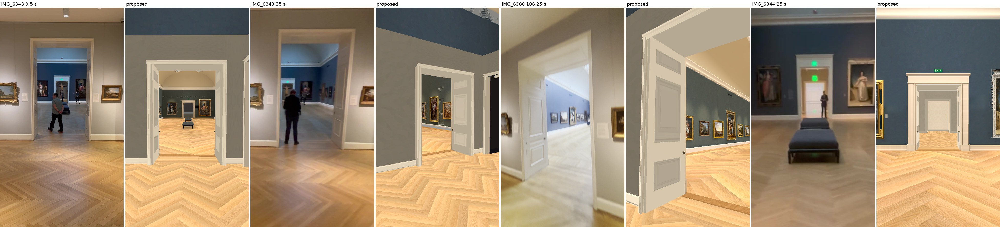
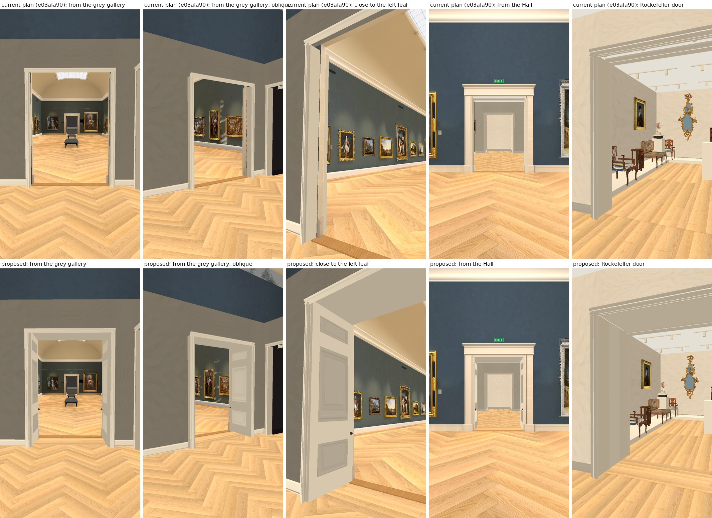
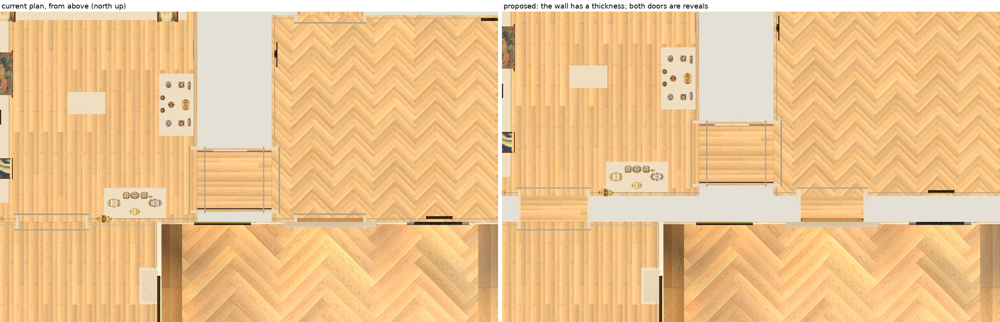
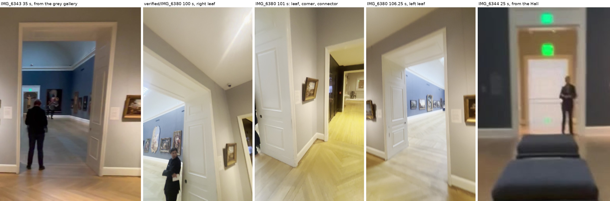
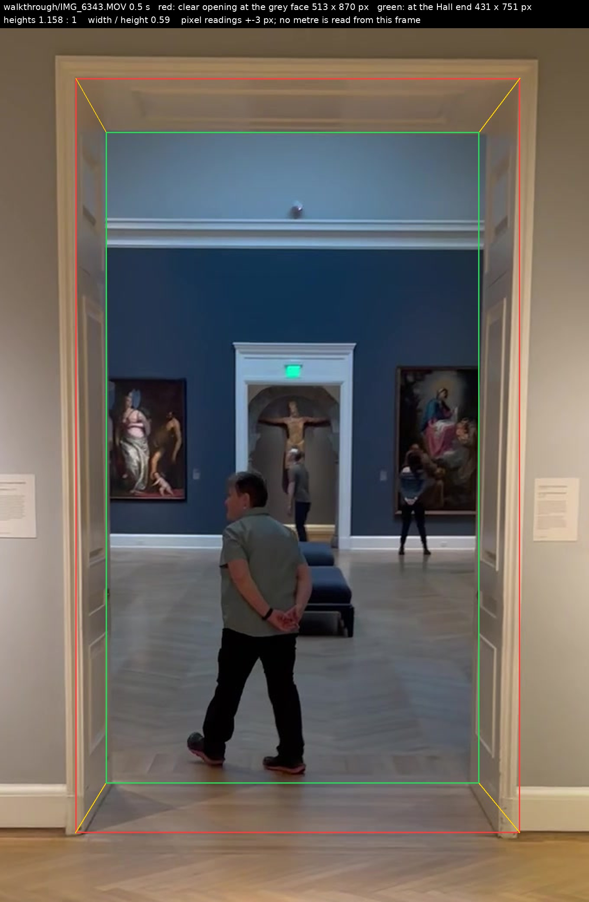
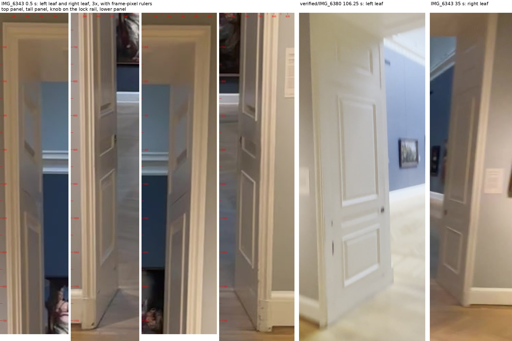
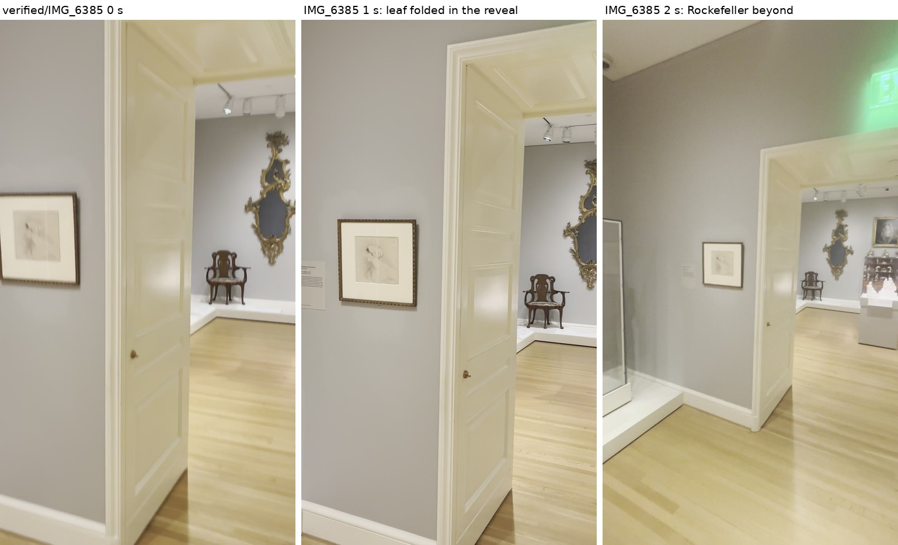

# Hall door: the deep reveal and its two folded leaves

Builder and source review, 2026-10-01. Collection prototype only, Issues #178 / #181 / #182 / #183. Base: root checkpoint `e03afa90` (`v49l` / `v50n`).

This is a proposal, not an implementation. Everything I wrote is in this folder. Root's workspace, the Main build, the ingestion folder and the video masters were only read. No paid call, no generation, no bake, no GPU. I ran Godot only on two private scratch copies of root's prepared room project, on the CPU.

**Every metre, placement, map and fidelity flag stays false. The depth of this wall is not measured.**

## What it looks like

Footage on the left of each pair, the proposed build on the right, at the same four cameras.



The proposed pictures are the room project before its bake, in draft light, drawn by a software renderer. They prove shape and position. They do not prove light, and they are not the full app.





Seen from above, the wall line now has a thickness. Both doors on it are short passages with boards running across them. Rockefeller, the purple connector and the grey gallery have moved up the picture together by the same amount.

What still differs from the footage, by eye:

- **The real door is taller.** The leaves in the build are squat: 0.95 m by 2.72 m, where the footage reads about 0.29 wide for 1 high.
- **The real soffit is panelled.** Built plain.
- **The panel mouldings are stretched.** The three existing Muse panels are square; the real panels are not.

## The footage



Read from the original videos: `walkthrough/IMG_6343.MOV`, `walkthrough/IMG_6344.MOV`, `collection-expansion/verified/IMG_6380.MOV`. The 0-byte `IMG_6380.MOV` one level up is a placeholder and was not used. My hashes of the 6380 and 6385 masters equal root's re-verified ones.

I found sharper views than the three frames named in the task: `IMG_6343` at 35 s shows the door and its right leaf from across the grey gallery, and `IMG_6344` at 25 to 26 s shows the Hall side larger than 23 s does.





### Observed

| What | Reading | Where |
| --- | --- | --- |
| One cased opening with a deep reveal and a panelled soffit | Yes, no second door inside it | 6343 0.5 s, 35 s; 6380 100, 106.25 s |
| Two leaves, each folded flat on its side of the reveal | Yes | 6343 0.5 s shows both |
| Hinge side | The grey face. The knob and free edge are at the Hall end, on both leaves | 6343 35 s; 6380 100, 101, 106.25 s |
| A leaf covers its reveal side from end to end | Yes. Nothing stands on grey parquet or in the Hall | 6343 0.5 s, 35 s; 6380 106.25 s |
| Clear opening, width over height | 0.59 from the grey side (513 by 870 px), 0.58 from the Hall side | 6343 0.5 s; 6344 25 s |
| Leaf panels, from the top, as a share of leaf height | Small 0.06 to 0.15, tall 0.23 to 0.63, lower 0.74 to 0.90, each give or take 0.03 | 6343 0.5 s; 6380 106.25 s |
| Knob | On the rail between the tall and lower panels, 0.71 down | 6343 0.5 s; 6380 106.25 s |
| Casing width | About 0.04 of the opening's width. Root's 0.10 m holds | 6343 0.5 s |
| Hall door stands in the grey gallery's south-west corner, next to the connector | Yes | 6380 101 s |



**The Rockefeller door is built the same way.** `verified/IMG_6385.MOV` at 0 to 2 s, from the European gallery: a deep panelled reveal with a leaf folded into it. So the thick wall is one wall line with two doors in it. It is not something special to the Hall door.

### Not measured

| What | Value | How far to trust it |
| --- | --- | --- |
| Reveal depth from perspective | 0.41 to 0.47 of the opening's width | Depends on the lens. I assumed 26 to 30 mm; the file does not record it |
| Reveal depth from the folded pose | 0.5 of the width: one leaf is half the opening, and it fills the reveal | Assumes the leaf's free edge is flush with the Hall face. It looks flush to within about 5 cm |
| In metres, with the retained 1.9 m Hall opening | 0.78 to 0.95 m | Both readings above, times a width that is itself not surveyed |
| Head height | About 3.2 m, against 2.8 m built on the Hall side and 2.74 m on the grey side | People standing in the door in three frames are about half its height. A guess at their height, not a measurement |

The earlier review's 0.7 to 1.0 m stands. The top of that range fits the pose best.

**The width is about right and the head looks about 0.4 m low.** I do not propose changing either. The Hall side is the retained Hall.

## Why the leaves cannot go in without moving rooms

Read in root's code at `e03afa90`:

- **Every wall on this line has no thickness.** `prepare_remodel.py` puts the grey gallery's south wall, Rockefeller's south wall, the Hall's north wall and the European gallery's north wall all at z 1.8. The 0.38 m door frame straddles that line.
- **A 0.95 m leaf in a 0.38 m frame stands 0.57 m into a room.** The footage shows the opposite. Root left the leaves out for that reason (`remodel_room.gd`, `build_grey_gallery`).
- **The grey gallery cannot give up the depth.** The connector door is 0.30 m from the grey gallery's south-west corner, an observed corner door. Moving only the south wall north would put the wall across that door. The grey register also fixes the west wall at 6.0 m.
- **So the far rooms move as one body.** Rockefeller, the connector, the grey gallery and its two stair thresholds are tied together along that axis by the connector door.
- **Moving them and nothing else shuts both doors.** `main_build_walk.gd` only lets the visitor through a wall where another added room lies 0.4 m beyond it. I replayed that rule: with the far rooms moved and nothing in the gap, the visitor stops at the wall from all four sides (`plan-check.json`, `far_group_moved_without_threshold_rooms`).

## The proposal

One number, in one place. `prepare_remodel.py` gets `leaf = .95` and `reveal = leaf - .19`, which is 0.76 m: the folded leaf, less the 0.19 m every door frame here already stands out from its wall.

1. **The five far rooms move 0.76 m north.** Their shapes, the connector door's 0.30 m from the corner and the 6.0 m west wall are unchanged.
2. **Two threshold rooms fill the wall's thickness**, one at each door. They are 0.76 m deep and as wide as their doors. The Hall, the European gallery and every near room stay where they are, so the Rockefeller seam is kept.
3. **The Hall door gets its two leaves.** Each is 0.95 by 2.72 m, folded flat on its side, hinged at the grey frame, knob at the Hall, free edge on the Hall's own wall plane. The three existing Muse panel textures are re-laid to the observed heights. No new paid call.
4. **Both passages get a soffit. The Rockefeller passage gets side linings.** Its leaf is not built: one leaf is seen in 6385, the other side is out of view.
5. **The Hall is not touched.** No Hall file, mesh or floor changes. The Hall's oak threshold stays where it is and now lies at the Hall end of the passage.

### Walking, both ways

- The two threshold rooms are plan rooms in the far group. `_room_at`, `_depth` and `_walkable` are unchanged. The only edit to `main_build_walk.gd` is two names added to `FAR_ROOMS`.
- **Hall to grey gallery:** the Hall's own rule carries the visitor to its wall line, as now. The existing 0.8 m strip covers the first 0.35 m of the passage. The passage's own room rule takes over from there.
- **Grey gallery to Hall:** the same in reverse. The switch back to the Hall happens at the Hall's wall line, as now.
- **European gallery to Rockefeller and back:** both sides are plan rooms, so the ordinary door rule applies at both ends. The room group changes 0.3 m into the passage going north and 0.3 m into the European gallery going south, as now.
- Clear walking width in the Hall passage is 1.2 m, narrowing to the Hall's own 0.8 m at the Hall end.

### Who owns what

| Piece | Collides | Owner for the camera cutaway |
| --- | --- | --- |
| Each Hall leaf | Yes, a 0.045 m box | Itself, tagged `Grand Gallery reveal threshold:west` or `:east`. Its six panel faces and knob are its children and go with it |
| Each Rockefeller lining | Yes | Itself, tagged `Rockefeller reveal threshold:west` or `:east` |
| Soffits | No | The ceiling list. Drawn only when the camera is below 3.4 m, like the room ceilings |
| Passage floors | Floor only | None. Built by `build_rooms` with the other floors |

Because the leaves carry a wall tag, the walk treats them as walls. They do not become furniture blocks.

## What I checked

| Check | Result |
| --- | --- |
| Patched `prepare_remodel.py`, run to a scratch folder | All of root's asserts pass. The unpatched run reproduces root's `v49l` `geometry.json` exactly, so the method is sound |
| Walk rule replayed in Python, current plan | Both doors cross both ways. Nothing else on the wall line opens |
| Walk rule replayed, proposed plan | The same. Grey west wall 6.0 m and the 0.30 m corner door are unchanged |
| Walk rule replayed, far rooms moved without the threshold rooms | Both doors shut, all four directions. This is the failure the task warned of |
| Patched room scene, built headless on a private copy | Builds. No script error. The Hall's 139-mesh check still passes |
| Patched `architecture_check.gd` on that copy | No failure: 19 casings, 1 piano leaf, 3 lift features, 2 Hall leaves, 2 Rockefeller linings |
| Every mesh and collider, before against after | 2,886 meshes before: 2,221 unchanged, 665 moved north by exactly 0.76 m, none lost. 46 new. 133 colliders: 89 unchanged, 44 moved, 4 new |
| Anything moved that should not have | None. No mesh outside the far rooms moved |
| Anything left behind | None. My first version left nine Rockefeller ceiling rails, their 18 fittings and two vents behind. The comparison caught it and the patch now moves them |
| `remodel_bake.gd`, `remodel_review.gd` | Parse. Not run: they need a renderer and a bake |
| Five views and a plan, private copy, software renderer | Captured for both builds. The capture clips the old Hall tunnel with the walk's own rule: 1,298 triangles, root's number |

**Not run by me:** the bake, the full app, the browser, the keyboard crossings, `main_build_check.gd`, the follow and dollhouse cameras, and the room project's own capsule trials. The walking result is a replay of the rule in Python. It is not the game.

## What root would have to do

1. Apply `hall-reveal.patch`. With `git apply` it is clean on `e03afa90`. On root's live tree at 19:07 UTC, `patch -p1` took every hunk but one: the last condition line in `architecture_check.gd`, which root has since edited. The patch touches no Saint Roch, triptych or Pietà line.
2. Rebake the addition. The new meshes shift the baked surface names, and 665 meshes move.
3. Rerun everything that crosses a door: `main_build_check`, `architecture_check`, the keyboard crossings, the follow views.
4. Look at the visitor's colour inside the two passages. I added no light probes there.

## For root to decide

- **Whether to move the far rooms at all.** It is the only version that holds the leaves, and it costs a full rebake.
- **The top of the wall.** From the dollhouse camera the wall's thickness is an open band 0.76 m wide showing the background. Walls here are single inward faces with no tops, so I added no cap. The Hall is 6 m high and the grey gallery 3.5 m, so a cap is a choice, not a default.
- **The Rockefeller leaf.** Seen on one side in 6385. Not built.
- **The head height.** Raising the grey side alone would make the two faces of one door disagree.
- **The piano door.** `IMG_6343` at 30 to 32 s shows its leaf sharply, with a panel layout unlike the one built, and an EXIT sign on the grey face (`piano-door-6343.jpg`). Outside this task.

## Where I was wrong during this work

1. I first read `IMG_6343` 30 to 32 s as the Hall door. It is the piano door: the connector is at the far end of the wall on its left.
2. My first message to root gave the move as 0.95 m. It is 0.76 m: the frame already stands 0.19 m out from the wall, and the leaf is 0.95 m.
3. My first patch left the Rockefeller ceiling rails and vents in place.

## Files

- `REPORT.md`, `SHA256.json`
- Proposal: `hall-reveal.patch` (six files, 131 lines added, 32 removed), `geometry-proposed.json`, `geometry-current-v49l.json`
- Readings: `measurements.json`
- Checks: `plan_check.py`, `plan-check.json`; `dump_scene.gd`, `compare_dumps.py`, `scene-compare.json`; `capture_reveal.gd`, `capture-current.json`, `capture-proposed.json`
- Pictures: `source-beside-proposed.jpg`, `render-before-after.jpg`, `plan-before-after.jpg`, `reciprocal-door.jpg`, `measure-6343-0.5s.jpg`, `leaf-panels.jpg`, `rockefeller-door-6385.jpg`, `piano-door-6343.jpg`
- Exact frames from the masters: `source-IMG_6343-0.5s.jpg`, `-31.0s`, `-35.0s`; `source-IMG_6344-25.0s.jpg`; `source-IMG_6380-100.0s.jpg`, `-101.0s`, `-106.25s`; `source-IMG_6385-1.0s.jpg`

```bash
python3 plan_check.py geometry-current-v49l.json geometry-proposed.json plan-check.json
godot --headless --path <private copy of the prepared room project> -s dump_scene.gd -- <out.json>
python3 compare_dumps.py <before.json> <after.json> 0.76 scene-compare.json
LIBGL_ALWAYS_SOFTWARE=1 xvfb-run -a godot --display-driver x11 --rendering-method gl_compatibility --path <private copy> -s capture_reveal.gd -- <output folder>
```
