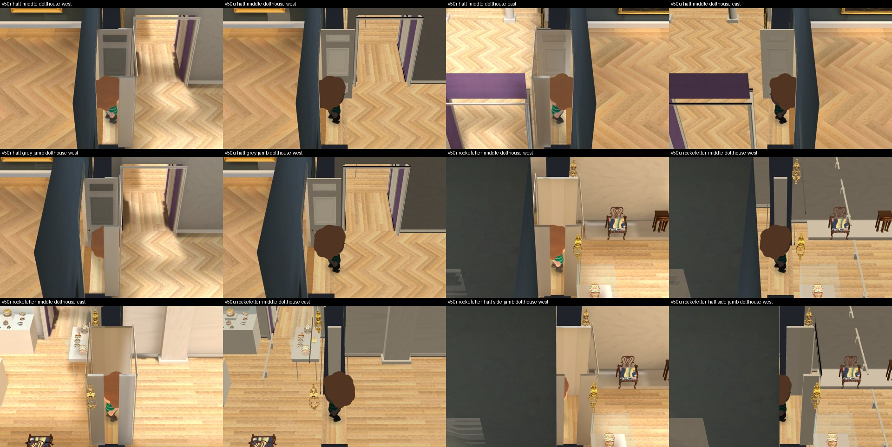
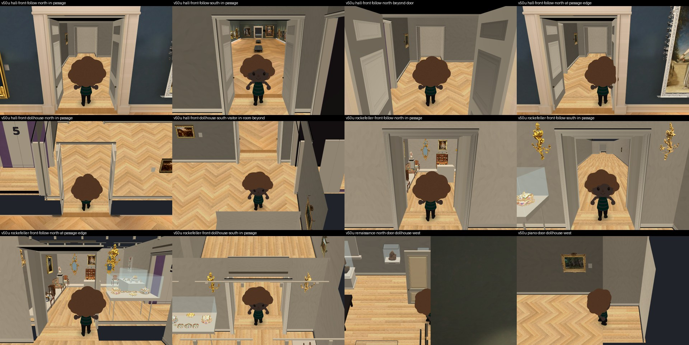
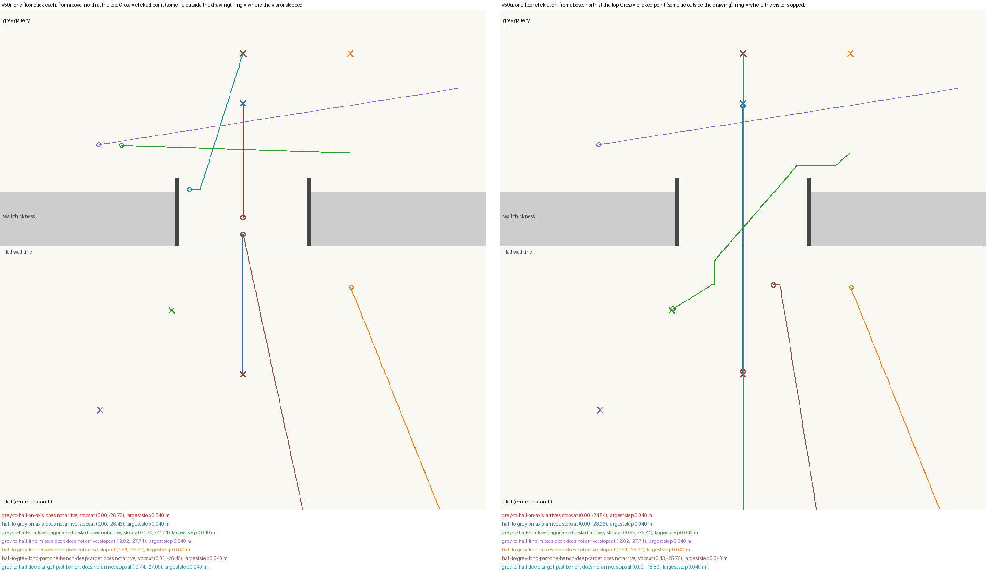
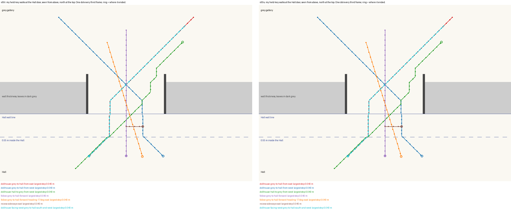

# Taps, clicks and door frames at the Hall door: independent review of `v50u`

Reviewer report, 2026-10-01. Collection prototype only, Issues #178 / #181 / #182 / #183. It follows my review of `v50r` in `opus-hall-passage-fix-review-20261001`, where taps and floor clicks from the grey gallery into the Hall still failed, and my earlier note (F3) that door jambs were never cut away.

I changed no implementation. Everything I wrote is in this folder. Root's workspace, the Main build, the 3D Viewer, the ingestion folder and the video masters were only read. No paid call, no generation, no bake, no GPU, no nested worker, no commit. I ran Godot only after root's ready message, on private copies of root's `v50u` and `v50r` apps in my scratch folder, with the software renderer (`llvmpipe` in all five logs).

**Every metre, placement, map, likeness and unseen-surface flag stays false. `v50u`'s added rooms are unbaked, so nothing here judges light.** I did not review the two new east wall cases or accept the triptych's new position.

## Verdict

| Item | Result on `v50u` |
| --- | --- |
| Held keys through both doors, every view | **Pass, unchanged.** 34 of 34 of my walks, largest step 0.040 m |
| Short taps in the follow view | **Fixed.** 16 of 16 arrive, from every start I tried (`v50r`: 10 of 16) |
| Door frames cut away side-on (F3) | **Fixed.** No frame piece is left drawn between camera and visitor in any of 23 side-on views (`v50r`: left drawn in 18) |
| Door frames kept when seen head-on | **Pass.** 16 of 17 head-on views cut nothing; the 17th has a jamb truly in the way |
| A floor click straight through the doorway | **Fixed.** One click crosses, both ways |
| A floor click whose line misses the doorway | **Not fixed.** The visitor stays on its own side, as in `v50r` |
| Jumps, flashes, walking through a wall | **None** in any walk, tap or click |

**Accepted in scope: held keys, taps and the door-frame cutaway.** Clicks are better and safe, but a click only crosses when the straight line from the visitor to the clicked point passes through the 0.8 m doorway.

## What it looks like

Side-on views of both doors, `v50r` then `v50u` in each pair. The visitor is dark in `v50u` because its added rooms have no baked light yet.



Head-on, `v50u`: the frame, both leaves and the wall stay when the visitor is seen through the opening.



One floor click each, drawn from above, `v50r` on the left and `v50u` on the right.



## The change

Root froze three files: the walk, and two tests. The walk differs from `v50r` in three places.

- **Targets across the Hall line.** When a tap, click or step would cross the Hall's wall line within 0.4 m of the door's centre, the walk now accepts the far-side point: by the room plan when going north, by the Hall's own rule when going south. Before, the point was pulled back to the nearest place on the visitor's own side.
- **The door strip** is now the same for a visitor counted as in the Hall and one counted as in the far rooms. Root's first try (`v50t`) had it for one only and jumped 1.13 m; root kept that failure on record.
- **Door frames.** Each header now carries the boxes of its own pieces (jambs, architraves, the face above the door), and the camera test uses those and not one box above the door.
- The Main build's walk file is not touched.

## Walking

### My previous script, unchanged

`review_passage.gd`, the same file as last review. Real key events, stepped by hand at 30 frames a second.

| Group | `v50r` | `v50u` |
| --- | --- | --- |
| 34 held-key walks: follow, dollhouse and gallery views, straight and diagonal, both doors both ways | 34 pass | **34 pass.** Largest step 0.040 m, one change of space, no flash, heading kept |
| 7 tap groups | 5 arrive | **7 arrive** |
| 4 click groups | 3 arrive | **4 arrive, in one click each** |



### More taps

Follow view, six short presses each. A tap asks for one 1.0 m step.

| Taps | `v50r` | `v50u` |
| --- | --- | --- |
| Grey gallery to Hall, forward, from seven distances between 2.0 m and 0.08 m before the Hall line | 2 of 7 arrive | **7 of 7** |
| Grey gallery to Hall: backward, 0.3 m off centre, 17 degrees off | 2 of 3 | **3 of 3** |
| Hall to grey gallery: three distances forward, one backward | 4 of 4 | **4 of 4** |
| Rockefeller door, both ways | 2 of 2 | **2 of 2** |
| **Total** | **10 of 16** | **16 of 16** |

### More clicks

My clicks call the walk's own `_walk_to` with the floor point, which is what a real click does once it has found the floor. I sent no mouse events and did not test picking.

| One click | `v50r` | `v50u` |
| --- | --- | --- |
| Grey gallery to Hall, on the door's line | Stops in the passage | **Arrives** |
| Hall to grey gallery, on the door's line, no bench between | Stops in the passage | **Arrives** |
| From inside the passage to the Hall | Does not move | **Arrives** |
| Grey gallery to a Hall point off to one side, line through the doorway | Stays in the grey gallery | **Arrives** |
| Grey gallery to Hall on a shallow diagonal | Stays in the grey gallery | **Arrives**, sliding round the door's edge, step 0.040 m |
| Rockefeller door, both ways and diagonal | Arrives | Arrives |
| A click beyond the Hall's north wall away from the door; a click into the wall's thickness beside the door | Stays on its side | Stays on its side. Correct |

| Still not crossing in `v50u` | What happens |
| --- | --- |
| **The line misses the doorway**, either direction | The visitor walks to the nearest point on its own side. More clicks on the same point do nothing. Clicking in front of the door first does not help unless the next line then passes the doorway |
| **Hall to grey gallery past a bench, to a point deep in the gallery** | The first click stalls at (0.43, -25.75), against the Hall wall 3 cm outside the doorway. A second click arrives. `v50r` reached the passage on the first click and arrived on the second, so it is two clicks in both |
| **Grey gallery to a Hall point beyond a bench** | Enters the Hall and stops at the bench's edge, z -18.8. `v50r` never left the grey gallery |
| Hall to grey gallery from the lane beside a bench | Stops in the passage, as in `v50r` |
| Hall to grey gallery past two benches | Stalls in the Hall at about (0.9, -18.6) in both builds. This is the Hall's own bench routing |

Across 26 click cases (leaving out the one with my own bad start, below), 16 tap cases and 34 held-key walks on `v50u`, the largest single step was 0.040 m and the flash stayed at zero. I checked all 7,933 recorded positions: none lies inside the wall's thickness away from a passage, or within the Hall's wall margin outside its doorway.

**The smallest fix I can see for the missed line**, for root to judge: when a clicked point is across the Hall wall line and the straight line misses the doorway, walk to the doorway's centre first and then to the point.

## Door frames

`review_target_jamb.gd`. For each view I test every piece of every door header against six lines from the camera to the visitor, using the pieces' own boxes worked out in my script, and record whether the piece is still drawn.

| Views | `v50r` | `v50u` |
| --- | --- | --- |
| 23 side-on views of five doors (Hall, Rockefeller, Renaissance north, piano, connector); 19 have a frame piece on the line | A piece is left drawn in 18 | **A piece is left drawn in none** |
| 17 head-on views: follow and dollhouse, in the passage, before and beyond the door | Nothing cut in 16 | **Nothing cut in 16** |
| The 17th: follow view with the visitor at the Rockefeller passage's edge, a jamb really in the way | Jamb left drawn | Jamb, frame and wall cut |
| Hall leaves | Both cutaway bodies | Both cutaway bodies |

- **An empty opening is not treated as wall.** With the visitor seen through the opening, no header, jamb or leaf is hidden, at either door, in either view.
- **What still covers the visitor side-on.** At the Hall door the Hall's own north wall stands between a side-on camera and the visitor; in the first picture it still hides about a third of the visitor. In three views with the visitor right at the Hall line, no added frame piece is in the way at all and the Hall's wall does the hiding. Root has said this stays open.
- A whole frame goes together: when one jamb is in the way, both jambs, the architraves and the face above the door are hidden.

## Unchanged, and what did change underneath

| Check | Result |
| --- | --- |
| `frozen-movement-sha256-v50u.json`, 3 files | All 3 hash-equal on root's live tree and in `frozen-movement-source-v50u.tar.gz` |
| The walk inside the `v50u` app | Equals the frozen hash |
| Main Hall files | 362 of 362 hash-equal to the Main build at `317b8f3b8dac` |
| `geometry.json` | Equal to `v50r` and to `v49t`. The room plan did not move |
| Room builder, `v50r` against `v50u` | Three changes: the two east wall cases, the triptych moved from 19.04 to 18.918, and the bake path back to its unbaked form. No door, wall or header line changed |
| App files | 56 added, all under `collection_rooms` (the case scripts and textures); the four baked files are gone; nothing outside `collection_rooms` changed except the walk |
| Root's own tests, read and not rerun | 16 held-key and 12 tap and floor-target tests pass on `v50u`; 2 and 2 fail on `v50t` |

The triptych's new position puts its back pane 0.007 m from the wall face by the numbers in the script. I did not measure it in the built scene.

## Still open

- **Clicks whose line misses the doorway**, and the bench cases above.
- **The Hall's own wall** hiding the visitor side-on at the Hall door.
- **Follow camera inside the Hall** when the visitor is in the grey gallery near its south wall, facing north.
- **The visitor's brightness step** at the Hall line. Not testable here: `v50u` is unbaked.
- The two east cases, the triptych's position, door head height, soffits, the Rockefeller leaf, and every metre, placement and likeness. The browser build and the map as a whole.

## Where my own run fell short

- **One of my click cases started from a spot the walk does not allow**, 1 cm inside a wall's clearance, and the visitor jumped 1.13 m on the first frame in both builds. That was my start point. From a valid start the same click steps 0.040 m; only that is reported, and the bad case is kept in the data as `grey-to-hall-shallow-diagonal`.
- **My early message to root gave loose counts for the door frames** ("20 side-on views", "15 of 16 head-on"). The counts in this report are the checked ones: 23 and 17.
- **One run did not exit.** The first `review_target_jamb.gd` run on `v50u` printed its OK line and wrote its data, then kept running for ten minutes until I stopped it. The same script on `v50r`, and a later script on `v50u`, exited normally. I did not find out why.
- **One click stopped 0.14 m short of its point**, at z -27.36 in the grey gallery after crossing. I count it as crossed; my script's own pass window missed it by 3 mm.
- I did not run `v50s` or `v50t`, and I did not rerun root's tests.
- The archived pictures are JPEG copies of my PNG captures. My private copies of `v50r` and `v50u` are still in my scratch folder.

## Files

- `REPORT.md`, `SHA256.json`
- Scripts: `review_passage.gd` (unchanged from last review), `review_target_jamb.gd`, `review_clicks2.gd`, `plot_paths.py`, `plot_clicks.py`, `sheet.py`
- Native data: `native-passage-v50u.json`, `native-target-jamb-v50u.json`, `native-target-jamb-v50r.json`, `native-clicks-2-v50u.json`, `native-clicks-2-v50r.json`, `door-frame-cutaway-v50r-vs-v50u.json`, `wall-crossing-check-v50u.json`
- Static data: `frozen3-v50u.json`, `full-app-static-v50r-vs-v50u.json`
- Pictures: `door-frames-side-on-v50r-beside-v50u.jpg`, `door-frames-head-on-v50u.jpg`, `click-paths-v50r-beside-v50u.png`, `walk-paths-v50r-beside-v50u.png`
- Archives: `raw-captures-jpeg.tar.gz` (84 pictures), `raw-logs.tar.gz` (5 logs)

```bash
LIBGL_ALWAYS_SOFTWARE=1 xvfb-run -a godot --display-driver x11 --rendering-method gl_compatibility --path <private copy of v50u> --script review_passage.gd -- <output folder>
LIBGL_ALWAYS_SOFTWARE=1 xvfb-run -a godot --display-driver x11 --rendering-method gl_compatibility --path <private copy of v50r or v50u> --script review_target_jamb.gd -- <output folder>
LIBGL_ALWAYS_SOFTWARE=1 xvfb-run -a godot --display-driver x11 --rendering-method gl_compatibility --path <private copy of v50r or v50u> --script review_clicks2.gd -- <output folder>
```
