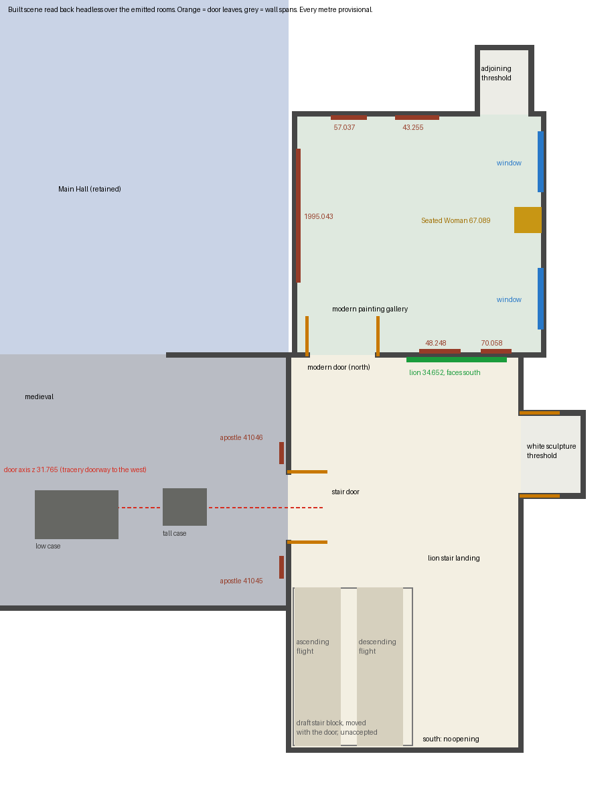

# Lion landing refit, door axis and wall-owned cutaway

Worker report, 2026-10-01. Collection connected museum map only, Issues #178 / #181 / #182 / #183.
Changed in my worktree only: the four prototype scripts. Nothing was rendered, baked, committed, pushed or written to the root workspace. No GPU, no paid call, no nested worker. Every metre stays provisional and every `metric_accepted` / stair flag stays false.

## What this is

Three corrections in one patch, in the order the coordinator sent them:

1. **Landing wall order (D1).** The modern door and the lion move from the landing's east wall to its north wall, beside the corner shared with the medieval-door wall. The white sculpture threshold moves from the south wall to the east wall. The accepted modern interior is turned a quarter-turn about its entry, nothing inside it re-ordered.
2. **Door axis (D2).** The medieval stair door moves onto the tracery doorway's axis (z 31.765). Its leaves, hardware, EXIT sign, the tall case and the two apostle brackets move with it. The draft stair block follows the door (coordinator's option A).
3. **Cutaway.** Wall-hung work is owned by its wall's visual, so a cut-away wall takes it along.

Plan drawn from what the built scene contains, read back headless:



This is a diagram, not a render. I have not looked at any of this in the game.

## Source

I read `landing-plan.png`, both pan sheets, `LANDING.md`, `REVIEW.md` and `evidence-sheet.jpg`, and the enlargements `land-a`, `land-f`, `land-g`. They agree with the brief; I found no contradiction to send. For the stair block I looked at `IMG_6387` 8.0, 44.5 and 83.0 s: the order along the wall is door casing, sign "5", then the rail and first steps. That is an order, not a distance.

## What changed

`landing-refit.patch` (522 lines, 22 hunks) takes the four BASE files to the delivered ones byte for byte. The root's copies still hash to BASE.

| File | Change |
| --- | --- |
| `prepare_remodel.py` | Landing openings `west [30.915, 32.615]`, `north [11.0, 12.7]`, `east [29.5, 31.5]`, no south; landing south bound `35.9 -> 37.615`, void `[10.55, 13.55, 33.715, 37.615]`; medieval `east [30.915, 32.615]`; modern `[10.70, 16.70, 22.30, 28.10]`, `boards_across False`; white stub `[16.15, 17.65, 29.5, 31.5]`; adjoining stub `[15.10, 16.40, 20.70, 22.30]`; lion row `[16.55, 1.18, 28.18]`, yaw 0 (the +1.95 x compensation kept); eleven trials moved; one new assertion that the two medieval side doors share a centre |
| `remodel_room.gd` | Door leaves, lion mount / frame strips / vent, windows, five paintings, case, bench, tracks turned or moved; stair door, EXIT sign, tall case, apostle brackets on the axis; treads, risers, posts, rails, guard and floor clip moved +1.715; east cornice lengthened; wall-hung work re-parented; one word in `update_baked_visibility` |
| `remodel_review.gd` | Lion, painting, case and window assertions (now on global transforms); 23 views re-aimed |
| `remodel_bake.gd` | Modern fills, five painting spots, lion spot, probes, stair-door fill and probe moved |

**A second, two-row patch for a file I do not own:** `video-inventory-d2.patch` moves the two apostles in `image-work/collection-room-remodel/video-inventory.json` (41.046 z `28.75 -> 30.465`, 41.045 z `31.5 -> 33.215`). I did not edit that file. The check ran against a scratch copy with the patch applied (`emitted-inventory-proof.json`). **Apply both patches together**, or the apostles stay behind their brackets.

## Checks

One headless check, CPU only, 7 s:

```bash
godot --headless --fixed-fps 60 --path <Hall-retained scratch project> -s docs/evidence/collection-reconstruction/opus-landing-refit-20261001/check_landing.gd
```

The scratch project was built by `prepare_main_build_extension.py` (the coordinator's retained-Hall helper) from my four files, with the root's `image-work` and `gallery_walk4` reached by read-only symlink.

| Check | Result |
| --- | --- |
| `prepare_remodel.py` and the extension prepare run to the end, with their own overlap, opening-pair and Hall-hash assertions | Passed |
| Emitted rooms equal the brief; every opening in all 13 rooms has exactly one partner on a shared wall line (13 pairs); no two rooms overlap; both medieval side doors centred on 31.765 | Passed |
| Original Hall: scene runs `retained_hall_room.gd`, 139 retained meshes, 23 paintings, 343 Hall source files hash-equal to the main-build reference | Passed |
| Official bytes: lion and five painting photographs hash-equal to the museum files; lion 2.286 x 1.041 m; Seated Woman bounds 0.203 x 0.711 x 0.241 m, bronze surface kept | Passed |
| Lion at `(14.6, 1.18, 28.18)`, facing south, unmirrored; 0.76 m from the door edge, 0.41 m from the corner; mount, four frame strips and vent with it | Passed |
| Six door leaves at their places with push bars; EXIT sign over the stair door | Passed |
| Five paintings, two windows and the case at their transforms, facing into the room; clockwise pan order equals the accepted one | Passed |
| Tall case on the axis, low case unmoved, 1.075 m aisle between them; apostles 0.45 and 0.60 m from the door edges, 2.365 and 0.985 m from the room corners (the numbers `REVIEW.md` D4 gives) | Passed |
| Stair block: 36 treads and the guard translated, flights the same shape; floor runs 1.1 m past the door's south edge and stops at the void | Passed |
| Bench, tracks, ceiling, board direction, wall spans; nothing authored left in the old modern footprint | Passed |
| **Walked** by the scene's own runner: stair door both ways, modern door both ways, white opening both ways, far doorway both ways, aisle between the cases; blocked: tall case, low case, bench, stair void guard, the old stair-door position, the landing south wall | 15 of 15 passed |
| **Cutaway**, 224 visitor positions in the modern room and adjoining stub: lion wall cut at 99, north wall cut at 12; lion, mount, frame or vent drawn over a cut wall: 0; Braque or Villon shown from behind: 0; Matisse or Cezanne floating: 0 | Passed |
| Bake mapping after `remodel_bake.gd` ran headless (UV2 prepare only): 1,254 baked surfaces each name exactly one live mesh; all 26 re-parented meshes are among them at their live transforms | Passed |
| Bake lights read back (`bake-lights.json`): three modern fills below the 3.5 m ceiling, 18 modern probes, six spots meeting the right walls, nothing left in the old footprint | Passed |
| `remodel_review.gd` run headless as far as it goes | Its lion, painting, case and window assertions passed; it then waits for a rendered frame and was stopped by a 60 s timeout |
| Scripts parse in the prepared project; `scripts/check.sh`; `git diff --check` | Passed; "checks passed"; clean |
| Native captures, lightmap bake, browser walk, anything seen on screen | **Not run** |

**Negative control.** The same check on a project prepared from untouched BASE: **exit 1, 63 failures**, no script error (`negative-control-base-checks.json`). The pan-order check passes on BASE too, as it should: the turn must not change it. A project with no Hall reference gives **exit 2** from the watchdog and writes no report (`error-exit-watchdog.log`). Limits: this shows the check fails on BASE and on a script error, not that each assertion fails alone.

## Where I departed from the letter of the instructions

- **Braque and Villon are owned by the lion wall's landing-side visual, not the modern-side one.** The landing face is 4.1 m tall and the modern face 3.5 m, so the camera cuts the first before the second: at 18 of the 224 positions the lion wall is cut while the modern-side face is still drawn (`lion_wall_cut_while_modern_south_drawn` in `checks.json`). An earlier run with the two paintings owned by the modern-side face failed the check at exactly those 18; owned by the landing face the count is 0. They hang on the same partition as the lion.
- **One word in `update_baked_visibility`**: a casing nested under a wall visual (the lion mount, the radiator covers) now reads its in-tree visibility, so its baked copy follows the wall. Top-level casings read exactly as before. **Not exercised with a real bake.**
- **Landing south bound moved to 37.615** (option A). The stair block keeps its authored 1.1 m from the door's south edge. This preserves a draft shape; it is not a source measurement.

## What the root needs to know before applying

- **Re-bake.** The scene builds different meshes in a different order; the saved addition bake does not fit.
- **The cutaway result is for the unbaked walking camera only.** The full-app adapter has its own wall list and cameras; I did not run it.
- **Two authored walks end inside the retained Hall's portal guard**, `medieval_between_cases_clear` and `medieval_stairs_aisle_clear`. They stop at the same points on BASE and with this patch, so I record them and do not judge them. The aisle between the cases is walked short of the guard instead and passes.
- **The modern room's west wall is 0.15 m from the Hall's east wall.** Whether the Hall's dollhouse view shows it through is the reviewer's flag 3; root says the adapter isolates the added rooms on their own layer. Not checked here.

## Still unverified or not done

- All metres. The sculpture door's place along the east wall, the stair geometry and its destinations, the medieval north-east wall (still 2.365 m from apostle to corner, D4 says do not close it by eye).
- Not modelled, as in BASE: the grey text panel between the modern door and the lion, the lion's wall label (BASE has no label node, so there was none to move), the thermostat, and the grey / white difference between landing walls.
- The white-gallery leaves keep BASE's swing, into that gallery. I did not re-read their swing from the video.
- The 23 re-aimed review views were worked out on paper and never looked through. `medieval-stair-door-detail` was moved north-west so the tall case is not in front of the door.
- Fill-light and probe positions: carried over by the same turn or shift, not tuned.

## Files

- `landing-refit.patch`, `video-inventory-d2.patch`: the delivery
- `check_landing.gd`, `checks.json`, `check.log`: the check and its output
- `negative-control-base-checks.json`, `negative-control-base.log`, `error-exit-watchdog.log`
- `built-plan.png`, `built_plan.py`: plan drawn from `checks.json`
- `emitted-geometry.json`, `prepare-manifest.json`, `emitted-inventory-proof.json`: what the prepare run wrote
- `bake-lights.json`, `bake-prepare-headless.log`, `review-assertions-headless.log`, `parse-check.log`, `repo-check.log`
- `SHA256.json`: BASE hashes as handed over, result hashes, the root's copies at check time, both patch hashes and every evidence file
