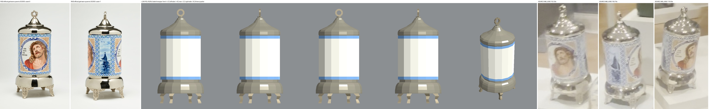
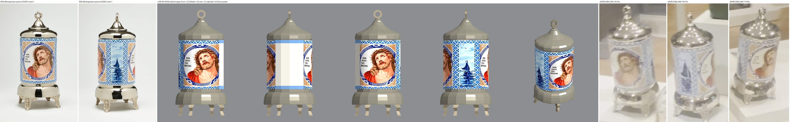
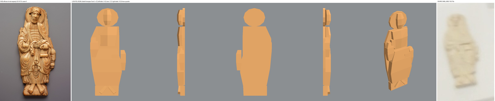
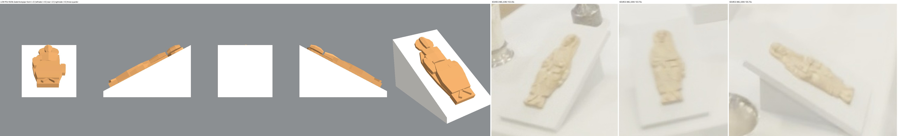

# God Save the Queens and the ivory Christ in Majesty — low polygon geometry for root review

Worker report, 2026-10-01. Collection map only. Nothing here is installed in a case, baked, committed or pushed.
No paid generation by this worker, no GPU, no Vulkan. Cost: 0 USD.

## What this is

One new helper script that builds the last two tall-case objects as closed low polygon shapes with real depth:

- **God Save the Queens**, Léopold L. Foulem, 2020.55 — matched. Separate lid, ring, ceramic body, skirt and four feet.
- **Christ in Majesty**, ivory, 2014.110 — **probable**, not confirmed. A thin seated relief, plus the museum wedge it lies on as a separate part.

They are shape prototypes with flat colours. The ceramic can optionally take two view crops from the root's Muse sheet as decals.

## Look at this first

Each sheet reads left to right: official RISD photographs; the model from the front (+Z), left side (+X), rear (−Z), right side (−X) and a raised three-quarter view; then the video frames.






The model views are real Godot 4.7.2 renders on the CPU (Mesa llvmpipe). They are not the game's bake.

## What was built

`modules/shell/prototype/collection_reconstruction/medieval_ceramic_ivory_assets.gd` (189 lines). It reuses `shell`, `limb`, `slab`, `mesh` and `flat` from the root's `seated_woman_asset.gd`, and `ngon`, `lathe`, `plate` and `box` from the root's `medieval_metal_assets.gd`. It must sit beside both.

| Object | Identity | Catalogue | Built size (W x H x D, cm) | Closed shells | Triangles |
| --- | --- | --- | --- | --- | --- |
| God Save the Queens 2020.55 | matched | 33 x 16 x 16 cm | 16.0 x 33.0 x 16.0 | 19 | 1012 |
| Christ in Majesty 2014.110 | probable | 15.9 x 6.4 cm, depth not listed | 6.4 x 15.9 x 1.4 | 13 | 304 |
| Wedge under the ivory (separate) | display furniture | nothing | 10.5 x 10.1 x 16.8 | 1 | 12 |

Parts:

- **Queens** — bell skirt (220 triangles), neck band, ceramic body in three stacked shells (lower border, white field, upper border), lid (252), lid collar, four S-curved feet (36 each), and a ring finial of eight segments with a real hole.
- **Christ** — halo plate, body plate, footstool, throne side, head, torso, lap and knees, blessing sleeve and hand, book and the hand on it, two feet.

Entry points for the root:

```gdscript
const Pair := preload("medieval_ceramic_ivory_assets.gd")
var queens: Node3D = Pair.build("queens")                       # flat colours
var dressed: Node3D = Pair.build("queens", {"roundel": front_texture, "boat": boat_texture})
var christ: Node3D = Pair.christ_on_wedge()                     # wedge plus the ivory lying on it, origin on the deck
```

`Pair.build("christ")` gives the ivory upright on its own; `Pair.parts(key)` returns `[name, colour key, shell]` rows. Nodes have no collision.

## Axes, as asked

- **Queens.** Origin under the centre of the four feet. **+Z is a Christ roundel** (the north-facing one as filmed) and −Z the other. **−X carries the boat panel** that was filmed from the east. +X is the west face, which nobody has seen; it stays plain.
- **Christ on the wedge.** Origin on the deck under the wedge centre. The low edge and the feet point to **+Z** (north, toward the viewer, as filmed); the head points to −Z (deck centre); the relief faces up. The slope is 27.9°.
- **Christ upright** (`build("christ")`): +Z is the carved face.

Each node carries these as `catalogue_front` and, for Queens, `catalogue_boat`, beside `catalogue_accession`, `catalogue_id`, `catalogue_identity`, `catalogue_size` and `catalogue_unresolved`.

## Decals from the root's Muse sheet

`make_decals.py` cuts two crops from the root's sheet and nothing else. I made no paid request.

| Crop | From | Box in the 1760 x 1440 sheet | Goes on |
| --- | --- | --- | --- |
| `decal-queens-roundel.png` (372 x 472) | FRONT view | 58, 522 – 430, 994 | +Z, and copied to −Z |
| `decal-queens-boat.png` (362 x 475) | RIGHT SIDE view | 488, 519 – 850, 994 | −X |

Each crop is one whole view of the ceramic. The helper projects it straight back onto the arc that faces that way: ±52° for a roundel, ±38° for the boat. The three patches are lit, matt, 16 triangles each, and sit 0.7 mm outside the faceted body. The sheet's REAR and LEFT SIDE views are not used. The patches are extra surfaces over the closed body; they are not part of the 19 checked shells.

The crops live in this evidence folder. The root has to copy them into the app and pass them in as textures.

## Exact dimension assumptions

1. **Queens width and depth.** The photographs give a skirt 14.9 cm across when scaled by the 33 cm height. To meet the catalogue 16 cm I widened every radius by 7.5%, so the skirt is exactly 16.0 cm. The body is therefore 13.9 cm across where the photograph proportion gives 12.9.
2. **Queens heights**, from official photograph 0: feet to 3.4 cm, skirt to 7.35, neck to 8.3, ceramic to 23.6, lid to 29.3, collar to 30.3, ring to 33.0.
3. **Queens feet** stand 63° round from the roundel face, read from the toe positions in photographs 0 and 1. Toes are 7.4 cm from the axis.
4. **Christ depth** is not in the catalogue or any photograph. 1.4 cm is a guess: 0.45 cm of backing and up to 0.95 cm of relief.
5. **Christ width and height** are the catalogue's; every mass position inside them is read by eye from the one official photograph.
6. **Wedge**: 10.5 cm wide, 19 cm of slope at about 28°, by eye from 102.2, 103.7 and 105.7 s, about ±30%. The side view reads anywhere from 24° to 35°.
7. **Colours** are median pixels of the official photographs; the wedge white is a guess.

## Visual mismatches

- **Queens.** Without decals the body is plain white between two blue bands. The lid's lower dome is flatter than the photograph's. The feet are plain square legs, not pierced scrollwork. The ring is an octagon without its leafy scroll. The chrome is a flat warm grey, not a mirror. The body is 7.5% too wide for its height.
- **Queens decals.** The rear roundel is a copy of the front, not a separate observation. The west face is blank. The Muse render curves the top and bottom borders slightly, so the lattice bands bend about 2% at the patch edges. The crops are a Muse render of the object, not the object.
- **Christ.** Blocks, not carving: no face, drapery folds, banded tunic or throne detail. The outline is simpler than the real edge; the broken upper left edge and the drapery at the lower right are squared off. The colour renders more orange than the cream the video shows.
- **Wedge.** A solid ramp; the video suggests a thinner tilted board on a support, which I could not resolve.

## Surfaces nobody has seen

- Queens: the west face, the underside of the skirt (a plain closing face) and the inside.
- Christ: the entire back. It is one flat plane.

## Checks

```bash
bash docs/evidence/collection-reconstruction/opus-medieval-case-pair-20261001/run_check.sh
bash docs/evidence/collection-reconstruction/opus-medieval-case-pair-20261001/run_controls.sh
```

Both copy the root's two helpers and this one into a throwaway project. The first runs Godot with Mesa llvmpipe on the shared Xvfb `:99` and writes `checks.json` and the `views-*.png`. The second is headless.

| Check | Result |
| --- | --- |
| `run_check.sh` | **exit 0**, renderer `llvmpipe (LLVM 20.1.2, 256 bits)` (`check.log`, `checks.json`) |
| Every shell closed: each directed edge once and its reverse once, no collapsed triangle, positive volume | Passed, 33 shells |
| Queens bounds equal 16 x 33 x 16 cm to 0.5 mm; Christ equals 6.4 x 15.9 cm; both typed independently in the check | Passed |
| Queens anatomy: four feet from deck to skirt in four quadrants, straight ceramic cylinder, skirt wider than the body, domed lid drawn to a narrow top, ring with a hole on top | Passed |
| Christ anatomy: halo behind the head, head and torso proud of the backing, wide seated lap, book under his left hand, raised blessing hand, two feet on the footstool, wedge not a part of it | Passed |
| Ivory on the wedge: rests on the slope (gap under 0.00002 mm), nothing inside the wedge or below the deck | Passed |
| Built nodes: checked triangles present, normals, metals lit and not emissive, tags, Christ still "probable" | Passed |
| Decals: three patches, lit textures, just outside the body, facing outward, roundels on ±Z, boat on −X, none unless asked | Passed |
| Opened, flipped, inside-out and collapsed copies of the skirt, inside the run | All four caught |
| `run_controls.sh` | **exit 0** (`controls.log`) |
| — headless instantiate smoke | **exit 0** |
| — sabotage: ring 1 cm short | **exit 1**, as wanted |
| — sabotage: one foot missing | **exit 1**, as wanted |
| — sabotage: Christ marked matched | **exit 1**, as wanted |
| `scripts/check.sh` with Godot off the PATH (module map and seam checks only) | **exit 0**, "checks passed" (`repo-check.log`) |
| `git diff --check` | **exit 0** |
| Full `scripts/check.sh` with its Godot import | **Not run**: the import would write `.import` files beside pending work I may not touch |
| Loading the helper inside this worktree's own project | **Not possible here**: this worktree has no `seated_woman_asset.gd` |
| In-game look, bake, case installation | **Not run** — root's work |

## Not accepted by this work

The Christ identity, both objects' unlisted measures, every rear and unseen face, all decoration, the wedge, and any position in the case. The room is not complete.

## Sources and manifest

- `sources.json` — hashes of the two root helpers, the root inventory, both catalogue records, the five official photographs, the four video frames, the Muse sheet and the two crops.
- `medieval_ceramic_ivory_assets.patch` — the helper as a new-file patch.
- `SHA256.json` — the helper and every file in this folder.
- The earlier case review, metal helper and their evidence are unchanged.
