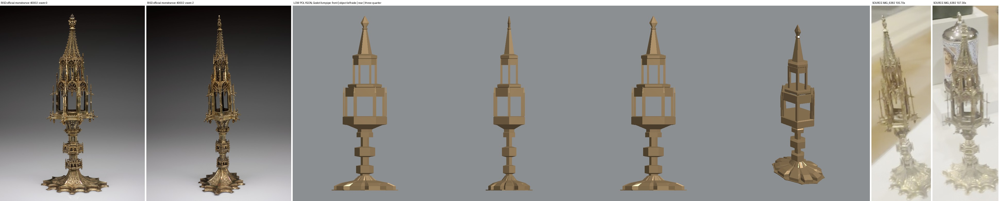
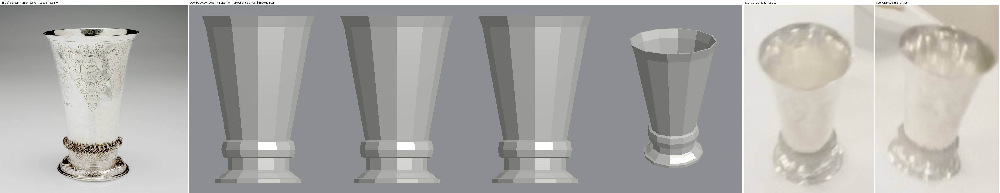
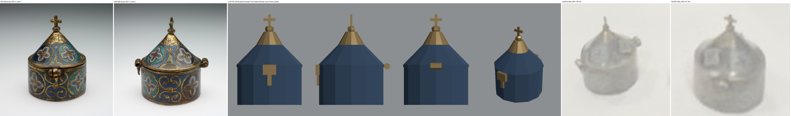
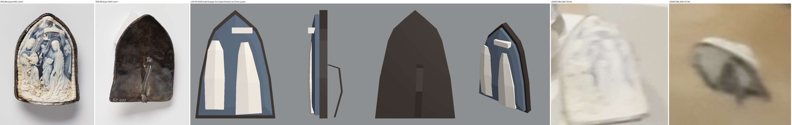
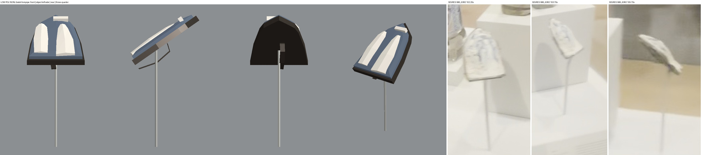

# Four small objects from the tall medieval case — low polygon geometry for root review

Worker report, 2026-10-01. Collection map only, Issues #178 / #181 / #182 / #183.
Nothing here is installed in a case, baked, textured, committed or pushed. No paid generation, no GPU. Cost: 0 USD.

## What this is

Plain low polygon shapes for four of the seven tall-case objects, in one new helper script: the Monstrance 40.002, the probable Communion Beaker 1992.051, the probable Pyx 30.011 and the Pax 52.002. They are shape prototypes built from the official photographs. They carry flat colours only, no Muse texture, and none of the engraving, enamel or carving. The beaker and pyx stay **probable**; nothing here promotes them.

## Look at this first

Each sheet reads left to right: official RISD photographs, then the model from the front, its left side, the rear and a raised three-quarter view, then the video frames.







The model views are real Godot 4.7.2 renders on the CPU (Mesa llvmpipe), lit by one light and grey ambient. They are not the game's bake.

## What was built

`modules/shell/prototype/collection_reconstruction/medieval_metal_assets.gd` (194 lines). It reuses `shell`, `limb`, `box`, `mesh` and `flat` from the root's `seated_woman_asset.gd` and adds only the ring builders these shapes need.

| Object | Identity | Fixed by the catalogue | Built size (W x H x D, cm) | Closed shells | Triangles |
| --- | --- | --- | --- | --- | --- |
| Monstrance 40.002 | matched | height 46.4 cm | 17.6 x 46.4 x 12.4 | 36 | 1260 |
| Communion Beaker 1992.051 | probable | height 14 cm | 9.5 x 14.0 x 9.5 | 1 | 356 |
| Pyx 30.011 | probable | height 8.9 cm | 6.4 x 8.9 x 7.3 | 9 | 268 |
| Pax 52.002 | matched | 12.1 x 8.9 x 2.2 cm without handle | 8.9 x 12.1 x 2.2, or 3.9 deep with the handle | 6 | 252 |
| Pax rod (museum stand, separate) | not an artwork | nothing | 15 cm rod | 1 | 20 |

Every origin is under the base centre with +Z forward. Each built node carries `catalogue_accession`, `catalogue_id`, `catalogue_identity` and `catalogue_height`.

What each shape contains:

- **Monstrance.** Ten-lobed foot with a spur between lobes, an upright rim and a low trumpet; hexagonal stem with two chamfered knops, a collar and a spreading calyx; platform; lower storey of six posts under a plain band with **the chamber left open** between them; six free-standing pinnacles; a narrower open upper storey; cornice, spire and leaf finial.
- **Beaker.** One shell with a real open mouth: stepped foot rim, domed foot, band, rope collar as a plain bulge, straight flaring body, turned-out lip.
- **Pyx.** Low cylinder, cone lid with a gilt top, knob, cross, hinge barrel behind, clasp plate and hanging hasp in front.
- **Pax.** Pointed-arch dark silver mount, the shell bulging forward inside it, three plain raised masses (angel left, Virgin right, canopy above her), and the strap handle on the plain back. The rod is a separate part and `pax_on_stand()` reclines the pax on it.

## Exact dimension assumptions

Only the figures in the "fixed" column come from the catalogue. Everything below is read from photographs or by eye and is **provisional**.

1. **Monstrance.** Foot 17.6 x 12.4 cm and plan depth 0.70 of width: silhouette widths in official photographs 0 and 2 (597 px and 412 px), scaled by the 46.4 cm height. Ten lobes: six are visible across the front including both end lobes, with a lobe on each long end and a spur at the front centre. Knops at 4.4–6.8 cm and 8.9–11.7 cm, platform at 17.4–19.8 cm, storeys to 27.4 and 35 cm, spire to 42.8 cm: row measurements on photograph 0. I assume photograph 2 is a true end view.
2. **Beaker.** Lip 9.46 cm, collar 6.2 cm, foot 7.2 cm across: photograph 0 scaled by the 14 cm height. Inner floor at 3.8 cm and a 1.5 mm wall are guesses; the inside is not photographed.
3. **Pyx.** I assume the catalogue 8.9 cm includes the cross. Body 6.3 cm across and 3.7 cm tall, cone to 7.2 cm, cross 1.2 cm: photograph 1. Hinge and clasp sizes by eye from photograph 0.
4. **Pax.** I assume 12.1 cm runs from the apex to a flat lower edge, and that the bowed lower band in photograph 0 is the mount wrapping the shell's curve, not extra height. The 2.2 cm depth is split 0.9 cm mount and 1.3 cm shell and relief by assumption. The handle stands 1.7 cm off the back by assumption; the catalogue excludes it.
5. **Pax rod.** 15 cm long, pax reclined 55° from upright, rod meeting the back a third of the way up: by eye from 102.2 s and 105.7 s, about ±30%. Not catalogued, not measured.
6. **Colours** are median pixels of the official photographs. Metals use metallic 0.6, roughness 0.4 and take light; nothing is emissive.

## Visual mismatches

- **Monstrance.** No tracery, ogee arch heads, crockets or pierced work: the arcades are plain bands and the spire is solid. The knops are plain blocks without their little corner pinnacles. The hanging pendants under the platform, the pinnacles on the upper storey, and the glass cylinder inside the chamber are missing. The real tower tapers in a cluster of pinnacles; the model reads as two stacked lanterns. The foot's engraved panels and pierced rim are not modelled. The front flat face of the chamber is wider than in the photograph (5.0 cm against about 3.4 cm).
- **Beaker.** The twisted rope collar is a smooth bulge. No engraving, no chased foot, no band pattern. The video shows a more turned-out lip than the photograph; I followed the photograph.
- **Pyx.** No enamel pattern or gilt bands; one flat blue. The lid cone is straight where the photograph shows a slight curve. The clasp and hasp are boxes.
- **Pax.** The relief is three blobs, not figures: no white border frame, no small angel, dove, lily or drapery. The mount has no rope edge. The strap handle is a bent flat bar without its top loop.
- **Pax on its rod.** The video shows no detail of how the rod holds the pax, so the rod simply meets the back; in the side view it passes beside the handle.

## Surfaces nobody has seen

- Monstrance: the rear, the underside of the foot and the inside of the chamber. The rear is the same plain masses as the front by the shape's own symmetry; no observed detail was copied onto it.
- Beaker: the inside and its floor.
- Pyx: a straight rear view, and the underside.
- Pax: the edge thickness and the underside. Front and back are both photographed.

## Checks

One command, CPU only:

```bash
bash docs/evidence/collection-reconstruction/opus-medieval-metal-assets-20261001/run_check.sh
```

It copies the root's `seated_woman_asset.gd`, this helper and `check.gd` into a throwaway project, runs Godot with Mesa llvmpipe, and writes `checks.json` and the five `views-*.png`.

| Check | Result |
| --- | --- |
| `run_check.sh` | **exit 0**, renderer `llvmpipe (LLVM 20.1.2, 256 bits)` (`check.log`, `checks.json`) |
| Every shell closed: each directed edge once and its reverse once, no collapsed triangle, positive volume in Godot winding | Passed, 53 shells |
| Heights equal the catalogue to 0.5 mm, typed independently in the check; pax width and depth without handle equal 8.9 and 2.2 cm | Passed |
| Shape tests so a plain box cannot pass: lobed long foot, two knops wider than the shaft, six posts per storey, chamber open at 23 and 31 cm, hollow beaker with collar and foot standing out, pyx hinge behind and clasp in front, pax gable, relief proud of the ground, handle behind, rod not part of the pax | Passed |
| Built nodes: checked triangles present, a normal on every vertex, metals lit and not emissive, accession tags, beaker and pyx still "probable" | Passed |
| The check can fail: opened, flipped, inside-out and collapsed copies of the beaker inside the run | All four caught |
| Sabotaged copies of the helper: finial 1 cm short; chamber filled; pyx marked confirmed | **exit 1** each (`negative-control.log`) |
| Helpers build with no display (`godot --headless`) | **exit 0** (`headless-smoke.log`) |
| `scripts/check.sh` with Godot off the PATH, so only the module map and seam checks run | **exit 0**, "checks passed" (`repo-check.log`) |
| `git diff --check` | **exit 0** |
| Full `scripts/check.sh` with its Godot import | **Not run**: the import would write `.import` files beside pending work I may not touch |
| Loading the helper inside this worktree's own project | **Not possible here**: this worktree has no `seated_woman_asset.gd`; it loads beside the root's copy |
| In-game look, bake, case installation, Muse pass | **Not run** — root's work |

Two things about the run itself. A private Xvfb aborts inside the worker sandbox, so the script uses the machine's shared `:99`. Two early trial runs let Godot fall back to Wayland and may have flashed a window on the desktop; the script now blocks Wayland.

## For the root

`medieval_metal_assets.gd` must sit beside `seated_woman_asset.gd`; it loads it with a relative `preload`. Then:

```gdscript
const Metal := preload("medieval_metal_assets.gd")
var monstrance: Node3D = Metal.build("monstrance")   # also "beaker", "pyx", "pax"
var pax: Node3D = Metal.pax_on_stand()               # rod plus reclined pax, origin on the deck
```

`Metal.parts(key)` returns `[name, colour key, shell]` rows if you want your own materials. The nodes have no collision; they belong inside a case.

## Sources

`sources.json` lists the hashes: the root helper, the four catalogue records, the eight official photographs and the four video frames used, all from the accepted review folder `opus-medieval-case-inventory-20261001` in the root checkout. That folder and my earlier report and ledger are unchanged. `SHA256.json` covers this folder and the helper.

## Files

- `modules/shell/prototype/collection_reconstruction/medieval_metal_assets.gd` — the helper.
- `run_check.sh`, `check.gd`, `check.log`, `checks.json` — the check and its output.
- `views-*.png` — Godot views; `make_compare.py`, `compare-*.jpg` — the sheets above.
- `negative-control.log`, `headless-smoke.log`, `repo-check.log`, `sources.json`, `SHA256.json`.
