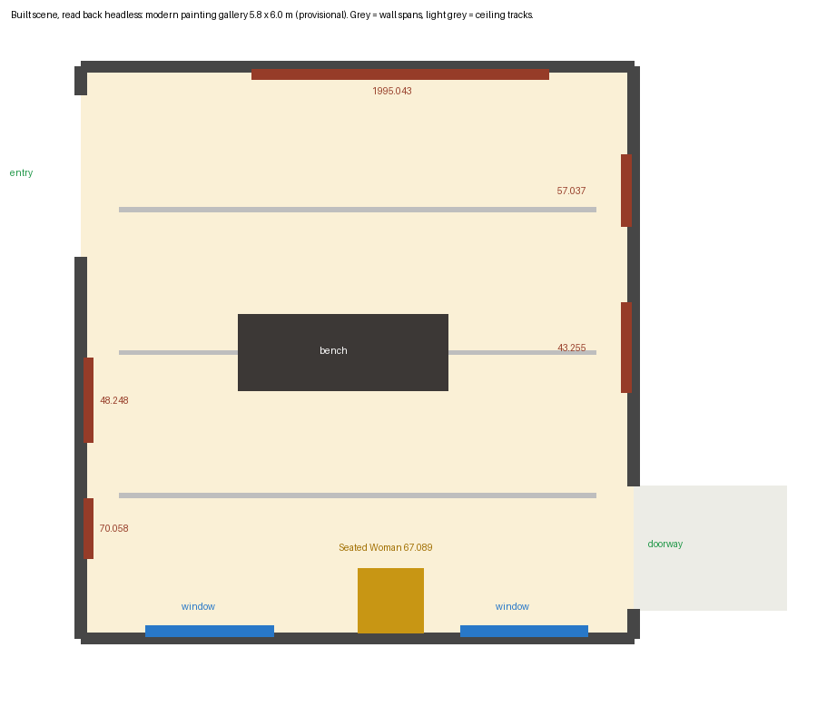

# Modern gallery layout — implementation of the accepted patch

Worker report, 2026-10-01. Collection connected museum map only, Issues #178 / #181 / #182 / #183.
Changed in my worktree only: four prototype scripts. Nothing was baked, rendered, committed, pushed or applied to the root workspace. No GPU, no paid calls. Every metre stays provisional and every `metric_accepted` stays false.

## What this is

The modern painting gallery turned a quarter-turn about its entry door, as `layout-patch.json` describes: the door stays where it is, the room now lies south of it behind the lion wall, it is near square, it has two windows, and the five paintings and the Seated Woman case are on the walls the video shows.

Plan drawn from what the built scene actually contains (read back headless, not from the patch):



This is a diagram, not a render. I have not looked at the room in the game: that needs a renderer, and the native captures, bake and browser walk are the root's.

## What changed

`modern-layout.patch` (254 lines, 11 hunks) takes the four BASE files to the delivered ones exactly; I applied it to copies of BASE and compared byte for byte. The root's own copies of those four files still hash to BASE, so it should apply there cleanly.

| File | Change |
| --- | --- |
| `prepare_remodel.py` | Modern room `[16.15, 21.95, 28.9, 34.9]`, second doorway `east [33.3, 34.6]`; adjoining threshold room `[21.95, 23.55, 33.3, 34.6]`; three walk trials replaced; layout note rewritten, with `entry_reveal_depth_modelled: False` added |
| `remodel_room.gd` | Two windows on the south wall, parented to that wall's visual so the cutaway hides them with it; five paintings moved and turned; bench turned; three ceiling tracks turned to run along the large-painting wall; case at `(19.4, 0, 34.84)`, `PI` |
| `remodel_bake.gd` | The three modern fill lights, five painting spots and the probe grid moved into the new room |
| `remodel_review.gd` | Placement assertions for all five paintings, the case and a two-window count; ten modern views re-aimed and one added (`modern-doorway-corner`) |

Three small additions beyond moving numbers, each so a check can find the thing: the Braque and Cézanne now carry `catalogue_accession` like the other three, and each window pane carries a `modern_window` tag.

Kept as they were: the landing, the entry opening `west [29.2, 30.9]` and its two trials, the lion, the door leaves, every Muse material and frame, the Villon oval patch, `seated_woman_asset.gd` with its bronze surface, floorboard direction, painting heights, and everything outside the modern room. I did not add entry depth or any adjoining-room interior.

## Checks

The scratch project was prepared with the edited scripts copied into a scratch folder and the root's `image-work` and `gallery_walk4` reached read-only by symlink, because the worktree does not hold the root's untracked source images. `prepare-manifest.json` is that run's full input hash list.

```bash
godot --headless --path <prepared project> -s docs/evidence/collection-reconstruction/opus-modern-layout-implementation-20261001/check_modern.gd
```

| Check | Result |
| --- | --- |
| `prepare_remodel.py` runs to the end, including its own opening-pair and room-overlap assertions | Passed |
| Scripts parse in the prepared project (`parse-check.log`) | Passed, 4 GDScript + 1 Python |
| **Emitted `geometry.json`**: both rooms and three trials equal the patch; entry pair with the landing unchanged; doorway pair matches; no rooms overlap; not stretched; nothing accepted | Passed |
| **Built scene**: five paintings at their patch transforms, on the right wall line, facing into the room, framed widths as assumed | Passed |
| Exactly two windows, on the south wall, parented to its visual; hiding that wall hides them; radiator covers follow | Passed |
| Case at its transform, in the cutaway list; figure is the catalogue-bounded 67.089, faces into the room with its left to the west, bronze surface kept | Passed |
| Each wall's order equals the pan order; nothing overlaps a neighbour, an opening or a corner | Passed |
| Walls split by the door (west) and doorway (east); ceiling covers the new room; three tracks; one bench; nothing authored left in the old footprint | Passed |
| **Trials walked** by the scene's own runner: both modern openings each way, the bench, and the four landing trials | 8 of 8 passed |
| `remodel_review.gd` run headless as far as it can go | Its lion, painting, case and window assertions passed; it then waits for a rendered frame and was stopped by a 60 s timeout (`review-assertions-headless.log`) |
| `scripts/check.sh`, `git diff --check` | "checks passed"; clean |
| Native captures, bake, browser walk, cutaway seen on screen | **Not run** |

The headless walk also records "camera clear" flags; with no renderer I report them but do not rely on them.

### Negative control

The same check against a project prepared from the untouched BASE: **exit 1, 34 assertion failures** (`negative-control-base-checks.json`) — wrong room, three trials, four paintings off their walls and one unfindable, no south windows, case, wall orders, bench, tracks, and authored nodes still in the old footprint.

What went wrong on the way, plainly:

- My first negative-control run hung. The check read a dictionary key that BASE does not have; Godot reports that as a script error, stops the function, and keeps the process alive. The root diagnosed it and terminated that one process (PID 2128497, receipt at `/tmp/collection-modern-negative-control-intervention.json`).
- I then reran into the same log file, so the raw log of the hung run is gone. The error is quoted in the root's receipt and messages: `check_modern.gd:49`, missing `entry_reveal_depth_modelled`.
- Fixed: optional keys are read with `.get()`, and the check now carries a 90 s watchdog. A deliberately injected missing-key error produced **exit 2** after 90 s with the error printed (`negative-control-watchdog.log`), so a script error can no longer pass for a hang or for an assertion failure (exit 1).

Limits of the negative control: it shows the check fails on BASE and on a script error. It does not show each assertion fails alone.

## What the root needs to know before applying

- **The saved bake does not fit this scene.** Surfaces are matched to the bake by `AuthoredSurfaceNNN` index, and the modern room now builds a different number of meshes in a different order. Re-bake before any baked build; do not load the old bake with these scripts.
- **The room's footprint moved.** `[16.15, 20.95] × [23.2, 28.9]` is now empty and `[16.15, 21.95] × [31.1, 34.9]` is newly occupied. Nothing else was authored there, and the overlap assertion passes for all 13 rooms.
- **`retained_hall_room.gd`** extends `remodel_room.gd` and is not copied by the prepare script, so it was not exercised here. It is byte-identical to BASE.

## What stays unverified or marked

- All room and placement metres: by eye from the video, about ±0.5 m on room size. `metric_accepted`, `placement_accepted` and the frame fidelity flags are all still false.
- Entry reveal depth (the door sits in a reveal roughly 0.8–1 m deep in the video): not modelled, marked `entry_reveal_depth_modelled: False`.
- Adjoining gallery interior: still a threshold stub, `adjoining_room_interior_complete: False`. No native source looks back from it.
- Bench position, track spacing, fill-light and probe positions: placed by eye or by proportion inside the new room.
- The eleven re-aimed review views: camera positions were worked out on paper and never looked through.
- Window size and sill height: unchanged from BASE.

## Files

- `modern-layout.patch` — the delivery
- `check_modern.gd`, `checks.json`, `check.log` — the check and its output
- `built-plan.png`, `built_plan.py` — plan drawn from `checks.json`
- `emitted-geometry.json`, `prepare-manifest.json` — what the prepare run wrote
- `parse-check.log`, `review-assertions-headless.log`, `repo-check.log`
- `negative-control-base-checks.json`, `negative-control-base.log`, `negative-control-watchdog.log`
- `SHA256.json` — BASE hashes as handed over, result hashes, the root's copies at check time, patch and evidence hashes
