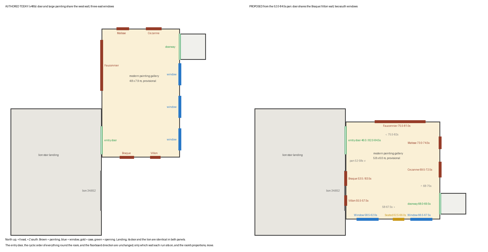

# Modern gallery layout — independent source review

Worker report, 2026-10-01. Collection connected museum map only, Issues #178 / #181 / #182 / #183.
A review and a suggestion: nothing in the room builder, the prepare script, the main build or the coordinator's workspace was changed. No paid generation, no GPU. All metres are provisional.

## The answer

1. **Two windows, not three.** The window wall has two windows with the Seated Woman case between them. The third window belongs to the next room and is seen through the doorway.
2. **The second doorway is in the Cézanne wall**, at the end beside the window wall — not in the window wall.
3. **Bigger than either: the entry door is in the Braque/Villon wall, not the large-painting wall.** That turns the whole room a quarter-turn about the door. With the door kept where it is, the room lies *south* of the door, behind the lion wall, instead of north of it.
4. **The room is close to square**, about 5.8 × 6.0 m, not 4.8 × 7.9 m.

The order of things going round the room is already right in the authored layout. What moves is which wall each run sits on.



## How the video shows it

One continuous leftward pan from inside the room, 52.0 s to 84.5 s, decoded every half second (`frames/`, five full sheets). In pan order:

| Seconds | What is in frame | Strip |
| --- | --- | --- |
| 52.5–57.5 | Braque, then Villon to its left, with the Villon's label beyond | `pan-0-51.0-57.5s.jpg` |
| 58.0 | corner: Villon wall meets the window wall | `pan-a-58.0-62.5s.jpg` |
| 58.5–62.0 | **window 1**, a short pier from that corner | `pan-a…` |
| 59.5, 62.5–66.0 | wall label, then the **case** | `pan-a…`, `pan-b-63.0-68.0s.jpg` |
| 66.5–67.5 | **window 2**, directly after the case | `pan-b…` |
| 67.5–68.0 | **corner** — ceiling line turns — and the doorway casing begins | `pan-b…` |
| 68.0–69.5 | **doorway**, a header sign above it; through it the next room's windows carry on the same wall line | `pan-c-68.5-75.0s.jpg` |
| 69.5–72.5 | label, then the Cézanne, on the same flat wall as the doorway | `pan-c…` |
| 73.0–74.5 | label, then the Matisse | `pan-c…` |
| 75.0 | corner: Matisse wall meets the large-painting wall | `pan-c…` |
| 75.5–81.0 | label, then the Le Fauconnier | `pan-d-75.5-84.5s.jpg` |
| 81.0–82.0 | a floor grille and a text panel, then a **corner**, then the entry door | `pan-d…` |
| 83.0–84.0 | entry door, a label, and the **Braque — all on one flat wall** | `pan-d…` |

**Two or three windows.** Between the corner at 58.0 s and the corner at 67.5–68.0 s there is one window, the case, and one window. No frame in between is skipped and each shares features with the next. The three-window reading came from the wide at 51.0 s, where the window seen through the doorway sits in line with the other two.

**Which wall the second doorway is in.** At 68.0 and 68.5 s the ceiling corner is between the doorway and window 2, so they are on different walls. At 69.5 and 70.0 s the Cézanne, its label and the doorway casing share one wall and one baseboard.

**Which wall the entry door is in** (`entry-42.0-51.0s.jpg`, `pan-d…`):

- Walking in at 46.0–47.5 s, with both door leaves in frame, the wall with the grille and the Le Fauconnier runs straight away on the left from the door jamb to the far wall. A door in that same wall could not show it.
- Looking back at 82.0 and 84.5 s, the corner is right beside the door casing and the grille wall is the *other* side of it.
- At 83.0–83.5 s the door, a label and the Braque are flat on one wall.

In my sculpture report earlier today I used the authored wall names ("north (Cézanne) wall", "east pier"). The relations there stand; the compass names and the interim case position are replaced by this report.

## The smallest correction

Kept exactly as authored: the landing, the entry door opening `west [29.2, 30.9]`, both walk trials through it, the lion, the floorboard direction, every painting's size, frame and height.

| Thing | Authored | Proposed |
| --- | --- | --- |
| Room bounds | `[16.15, 20.95, 23.2, 31.1]` | `[16.15, 21.95, 28.9, 34.9]` |
| Second doorway | `east [23.5, 25.1]` | `east [33.3, 34.6]` |
| Adjoining threshold room | `[20.95, 22.55, 23.5, 25.1]` | `[21.95, 23.55, 33.3, 34.6]` |
| Windows | three on the east wall, z 26 / 28 / 30 | two on the south wall, centres x 17.5 and 20.8 |
| Braque 48.248 | `(17.7, 1.65, 31.02)`, `PI` | `(16.23, 1.65, 32.4)`, `PI/2` |
| Villon 70.058 | `(19.45, 1.65, 31.02)`, `PI` | `(16.23, 1.65, 33.75)`, `PI/2` |
| Le Fauconnier 1995.043 | `(16.23, 1.65, 25.45)`, `PI/2` | `(19.5, 1.65, 28.98)`, `0` |
| Matisse 57.037 | `(17.45, 1.65, 23.28)`, `0` | `(21.87, 1.65, 30.2)`, `-PI/2` |
| Cézanne 43.255 | `(19.35, 1.65, 23.28)`, `0` | `(21.87, 1.65, 31.85)`, `-PI/2` |
| Seated Woman case | not installed | `SeatedWoman.build(...)` at `(19.4, 0, 34.84)`, `rotation.y = PI` |

Full detail, evidence seconds per item and the three replaced walk trials are in `layout-patch.json`.

Where the numbers come from, and how far to trust them:

- **Room size.** Each wall's length is the sum of the things on it: catalogue painting widths with their authored frames, the 1.7 m door, 1.34 m windows, and gaps judged by eye against those. West ≈ 6.2 m, east ≈ 5.6 m, north ≈ 6.1 m, south ≈ 5.8 m. I took 5.8 × 6.0. Good to perhaps ±0.5 m.
- **No overlap.** The proposed doorway is 0.82 m clear of the Cézanne frame and 0.14 m from the corner; nothing on any wall touches its neighbour.
- **Case.** It sits off-centre on the pier: close to window 2, with the label and more wall on the window 1 side. Turned `PI`, the figure's left faces west — the side the 63.5 and 64.5 s frames show.
- **Things that move with the room but that I did not place carefully:** the bench (its long side runs along the large-painting wall, near the middle), the ceiling tracks and painting spots, and the code that looks up the east wall by `position.z > 25.1`. Listed in the JSON.

## Checks

```bash
python3 docs/evidence/collection-reconstruction/opus-modern-layout-review-20261001/check_layout.py
python3 docs/evidence/collection-reconstruction/opus-modern-layout-review-20261001/plan.py
```

`check_layout.py` applies the proposed rooms to the v48b `geometry.json` and checks:

| Check | Result |
| --- | --- |
| The four opening pairs `prepare_remodel.py` asserts still match, share a wall line and fit inside both walls | Passed |
| No two rooms overlap (same test as `prepare_remodel.py`, all 13 rooms) | Passed |
| On each modern-gallery wall: nothing overlaps, at least 0.15 m between neighbours, order equals the pan order | Passed |
| Room no more stretched than 1.25 : 1 | Passed (5.8 × 6.0) |
| The check can fail: doorway put back beside the old windows; Cézanne hung across the doorway | Both rejected on every run |
| `scripts/check.sh` | "checks passed" (`repo-check.log`), log redirected away from the coordinator's `/tmp/godot-import.log` |
| `git diff --check` | Clean |
| Walk, cutaway, bake or any render of the proposed layout | **Not run** — nothing was built |

Output is saved in `check-layout.json`. It also lists what breaks if the new item positions are used with the old room, as a reminder that rooms and items have to change together.

## What is not established

- **Every metre.** No measurement, only sums of known painting widths and gaps judged by eye in blurred frames.
- **Wall thickness at the entry.** The door sits in a reveal roughly 0.8–1 m deep with a grey stone floor (46.0–47.5 s). The authored walls are 0.12 m and share one line; I left that alone, so the room may really begin that much further east.
- **The adjoining room.** Only what shows through the doorway: its window wall continues ours and has a painting between two windows. No frame looks back from it, and I did not search the other nine videos for one.
- **Windows.** Width, sill height and the pier sizes are by eye; the authored 1.2 m pane is kept.
- **Paintings' heights on the wall** are untouched and unchecked.
- **Not built today and not proposed in metres:** the wall labels, the text panel and floor grille on the large-painting wall, the EXIT sign over the entry door, the header sign over the second doorway.

## Files

- `REPORT.md`, `plan.png`
- `layout-patch.json` — the suggested values; `check_layout.py`, `check-layout.json` — the check and its output; `plan.py` — draws the plan from the JSON
- `entry-…jpg`, `pan-0…` to `pan-d…jpg` — captioned source strips
- `frames/` — five sheets of the whole 42.0–85.0 s decode, twelve full-size frames, and `manifest.json` with the command and hashes
- `repo-check.log`, `SHA256.json`

The earlier sculpture helper and its evidence folder are untouched.
