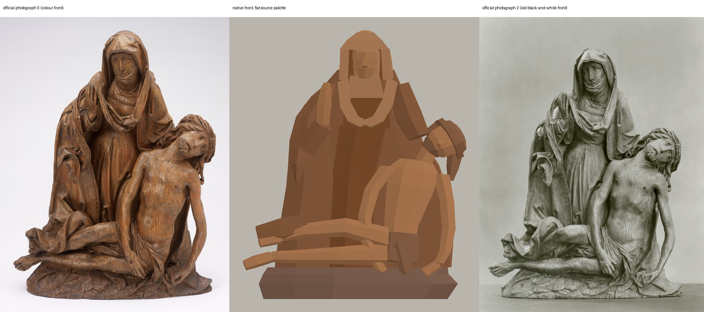
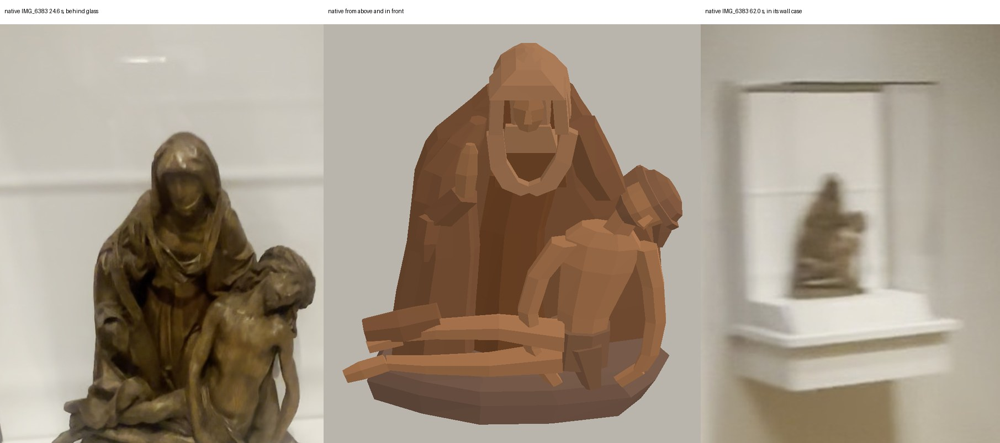
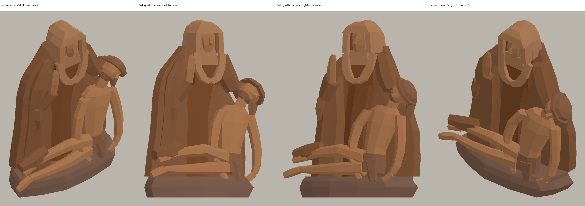
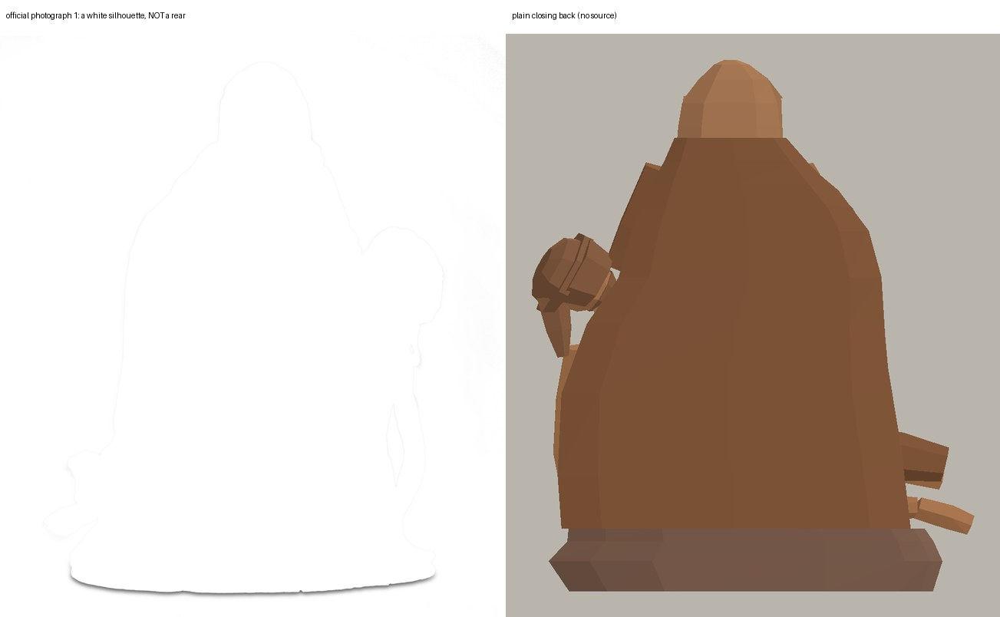
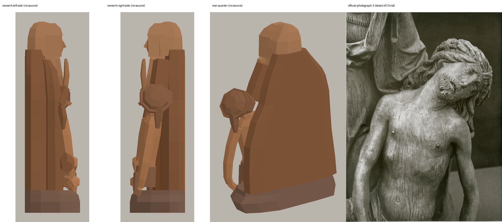
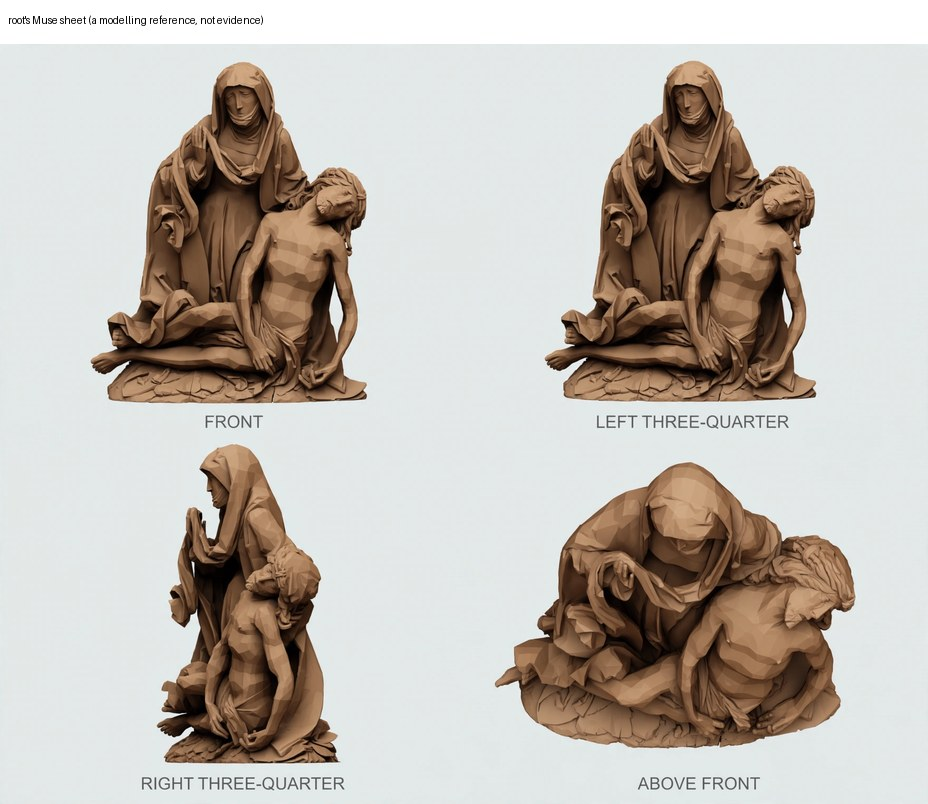
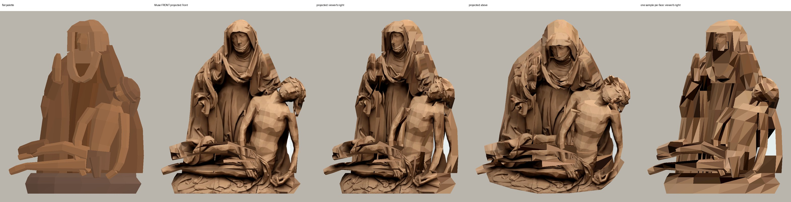

# Pietà 59.128: low-polygon prototype asset

Worker report, 2026-10-01. Collection reconstruction prototype only.
Changed in my worktree only: this folder. Nothing was installed in a room, committed, pushed or written to the root workspace. No paid call, no GPU, no bake, no nested worker, no 3D Viewer, no interface, error or acceptance file touched. Zero new spend; the one Muse sheet is root's ($0.01, run `0b38abf3159fe7bf6b3761b5`, never resubmitted).

**Verdict: a usable block study, not accepted.** It reads as a tall hooded Mary at the viewer's left and back with her right hand raised, and the dead Christ at the viewer's right and front: torso upright but slumped, head fallen to the viewer's right, both arms hanging, both legs running to the viewer's left with the feet past the base. It is not the Michelangelo pose. It is 39 separate closed solids in flat wood tones taken from the official photograph. Faces, fingers, hair, thorns and carved drapery are not modelled.

It is linden wood by Tilman Riemenschneider. It is not bronze.

## Against the sources

Official photograph 0, the native front render, official photograph 2 (the old black-and-white front):



The installed view in the film, and the native render from above and in front:



No source shows either side, so the quarter views have nothing to be checked against:



The back. Official photograph 1 is a white silhouette of the front, not a rear. The mesh back is a plain closing face:




## The Muse sheet, checked against the originals

Sheet: root's `trial/pieta-original.webp`, sha256 `378a734d…a824b2`, copied here unchanged as `muse-sheet-run-0b38abf3159fe7bf6b3761b5.webp`.



| Panel | Finding | Used for |
| --- | --- | --- |
| FRONT | Agrees with photograph 0: hood, raised hand, veil swag, Christ's fallen head, both hanging arms, loincloth, both legs and feet to the left, the mantle over the upper foot, the leafy base. | A modelling study for the block masses. No pixel of it is in the asset |
| LEFT THREE-QUARTER | **Rejected.** It repeats the front. | Nothing |
| RIGHT THREE-QUARTER | A near profile from the viewer's right. It is 25.2 cm deep at the catalogue height against the catalogue's 13.2 cm, so it is a round statue, not this shallow carving. | Nothing. Depth was not taken from it |
| ABOVE FRONT | Plausible for Mary bowed over Christ, but again far deeper than the catalogue. | Order of the masses front to back only |

What Muse changed: one even matt tan in place of the varied wood; a width of 37.0 cm at the catalogue height, where photograph 0 gives 34.4 cm; and invented depth in the side and above panels. My reading agrees with root's review.

## Texture trial: the sheet fails, flat palette kept

`texture_trial.gd` lays the Muse FRONT panel on the same mesh two ways. Left to right: flat palette; projected, seen from the front; projected, from the viewer's right; projected, from above; one sample per face.



- Projected looks good only straight on. From the right and from above it tears into wedges, paints Christ's arm across the cloth behind it, and shows the sheet's pale ground between his arm and body.
- One sample per face is a patchwork of unrelated darks and lights.

This is the fault that had Saint Roch's sheet rejected. The asset therefore has no texture path. `build()` takes no arguments and gives flat colours.

## How it is built

`pieta_asset.gd` follows the existing helpers. `photo_cm()` returns the solids in photograph centimetres, `parts()` fits them to the catalogue in metres, `build()` returns one node with a mesh per colour group. It reuses `seated_woman_asset.gd` for `shell`, `slab`, `limb`, `mesh` and `flat`, and `saint_roch_asset.gd` for `loft`. No new helper was added.

39 solids, 1,622 triangles, eight groups:

| Group | Solids |
| --- | --- |
| base | one low irregular mound, flat behind |
| mantle | flat-backed body from the ground to the shoulders, widening behind Christ; the pleated wing down her right side; its turned flap; the hem over Christ's upper foot; her left sleeve reaching behind his head; her right sleeve |
| dress | pleated skirt, chest, and the shadow inside the hood |
| veil | hood dome, two cheeks and a peaked brow that leave a niche for the face; the swag across the chest in two pieces; the wimple |
| mary | face, nose, raised right hand |
| christ | torso, neck, head, nose, two arms, two hands, two legs, two feet |
| hair | cap over the head, a band at the brow for the crown of thorns, a mass behind, the beard, the lock hanging at the viewer's right |
| cloth | loincloth and its hanging end |

Pleats are every other vertex of a ring pulled in, so the cloth falls in broad faces. No fold is a separate stick.

Colour. Each group is one flat colour measured on photograph 0: the median of that part's middle half by brightness, except Mary's face and hand, which take the lightest quarter of her face so they stand out from the mantle. It is all one wood, so the tones are close.

## Dimensions

| | Value | Basis |
| --- | --- | --- |
| Height | 0.457 m | Catalogue, exact |
| Width | 0.381 m | Catalogue, exact, **but see below** |
| Depth | 0.132 m | Catalogue, exact |
| Positions inside those | read by eye | Photograph 0, in centimetres at the catalogue height |
| Front-to-back layering | inferred | No source. Mary and the flat back fill about the rear 5.6 cm; Christ sits in the front 7 cm |

**Open conflict on width.** At the catalogue height the outline of photograph 0 is 34.4 cm wide, not 38.1. The film frame, taken from above, looks no wider. To meet all three catalogue bounds the mesh is widened in x only, by 9.4 percent over my reading (10.7 percent over the photograph's own outline). Heights and depths are not scaled. Either the catalogue width is measured some other way or the figure is truly wider than it photographs; I cannot tell which.

**Dating** is left as the conflict it is: the catalogue API gives 1480-1510, the case label and page ca. 1515-1525. The node carries that as text. No label was made.

## Check

```bash
godot --headless --editor --import --path <copy of this folder>
env LIBGL_ALWAYS_SOFTWARE=1 GALLIUM_DRIVER=llvmpipe DISPLAY=:99 godot --path <copy of this folder> --rendering-method gl_compatibility --script check.gd
```

Run it in a disposable copy; it writes eleven PNGs and `checks.json` beside itself. I ran it on CPU (llvmpipe, display :99) in my scratch folder only. The two reused helpers here are byte-identical to root's.

| Check | Result |
| --- | --- |
| Every solid closed: each edge used exactly once in each direction | Passed, 39 solids, 2,433 edge pairs |
| No degenerate triangle; every solid outward-facing with positive volume; every vertex finite | Passed, 1,622 triangles, 0.0088 m³ |
| No solid thinner than 5 mm | Passed; thinnest is 9.3 mm |
| Bounds 0.381 x 0.457 x 0.132 m, base on y=0, centred in x and z | Passed |
| Stored normals of the built meshes face out of their triangles | Passed |
| All five accepted flags false on the node | Passed |
| Rear render against the mirrored front render (a missing or inside-out back face would show the ground) | 3 of 447,738 pixels differ |
| Negative control: `-- open` drops one triangle from the base | Exit 1, "base: open, doubled or inconsistently wound edge" |
| `scripts/check.sh` | "checks passed", run with Godot off the path so it did not open the shared project (its step 4 is skipped) |
| `git diff --check` | clean |

## Measured outline

`silhouette-vs-official.txt` compares the front render's outline with photograph 0 every 2.5 cm, after removing the width stretch.

- Mean difference 0.36 cm.
- Worst is 2.8 cm at 31.5 cm high on the viewer's right: the top of Christ's hair and thorns stands higher in the photograph than my hair cap.

## Not accepted

- **Likeness.** Blank faceted faces, mitten hands, plank legs, no beard curls, no thorns, no ribs, no leaf carving on the base.
- **Mary's raised hand.** Clear from above and from the quarters. From straight in front it sits against the mantle in nearly the same tone and is easy to miss.
- **Christ's head.** Reads as a tilted head in a dark cap. The upturned face of photograph 3 is not there.
- **Drapery.** Broad pleats only. The veil swag is two bent bars. The ornamented mantle border is missing.
- **Width.** Stretched to the catalogue, against the photograph.
- **Depth and both sides.** No source. All inferred.
- **Back.** No source. A plain closing face.
- **Base.** One mound, taller and squarer than the thin leafy original.
- **Colour.** Eight flat tones. No grain, no wear.
- **Wall case, shelf, label and hood.** Not built.
- **Placement.** Not installed. Not in any room.

Flags, all false: `survey_metres_accepted`, `placement_accepted`, `rear_fidelity_accepted`, `visual_fidelity_accepted`, `whole_room_complete`.

## For root

- Put `pieta_asset.gd` beside `seated_woman_asset.gd` and `saint_roch_asset.gd`; it preloads both by relative path. `build()` returns a `Node3D` named `Pieta59128`, origin under the middle of the base, +Z to the viewer, metres.
- It is 0.132 m deep with a flat back, so it can stand close to the case's back panel.
- The Muse sheet is not needed at runtime. Do not project it.
- Look at it in the case before keeping it. I have not marked the figure, the case or the room done.

## Files

- `pieta_asset.gd`, `seated_woman_asset.gd`, `saint_roch_asset.gd`, `project.godot`, `check.gd`: the runnable check
- `checks.json`, `native.log`, eleven PNG views
- `negative-control-open-base.log`, `repo-check.log`
- `compare-*.jpg`, `compare.py`, `silhouette-vs-official.txt` and `.json`
- `texture_trial.gd`, `texture-trial.log`, eight `trial-*.png`
- `muse-sheet-run-0b38abf3159fe7bf6b3761b5.webp` (root's sheet, unchanged)
- `SHA256.json`: the asset, the reused helpers, every source read and every file here
