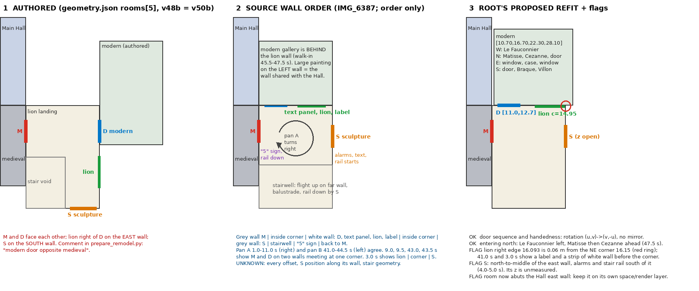
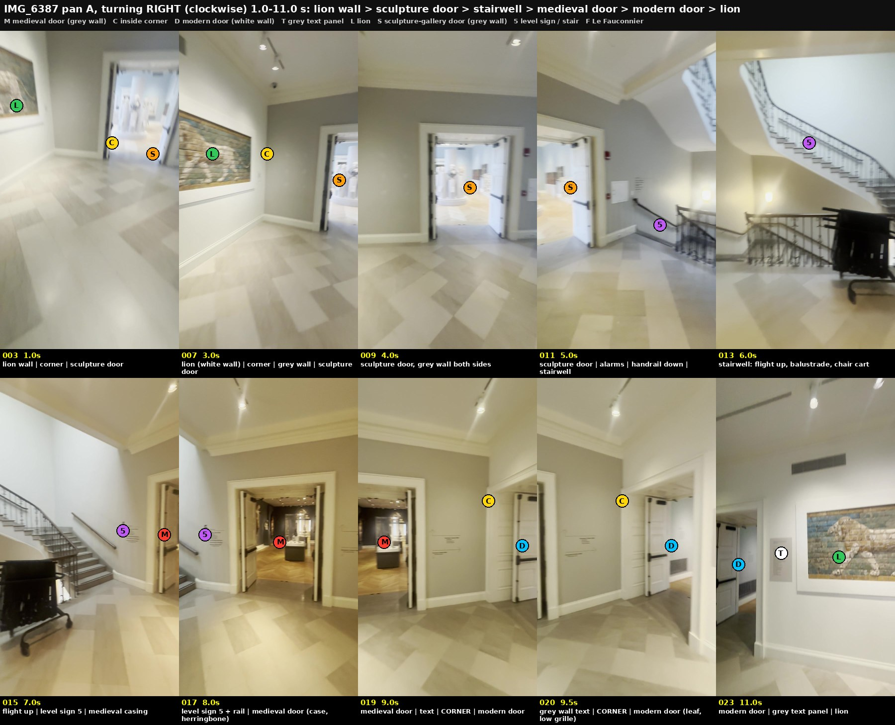
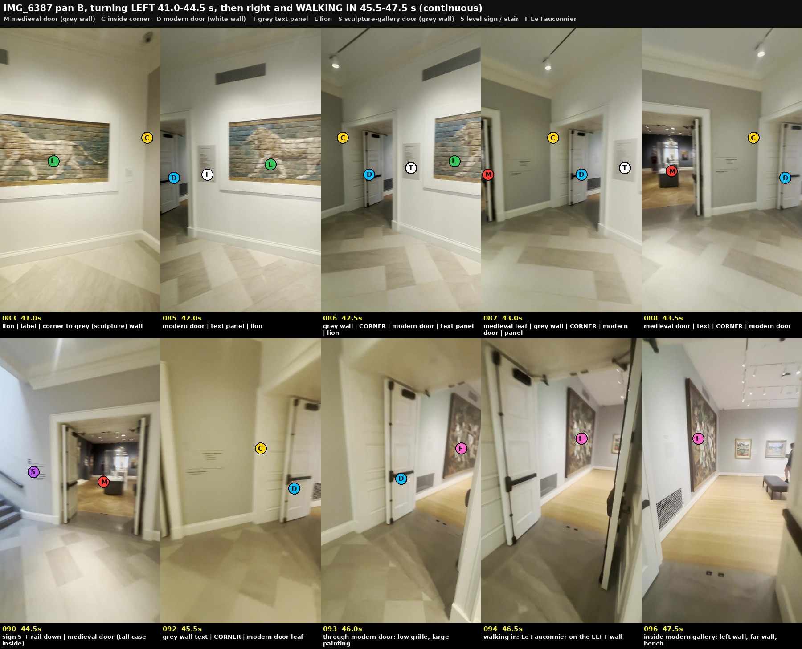

# Lion landing: which door is on which wall

Answer to the coordinator's four messages. Review only; no code, bake or root file touched.

## Verdict

1. The medieval door and the modern door are on **two walls that meet at one inside corner**. They do not face each other.
2. The modern door, a grey text panel and the lion are on the **same white wall**, in that order going away from the corner.
3. The white sculpture-gallery door is on the **next wall round**, a grey wall that faces the medieval-door wall.
4. The stairwell closes the fourth side. The level sign "5" and the rail of the down flight are beside the medieval door on its far side from the corner.

With the medieval door kept on the landing's west wall (as authored), that makes: **north = modern door, panel, lion; east = sculpture door; south = stairwell.** The authored layout has east = modern door and lion, south = sculpture door.

Root's proposed refit has the right door sequence and the right handedness. Three flags are at the end.

## The frames

`IMG_6387.MOV`, sha256 `75c4892c1a37e1c83dd7103187d1c284e13fd0ac458710f4e8fd6e14daf1c7af` (from the ingestion `verified-manifest.json`). Survey frame N is at (N-1)/2 s. Per-frame hashes: `landing-frames-sha256.json`.

### Which door is which

| Door | How it is identified | Frames |
| --- | --- | --- |
| Medieval (grey wall) | Through it: dark blue-grey room, herringbone floor, the tall glass case on a grey base. On axis behind the case, the lit tracery doorway with the painted figure to its left and two gold panels to its right. Same room as `IMG_6382` 78.0 s. | 8.0, 13.0, 44.0, 44.5 s |
| Modern (white wall) | The camera pans right from the medieval door, passes the corner, and walks through this door without a cut: low floor grille, then the Le Fauconnier on the left wall, then two small paintings on the far wall and the bench. | 45.5, 46.0, 46.5, 47.5 s |
| Sculpture (grey wall) | Through it: white statues on a round plinth, pale blue walls. | 1.0, 3.0, 4.0, 5.0 s |

### The two pans agree

- **Pan A, turning right, 1.0–11.0 s:** lion (white wall) → corner → grey wall, sculpture door → fire alarms, rail of the down flight → stairwell, flight up → sign "5" → medieval door (grey wall) → wall text → **corner** → modern door (white wall) → text panel → lion.
- **Pan B, turning left, 41.0–44.5 s:** lion with a small label and the corner to a grey wall on its right → text panel → modern door → **corner** → grey wall with wall text → medieval door → sign "5" and the down rail.

The lion is not in the 9.5 s and 43.5 s frames root decoded. It is tied to the modern door by the frames half a second either side: **42.5 s** has corner, modern door, text panel and lion in one frame; **43.0 s** has the medieval leaf, the corner, the modern door and the same text panel. 10.0 and 11.0 s do the same on pan A.

### Why north, not south

Facing the medieval door from inside the landing (9.0 s, 43.5 s), the modern door is on the **right** and the "5" sign and stair are on the **left**. The medieval door is in the landing's west wall, so the camera faces west; right is north.

A third view agrees. Leaving the modern gallery at 82.0–83.0 s (`frames/land-f-return.jpg`), the camera looks out through its entry door and sees the landing floor and the stair flight straight across, not the medieval door. That is what a door in the north wall facing a stairwell on the south side gives; a door facing the medieval door would show the dark medieval room.

Supporting only, not a measurement: the 2020 floor-5 diagram already in the root evidence (`risd-floor5-map-2020.png`) shows the same thing. Ancient Greek and Roman opens off the stair landing on the side away from the medieval strip, the stair is on the outer side, and the strip of "European" rooms beside the Grand Gallery, facing the garden, starts at the landing. That is where a room with garden windows and a wall shared with the Hall would be.

## Root's proposed refit

Door span `[11.0, 12.7]` on the north wall, modern room `[10.70, 16.70, 22.30, 28.10]`, lion centre `(14.95, 1.7005, 28.18)` facing south, sculpture stub on the east wall.

- **Sequence: correct.** Corner, door, panel, lion, reading west to east.
- **Handedness: correct, not mirrored.** Rotating the modern reviewer's layout about the entry by `rotation.y = +PI/2` sends a point `door + (u, v)` to `new door + (v, -u)`. Their room `[16.15, 21.95, 28.9, 34.9]` lands exactly on root's bounds. The walls come out as: west Le Fauconnier, north Matisse then Cézanne then the far doorway, east window, case, window, south door, Braque, Villon. Video check: walking in at 46.0–47.5 s the large painting is on the left and the far wall reads Matisse then Cézanne left to right.
- **Flag 1, lion against the corner.** A 2.286 m lion centred at 14.95 ends at 16.093, 0.06 m from the corner at 16.15. At 41.0 s and 3.0 s there is a small wall label and a strip of white wall between the lion's frame and the corner. The gap is real; its size is not measured.
- **Flag 2, sculpture door.** It sits in the north-to-middle part of the east wall with grey wall on both sides (4.0 s). The alarms, a wall text and the start of the down rail are on its stair side (5.0 s). Its position along the wall is not measured.
- **Flag 3, the Hall.** The modern room now backs onto the Hall's east wall. The live Hall hides that wall for its dollhouse view, so the room has to sit in its own space or render layers, as the existing far-door room does, or it will show through.

## Still unknown

- Every offset and every room size. Nothing here is a measurement.
- Where the sculpture door is along the east wall, and whether it lines up with the medieval door (the 2020 diagram suggests it does; no frame shows both).
- Stair geometry: one flight rises along the far wall, one descends beside the sculpture door. Where the void starts is not established.
- Whether the landing's north wall is long enough for corner strip, door, panel, lion and label as authored (5.6 m).
- Wall colours differ by wall: the medieval-door and sculpture-door walls are grey, the lion and stairwell walls white.
