# Renaissance case A: six low-polygon object studies

Worker report, 2026-10-01. Collection reconstruction prototype only.
Changed in my worktree only: this folder. Nothing was installed in a room or case, committed, pushed or written to the root workspace. No paid call, no new provider, no GPU, no bake, no nested worker, no 3D Viewer, no interface, error or acceptance file touched. Zero new spend. No Muse request was made.

**Verdict: six usable studies, none accepted.** Each is a set of closed solids at its catalogue size, carrying source photographs and straightened film crops. Depths, frame bands, splay, recline, mounts and everything about placement are read by eye and flagged false. The room is not complete and no ticket is closed.

The six together, beside the film at 41.2 s. Left to right: film, render with source images, render from the front, the bare solids.

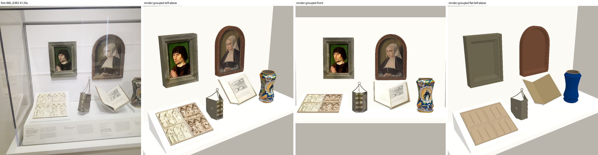

Close views beside the film at 49.8 s and 46.4 s:

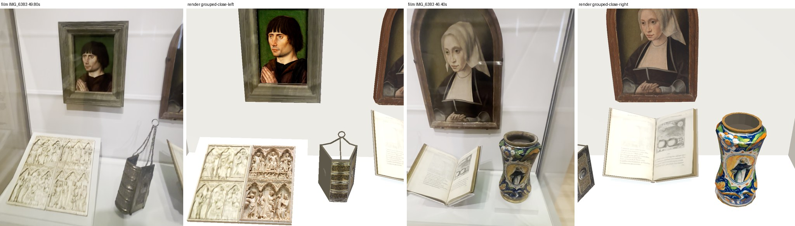

The arrangement in these pictures is the film's left-to-right order, set by hand for the picture. It is not a placement.

## The six objects

| Object | Accession | Catalogue size used | Solids | Triangles | Source images on it | Back |
| --- | --- | --- | --- | --- | --- | --- |
| Portrait of a Cleric | 45.042 | panel 14.6 x 22.2 cm, depth 5.7 cm | 14 | 168 | official photograph 0 on the panel; film crop on the frame | plain board, not observed |
| Portrait of a Woman | 34.861 | 24.8 x 36.2 cm | 33 | 508 | official photograph 0 (front, frame included), photograph 1 (back) | observed: painted coat of arms |
| Diptych | 22.201 | each leaf 13.3 x 24.1 cm | 24 | 600 | right leaf official photograph 0; left leaf film 49.8 s | observed: plain ivory, flat colour |
| Book cover | 34.016 | 14 x 8.6 x 5.1 cm closed | 16 | 408 | spine official photograph 1; one board straightened from photograph 0 | not observed |
| One Hundred Christian Emblems | 2023.17 | page 14.7 x 19.7 cm | 5 | 68 | both pages film 46.4 s | not observed |
| Drug jar (albarello) | 35.713 | 13 cm across, 24.1 cm high | 1 | 796 | official photograph 0 (front half), photograph 1 (reverse half) | observed in photograph 1; not filmed |

Museum furniture is separate and not catalogued: the diptych's sloped white mount (1 solid) and the book's clear cradle (5 solids).

All six identities are **confirmed** by the inventory and the paper research; none is probable. The emblem book is RISD 2023.17 (catalogue id 1597546), open at emblem 15, as `opus-unmatched-paper-research-20261001/SOURCES.md` and the root inventory say. The museum has no photograph of it.

### Portrait of a Cleric, 45.042

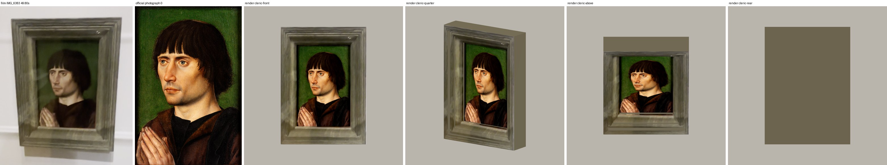

- The painting is official photograph 0, unchanged, on its own closed slab.
- The grey frame is a closed back board and twelve mitred strips: an outer rail, a lower step and a slope to the painting on each side. It is not a card with a hole.
- The frame is not in the official photograph. Its surface is the film's own frame at 49.8 s, each band fitted onto the model's band. This is a stand-in until a Muse pass.
- Bands: sides 4.4 cm, top and bottom 5.0 cm, so the framed size is 23.4 x 32.2 cm. The two film frames give 3.9 to 4.9 cm at the sides and 4.8 to 5.2 cm at top and bottom.
- The catalogue depth of 5.7 cm is taken as the framed depth. The record does not say what it measures.
- I checked that the photograph is the whole panel: the film's opening, straightened, puts hair, eyes, chin and hands at the same heights.

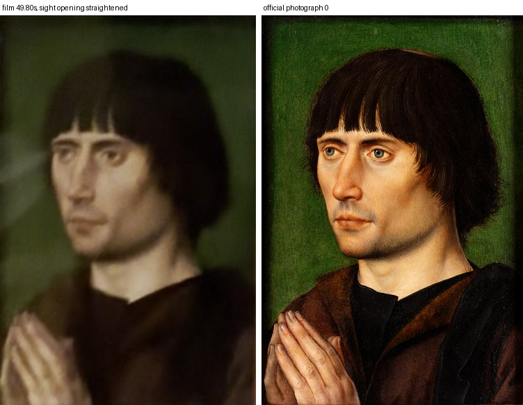

### Portrait of a Woman, 34.861

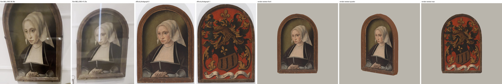

- The arched frame is part of the panel and is already in official photograph 0, so the frame pixels are the museum's own.
- One closed arched plate follows the outline in the photograph; 32 closed strips raise the frame round it with a flat face and an inner slope. The painting sits 2.4 cm back.
- The back carries official photograph 1, the painted coat of arms.
- **Conflict:** the photograph is 0.731 wide per high; the catalogue is 0.685. The model is the catalogue size, so the photograph is stretched 6.7% in height.
- Depth (4 cm) and recess are guesses. The two side clips in the film are not modelled.

### Diptych, 22.201

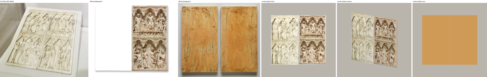

- Each leaf is a back plate, a raised border, a band between the tiers and six broad raised masses with pointed heads, one under each arch. No figure is carved.
- Official photograph 0 shows only the right leaf; the museum blanked the other. The left leaf therefore carries the film at 49.8 s, straightened. It is blurred and paler than the right leaf, and the two do not match in tone.
- The right leaf was checked against the film: Christ enthroned and the angel with the cross are in the same bays.
- Thickness (1.25 cm at the highest relief) is a guess. The mount's size and its 22 degree slope are by eye.

### Book cover, 34.016

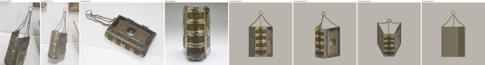

- **It does not stand on its fore-edge.** In the film the spine is upright with its bands running across, facing the room, and the two boards open behind it. It stands on its tail edge. I built what the film shows.
- Spine with five raised bands, two boards each with a round boss, a ring of eight segments and three stiff chains. No link is modelled.
- The spine carries official photograph 1. One board carries the board in photograph 0, straightened; the other board is plain silver.
- Not known: the splay (20 degrees each side by eye; the film looks narrower), where the chains fix, what holds the ring up, which board the photograph shows. Clasps are not modelled.
- In the film the cover is turned so the spine faces the viewer's left. That is placement and is root's.

### One Hundred Christian Emblems, 2023.17

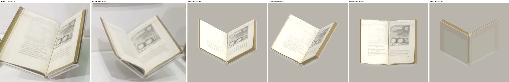

- Two page blocks, two boards and a spine, open and reclined on a clear cradle of two rests, two lips and a fin.
- Both pages carry the film at 46.4 s, straightened: the French verse on the left, the two pots under the sun on the right. They are blurred. They are the museum's copy.
- **The Glasgow library copy is not used, shown or copied anywhere in this folder.** The check fails if a texture path names it. The node carries `comparative_copy_used: false` and `museum_photograph_available: false`.
- The 116 leaves are split 22 left and 94 right, as the collation and folio 14v-15r imply. Total thickness (2 cm), the 110 degree opening, the 40 degree recline, the binding colour and the cradle are by eye.

### Drug jar (albarello), 35.713

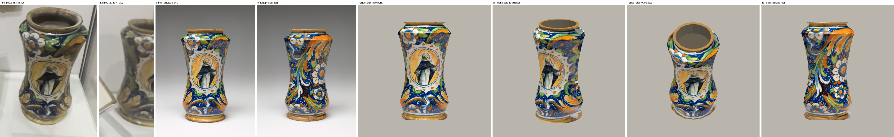

- One closed sixteen-sided shell with a real mouth, profile read from the left edge of official photograph 0. Its widest ring is the catalogue 13 cm; the photograph gave 13.16 cm at the catalogue height, so radii are scaled by 0.9875.
- Photograph 0 is laid on the front half and photograph 1 on the reverse half.
- The two sides are the stretched edges of those photographs and meet in a seam nobody has seen. `sides_observed` is false. Photograph 1 is assumed to be the 180 degree reverse; the record does not say.
- The lowest centimetre of the foot picks up a little studio ground at the right. The inside depth and the underside are not observed.

## Unresolved: the two portraits against each other

In the far frame (41.2 s) the arched portrait is 1.19 times the width and 1.30 times the height of the grey frame's outer edge. Two catalogue-sized objects with this frame give 1.06 and 1.12. Either the woman's catalogue size is her painted surface without the engaged frame (the photograph's proportions would then make the whole about 31 x 43 cm), or the grey frame is narrower than its bands read. I kept both at catalogue size. Root should not scale one against the other before this is decided. Numbers: `measurements.json`, `cleric.relative_size_conflict`.

## Muse frames

No existing root Muse frame suits either portrait. I looked at all sixteen: they are gilt, black or white.

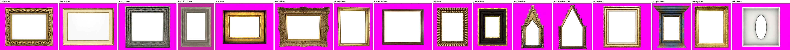

The reference crops for a root Muse pass, all unchanged crops of the decoded film or byte copies of official photographs:

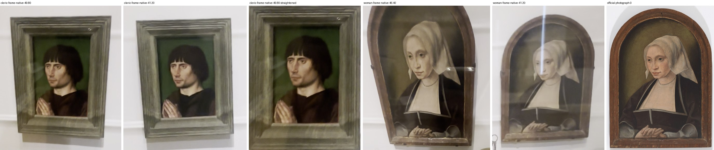

| Frame | Reference files | Proportions |
| --- | --- | --- |
| Cleric, grey rectangular | `muse-reference/cleric-frame-native-49.80.png` (x 300..800, y 550..1150), `cleric-frame-native-41.20.png` (x 340..620, y 715..1045), `cleric-frame-native-49.80-straightened.png` | opening 14.6 x 22.2 cm; bands 4.4 cm sides, 5 cm top and bottom; outer 23.4 x 32.2 cm |
| Woman, brown arched | `textures/portrait-woman-34861-zoom-0.jpg`, `muse-reference/woman-frame-native-46.40.png` (x 0..700, y 0..800), `woman-frame-native-41.20.png` (x 680..985, y 665..1060) | bands 9.8% of the width at the sides, 6.8% of the height round the arch, 9.8% of the height at the sill |

- The call root would make: its existing frame procedure (`{"procedure": "edit", "plan": ..., "attempt": ...}`, OpenRouter `meta/muse-image`, one output, about 0.01 USD each). Draft plans and prompts in root's wording are `muse-reference/*-frame-plan.proposed.json` and `*-frame-prompt.proposed.txt`. They are proposals; nothing was sent.
- The helper already takes the results: pass them as `cleric_frame` and `woman_frame` and they are laid on the same closed strips.
- My view: the cleric's frame needs the pass. The woman's frame is the object's own and is photographed front-on; a Muse frame would replace real pixels with generated ones. That is the owner's call.

## How it is built

`renaissance_case_a_assets.gd` follows the existing helpers. Each object function returns closed solids and a list of flat source images; `build(key, images, painted)` returns one node per object, and `on_display(key, ...)` adds the mount or cradle.

- Reused: `seated_woman_asset.gd` for `shell`, `slab`, `box`, `limb`, `mesh` and `flat`; `medieval_metal_assets.gd` for `ngon`, `lathe`, `plate` and `box`; `painting_asset.gd` `mat`, which the caller passes in so the two paintings use the room's painting material.
- Not used: `medieval_ceramic_ivory_assets.gd`. Its decal and wedge are tied to its own objects' constants.
- New, small: `solid` (turns a shell outward), `strip` (one mitred frame strip), `skin` (a flat image on chosen faces).
- With no images, `build` gives flat observed colours.
- `textures/*.jpg` are byte copies of the inventory's official photographs. Root can point `TEXTURES` at its own copies and drop them.

## Checks

One command, CPU only: `./run_check.sh <empty scratch dir>`. It runs `check.gd` and its negative control in a disposable copy under software GL and brings back the renders.

1. `native.log`: **exit 0**, no failures. 93 solids in the six objects and 6 in the furniture are closed, outward, finite and thicker than 2 mm; 2,548 and 72 triangles.
2. `negative-control-open.log`: **exit 1**. One triangle dropped from the first solid of every object is caught in all eight.
3. Catalogue sizes hold: cleric panel 14.6 x 22.2 cm and depth 5.7 cm; woman 24.8 x 36.2 cm; both leaves 13.3 x 24.1 cm; spine 5.1 x 14 cm and both boards 8.6 cm; both pages 14.7 x 19.7 cm; jar 13 x 24.1 x 13 cm.
4. Every built node leaves all eight acceptance flags false, and each official texture matches its inventory hash.
5. `scripts/check.sh` in my worktree: `checks passed` (`repo-check.log`). `git diff --check`: clean.
6. Every comparison sheet above was opened and read against the film before this was written. One sheet caught an error: my first frame band (5.5 cm) came from the close view alone and was too wide.

Passing says nothing about likeness. That is judged by eye, and nothing here is accepted.

## Sources

- Film: `IMG_6383.MOV`, sha256 `8cfd089e…e6eeef`, read only. Five frames decoded on the CPU at 41.10, 41.20, 45.70, 46.40 and 49.80 s; each PNG hash equals the inventory manifest's.
- Official photographs: nine files, byte copies, each checked against `ledger.json`.
- Corners for the straightened crops were picked by eye (`picked-corners.jpg`). Measurements are in `measurements.json`; every file hash is in `SHA256.json`; texture sources are in `textures/manifest.json`.

Rebuild: `prepare_textures.py`, `run_check.sh`, `compare.py`, `seal.py`.

## Left for root

1. Decide the Muse frame pass for the cleric, and whether the woman's own frame stays.
2. Decide the size conflict between the two portraits.
3. Build the case and place the six. Yaw of the book cover and the open book, the mount and all positions are unaccepted.
