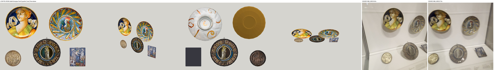
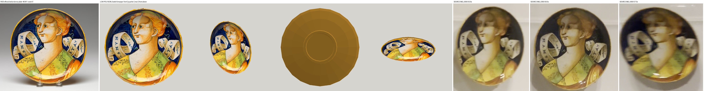
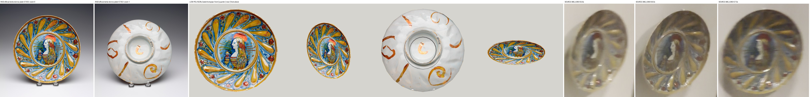
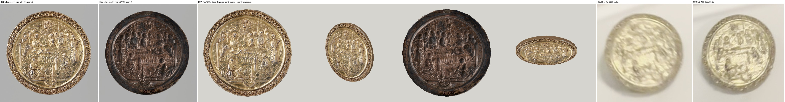
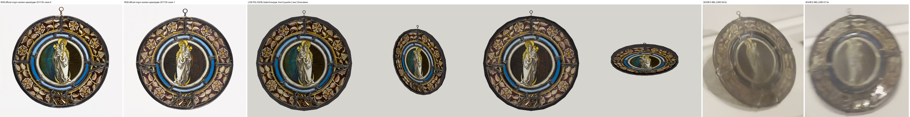
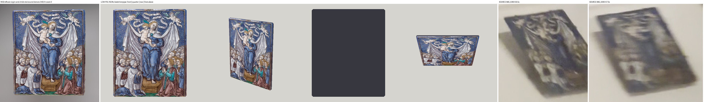

# Five objects from Renaissance case B — low polygon studies for root review

Worker report, 2026-10-01. Renaissance room, east wall, case B, video IMG_6383 55.6 / 56.0 / 56.5 / 57.0 s.
Nothing here is installed in a case, baked, committed or pushed. No paid generation, no Muse request, no GPU. Cost: 0 USD.

## What this is

Five closed low polygon models, one per artwork, in one script. Each carries the museum's own photograph on its face, so the painting, gilding, glass and enamel are the real pixels. Nothing was repainted or generated. The shapes behind the pictures — rim, dish, thickness, back — are simple guesses and are marked as such.

| Where in the case (56.0 s) | Object | Accession | Identity | Size fixed by the catalogue | Depth (my guess) | Back photographed? |
| --- | --- | --- | --- | --- | --- | --- |
| back panel, upper left | Bella Donna Plate | 46.391 | matched | diameter 22.5 cm | 4.0 cm | no |
| back panel, upper right | Bella Donna Plate | 57.302 | matched | diameter 23.2 cm | 3.4 cm | yes |
| deck, lower left | Death of the Virgin, gilt roundel | 51.105 | matched | diameter 11.1 cm | 0.8 cm | yes |
| deck, lower centre | The Virgin as the Woman of the Apocalypse, glass roundel | 2017.29 | matched | diameter 19.0 cm | 0.7 cm | yes |
| deck, lower right | Virgin and Child with Clerics and Donors, enamel plaque | 34.024 | **probable** | 12.9 x 10.7 cm (height x width) | 0.48 cm | no |

The fifth object stays **probable**. Its label is not legible in the video; the match rests on form and colour. Nothing here promotes it.

## Look at this first

All five together, in the order they hang. Left: the models from the front, a quarter view, the rear and from above. Right: the video.
The spacing in the model views is schematic. It is not a placement.



Each sheet below reads left to right: official RISD photographs, the model (front, quarter, rear, from above), then the video frames.







The model views are real Godot 4.7.2 renders on the CPU (Mesa llvmpipe), unlit, the way the room shader draws paintings. They are not the game's bake.

## What was built

`renaissance_case_b_assets.gd` in this folder (163 lines). It reuses `shell` and `limb` from `seated_woman_asset.gd`, `ngon` and `plate` from `medieval_metal_assets.gd`, and `Painting.mat` (the room's main shader) from `gallery_walk4/painting_asset.gd`.

| Object | Built size, W x H x D (cm) | Closed shells | Triangles | Shape |
| --- | --- | --- | --- | --- |
| Plate 46.391 | 22.5 x 22.5 x 4.0 | 1 | 572 | shallow footed bowl: foot ring, curved outside, lip, dished inside, flat well |
| Plate 57.302 | 23.2 x 23.2 x 3.4 | 1 | 476 | broad sloping rim, small deep well, foot ring with a recess |
| Roundel 51.105 | 11.1 x 11.1 x 0.8 | 1 | 380 | flat back, plain edge, border band, raised moulding, field as one low dome |
| Glass 2017.29 | 19.0 x 19.0 x 0.7 | 1 + 7 loop pieces | 368 | 3 mm pane inside a 7 mm lead rim, wire loop on top |
| Plaque 34.024 | 10.7 x 12.9 x 0.48 | 1 | 60 | thin plaque, corners cut 2 mm, slightly pillowed |

Every origin is the centre of the rearmost plane, +Z is the front, +Y is the top of the artwork. Each node has a `front` mesh, a `rear` mesh only where a rear photograph exists, and a plain `body` mesh.

Each node carries `catalogue_accession`, `catalogue_id`, `catalogue_identity`, `catalogue_title`, `catalogue_size`, `source_position`, `depth_provisional`, `source_rear_observed`, and six flags that are all **false**:
`rear_accepted`, `thickness_accepted`, `mount_accepted`, `placement_accepted`, `fine_fidelity_accepted`, `whole_room_accepted`.

## How the photographs are used

1. **Source.** Eight official photographs from the accepted inventory (`opus-renaissance-case-inventory-20261001/photos/`, read only). Each file's hash is checked against that inventory's ledger.
2. **Crop only.** `prep.py` cuts each photograph to the object's outline. Inside 98.5% of the outline, every texel equals the source decode; `prep.py --verify` re-proves this.
3. **Outline by measurement and by hand.** The roundel and the glass are an ellipse fitted to the outer edge. The plates' left, right and top are measured; their bottom edge is read by hand (±3 px) because the stand and its shadow hide it. The plaque's four corners are read by hand (±3 px). All numbers are in `sources.json`.
4. **No backdrop colour on the rim.** Outside the kept area — soft edge, backdrop, shadow — every texel is a copy of the nearest kept texel. So filtering cannot pull grey backdrop onto a rim.
5. **No smear down an edge.** A photograph is laid only on faces within 60° of facing it. Edges, foot walls and unphotographed backs take one plain colour, the median rim pixel of the photograph.
6. **Backs.** Plate 57.302, the roundel and the glass use their official rear photographs. Plate 46.391 and the plaque have no rear photograph: their backs are plain closing surfaces and `source_rear_observed` is false.
7. **Glass is glass.** The two glass panes multiply whatever is behind them by the photograph's colour, as stained glass filters light. In the video the roundel shows the white case through its centre, which is what separates it from a bronze medallion. The lead rim and the loop are opaque.

## Exact dimension assumptions

Only the diameters, and the plaque's height and width, come from the catalogue. Everything below is provisional.

1. **Plate 46.391.** 4.0 cm deep, bowl 3.0 cm deep inside, foot ring 9.4 cm across and 0.5 cm high, wall about 0.7 cm. Read by eye from the side view at 55.6 s. No photograph shows its profile or back.
2. **Plate 57.302.** 3.4 cm deep. Foot ring 10.4 cm and its recess 7.4 cm across, from the rear photograph. Well about 9.8 cm across and 1.3 cm deep, rim sloping 0.65 cm, by eye from the front photograph.
3. **Roundel 51.105.** 0.8 cm thick: 0.45 cm edge, border band, a moulding 0.15 cm proud, the field 0.25 cm lower, rising 0.35 cm to the centre. The band and moulding widths are from the front photograph; every height is a guess.
4. **Glass 2017.29.** Lead rim 0.43 cm wide (photograph) and 0.7 cm deep (guess), pane 0.3 cm (guess). The 19.0 cm is taken as the leaded disc without the loop; the loop adds 1.1 cm. The photographs show the disc about 1.7% wider than tall; the model is a true circle.
5. **Plaque 34.024.** 0.48 cm thick with a 0.23 cm pillow. Both are guesses. The hand-read outline and the catalogue both give a width to height ratio of 0.83.
6. **Round outlines** are 24-sided, with corners on the catalogue radius.

## Visual mismatches

- **All five.** The photographs carry their own studio highlights and shadows. Relief, brush marks and glaze are flat pixels on broad low polygon forms.
- **Plate 46.391.** The whole back is one ochre colour taken from the lip. The real back is unknown. Two acrylic stand prongs from the photograph show as pale specks on the lower rim.
- **Plate 57.302.** The same two prongs show on the lower rim, front and back. The rear photograph was taken slightly off-axis, so the photographed foot ring sits a few millimetres off the modelled one. The moulded lobes of the rim are not modelled.
- **Roundel 51.105.** No real relief: figures, halos and the scroll border are a picture on a low dome. In the video it looks thicker and lies on a mount; neither is modelled.
- **Glass 2017.29.** The video does not resolve which side faces the room; the catalogue's first photograph is used as the front. Against a dark background the panes go dark, as real unlit glass does. The lead lines inside the disc are pixels, not geometry. Over the study's grey ground it reads darker than in the white case.
- **Plaque 34.024.** The photograph is slightly oblique and shows the plaque's right side wall inside the outline; that strip is mapped onto the front. The back is one dark plain colour.
- **Plain faces** carry a fixed study shade in vertex colour so the facets read in an unlit view. It is not room lighting.

## Checks

One command, CPU only, writes only into this folder:

```bash
bash docs/evidence/collection-reconstruction/opus-renaissance-case-b-assets-20261001/run_check.sh
```

| Check | Result |
| --- | --- |
| `run_check.sh` | **exit 0**, Godot 4.7.2, renderer `llvmpipe (LLVM 20.1.2, 256 bits)` (`check.log`, `checks.json`) |
| Textures: 8 hashes, 8 source hashes against the inventory ledger, kept texels equal the source decode | Passed |
| Every shell closed: each directed edge once and its reverse once, no collapsed triangle, positive volume | Passed, 12 shells |
| Every vertex finite and within one metre; depth finite and equal to its declared guess | Passed |
| Catalogue width and height, typed independently in the check, to 0.01 mm; centred on the rear plane | Passed |
| Photographs only on faces within 60° of square; every texture coordinate inside the photographed outline; texture size matches the mapping | Passed |
| Rear mesh only where a rear photograph exists; only the glass panes are see-through and they multiply | Passed |
| All six flags false on all five nodes; plaque "probable", the other four "matched" | Passed |
| Open-surface negative control inside the run, plus inside-out and non-finite shells | All three caught |
| Six sabotaged copies of the script: open surface, rim 2.5 mm short, flags set true, plaque promoted, rear claimed for all, photograph laid on edges | **exit 1** each (`negative-control.log`) |
| `scripts/check.sh` with Godot off the PATH (module map and seam checks only) | **exit 0** (`repo-check.log`) |
| `git diff --check` | **exit 0** |
| Full `scripts/check.sh` with its Godot import | **Not run**: the import would write outside this folder |
| In-game look, bake, case, mounts, placement | **Not run** — root's work |

Two things about the run. It uses the machine's shared Xvfb `:99` with Wayland blocked, as the earlier asset checks do. The first render attempt stopped on a type error in `check.gd` before drawing anything; it was fixed and rerun.

## For the root

1. Copy `renaissance_case_b_assets.gd` to `modules/shell/prototype/collection_reconstruction/`. Its three preloads are relative to that folder. In a flattened run project, point the `Painting` preload at `res://modules/shell/prototype/gallery_walk4/painting_asset.gd`, as `triptych_asset.gd` does.
2. Copy `textures/*.png` to a folder of your choice and pass it, or use the default `res://assets/renaissance-case-b/`. Imported textures are used when present; otherwise the PNG is read from disk.

```gdscript
const CaseB := preload("renaissance_case_b_assets.gd")
var plate: Node3D = CaseB.build("plate_46391")   # also "plate_57302", "roundel_51105", "glass_201729", "plaque_34024"
```

3. The nodes have no collision, no mount and no tilt. In the video the two plates hang on the back panel, the roundel and the plaque lie on small tilted mounts, and the glass leans upright on the deck. None of that is measured.
4. The glass panes use alpha transparency with multiply blending, so `remodel_bake.gd` skips them as it skips the acrylic hoods. The plain `body` meshes use the room shader with a tint, so the bake lights them.
5. The folder is 22 MB, of which the eight lossless textures are 14 MB at the photographs' native size (about 1000 px). Downsizing them is your call.

## Muse

No Muse study was needed or run. The painted, gilt, glass and enamel surfaces must stay the museum's pixels. The only surfaces Muse could add are the unphotographed backs of plate 46.391 and the plaque, and those would be invented, so I recommend leaving them plain. If you still want a material-only back for plate 46.391, the references would be `textures/plate-57302-rear.png` (same ware, for glaze only), `photos/bella-donna-plate-46391-zoom-0.jpg`, and the 55.6 s frame crop `(350, 540, 660, 900)`; ask for an unpainted tin-glazed back and foot, nothing figurative. Not requested, not paid.

## Not touched

The root checkout, the ingestion folder and the original masters were read only. Nothing outside this folder was written. No shared import, bake or 3D Viewer run. No interface, error or acceptance file changed. Case A is not covered here. No ticket is closed and nothing about the whole room is accepted.

## Files

- `renaissance_case_b_assets.gd` — the script.
- `textures/` — eight authentic crops; `sources.json` — their sources, outlines and hashes; `prep.py` — builds and verifies them.
- `run_check.sh`, `check.gd`, `check.log`, `checks.json` — the check and its output.
- `views-*.png` — Godot views; `make_compare.py`, `compare-*.jpg` — the sheets above.
- `negative-control.log`, `repo-check.log`, `SHA256.json`.
