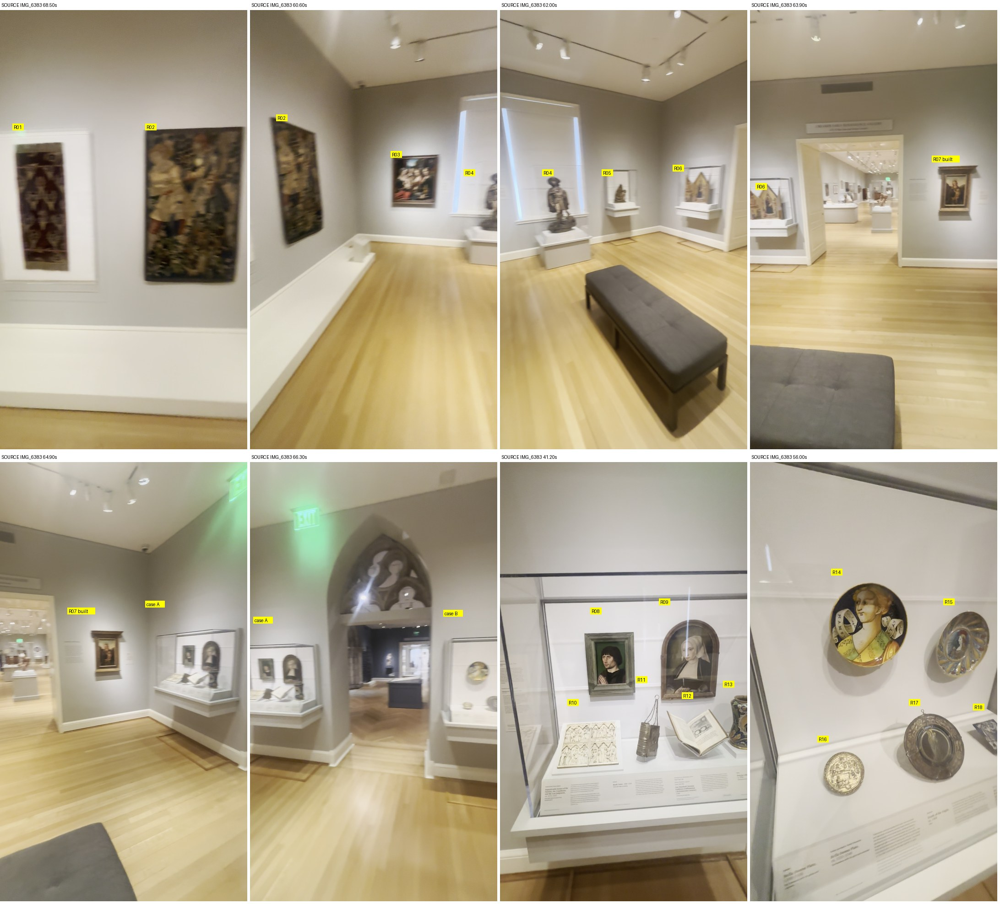

# Renaissance room objects and cases (IMG_6383) — inventory for root review

Worker report, 2026-10-01. Identification only. No source edits, no paid generation, no GPU, no Godot, no point clouds. Cost: 0 USD.

## Result

1. The room holds **18 objects**: 15 are confirmed against official RISD photographs, 1 is probable, 1 is known from its case label only, and 1 (the Perugino) is already built by the root.
2. **Only the Perugino and the bench are built today.** All five cases and the other 17 objects are missing from the room.
3. Two priority objects are not what the inventory calls them. The tall figure in front of the window is **Saint Roch, polychromed wood, 105.4 cm** (21.398), not a bronze knight. The Pietà is **Riemenschneider, linden wood** (59.128), not bronze.
4. Wall order and case contents agree with the root inventory. Nothing here is measured, and the room is not complete.

Start with `sheets/overview-wall-order.jpg`, then `sheets/labels-read.jpg` (the case labels that were legible), then one sheet per slot.

## Ledger

Video `IMG_6383.MOV`, sha256 `8cfd089e769000369419f577f28a1bfc68b09f8cc7cda4cbe93d840194e6eeef`. Walls are the root's local prototype walls, not compass bearings.

| Slot | Where | Status | Object | Accession | Maker, date | Catalogue dimensions | Built | Seen at (s) |
| --- | --- | --- | --- | --- | --- | --- | --- | --- |
| R01 | south wall | confirmed (photo) | [Velvet Cover](https://risdmuseum.org/art-design/collection/velvet-cover-23307x) | 23.307X | Unknown Maker, French, 1575-1625 | 127 cm (50 inches) (length) | no | 6.10, 68.50 |
| R02 | south wall | confirmed (photo) | [The Woodcutters](https://risdmuseum.org/art-design/collection/woodcutters-29280) | 29.280 | Unknown Maker, French, 1475-1510 | 152.4 x 94 cm (60 x 37 inches) | no | 11.50, 60.60, 68.50 |
| R03 | west wall | confirmed (photo) | [Madonna and Child with Saint Barbara and Saint Catherine](https://risdmuseum.org/art-design/collection/madonna-and-child-saint-barbara-and-saint-catherine-58196) | 58.196 | Unknown Maker, Possibly, 1500-1550 | 91.4 x 87 cm (36 x 34 1/4 inches) | no | 15.10, 60.60 |
| R04 | west wall | confirmed (photo) | [Saint Roch](https://risdmuseum.org/art-design/collection/saint-roch-21398) | 21.398 | Unknown Maker, French, 1475-1525 | Height: 105.4 cm (41 1/2 inches) | no | 18.30, 20.60, 21.30, 62.00 |
| R05 | west wall | confirmed (photo and label) | [Pietà](https://risdmuseum.org/art-design/collection/pieta-59128) | 59.128 | Tilman Riemenschneider, 1480-1510 | 45.7 x 38.1 x 13.2 cm (18 x 15 x 5 3/16 inches) | no | 24.60, 62.00 |
| R06 | north wall | confirmed (photo and label) | [Madonna Enthroned, with Saints and Angels](https://risdmuseum.org/art-design/collection/madonna-enthroned-saints-and-angels-2021131) | 2021.131 | Lippo di Benivieni, 1315-1325 | 67 x 72.5 cm (26 3/8 x 28 9/16 inches) (open) | no | 30.00, 30.20, 63.90, 71.90 |
| R07 | north wall | already built by root | Perugino, Madonna and Child | 16.236 | not re-examined | not re-examined | **yes** | 63.90, 64.90 |
| R08 | case A | confirmed (photo) | [Portrait of a Cleric](https://risdmuseum.org/art-design/collection/portrait-cleric-45042) | 45.042 | Bruges Master, 1465-1515 | 22.2 x 14.6 x 5.7 cm (8 3/4 x 5 3/4 x 2 1/4 inches) | no | 41.20, 49.80 |
| R09 | case A | confirmed (photo) | [Portrait of a Woman](https://risdmuseum.org/art-design/collection/portrait-woman-34861) | 34.861 | Jan Joest, 1515-1525 | 36.2 x 24.8 cm (14 1/4 x 9 3/4 inches) | no | 41.20, 46.40 |
| R10 | case A | confirmed (photo and label) | [Diptych with scenes of the Nativity, the Crucifixion, and the Last Judgement](https://risdmuseum.org/art-design/collection/diptych-scenes-nativity-crucifixion-and-last-judgement-22201) | 22.201 | Unknown Maker, French, 1275-1325 | Panel: 24.1 x 13.3 cm (9 1/2 x 5 1/4 inches) (each) | no | 41.10, 41.20, 49.80 |
| R11 | case A | confirmed (photo and label) | [Book cover](https://risdmuseum.org/art-design/collection/book-cover-34016) | 34.016 | Unknown Maker, German, 1500-1550 | 14 x 8.6 x 5.1 cm (5 1/2 x 3 3/8 x 2 inches) | no | 41.10, 41.20, 49.80 |
| R12 | case A | **unmatched** (label only) | Emblem book, title read from the label | none found | none | none | no | 41.20, 45.70, 46.40 |
| R13 | case A | confirmed (photo and label) | [Drug Jar (Albarello)](https://risdmuseum.org/art-design/collection/drug-jar-albarello-35713) | 35.713 | Unknown Maker, Italian, 1500-1599 | 24.1 x 13 cm (9 1/2 x 5 1/8 inches) | no | 41.20, 45.70, 46.40 |
| R14 | case B | confirmed (photo and label) | [Bella Donna Plate](https://risdmuseum.org/art-design/collection/bella-donna-plate-46391) | 46.391 | Castel Durante, 1525-1550 | Diameter: 22.5 cm (8 7/8 inches) | no | 55.60, 56.00 |
| R15 | case B | confirmed (photo and label) | [Bella Donna Plate](https://risdmuseum.org/art-design/collection/bella-donna-plate-57302) | 57.302 | Unknown Maker, Italian, 1500-1550 | Diameter: 23.2 cm (9 1/8 inches) | no | 56.00 |
| R16 | case B | confirmed (photo and label) | [Death of the Virgin](https://risdmuseum.org/art-design/collection/death-virgin-51105) | 51.105 | Unknown Maker, German, 1435-1485 | Diameter: 11.1 cm (4 3/8 inches) | no | 56.00, 56.50 |
| R17 | case B | confirmed (photo and label) | [The Virgin as the Woman of the Apocalypse](https://risdmuseum.org/art-design/collection/virgin-woman-apocalypse-201729) | 2017.29 | Unknown Maker, German, 1475-1500 | Diameter: 190 mm (190 mm) | no | 56.00, 56.50, 57.00 |
| R18 | case B | probable (form only) | [Virgin and Child with Clerics and Donors](https://risdmuseum.org/art-design/collection/virgin-and-child-clerics-and-donors-34024) | 34.024 | Pierre Reymond, 1508-1589 | 12.9 x 10.7 cm (5 1/16 x 4 3/16 inches) | no | 56.00, 57.00 |

"Confirmed" means the official photograph matches the object in the video in distinctive detail. "Probable" means form and colour agree but the detail is not resolved.

## Wall order, clockwise

- **South:** velvet R01, then tapestry R02, above one low white platform.
- **West:** painting R03, the shuttered window with Saint Roch R04 on a floor plinth in front of it, then the Pietà case R05.
- **North:** triptych case R06, the doorway to the long gallery, then the Perugino R07.
- **East:** case A (R08–R13), the tracery doorway to the medieval room, then case B (R14–R18).
- **Centre:** the bench.

Four of the five cases hang on the wall with no floor plinth: a white shelf with a sloped label front and an acrylic hood. Only Saint Roch stands on a floor plinth.

## What matched, and the limits

- **R01** (`sheets/R01-velvet-cover-23.307X.jpg`), South wall, east half, in a white box mount above a low white platform with a label stand. Tall dark red velvet with gold fringe top and bottom, two narrow horizontal bands, and rows of gold stag heads with antlers and curled horns. Every motif position matches the official photograph. Limit: Catalogue gives only the 127 cm length; width is not listed.
- **R02** (`sheets/R02-tapestry-29.280.jpg`), South wall, west half, hung directly on the wall above the same low platform. Tapestry of two men, one in a gold jerkin and one in a red cap and blue coat carrying a tool, over fruiting bushes on a dark blue ground with a dark border. Matches the official photograph figure for figure. Limit: None beyond resolution.
- **R03** (`sheets/R03-painting-58.196.jpg`), West wall, south end, framed, with a wall label to its right. Virgin nursing the Child at left, an angel with a dish of fruit, a saint reading, a saint in green with a sword, tower and landscape behind. Matches the official photograph. Limit: The dark moulded frame is not in the catalogue photograph; frame size is unlisted.
- **R04** (`sheets/R04-saint-roch-21.398.jpg`), In front of the shuttered west window on a white floor plinth under a tall acrylic hood. Standing pilgrim in a broad hat and short cape, tunic lifted from one thigh, a small dog at his feet on a rocky base. Matches the four official views, including the back. Limit: It is polychromed wood, not bronze. Catalogue gives only the 105.4 cm height. Plinth and hood sizes are unmeasured.
- **R05** (`sheets/R05-pieta-59.128.jpg`), West wall, north end, in a wall-hung case: white shelf with a sloped label front and an acrylic hood. Veiled Virgin seated with the dead Christ slumped at her side, his head fallen back, on a leafy mound. Matches the official photograph. Label read: "Tilman Riemenschneider / Pieta, ca. 1515-1525 / Linden wood". Limit: It is linden wood, not bronze. The case label and the 2020 caption date it ca. 1515-1525; the live catalogue record gives 1480-1510.
- **R06** (`sheets/R06-triptych-2021.131.jpg`), North wall, west of the doorway to the long gallery, in a wall-hung case, wings open at an angle. Gabled gold-ground triptych: enthroned Madonna in dark blue with saints at the centre, Saint Michael over the dragon and two saints on the left wing, Crucifixion on the right wing. Matches the official photographs. Label read: "... Enthroned, with ... Angels, ca. 1320 / ... on wood panel". Limit: Catalogue size 67 x 72.5 cm is for the triptych open flat; the wing angle in the case is unmeasured.
- **R08** (`sheets/R08-portrait-man-45.042.jpg`), Case A (east wall, north of the tracery doorway), back panel, left. Small portrait of a dark-haired man in three-quarter view with hands joined in prayer, green ground, grey moulded frame. Matches the official photograph. Limit: The frame is not in the catalogue photograph. No legible label was found for it.
- **R09** (`sheets/R09-portrait-woman-34.861.jpg`), Case A, back panel, right. Arch-topped portrait of a woman in a white headdress and black dress, hands folded, in a brown arched frame. Matches the official photograph. Limit: The painted coat of arms on the back (official photograph 1) is not visible in the case.
- **R10** (`sheets/R10-diptych-22.201.jpg`), Case A, deck, left, lying open on a sloped white mount. Two ivory leaves side by side, each with two tiers of scenes under three Gothic arches. Matches the official photograph of one leaf. Label read: "Diptych with Scenes of the Nativity, the Crucifixion, and the Last Judgment, ca. 1275-1325". Limit: Individual scenes are not resolved in the source.
- **R11** (`sheets/R11-book-cover-34.016.jpg`), Case A, deck, centre left, standing on its fore-edge with its chains raised to a ring. Silver book-shaped cover with a banded spine and three chains gathered to a ring. Matches the official photographs. Label read: "Book Cover, 1500-1550". Limit: Filigree and niello are not resolved in the source.
- **R12** (`sheets/R12-emblem-book-label-only.jpg`), Case A, deck, centre right, open on a clear cradle. Small printed book open to a left page of verse and a right page with an engraving of an oval emblem above text. Label read: "... de Montenay, author / ... Woeiriot, engraver / One Hundred Christian Emblems (Emblematum Christianorum Centuria)". Limit: Identified by its case label only. Three catalogue searches (Montenay, Emblematum, Woeiriot) returned no record, so there is no accession, size or official photograph. The label year is not legible.
- **R13** (`sheets/R13-albarello-35.713.jpg`), Case A, deck, right. Waisted tin-glazed jar with a monk saint in a yellow cartouche, blue ground with orange, green and white flowers. Matches the official photograph. Label read: "Italian / Drug Jar (Albarello), ca. 1550 / Earthenware with tin glaze and enamels". Limit: The reverse (official photograph 1) is not filmed.
- **R14** (`sheets/R14-R15-bella-donna-plates.jpg`), Case B (east wall, south of the tracery doorway), back panel, left. Dish with a large bust of a woman in profile to the right, yellow dress, two lettered scrolls on a dark blue ground. Matches the official photograph. Label read: "Bella Donna Plate (two labels)". Limit: Which of the two "Bella Donna Plate" labels belongs to which plate is not established.
- **R15** (`sheets/R14-R15-bella-donna-plates.jpg`), Case B, back panel, right. Lustred dish with a small profile bust in the well and a rim of large radiating drops. Matches the official photograph. Label read: "Bella Donna Plate (two labels)". Limit: Colours are washed out by reflection in the source.
- **R16** (`sheets/R16-death-of-the-virgin-51.105.jpg`), Case B, deck, left. Small gilt roundel with a crowded relief of figures round a bed and a beaded border. Matches the official photograph. Label read: "Death of the Virgin, ca. 14..". Limit: Relief detail is not resolved.
- **R17** (`sheets/R17-glass-roundel-2017.29.jpg`), Case B, deck, centre, propped upright with its hanging loop at the top. Leaded glass roundel: a standing figure in a pale centre, a blue ring, and a wide border of leaves and rosettes, with a loop at the top. Matches the official photograph. Label read: "The Virgin as the Woman of the Apocalypse". Limit: The glass is seen against white and reads grey; colours are not confirmed.
- **R18** (`sheets/R18-enamel-plaque-34.024.jpg`), Case B, deck, right, on a small tilted mount. Small upright rectangular plaque, blue with pale figures. Size and colour are consistent with the official photograph. Limit: The scene is not resolved and its label is not legible, so the match rests on form, colour and being the only such enamel plaque returned as on view.

Root inventory names corrected by this review:

- `burgundy-textile`: "Burgundy repeated floral textile in white mount" is Velvet Cover, Silk-velvet ground with silver- and gilt-silver-wrapped silk thread embroidery (couching stitch).
- `hunting-tapestry`: "Green hunting tapestry: riders and foliage" is The Woodcutters, wool tapestry weave.
- `holy-family`: "Holy Family with female attendants, outdoor setting" is Madonna and Child with Saint Barbara and Saint Catherine, Oil on panel.
- `bronze-knight`: "Bronze young knight with hat/cape, rock base, large glass case" is Saint Roch, Wood with polychromy (colored paint).
- `bronze-pieta`: "Virgin seated, dead Christ at her side, small wall glass case" is Pietà, Linden wood.
- `books-portraits-case`: "bronze bucket" is Book cover, Silver with niello and gilding.

Rejected or empty leads:

- R01: Textile length, Italian, silk cut-pile velvet (52.110). Official photograph shows a red, black and yellow pomegranate velvet with no stag heads. Sheet sheets/R01-rejected-textile-length-52.110.jpg.
- R08: four on-view works titled Portrait of a man (58.001 / 25.063 / 39.025 / 39.026). Egyptian and Roman, granite, marble or tempera, dated before 400; rejected on catalogue text without a photo comparison.
- R12: any catalogue record for the emblem book (no record). Searches for Montenay, Emblematum and Woeiriot each returned 0 rows.

In the room but not artworks:

- Black upholstered bench, room centre. Built by root: True.
- Low white platform along the south wall with one label stand under each textile. Built by root: False.
- Wall labels: right of R03, both sides of R07, left of case A; a lettered sign over the north doorway; text illegible. Built by root: False.
- White shuttered window behind R04, ceiling light tracks, ventilation grille over the north doorway. Built by root: grille only.

## Next asset

**Saint Roch, 21.398.** It is the tall figure in front of the window, the first priority in the brief.

- Give Muse the four official views `photos/saint-roch-21398-zoom-0.jpg` to `-zoom-3.jpg`. They are front, two three-quarter views and the **back**, so no surface has to be invented. All four are marked `public`.
- Scale: catalogue height 1.054 m. Width and depth are not listed.
- Check the result against `frames/IMG_6383-018.30.jpg`, `-020.60.jpg` and `-021.30.jpg`.
- Material is dark polychromed wood with pale flesh, not bronze.
- It needs a white floor plinth and a tall acrylic hood; both are unmeasured.

The triptych R06 needs no Muse pass: it is three flat gabled panels, and the official front and back photographs can be used directly. The Pietà R05 has one usable front view, an old black-and-white view and a detail, so its back would be unobserved.

## A second source: the 2020 faculty document

The root exported the museum's spring 2020 faculty planning document (`/tmp/collection-research-on-view.txt`, sha256 `7c95815303aef9a5…`). 13 of the 16 matched accessions have a caption there, listed under "5th floor / European galleries"; line numbers and captions are in `historical-2020-captions.json`.

- It agrees with the live catalogue on title, medium and size for all 13, including Saint Roch as polychromed wood and the Pietà as linden wood.
- Its Pietà caption text is the same text that is legible on the case label in the video.
- In 2020 the enamel plaque R18 shared a caption with the glass roundel R17, which fits the two standing side by side in case B. R18 still stays **probable**: the film does not resolve it.
- Absent from it: the velvet R01, the tapestry R02 and the triptych R06 (the triptych was acquired in 2021), and nothing in it names the emblem book R12.
- It is from 2020. It supports identity only and says nothing about where anything stands today.

## Limits

- **Nothing is measured.** Positions, case sizes, plinth and hood sizes are observations of order only. No metric calibration is claimed.
- **R12** has no catalogue record, so it has no accession, size or photograph. It may be a loan. Do not build it from a guessed record.
- **R18** stays probable until a sharper view or a legible label is available.
- **Label text** was read from blurred 1080p frames. Titles and makers quoted above are legible; date digits mostly are not.
- **On-view flag.** `onView` says an object is on display somewhere in the museum, not where.
- **Rights.** Every saved photograph is marked `public` by the museum; the flag is kept per file in `photos/manifest.json`.
- **Side lead, not checked:** the on-view search for "Flemish" returned two vellum miniatures about 6.7 x 5.1 cm (82.190.1, 82.190.2). They could be the unidentified works in the medieval low case. That is a text lead only; no comparison was made.

## Provenance and checks

| Accession | Catalogue id | Record | Record file sha256 | Primary photo | Photo sha256 |
| --- | --- | --- | --- | --- | --- |
| 23.307X | 1202276 | `api/cached-records.json` | `4c83546697aa1d2f…` | `photos/velvet-cover-23307x-zoom-0.jpg` | `ca0e329da7200837…` |
| 29.280 | 1201986 | `api/cached-records.json` | `4c83546697aa1d2f…` | `photos/woodcutters-29280-zoom-0.jpg` | `bca788abc10a42c7…` |
| 58.196 | 1591076 | `api/cached-records.json` | `4c83546697aa1d2f…` | `photos/madonna-and-child-saint-barbara-and-saint-catherine-58196-zoom-0.jpg` | `a2a3631971919021…` |
| 21.398 | 1273471 | `api/cached-records.json` | `4c83546697aa1d2f…` | `photos/saint-roch-21398-zoom-0.jpg` | `abe58d5d9cc7b751…` |
| 59.128 | 1312736 | `api/onview-pieta.json` | `9d7aec935f52ded3…` | `photos/pieta-59128-zoom-0.jpg` | `19772d5ae6903e71…` |
| 2021.131 | 1345606 | `api/cached-records.json` | `4c83546697aa1d2f…` | `photos/madonna-enthroned-saints-and-angels-2021131-zoom-0.jpg` | `57fa52dc3b7a79da…` |
| 45.042 | 1544321 | `api/onview-flemish.json` | `1b09a6f7a493400f…` | `photos/portrait-cleric-45042-zoom-0.jpg` | `0e7b7e4c9b9e5e57…` |
| 34.861 | 1257341 | `api/cached-records.json` | `4c83546697aa1d2f…` | `photos/portrait-woman-34861-zoom-0.jpg` | `7b4066ab077a2a34…` |
| 22.201 | 1572876 | `api/cached-records.json` | `4c83546697aa1d2f…` | `photos/diptych-scenes-nativity-crucifixion-and-last-judgement-22201-zoom-0.jpg` | `02d0818d5601d895…` |
| 34.016 | 1546231 | `api/onview-book-cover.json` | `8c786476f4148c3e…` | `photos/book-cover-34016-zoom-0.jpg` | `c7955feb2ad1f512…` |
| 35.713 | 1461531 | `api/cached-records.json` | `4c83546697aa1d2f…` | `photos/drug-jar-albarello-35713-zoom-0.jpg` | `4830f1451568dfb4…` |
| 46.391 | 1494506 | `api/cached-records.json` | `4c83546697aa1d2f…` | `photos/bella-donna-plate-46391-zoom-0.jpg` | `f64275fd9cc55011…` |
| 57.302 | 1264011 | `api/cached-records.json` | `4c83546697aa1d2f…` | `photos/bella-donna-plate-57302-zoom-0.jpg` | `cd17b64e9f900220…` |
| 51.105 | 1228756 | `api/cached-records.json` | `4c83546697aa1d2f…` | `photos/death-virgin-51105-zoom-0.jpg` | `30752b62e105cfba…` |
| 2017.29 | 1442936 | `api/cached-records.json` | `4c83546697aa1d2f…` | `photos/virgin-woman-apocalypse-201729-zoom-0.jpg` | `44a4ed86c69f5622…` |
| 34.024 | 1246991 | `api/cached-records.json` | `4c83546697aa1d2f…` | `photos/virgin-and-child-clerics-and-donors-34024-zoom-0.jpg` | `3b6de13d2fa35839…` |

Full hashes are in `ledger.json`, `photos/manifest.json`, `api/manifest.json`, `frames/manifest.json` and `SHA256.json`.

1. **Cache first.** 13 of the 16 catalogue records were reused unchanged from the root cache (`cached-records-provenance.json` names each cache file and its hash). The root cache already held photographs of the triptych, the painting and the velvet.
2. **Then 14 free API requests** and 17 catalogue pages with 37 photographs, through the existing Scrapling interpreter. They found the Pietà, the cleric portrait and the book cover, which the cache did not hold.
3. **27 native frames** were decoded on the CPU; each decoded PNG hash and the command are in `frames/manifest.json`, with a JPEG viewing copy kept.
4. `python3 check_ledger.py --self-test` **exits 0**: counts, identity flags, built-versus-missing, catalogue fields and every file hash hold, and five tampered ledgers are each caught (`check.log`).
5. `git diff --check` exits 0. `scripts/check.sh` was not run: no source changed, and its Godot import would write outside this folder.
6. Every sheet in `sheets/` was opened and compared by eye before a status was set.

Rebuild: `fetch_api.py`, `fetch_photos.py`, `decode_frames.py`, `make_sheets.py`, `build_ledger.py`, `check_ledger.py` in this folder.
