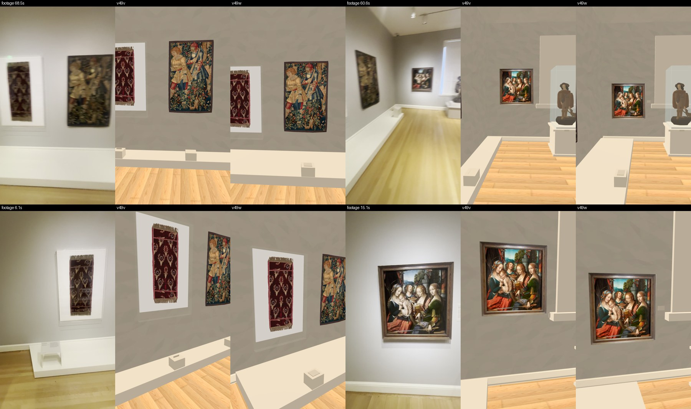
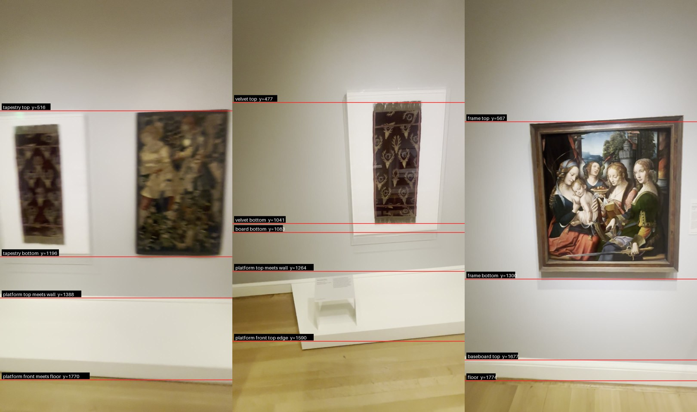
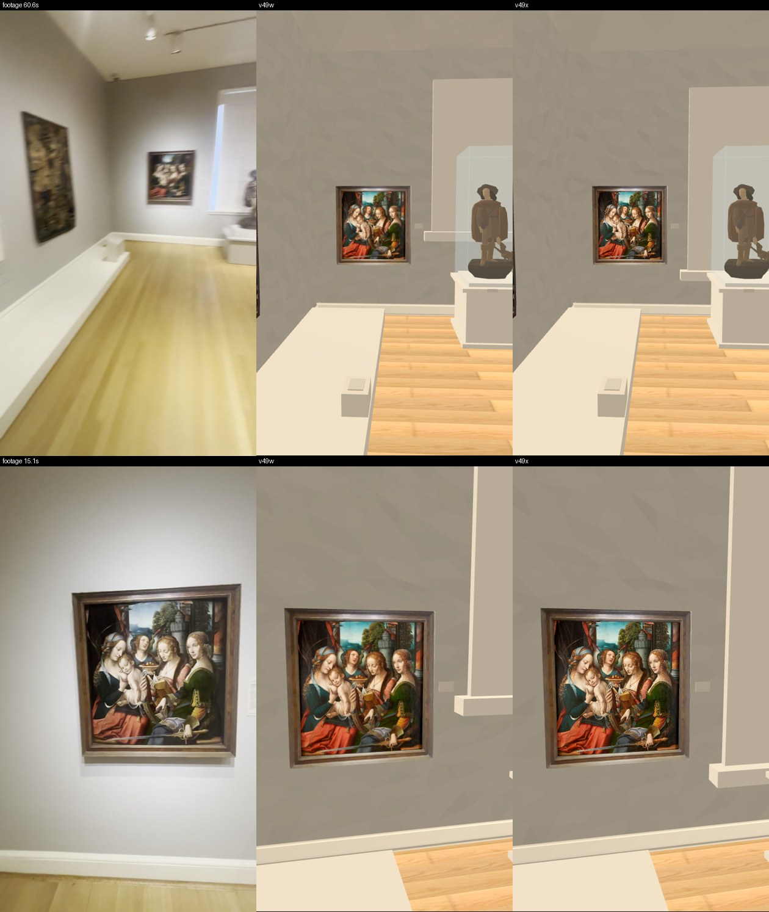
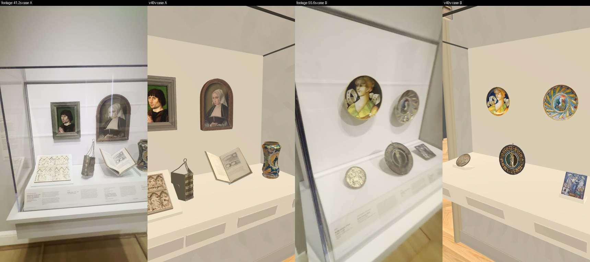
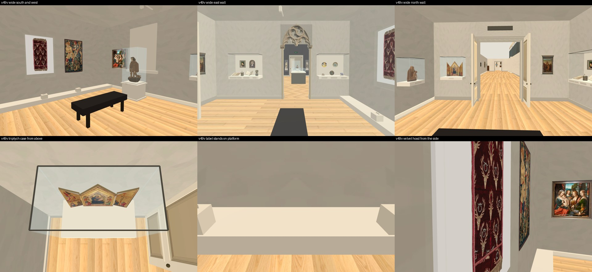

# Renaissance room install: independent review of `v49v` and the fixes in `v49w` and `v49x`

Reviewer report, 2026-10-01. Collection prototype only, Issues #178 / #181 / #182 / #183. Scope: the three new wall objects (Velvet Cover 23.307X, The Woodcutters 29.280, Madonna and Child 58.196), the low platform under the textiles, the eleven objects in the two east wall cases, and the triptych case's wall gap.

I changed no implementation. Everything I wrote is in this folder. Root's workspace, the Main build, the ingestion folder, the assets and the video masters were only read. No paid call, no generation, no bake, no GPU, no nested worker, no commit. I ran Godot only on private copies of root's prepared room projects `v49v`, `v49w` and `v49x`, copied without their bake files, with the software renderer (`llvmpipe` in all three logs). One free catalogue fetch.

**All three builds were looked at unbaked. Nothing here judges light. Every metre, placement, map and likeness flag stays false, and no claim is made that the room's objects are complete.**

## Verdict

| Build | Result |
| --- | --- |
| `v49v` | **Placement not accepted.** The three wall objects hung about 0.4 to 0.47 m too high, and the platform was too shallow and too long (H1, H2). Sources, sizes, wall contact, ownership and order were right |
| `v49w` | **H1, H2 and H3 are fixed and match the footage by ratio.** The Pietà case is also against its wall now. The west window's sill was still about 0.45 m too high (H4), so the lowered Madonna hung below it, the opposite of the footage |
| `v49x` | **H4 is fixed too.** The window is the only thing that differs from `v49w`. **Accepted in scope: the three wall objects, the platform, the labels and the window now agree with the footage by ratio, unbaked.** Not a metre or placement acceptance |

## What it looks like

Footage, then `v49v`, then `v49w`, at about the same four poses.



The readings behind H1, drawn on the footage.



## H1. The wall objects hung too high (`v49v`)

Each reading is taken in the wall's own plane and scaled by the object's catalogue size in the same frame.

| Reading | Footage | `v49v` | `v49w` |
| --- | --- | --- | --- |
| Tapestry bottom above the platform top, 68.5 s and 68.4 s | 0.43 m, 0.43 m | 0.85 m | **0.43 m** |
| Velvet board bottom above the platform top, 6.1 s | 0.41 m | 0.90 m | **0.41 m** |
| Madonna frame bottom above the baseboard top, 15.1 s | 0.55 m | 0.96 m | **0.53 m** |

- Camera tilt is not corrected; I put the error at about 0.06 m.
- The platform had been lowered from 0.54 to 0.16 m and the artworks had stayed where they were.

## H2. The platform (`v49v`)

| | Footage | `v49v` | `v49w` |
| --- | --- | --- | --- |
| Height | Low. The front face is about 0.17 m at 6.1 s | 0.16 m | 0.16 m |
| Depth | About 0.9 to 1.0 m, from 68.5 s and 6.1 s with the camera taken as 1.4 to 1.5 m up | 0.45 m | 0.95 m |
| Length | Not wall to wall. East end about 0.35 m past the velvet board (6.1 s) and short of the east wall (54.5, 58.5 s); west end short of the corner (60.6 s) | 5.85 m | 4.30 m, ending 0.34 m past the board and 0.24 m from the west wall |

The depth is the weakest of these readings; it rests on an assumed camera height and lens.

## H3. Label proxies inside other solids (`v49v`)

- The Madonna's blank label sat inside the window sill. In `v49w` it is beside the frame at mid height, clear of sill and blind, where the footage has it.
- The two textile labels sat inside their label stands. In `v49w` each lies on top of its stand, and the stands are at the platform's front.
- All labels are blank. No text is invented.

## H4. The west window was too high (from an earlier round; fixed in `v49x`)

At 60.6 s, in the window's own column, the baseboard is 32 pixels (0.144 m). On that scale the blind's bottom is about 0.63 m above the floor and its top about 2.95 m. Built, in both `v49v` and `v49w`: blind 1.10 to 3.10 m, sill 1.03 to 1.15 m.

- In the same frame the Madonna's frame bottom is 0.74 m above the floor (0.69 m from 15.1 s), so in the footage the frame sits just above the sill line.
- In `v49w` the frame bottom is 0.69 m and the sill 1.03 m: the painting hangs 0.34 m below the sill.
- I sent this to root after `v49w` was prepared.
- **In `v49x`:** blind 0.63 to 3.00 m, sill 0.51 to 0.63 m, both now owned by the west wall so they go when it is cut away. The frame's bottom (0.69 m) sits just above the sill, as in the footage. The three wall objects, the cases, the platform and every other measured piece are equal to `v49w`.



## What was right in `v49v` and stays right

| Check | Result |
| --- | --- |
| Helper script | Root's source copy is byte-equal to the worker's. The prepared copy differs by one preload line |
| Textures | 10 of 10 hash-equal to the worker's. The worker's manifest: 43 of 43 present and equal |
| Catalogue, fetched by me today | 23.307X "127 cm (length)"; 29.280 "152.4 x 94 cm"; 58.196 "91.4 x 87 cm"; all on view |
| Built sizes | Velvet 0.500 x 1.270 m, tapestry 0.940 x 1.524 m, panel 0.870 x 0.914 m. Equal to the catalogue; the velvet's width is not catalogued |
| Against the wall | Velvet board 2 mm, tapestry 2 mm, Madonna frame 1 mm, east cases 8 mm |
| Who owns them for the cutaway | The three wall objects belong to the south and west walls; both east cases to the east wall |
| Triptych case | Back 1 mm from the north wall, was 0.123 m. No gap by eye from above |
| Pietà case | 4.3 cm off the west wall in `v49v`; 3 mm in `v49w` |
| South wall order and spacing | Velvet east, tapestry west. Board to tapestry 0.49 m built, about 0.48 m at 68.5 s |
| Velvet hood | Five clear panes, 1.04 x 1.60 m, 13.9 cm below the board; the footage shows about 12. Depth is a guess |
| West wall order | Corner, Madonna, window with Saint Roch, Pietà. Agrees with 60.6 s and 62.0 s |
| East wall | Case A north of the tracery door, case B south of it, as at 44 to 54.5 s |
| Case A | Cleric and woman portraits on the back; diptych, girdle book, open book, jar on the deck, in the footage's order |
| Case B | Two plates on the back; roundel, round dish, plaque on the deck, in the footage's order |
| Flags | Nine false flags on each wall object; every inventory flag false; 34.024 still marked probable |





## Smaller notes

- **Madonna and the corner.** The frame is 0.29 m from the south wall in `v49w`. At 60.6 s the gap reads nearer 0.85 m, by eye and at an angle. The wall between corner and window is shorter in the build than the footage suggests; the room's metres are not accepted.
- **Label stands.** At 6.1 s the stand is about mid-depth on the platform. In `v49w` it is at the front edge.
- **Madonna frame.** The four strips are video pixels, soft, with the gallery's glare in them. Root's one Muse trial was rejected and is not used.
- **Root's close view of the Madonna in `v49w`** crops her lower edge because its camera still aims at the old height. Root has said so.

## Still open

- Light: all three builds were reviewed unbaked.
- The Madonna's frame texture, every unseen back and side, the velvet's width, the hood's depth, the platform's exact size.
- Every metre and placement in the room; the likeness of the eleven case objects, which I compared only for kind and order; the browser build; the map as a whole.
- From earlier reviews: floor clicks that miss the doorway, the follow camera inside the Hall, the brightness step.

## Where my own run fell short

- **I did not rerun the worker's pixel-equality check** of the textures against the museum photographs. I checked that the installed textures are the worker's files.
- **The east cases got a look, not a measurement.** I compared two footage frames per case for kind and order only.
- **The platform's depth and ends are estimates** from three frames, not a fit.
- **My copy of `v49x` was taken while root's import was still writing.** A few imported textures for other rooms were missing from it, and the scene logged four errors while building the west gallery and a door. The Renaissance positions and the window are read from built geometry and are not affected; my `v49x` pictures should not be used for anything outside this room.
- **I did not see a baked build.** Root's baked views of `v49v` and the full app `v50w` exist; I did not review them here.
- A cleanup command of mine was stopped by a safety check before it ran; nothing was removed and I repacked without it. A later shell command of mine mis-quoted this report's text and tried to run words from it as commands; none exists as a command, nothing ran, and the edit was redone. My private copies of `v49v`, `v49w` and `v49x` are still in my scratch folder.
- The archived pictures are JPEG copies of my PNG captures.

## Files

- `REPORT.md`, `SHA256.json`
- Script: `review_install.gd` (position dump and pictures; run on `v49v`, on `v49w` with only the output file's name changed, and on `v49x` with the window search widened to pieces the wall now owns), `sheet.py`
- Native data: `native-install-v49v.json`, `native-install-v49w.json`, `native-install-v49x.json`, `measured-gaps-v49v.json`, `measured-gaps-v49w.json`
- Source readings: `source-height-readings.json`, `source-height-readings.jpg`
- Static data: `static-install-v49v.json`, `live-api-check.json`
- Sheets: `footage-v49v-v49w.jpg`, `footage-v49w-v49x-window.jpg`, `footage-beside-build-walls.jpg`, `footage-beside-build-east-cases.jpg`, `build-wides-and-checks-v49v.jpg`, `root-six-native-views-v49v.jpg`, `source-wides.jpg`, `source-east-wall-order.jpg`
- Archives: `raw-captures-jpeg.tar.gz` (39 pictures and 16 source frames), `raw-logs.tar.gz` (3 logs)

```bash
rsync -a --exclude 'addition_baked/*' <root's prepared v49v or v49w>/ <private copy>/
LIBGL_ALWAYS_SOFTWARE=1 xvfb-run -a godot --display-driver x11 --rendering-method gl_compatibility --path <private copy> --script review_install.gd -- <output folder>
```
