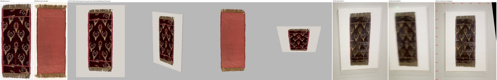
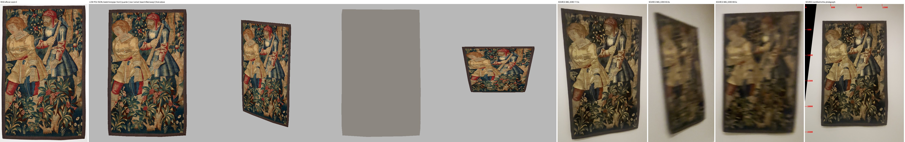
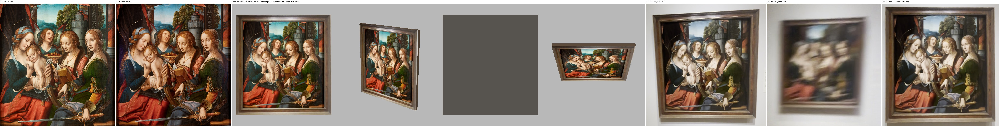

# Renaissance south and west wall: three asset studies for root review

Worker report, 2026-10-01. Velvet Cover 23.307X, The Woodcutters 29.280, Madonna and Child with Saint Barbara and Saint Catherine 58.196.
Study assets only: nothing is installed, placed, baked or accepted. No paid call, no GPU, no generated pixel. Cost: 0 USD.

## Result

1. **All three build as closed solids at their catalogue size** from one script, `renaissance_wall_assets.gd`, and pass the CPU check (`checks.json`, `passed: true`).
2. **Every painted or woven surface is the museum's own photograph**, pixel for pixel. Nothing was repainted, generated or typed.
3. **The velvet's back is photographed.** The catalogue page carries four photographs; the inventory kept two. The third is the back: a plain salmon lining with the museum's sewn tag. It is used here after inspection. The root has not yet accepted it as a source.
4. **The painting's frame is not in any official photograph and no saved root frame fits it.** A provisional moulded frame is built from four strips of the video. One Muse pass is still needed; the reference crops are in `references/`.
5. **Nothing here is measured to acceptance.** Every node carries nine flags, all `false`, and its own list of catalogue and source conflicts.

## Pictures

Each sheet reads left to right: official photograph(s), the Godot views (front, quarter, rear, from above), then the owner's video.

**Velvet Cover 23.307X** on its white board. The rear view lifts the board away to show the photographed lining.

**The Woodcutters 29.280**, hung bare. The video is darker and yellower than the studio photograph: gallery light on a textile, not an error in the asset.

**Madonna and Child with Saint Barbara and Saint Catherine 58.196** in its frame. The last tile is the video frame warped square-on to the painting.

Compared by eye: motif positions, outline, fringe, the board's margins and the frame's three bands agree with the video. The frame's faces are soft because they are video pixels.

## What is authentic and what is a guess

| | Velvet Cover 23.307X | The Woodcutters 29.280 | Madonna and Child 58.196 |
| --- | --- | --- | --- |
| Catalogue record | 1202276, "127 cm (50 inches) (length)" | 1201986, "152.4 x 94 cm (60 x 37 inches)" | 1591076, "91.4 x 87 cm (36 x 34 1/4 inches)" |
| Built size (w x h) | 0.500 x 1.270 m | 0.940 x 1.524 m | panel 0.870 x 0.914 m |
| Front | official photograph zoom-0, backdrop cut away | official photograph zoom-0, backdrop cut away | official studio photograph zoom-0, whole |
| Back | **official photograph zoom-2** (lining and tag) | not photographed: plain neutral, cut to the outline | not photographed: plain neutral |
| Edges | one plain colour, the photograph's rim median | same | plain neutral, hidden in the frame |
| Thickness (guess) | 3 mm | 5 mm | 10 mm panel |
| Hardware | white board 0.971 x 1.448 m, 2 cm thick (guess) | none | moulded frame, 7.7 cm band, 5.5 cm deep (depth a guess) |
| Outer size | board 0.971 x 1.448 m | 0.940 x 1.524 m | frame 1.005 x 1.060 m |
| Closed shells, triangles | 2, 496 | 1, 52 | 23, 276 |

## Catalogue check

- **Cached, accepted:** the three records in the inventory's `api/cached-records.json` (sha256 `4c835466…`). Ledger `5f6027a5…` re-checked first with its own `check_ledger.py`: ok.
- **Live, today:** three free API queries at 20:26 UTC through the Scrapling interpreter (`fetch_live.py`, `live/manifest.json`). All three records were found and **no field differs** from the cache: accession, title, dimensions, medium, on view, dates, culture, URL. The painting's live reply is byte-identical to the root's cached file. Plain `urllib` is refused with 403; that first failure is why the script uses Scrapling.
- The velvet's record gives a length and **no width**. The painting's record names no frame. Neither record says whether a size includes fringe, binding or frame.

## The velvet's back: a source the inventory did not hold

- `live/carousel-velvet-cover-23307x-zoom-2.jpg`, sha256 `eac340d0…`, from `https://risdmuseum.cdn.picturepark.com/v/e6l3lIgP/`, marked `public`. The URL is the third of four on the inventory's cached catalogue page; fetched today by `fetch_carousel.py`. It is **not in the accepted ledger**.
- It shows a plain salmon lining, both gilt fringes, the red side fringe at both edges, and a small sewn tag at the top right. The tag is photographed, not typed.
- Front and back are at one scale: the velvet between its fringes is 2624 and 2622 pixels long. Its width tapers the same way from top to bottom in both (1163, 1166, 1167, 1141, 1136 against 1166, 1170, 1170, 1143, 1144), which fixes which end is up. The back is laid body centre on body centre, mirrored.
- The fourth photograph (`…zoom-3.jpg`) is a close detail of one stag head. Not used.
- The tapestry and the painting have two photographs each, both of the front. Their backs stay plain.

## The painting's frame

- **Official photographs:** zoom-0 is an unframed studio crop and is the texture. zoom-1 was taken in the frame but shows only a 7 pixel sliver of the sight edge and its shadow down the left side. It was used to register the video, not as a texture.
- **Saved root frames:** all fifteen were looked at side by side. None fits. `fauconnier` is the nearest colour but has a cream liner and a flat section; `cleric-45042` has a stepped section but is grey.
- **What the video shows** (`references/frame-58196-rectified-15.10.png`): dark brown wood, square mitred corners, no carving. From the painting outward: a dark slope with a thin light bead line, a flat mottled reddish-brown frieze, a raised plain outer moulding. The top member reads grey only from track-light glare.
- **Measured from the video:** band width 7.3, 7.4, 7.9 and 8.2 cm on the four sides, mean **7.7 cm**; inner moulding 1.8 cm, frieze 2.9 cm, outer moulding 3.0 cm. Readings are ±5 pixels (about ±3 mm), plus up to 1 cm from the frame standing proud of the panel.
- **Built now:** four mitred members, each five closed solids along that section, 5.5 cm deep. Their fronts carry strips of the 15.10 s frame warped into the painting's plane. These are the only resampled pixels in the folder. Section heights are guesses from shading.
- **Proposed Muse pass (not run, root's decision):** one source-guided frame texture. Main reference `references/frame-58196-rectified-15.10.png`; detail references the two 3x corner crops; the untouched native crop is `references/frame-58196-native-15.10.png` (x 260–1060, y 500–1320 of the upright 1080 x 1920 frame, PNG sha `fc6522c9…`, the inventory's own 15.1 s frame). A Muse texture replaces the four strip textures; the panel is not touched.

## Sizes read from the video, and their limits

| Reading | Value | How | Error |
| --- | --- | --- | --- |
| Velvet width | 0.500 m | the photograph's own proportion at the catalogue length | not catalogued |
| Velvet length means | whole textile with both fringes | measured against the tapestry on the same wall at 68.40 s: 1.27 and 1.34 m overall, 0.48 and 0.53 m wide | weak fits, 13 and 16 inliers; the velvet alone would have read 1.46 m |
| Velvet board | 0.971 x 1.448 m | 6.10 s frame registered to the photograph (260 inliers, 1.0 px) | ±1 cm sides and bottom, ±2 cm top |
| Velvet on the board | 23.2 and 23.8 cm at the sides, 7.2 cm above, 10.6 cm below | same | same |
| Acrylic hood (not built) | about 1.04 x 1.60 m, reaching about 12 cm below the board | same | ±2 cm; depth not readable |
| Painting's visible opening | 0.9445 wide for its height; catalogue panel is 0.9519 | 15.10 s frame registered to zoom-1 (929 inliers, 1.1 px) | ±0.5 % |
| Studio photograph inside that opening | 97.6 % of its width, 97.8 % of its height | zoom-0 registered to zoom-1 | ±1 % |

Catalogue and source disagree in three places. Each is kept, not smoothed over, and travels on the node as `dimension_conflicts` with `dimension_conflict_resolved: false`:

1. **Painting proportion.** The studio photograph is 0.9403 wide for its height, the catalogue 0.9519. The photograph keeps its own proportion at the catalogue height, so 5 mm of panel each side is bare. Those strips sit behind the frame.
2. **Painting scale.** The video says the studio photograph stops about 1 cm short of the frame opening on every side. Here it is drawn to the full catalogue height, so the painted image may be about 2 % large. The other reading, a visible bare margin inside the frame, would have meant inventing a strip of surface.
3. **Tapestry proportion.** The photograph is 0.6207 wide for its height, the catalogue 0.6168. It is stretched 0.6 % taller to the catalogue size.

## Checks

`bash run_check.sh`, CPU only, Godot 4.7.2 on Mesa llvmpipe. Exit 0 (`check.log`, `checks.json`).

1. `prep.py --verify`: the four inventory photographs used match the ledger; the video is the verified `8cfd089e…`; three of the four frames decode to the inventory's own PNG hashes (6.1, 11.5, 15.1 s; 68.4 s is new); all 18 outputs rebuild byte for byte. Every opaque artwork texel equals the source decode (3.31 M front and 3.42 M back for the velvet, 2.56 M for the tapestry, the whole photograph for the painting).
2. Closure: each of the 26 shells has every edge matched once, positive volume, no collapsed triangle, all vertices finite and within two metres.
3. Catalogue size to a hundredth of a millimetre, typed into the check separately from the asset. The velvet's width must equal its declared photograph proportion and lie inside the video's range.
4. Hardware: the board's face is the textile's back plane and shows round the whole textile; the frame stands on the wall, proud of the panel, laps the photograph by 4 mm on every side, and no frame vertex lies inside the opening.
5. Mapping: every picture coordinate stays inside its texture; no face more than 60° from square carries a picture; a back carries a photograph only where one exists; every other back is the neutral colour.
6. False acceptance: all nine flags must be `false` and each node must carry its conflicts.
7. Controls that must fail, and do (`checks.json` → `negative_controls`): an opened surface, an inside-out shell, a non-finite vertex, a painting 2 % too wide, a node claiming `rear_accepted`.
8. **Open-surface control on the whole run** (`negative-control.log`): a copy of the asset whose textile slabs have no back face exits 1 with `open edge` for the velvet and the tapestry.
9. `git diff --check` exits 0 (`repo-check.log`). `scripts/check.sh` was not run: no tracked source changed, and its Godot import would write outside this folder.

## For the root to install

- Script: `renaissance_wall_assets.gd` into `modules/shell/prototype/collection_reconstruction/`. It preloads `seated_woman_asset.gd` (shell, box) and `../gallery_walk4/painting_asset.gd` (the room shader). Checked against root copies `7b17a507…`, `3141d333…`, `071ddec3…`.
- Textures: the ten files in `textures/` into `res://assets/renaissance-wall/`, or pass another folder: `Asset.build("velvet_23307x", dir)`, `"woodcutters_29280"`, `"madonna_58196"`.
- Each node: origin at the centre of the artwork's back, +Z the front, +Y up. `wall_behind_origin` says how far behind that the wall is (2 cm board, 1.2 cm frame, 0 for the tapestry). No collision.
- Meshes are named `front`, `rear`, `edge`, `mount`, `frame bottom|right|top|left`, `frame edge`, `hardware rear`. Free `mount` or the `frame …` meshes to place an artwork without them.
- The textiles' fronts use alpha cut, as the room's frames do.

## Not built, and why

- **Acrylic hood over the velvet.** A case is the root's. Its observed size is in the table and in `textures/geometry.json` under `hood_observed_not_built`.
- **Labels.** The label stands on the low platform under both textiles and the wall label right of the painting are seen in the video. No label is built and no label text is written anywhere.
- **Low white platform, placement, heights on the wall, hanging hardware.** Room work. The tapestry's top fixing is not visible; the video shows it standing a little off the wall with a soft shadow and its lower corners curling. The asset is flat.
- **Frame rebate.** The panel's edges sit inside the frame solid.

## Limits

- No metric acceptance and no whole-room acceptance is claimed. Every size from the video carries the error stated above.
- The frame strips are soft video pixels with the gallery's lighting in them, glare on the top member included.
- The velvet's fringe is cut out thread by thread by a colour rule; a few backdrop pixels between threads may survive and a few pale silver stitches at the fringe base may be cut.
- The velvet's back and front outlines differ where the fringe lay differently on the two days. The back is clipped to the front's outline.
- Two readings are by hand: the board edges and the frame band edges (`sources.json` → `hand_readings`).

## Provenance

`SHA256.json` lists every input and output hash. `sources.json` holds the per-texture record, the four frame decode commands, the registrations and the hand readings. Rebuild: `fetch_live.py`, `fetch_carousel.py`, `prep.py`, `run_check.sh` (which runs `check.gd` and `make_compare.py`).
