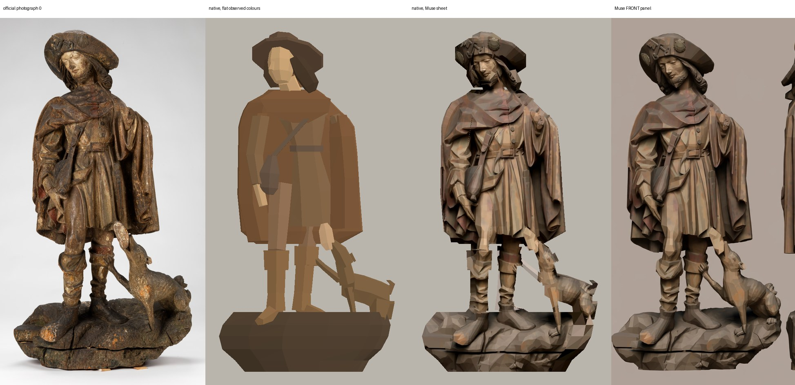
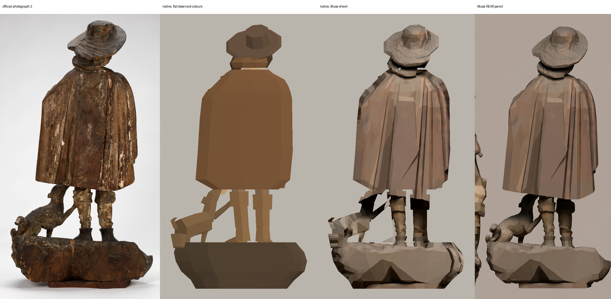
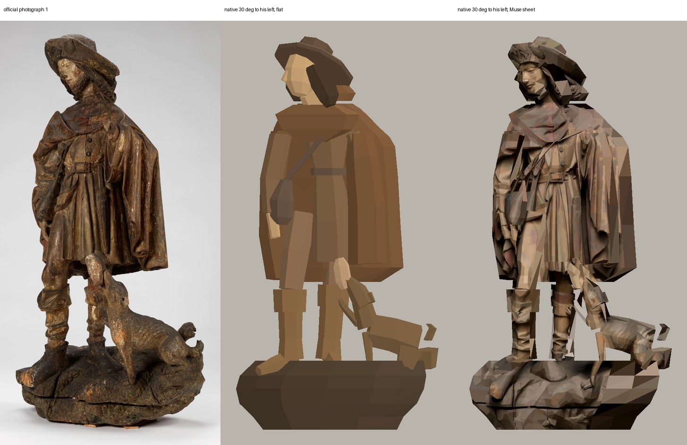
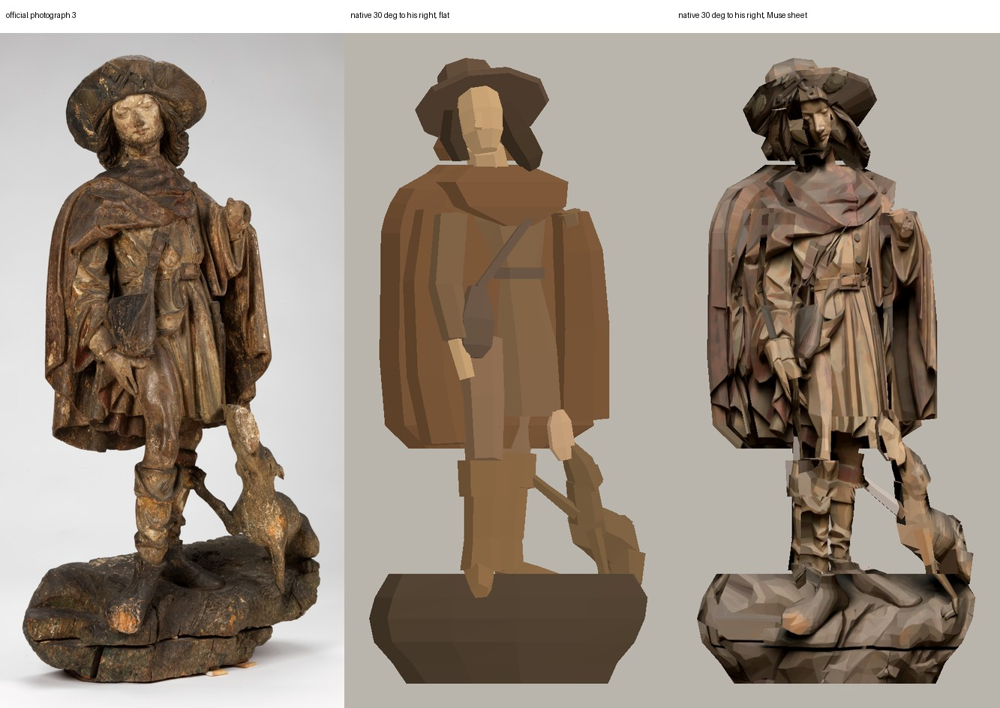
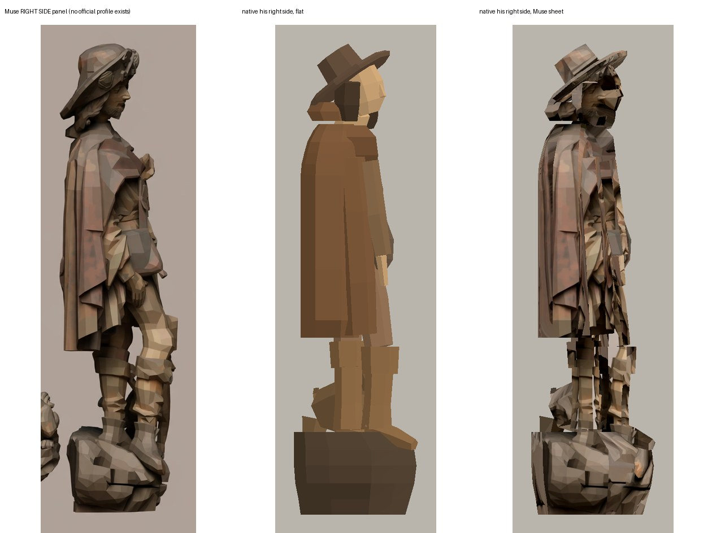
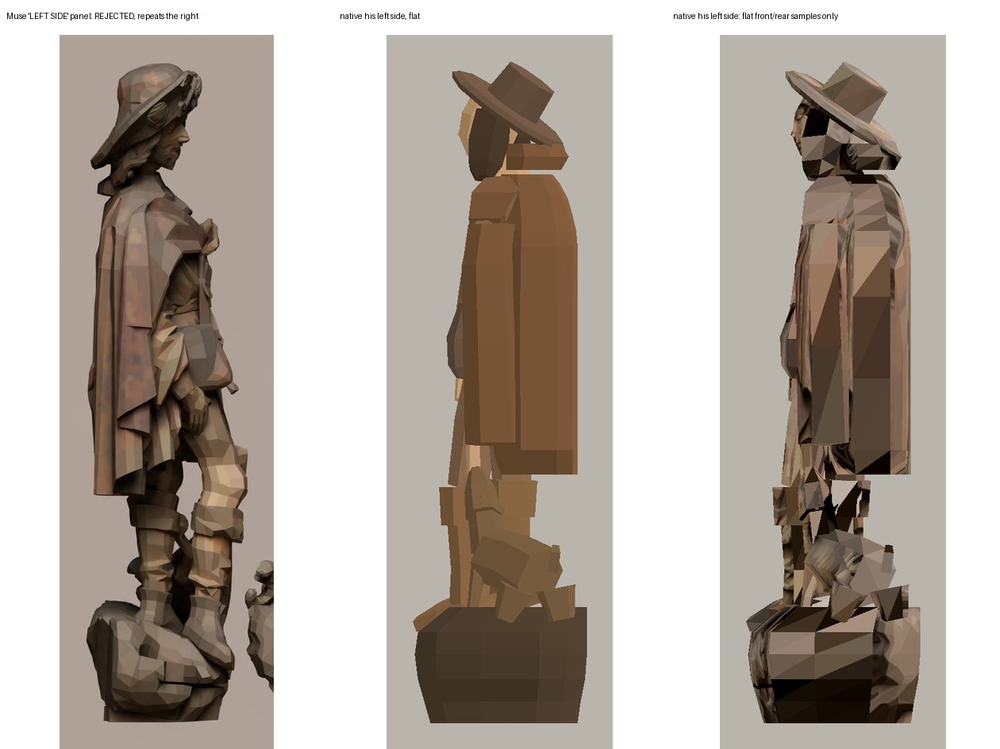
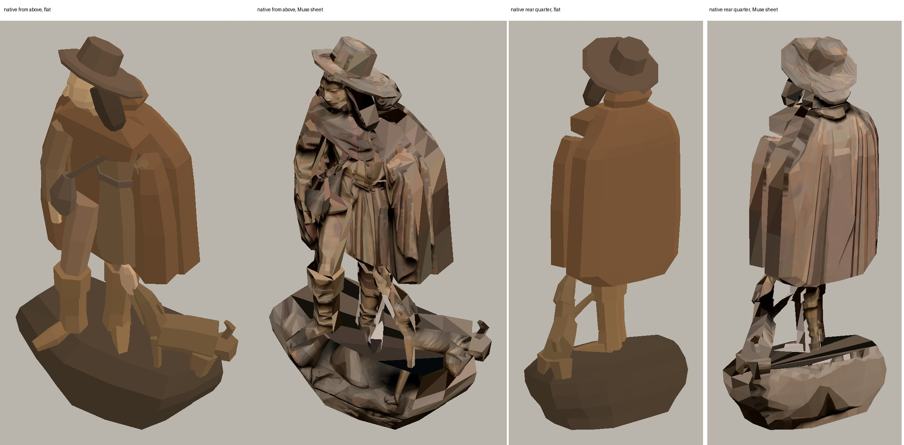

# Saint Roch 21.398: low-polygon prototype asset

Worker report, 2026-10-01. Collection reconstruction prototype only.
Changed in my worktree only: one new file, `modules/shell/prototype/collection_reconstruction/saint_roch_asset.gd`, and this folder. Nothing was installed in a room, committed, pushed or written to the root workspace. I did not touch `prepare_remodel.py`, `remodel_room.gd` or `PROVENANCE.md`. No paid call, no GPU, no bake, no nested worker, no 3D Viewer. Zero new spend; the one Muse sheet is root's.

**Verdict: a usable block study, not accepted.** It reads as the wooden pilgrim in the broad hat and short cape, head tilted and turned to his right, tunic lifted from the right thigh, long boots with a clear gap between the legs, the dog at his left with the loaf, on the rocky base. It is 40 separate closed solids. Faces, folds, hair, fingers and the worn paint are not modelled, and the sheet colour smears on every view that is not straight front or straight back.

It is polychromed wood. It is not bronze and not a knight.

## Against the four official photographs

Each strip: official photograph, native render in flat observed colours, native render with the Muse sheet, Muse panel.






No official profile exists. His right side is shown beside the Muse panel; his left side has no source at all.





## The Muse sheet, checked against all four originals

Sheet: root's `run-b13a93b2b883bac8562b552d/materialized/image-01.webp`, copied here unchanged as `muse-sheet-run-b13a93b2b883bac8562b552d.webp`.

| Panel | Finding | Used for |
| --- | --- | --- |
| FRONT | Agrees with photograph 0: pose, hat with keys and shell, cowl, strap and bag, belt, lifted tunic, bared right thigh, boot cuffs, dog with the loaf, right toe over the base. Cape 37.0 cm wide against 37.3 in the photograph. | Colour on faces turned to the viewer |
| REAR | Agrees with photograph 2: broad cape, the roll behind the neck, hat, boots, dog at his left. Cape 36.2 cm against 38.9. | Colour on faces turned away |
| RIGHT SIDE | No photograph to check it against. Its depth (about 21 cm for body and base alike) is Muse's own. | Colour only, on faces turned to his right. No geometry was taken from it |
| LEFT SIDE | **Rejected.** It repeats the right profile: the nose points the same way, same knee, boot and dog. | Never read. `check.gd` fails if a single face reads it |

What Muse changed or made up, and what I did about it:

- **Paint.** Muse gives an even matt brown. The pale flesh of the face and hand, the red cape lining, the red band on the left boot, the green on the base and the white losses are mostly gone. Not corrected; I added no paint.
- **Back.** The real back is dark and streaked, with a long vertical split and dowel holes. Muse drew a clean pale cape with tidy folds. Its outline is right; its surface is not evidence.
- **Dog.** Muse made it plump and smooth. The real dog is lean and worn, with a damaged muzzle. The mesh dog is placed and sized from photographs 0, 1, 2 and 3; the Muse colour on it still looks like Muse's dog.
- **Raised left arm.** The original ends in a break at shoulder height with the cape hanging from the forearm. Muse drew a small knob that reads as an ornament. The mesh has a plain forearm ending in a flat break.
- **Hat.** The side panels show two shell badges on the side of the brim. No photograph shows them. They land only on faces turned to his right.
- **Base.** Muse cut the base off at the sheet's left edge (front) and right edge (rear), and drew the museum's mount board under the back as if it were wood. The mesh base is 2 cm wider than Muse painted and leaves the board out.
- **Perspective.** The FRONT panel keeps the photograph's view from slightly above, so it shows the top of the base. Projected straight on, that paint lands on the front face of the mesh base.

## How it is built

`saint_roch_asset.gd` follows the existing helpers: `parts()` returns closed shells, `build()` returns one node, and it reuses `seated_woman_asset.gd` for `shell`, `slab`, `limb`, `mesh` and `flat`. One local function was added, `loft`, for a flat-backed upright mass (the cape, tunic, base).

40 solids, 1,446 triangles, in eleven groups:

| Group | Solids |
| --- | --- |
| base | one irregular rock, flat at the back |
| boots | shoe, ankle, shaft and turned-down cuff for each leg |
| legs | bared right thigh, left thigh |
| tunic | belted body and skirt, right sleeve, the raised left forearm ending in the break |
| leather | belt, strap, bag |
| cape | flat-backed main mass, lappet over the right arm, fold hanging from the left forearm, cowl, roll behind the neck |
| flesh | neck, head, nose, right hand |
| hair | a mass at each side of the face |
| hat | brim and crown |
| dog | body, neck, head, ear, two forelegs, two haunches, tail |
| bread | the loaf |

Read from the photographs: head tilted about 24 degrees to his right and turned about 25 degrees the same way; hat brim low behind and turned up over the face; right leg about 7 cm forward of the left; dog's chest forward and rump back; cape and base squared off at the back.

Colour. With no sheet, each group takes a flat colour that is the median of its pixels in photograph 0. With the sheet, a face turned to the viewer reads the FRONT panel and a face turned away reads the REAR panel, vertex by vertex. A face turned to his right reads the RIGHT SIDE panel. Every other face (his left, tops, undersides, and all of the dog's side faces) takes one flat sample from the front or rear panel. The front is never repeated on the back.

`muse-sheet-padded.webp` is the sheet with the grey ground and the four caption words replaced by the nearest sculpture pixel (`pad_sheet.py`). It stops a mesh edge from reading grey. Sculpture pixels are unchanged and nothing is drawn.

## Dimensions

| | Value | Basis |
| --- | --- | --- |
| Height including base | 1.054 m | Catalogue, exact |
| Width | 0.545 m over base and dog; cape 0.375 m | Outlines of photographs 0 and 2 scaled to the height. **Unmeasured** |
| Depth | 0.278 m; cape about 0.14 m back to front | Fitted from photographs 1 and 3, assuming each is turned 30 degrees. **Unmeasured, could be a third off** |
| Head turn | 25 degrees | By eye between photographs 0 and 3 |

The photograph outlines include the mount shims in front and the 2.5 cm mount board behind, so the whole figure may be up to 2 percent small.

## Check

```bash
godot --headless --editor --import --path <copy of this folder>
env LIBGL_ALWAYS_SOFTWARE=1 GALLIUM_DRIVER=llvmpipe DISPLAY=:99 godot --path <copy of this folder> --rendering-method gl_compatibility --script check.gd
```

Run it in a disposable copy; it writes sixteen PNGs and `checks.json` beside itself. The two `.gd` helpers here are byte-identical to the module file and to root's `seated_woman_asset.gd`. I ran it on CPU (llvmpipe, display :99) in a scratch copy, after telling the coordinator.

| Check | Result |
| --- | --- |
| Every solid closed: each edge used once in each direction | Passed, 40 solids |
| No degenerate triangle; every solid outward-facing with positive volume | Passed, 1,446 triangles, 0.054 m³ |
| No solid thinner than 5 mm (no card standing in for a mesh) | Passed; thinnest is the 7 mm strap |
| Base at 0, hat top at 1.054 m | Passed |
| Front faces read FRONT, rear faces read REAR, nothing reads the rejected panel | Passed: 374 front, 371 rear, 159 right, 542 flat samples, 0 rejected |
| All four accepted flags false on the node | Passed |
| Negative control: one triangle removed from the base | Exit 1, "open, doubled or inconsistently wound edge" |
| Negative control: front panel forced onto every face | Exit 1, "a face turned rear reads the front panel" |
| `scripts/check.sh`; `git diff --check` | "checks passed"; clean |

Two earlier runs failed and are kept in `trials/`: a type error in `loft`, and my own check reading the mesh's compressed normals.

## Measured outline

`silhouette-vs-official.txt` compares the flat render's outline with photographs 0 and 2 every 2.5 cm. The photographs are perspective views, so about a centimetre is noise.

- **Front:** mean difference 1.1 cm. The cape is within 0.8 cm from 45 to 75 cm. Worst is 13.9 cm at 15 cm on his right: the real base has a low ledge in front there and the mesh base is one mass at the height of the back.
- **Rear:** mean difference 1.2 cm. The cape is within 1.2 cm. The 9 cm figure at the hat is the measurement, not the mesh: the grey hat drops out of the photograph's mask. By eye the brim spans the same 23 cm.

## Not accepted

- **Likeness.** Blank faceted head, no beard, no curls, no fingers, no buttons, no badges, no drapery folds.
- **Sheet colour off-axis.** Good straight on from front and back. Streaked and blocky from the quarters, the sides and above, where the dog and legs are painted onto the base top.
- **His left side.** No source. Geometry inferred from photographs 0, 1, 3 and the back; colour is flat samples.
- **His right side.** Muse only.
- **Back surface.** Outline from photograph 2; Muse's clean cape is not the real back.
- **Width, depth and head turn.** Read from photographs, not measured.
- **Base.** One rock mass. The front ledge, the split between its two layers and the hollowed back are missing.
- **Dog.** Block limbs; reads as a dog but not as this dog. In flat colour the loaf can be mistaken for a hand.
- **Paint and damage.** None of the worn polychromy or losses.
- **Plinth and acrylic hood.** Not built. Their sizes are unmeasured.
- **Placement.** Not installed. Not in any room.

## For root

- Put `saint_roch_asset.gd` beside `seated_woman_asset.gd`. `build()` gives flat colours; `build(sheet_texture)` gives the Muse sheet. Origin is under the base centre, +Z is his front, metres.
- If you use the sheet, use the padded one, or run `pad_sheet.py` on your own copy. Where it lives and its `PROVENANCE.md` entry are yours; I registered nothing.
- If the off-axis smearing is too much in the room, call `build()` with no sheet. The flat version is cleaner from every angle.
- Look at it before installing. I have not marked the figure, the case or the room done.

## Files

- `saint_roch_asset.gd`, `seated_woman_asset.gd`, `project.godot`, `check.gd`: the runnable check
- `checks.json`, `native.log`, sixteen PNG views (eight with the sheet, eight `flat-`)
- `compare-*.jpg`, `compare.py`
- `silhouette-vs-official.txt` and `.json`, `silhouette.py`
- `muse-sheet-run-b13a93b2b883bac8562b552d.webp` (root's sheet, unchanged), `muse-sheet-padded.webp`, `pad_sheet.py`
- `negative-control-open-shell.log`, `negative-control-front-on-rear.log`, `repo-check.log`
- `trials/`: two failed runs and the earlier passes
- `SHA256.json`: the asset, the reused helper, every source read and every file here
