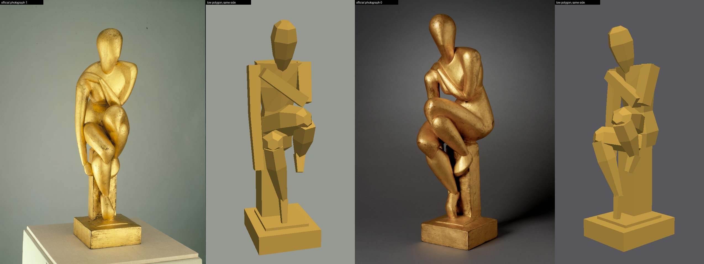
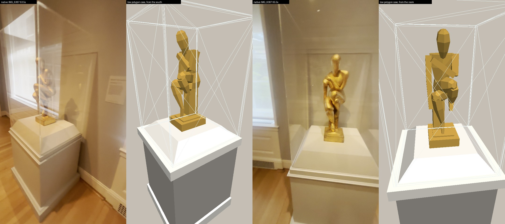
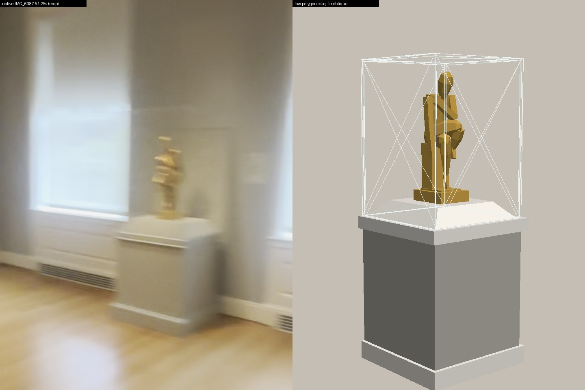
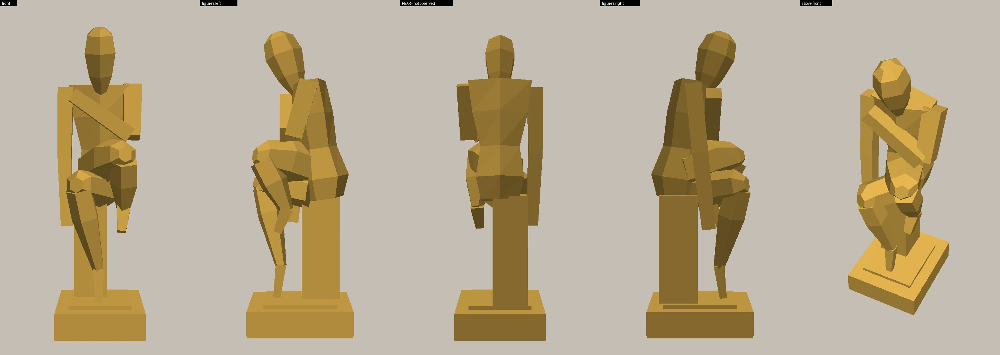

# Seated Woman 67.089 and its case — low polygon asset for coordinator review

Worker report, 2026-10-01. Collection connected museum map only, Issues #178 / #181 / #182 / #183.
Nothing here is integrated, baked, committed or pushed. No paid generation, no GPU.

## What this is

The gold seated figure that was missing from the modern painting gallery, plus the case it sits in, as one new helper script. The figure is 14 closed low polygon masses (344 triangles) posed from the two official RISD photographs and the walk-through video. The case is the white-capped plinth with an acrylic hood that stands against the wall between the two windows.

## Look at this first

Figure beside the two official photographs (same side, same height of view):



Case beside the video frames it was read from:



Far view, and the figure from all sides (the rear is marked — it was never photographed):




These are flat-shaded CPU review renders made by `render.py` from the exported OBJ. They are not the game renderer and not a bake. The crossed lines on the hood are triangle edges of the review render only.

## One correction to the brief

The brief says "actual wall case between windows, not a floor pedestal". The video shows something in between, and I built what the video shows:

- It is **against the wall** on the pier between two windows, and its acrylic hood closes against the wall (`native-IMG_6387-63.5s.png`, `-65.5s.png`).
- It **does reach the floor**: a wall-grey plinth with a white foot moulding and a stepped white cap, then a raised chamfered deck (`native-IMG_6387-63.5s.png`, bottom left).
- So: not a freestanding pedestal out in the room, and not a case hung on the wall. A plinth case built against the pier.

## Two findings about the room that affect placement (coordinator's files, not changed)

1. **The window wall has two windows, not three.** Panning from the south corner: corner (58.0 s) → window (58.5–62.0 s) → label → case (62.5–66.0 s) → window (66.25–67.25 s) → corner and doorway (67.75–69.0 s). The third blinded window in the wide view is seen *through* the doorway, in the next room. `remodel_room.gd` currently authors three at z = 26, 28, 30.
2. **The "deeper opening" is in the north wall at its east end, not in the window wall.** At 68.5–69.5 s the doorway is in the same wall as the Cézanne, with the ceiling corner between it and the first window (`native-IMG_6387-68.5s.png`, `-51.0s.png`). `geometry.json` currently has it as `"east": [23.5, 25.1]`.

Both are read from frames by eye; neither is measured.

## What was built

`modules/shell/prototype/collection_reconstruction/seated_woman_asset.gd` (166 lines, no dependencies on the room script).

| | Value | Source |
| --- | --- | --- |
| Figure bounds | 0.203 × 0.711 × 0.241 m (W × H × D) | Catalogue, RISD API 1552686 — checked to 0.5 mm |
| Figure | 14 closed shells, 344 triangles | — |
| Case | 9 closed shells, 108 triangles; 0.68 × 1.70 × 0.67 m overall | Estimated from video, about ±15% |
| Hood width | 0.62 m | Measured in the 65.5 s frame from the hood's front and back edges against the figure's 20.3 cm shoulder span |
| Deck (sculpture stands here) | 0.92 m above floor | By eye: level with the window sill in 65.75–66.0 s; 0.92 m from the 51.25 s far view |
| Hood top | 1.70 m (7 cm above the head) | 51.25 s far view: faint top edge just above the head |
| Plinth depth, cap and foot mouldings, chamfer | 0.64 m deep; 7 cm cap; 10 cm foot | By eye only |
| Gold colour | `caa046` | Median gold pixel of official photograph 1 |

Pose, as read from the photographs and built:

- Narrow rectangular seat post, set back and slightly to the figure's right, on a rectangular base with a low step.
- Torso leaning forward; faceless egg-shaped head bowed about 20°.
- Right arm hanging long and nearly straight to a hand at seat height.
- Left shoulder blocky, upper arm upright, forearm crossing the chest diagonally up to the right shoulder.
- Crossed legs: one thigh crosses over to a high knee on the figure's left, its calf falling back to a foot that hangs clear; the other knee is lower and furthest forward on the right, its calf running back to a tiptoe at the centre of the base.

Orientation in the case: the figure faces straight out into the room, base square to the wall. The 65.5 s frame (camera facing the wall) matches the official front photograph; the 64.5 s frame (camera to the south-west) matches the official three-quarter photograph, which fixes which side is which.

## How to put it in the room

In `prepare_remodel.py`, add `'seated_woman_asset.gd'` to the script copy list (line 491). In `remodel_room.gd`:

```gdscript
const SeatedWoman := preload("res://seated_woman_asset.gd")

# last thing in build_lion_modern_rooms(), before inventory["modern_gallery"]=...
#6387 63.0..66.0s: 67.089 under its acrylic hood on the plinth against the east pier.
var seated:StaticBody3D=SeatedWoman.build(look(Color.WHITE,"res://presentation/landing-plaster.png"),ivory)
seated.position=Vector3(20.89,0,27.0)
seated.rotation.y=-PI/2
add_child(seated)
casings.append(seated)
```

- `20.89` is the inner face of the east wall (wall centre 20.95, 0.12 thick). `-PI/2` turns the case's front to the west, into the room, with the figure's left to the south — the side the video shows.
- `z = 27.0` is the pier between the authored windows at 26 and 28, the pair nearest the middle of the wall. This is an interim position: with the wall corrected to two windows, the case goes on the single pier between them, with the wall label on its south side.
- The case is 0.68 m wide. It fits between the authored radiator covers (0.80 m apart) but its hood is 0.62 m against an authored clear pier of about 0.665 m between the window stiles, so it sits tight. In the video the pier is wider than a window.
- `casings.append` gives it the same camera cutaway as the other display cases; the node's child order (collision, then visuals) matches what the cutaway expects.
- **It needs a re-bake.** Added last, it does not renumber any existing `AuthoredSurface`, so the saved bake still loads; but until it is baked the plinth and figure have no light in a baked build. The hood is an alpha material and is skipped by `remodel_bake.gd`, like the existing case glass.

I ran exactly this call in a scratch copy of `lowpoly-room-v48b-modern-frames` (headless, no GPU): the room built, and the figure landed at x 20.45–20.69, z 26.90–27.10, y 0.92–1.631, facing −X (`integration-smoke.log`). The two `store_string` script errors in that log are existing evidence writers in `build_gabled_frame` / `build_iron_grille` failing because my scratch copy left out the `evidence/` folder; they are not from this asset.

## Checks (all CPU, all rerunnable)

```bash
mkdir -p /tmp/empty && touch /tmp/empty/project.godot
godot --headless --path /tmp/empty -s "$PWD/docs/evidence/collection-reconstruction/opus-seated-woman-20261001/check.gd"
python3 docs/evidence/collection-reconstruction/opus-seated-woman-20261001/render.py ~/risd-godot-ingestion/collection-expansion
```

| Check | Result |
| --- | --- |
| Every shell closed: each directed edge once, its reverse once, no collapsed triangle, positive volume in Godot winding | Passed, 23 shells (`checks.json`) |
| Figure bounds equal the catalogue 71.1 × 20.3 × 24.1 cm, typed independently in the check | Passed |
| Seated pose relations (hips on the post, crossing knee higher and on the left, lower knee furthest forward, tiptoe on the base, hanging foot clear, hand at seat height, bowed head highest) | Passed |
| Case meets the wall plane, reaches the floor, hood encloses the figure and tops out just above the head, base stands on the flat deck | Passed |
| Built node: collision present, a normal on every vertex, hood is alpha, accession tag `67.089` | Passed |
| The check can fail: opened cap, flipped triangle, inside-out shell, wrong height, plinth off the wall | Each made it exit 1 |
| `scripts/check.sh` | "checks passed" (`repo-check.log`), after one headless import of the fresh worktree; run with its log redirected so it could not overwrite the coordinator's `/tmp/godot-import.log` |
| `git diff --check` | Clean |
| In-game look, bake, browser walk | **Not run** — coordinator's GPU bake and integration |

## Where everything came from

- Catalogue record: `image-work/collection-room-remodel/inventory-catalogue/seated-woman-duchamp-villon.json` in the coordinator's checkout (saved from `https://risdmuseum.org/api/v1/collection?id=1552686`). I did not re-fetch it: a plain request to the live API returned 403 today, and the saved record was enough.
- Official photographs: `modern-candidates-v3/seated-woman-zoom-0.jpg` and `-1.jpg` in ingestion. Used as reference for shape and for the gold colour only; no pixels from them are in the asset. `-2.jpg` is a line silhouette of the same three-quarter view.
- Video: `verified/IMG_6387.MOV`. The existing GPU-decoded wides at 51.25 / 64.25 / 66.25 s, plus six frames I decoded on the CPU with the same orientation (`ffmpeg -noautorotate … -vf transpose=clock`) and saved here as `native-IMG_6387-*.png`.
- Textures: none made. The figure is a flat colour. The plinth takes the room's existing Muse plaster (`presentation/landing-plaster.png`) and white woodwork material (`presentation/wall-plaster.png`) through the two arguments of `build()`; their provenance stays where it already is in `modules/shell/PROVENANCE.md`.
- Hashes for all of the above and for every delivered file: `SHA256.json`.

Suggested line for `modules/shell/PROVENANCE.md` when this is integrated (I did not edit that file):

> Seated Woman 67.089 (RISD API 1552686): authored low polygon figure and wall case, `seated_woman_asset.gd`, no generation, no cost. Shape read from official photographs 0/1 and native IMG_6387 51.25/63.5/64.5/65.5 s; catalogue bounds 71.1 × 20.3 × 24.1 cm; rear not observed; case metres estimated ±15%; placement unaccepted. Evidence `docs/evidence/collection-reconstruction/opus-seated-woman-20261001/`.

## What is not verified

- **The rear.** No photograph or frame shows the back of the figure, the buttocks, or the reverse of the seat post. Those faces are plain closing surfaces. The catalogue says the foundry stamp is on the back of the base; it is not modelled.
- **Limb positions inside the catalogue box.** Every joint position is read by eye from two photographs of a cubist figure; depth along the viewing direction is the weakest. Which dimension of the base is 20.3 and which is 24.1 is assumed (width, then depth), and I assumed the base fills the catalogue footprint.
- **Fine form.** The V of the chest, the breast, the curved planes and the gold-leaf wear are not modelled. This is a silhouette-and-pose asset; a Muse pass would be the next step if closer fidelity is wanted.
- **Case size.** Only the hood width is measured (0.62 m, and that assumes the figure stands at mid-depth). Depth, deck height, hood height, moulding sizes and whether the deck is chamfered on its wall side are by eye.
- **Exact position along the wall, and distance of the figure from the wall.** The case is on the pier between the two windows; where on that pier, in metres, is not established, and the room's own dimensions are still unaccepted.
- **The wall label** to the south of the case (visible at 59.5 and 63.5 s) is not built: it is text, and outside this task.
- **Plinth colour.** The body reads as the wall grey and the cap, deck and foot as white in every frame; I did not sample it.

## Files

- `modules/shell/prototype/collection_reconstruction/seated_woman_asset.gd` — the asset.
- `check.gd`, `checks.json`, `check.log` — the closure and relation check and its output.
- `render.py`, the four `.jpg` sheets — CPU review renders.
- `seated-woman.obj`, `seated-woman-case.obj` — exported by `check.gd` for inspection; not runtime files.
- `native-IMG_6387-{51.0,59.5,63.5,64.5,65.5,68.5}s.png` — CPU-decoded source frames.
- `integration-smoke.log`, `repo-check.log`, `SHA256.json`.
