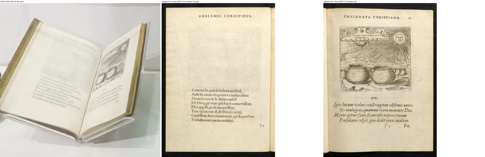
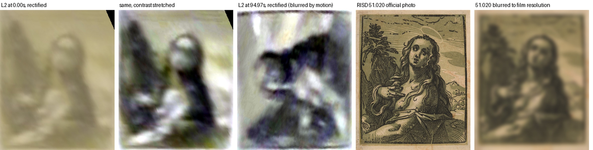
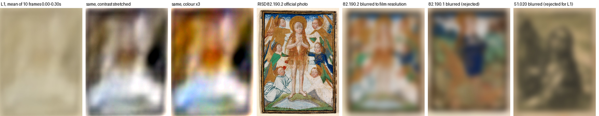

# Sources for the three unmatched paper objects

Worker research, 2026-10-01. Collection connected rooms only. No paid calls, no logins, no GPU, no source edits. Cost: 0 USD.

## Answer

| Object | Result | Status |
| --- | --- | --- |
| **R12**, emblem book, Renaissance case A | RISD **2023.17**, Georgette de Montenay and Pierre Woeiriot, *One Hundred Christian Emblems (Emblematum Christianorum Centuria)*, 1584. Open at emblem 15. | **Confirmed** by the case label and the catalogue. Edition and opening confirmed against a library facsimile. |
| **L2**, larger work, medieval low case | RISD **51.020**, Hendrick Goltzius, *Mary Magdalene*, chiaroscuro woodcut, 14 x 11.4 cm | **Probable.** Layout and tone match; the film is too blurred to call it confirmed. |
| **L1**, small work, medieval low case | RISD **82.190.2**, Flemish, *The Penitent Magdalene in Glory*, ink and tempera on vellum, 6.8 x 5.2 cm | **Probable.** Colour layout matches in a ten-frame average; no single frame resolves it. |

My earlier "unmatched" for R12 was a search error: I had filtered the API to records with images, and 2023.17 has no photograph. L1 and L2 remain identity-unaccepted until the root or the owner looks at the sheets. R18 (enamel plaque) is unchanged and still probable.

## R12: the emblem book

**The museum's copy (specimen identity).**

1. Catalogue record: RISD API id 1597546, accession 2023.17, type Books, "One Hundred Christian Emblems (Emblematum Christianorum Centuria)", 1584, letterpress and engraving, 197 x 147 mm (197 x 147 mm), credit "Museum purchase: gift of Ambassador J. W. Middendorf II and Esther Mauran Acquisitions Fund", `onView` true. Source: `https://risdmuseum.org/api/v1/collection?search_api_fulltext=Montenay&items_per_page=25`, saved as `api/any-montenay.json`, sha256 `af5ac6d706b87e2d1d39c0987737ddbfdff5c3452efd468f72c8d794bb0c3cc5`.
2. Catalogue page: https://risdmuseum.org/art-design/collection/one-hundred-christian-emblems-emblematum-christianorum-centuria-202317 (saved `photos/one-hundred-christian-emblems-emblematum-christianorum-centuria-202317.html.gz`). It has **no photograph**. It gives the exhibition history "European Galleries Sep 02, 2017" and the label copy that begins "This is an emblem book, a literary genre popular in Europe during the 1500s and 1600s."
3. Film: IMG_6383 at 45.70 s (`sheets/R12-case-label.jpg`). The case label reads "… de Montenay, author", "… Woeiriot, engraver", "One Hundred Christian Emblems (Emblematum Christianorum Centuria)", and its text block begins with the same sentence as the catalogue label copy.
4. So the book in case A is the museum's own 2023.17, not a loan. Rights: API `publicDomain` is false; there is no museum image to reuse.

**Which edition (bibliographic identification, not specimen).**

5. The API record carries a pencilled collation: "a-z(4) A-f(4) = 116 / [8], 100, [8] ff. / engr. portrait of author + 100 emblems".
6. Glasgow University's bibliographical description of *Emblematum christianorum centuria / Cent emblemes chrestiennes*, **Zurich, Christoph Froschover, 1584**, gives the same collation: 4to, a-z4 A-F4, 116 leaves, numbered [8] 1-100 [8]; 100 emblems, each an opening with the French verse on the verso and the engraving with Latin verse on the recto; page height 199 mm. It cites entry F.438 in Adams, Rawles and Saunders, *A Bibliography of French Emblem Books* (Droz, 1999-2002). Source: `https://www.emblems.arts.gla.ac.uk/french/bib-desc.php?id=FMOb`, saved `web/glasgow-FMOb-bibdesc.html`, sha256 `d4e334a47799a81cfb74000a071d39c0a5ec29a33633acb98943f920077a43e9`.
7. The date, the title, the collation and the page size (197 mm against 199 mm) all agree, so the edition is the Zurich 1584 one. I did not read F.438 itself, only Glasgow's summary of it.

**Which pages are open.**

8. Film: IMG_6383 at 46.40 s. The left page has an eight-line French verse beginning "Comme les pots…" and ending "…par incredulité"; the right page has an engraving of two round pots under a sun, with verse below.
9. Glasgow transcription of emblem 15, *HOC SERMO VERITATIS EST REPROBIS*: "Comme les pots se sechent au soleil, / Aussi les coeurs des pervers s'endurcissent / … / Tresjustement par incredulité." Leaves f2v and f3r (folios 14v-15r). Source: `https://www.emblems.arts.gla.ac.uk/french/emblem.php?id=FMOb015`, sha256 `a0d683a7f94c9c9ebbf200acc0bd2bab6fca4cc8de7cbbe26cd5d85b447f0a7e`.
10. Glasgow facsimile pages of its own copy, shelfmark SM772: `web/glasgow-sm772_f2v.jpg` (sha256 `4c704cd1fc0dfabe15da98d34a00c57262e35c5305ad33417bab4abcdd335631`) and `web/glasgow-sm772_f3r.jpg` (sha256 `48b99a5c1a8af1c8c14d355a65227a3a6b70288ca8981c147d2857f213754f6e`). Side by side with the film the verse block, the running headline, the engraving and the page layout are the same.
11. The Glasgow copy is a different specimen. It proves the edition and the opening, not anything about the condition or binding of the museum's copy. Glasgow's site states that copyright in its images is the University of Glasgow's and that no image may be reproduced without permission (`web/glasgow-copyright.html`).

Rejected on the way: emblem 76 *CONVERTE OCULOS* (I first misread the folio number; its verse and picture are a man digging a well), emblem 36 (a blind man with a torch), and emblems 84 and 85 (verses begin "Comme la poule" and "Comme d'oiseaux").

## L2: the larger work in the low case

1. Film: IMG_6382 at 0.00 s, where the camera is close and on the far side of the case, and at 94.97 s from the label side. The picture was rectified from its four corners (`make_evidence.py`).
2. What the rectified frame shows: a dark upright mass at the left edge, a head with a pale ring round it at upper centre-right, dark hair falling down the right side, pale flesh at lower centre, all in an olive tone.
3. The official photograph of 51.020 has each of these in the same place: tree at left, haloed head, long hair down the right, bare chest and arm, olive tone blocks.
4. Shape: at 0.00 s the picture measures about 123 px across and 108 px deep. Depth can only be shortened by the viewing angle, so the true picture is at least 0.88 as tall as it is wide. That fits an upright 14 x 11.4 cm print and rules out any landscape print of 0.80.
5. Why only probable: the face, the hand and the monogram are not resolved, and the 94.97 s view is smeared by motion. The match is one of layout and tone.

## L1: the small work in the low case

1. Film: IMG_6382, the first ten native frames (0.00-0.30 s). Any single frame is washed out by glare, so the ten rectified frames were averaged, then contrast and colour were stretched. The boxes used are in `frames/L1-boxes.json`.
2. What the average shows: an orange upright form in the centre, gold-brown masses in the upper half, a dark patch at the right at mid height, white wedges in both lower corners, a pale band along the bottom and a dark border.
3. The official photograph of 82.190.2 has the same layout: the Magdalene covered in long orange hair at the centre, gold-winged angels above, a dark blue angel at the right at mid height, white-robed angels in both lower corners, pale water at the bottom, a dark painted border.
4. Size: at 0.00 s L1 is 51 px wide and L2 is 116 to 130 px wide, with L2 nearer the camera. That ratio of about 2.3 to 2.5 fits 11.4 cm against 5.2 cm (2.2).
5. Why only probable: this is a colour-layout match in an averaged, stretched image. Nothing in it is sharp, and the label is illegible.

**Circumstantial support for both, not proof.** Both catalogue pages say "Now On View", list "European Galleries, Sep 02, 2017", and carry label copy about Mary Magdalene. The Lippo Memmi *Mary Magdalene* panel (21.250) hangs in the same room. The low case has exactly two labels.

## Catalogue data for the matches

| Accession | Catalogue id | Title | Catalogue dimensions | Page | API record | Official photograph | API `publicDomain` |
| --- | --- | --- | --- | --- | --- | --- | --- |
| 2023.17 | 1597546 | One Hundred Christian Emblems (Emblematum Christianorum Centuria) | 197 x 147 mm (197 x 147 mm) | [one-hundred-christian-emblems-emblematum-christianorum-centuria-202317](https://risdmuseum.org/art-design/collection/one-hundred-christian-emblems-emblematum-christianorum-centuria-202317) | `api/any-emblematum.json` `af5ac6d706b8…` | none on the page | `False` |
| 51.020 | 1214091 | Mary Magdalene | Plate/Image: 14 x 11.4 cm (5 1/2 x 4 1/2 inches) | [mary-magdalene-51020](https://risdmuseum.org/art-design/collection/mary-magdalene-51020) | `api/onview-woodcut.json` `8f8d1d846eb1…` | `photos/mary-magdalene-51020-zoom-0.jpg` `d17f39e2f9a5…`, museum flag `public` | `False` |
| 82.190.2 | 1505136 | The Penitent Magdalene in Glory | 6.8 x 5.2 cm (2 11/16 x 2 1/16 inches) | [penitent-magdalene-glory-821902](https://risdmuseum.org/art-design/collection/penitent-magdalene-glory-821902) | `api/onview-vellum.json` `ff5deec27b0f…` | `photos/penitent-magdalene-glory-821902-zoom-0.jpg` `31384ec442c4…`, museum flag `public` | `False` |

Rights, as found and not resolved here: the API flag is false for all three, the museum marks both photographs `public`, and the pages for 51.020 and 82.190.2 state "This object is in the Public Domain and available under a CC0 1.0 Universal Public Domain Dedication". The page for 2023.17 has no such sentence.

## Rejected candidates

| For | Candidate | Compared by | Why rejected |
| --- | --- | --- | --- |
| L1 | 82.190.1, *St. Margaret and the Dragon*, vellum, 6.7 x 5.1 cm | photograph, `sheets/L1-vs-miniatures.jpg` | Its centre is a dark blue figure over a green and orange dragon. The film shows an orange centre over white. Its page lists only a 2013 rotation. |
| L1 | 51.020 as the small work | photograph | Olive monochrome; the film shows orange, white and blue. |
| L2 | 84.198.1032, after Bruegel, *River Landscape with Mercury Abducting Psyche*, 27.6 x 34.6 cm | photograph, `sheets/L2-rejected-bruegel-84.198.1032.jpg`, and shape | A landscape print cannot produce the shape in point 4 above. Its own label copy says it hangs between two paintings. |
| L2 | 47.025B, Wolgemut, hand-coloured woodcut, 25.1 x 17.5 cm | photograph | Brightly coloured, many small figures; the film shows one olive figure. |
| L2 | 53.343, Rubens, *St. Catherine*, 29.1 x 19.8 cm | catalogue text only | Dated 1615-1621 and twice the height the size ratio allows. No photograph was compared. |

The two matches and the four other works above are every pre-1650 print, drawing or vellum work the API returned as on view for the terms searched (vellum, parchment, manuscript, engraving, etching, woodcut, drypoint, niello, and the names Schongauer, Dürer and Meckenem). A work catalogued under some other term would have been missed.

## Source frames

IMG_6382.MOV sha256 `415467db2d2216363fbccb41801851180f48bbdb3304c95861f90f3f5767020e`; IMG_6383.MOV sha256 `8cfd089e769000369419f577f28a1bfc68b09f8cc7cda4cbe93d840194e6eeef`. Decoded on the CPU; commands are in `frames/manifest.json`.

| Video | Seconds | Decoded PNG sha256 | Kept copy |
| --- | --- | --- | --- |
| IMG_6382.MOV | 0.00 | `3bb73b53a2715ad634c07786906f61f03344de98dbf5ee81cd435ac023a5c77d` | `frames/IMG_6382-start-0001.jpg` |
| IMG_6382.MOV | 0.03 | `6a896a23258ae0b4ccd071ae07d7e5c91fb5c121accd16df3d5a10c179253764` | `frames/IMG_6382-start-0002.jpg` |
| IMG_6382.MOV | 0.07 | `42d54ffc24873f5574d5eae2a9246a20dd99379f96e5fbe89cca506a3abb485d` | `frames/IMG_6382-start-0003.jpg` |
| IMG_6382.MOV | 0.10 | `b17fd547492af4245ecda53154bd9e86f6fd9e4bbaa34adeffa8fb82200378ab` | `frames/IMG_6382-start-0004.jpg` |
| IMG_6382.MOV | 0.13 | `221bab567c987231b19a3aa6edfc59bf89687a427da69660b6ecc001d8a682de` | `frames/IMG_6382-start-0005.jpg` |
| IMG_6382.MOV | 0.17 | `ae2c77c785c5faa4ab5361a2fa342802b6f858cf8cf1fab4e100f0e3d858fe79` | `frames/IMG_6382-start-0006.jpg` |
| IMG_6382.MOV | 0.20 | `37f88deeee3ad026ae308759e2e6d05749387ef6ce9305f5fd7d081c469de707` | `frames/IMG_6382-start-0007.jpg` |
| IMG_6382.MOV | 0.23 | `8eff0c1900e2f8d29b59e350463243a9fc7d5221c27c3bea14140abf06cd8000` | `frames/IMG_6382-start-0008.jpg` |
| IMG_6382.MOV | 0.27 | `cfbee5117b04f25c3c2bad4b9d82f4db920ec09edf3ba1eb7a3dbfe3812cf91d` | `frames/IMG_6382-start-0009.jpg` |
| IMG_6382.MOV | 0.30 | `bce0731f3486061012abd38d6e71523977471a8a78c5ebd0b3a922e047e53198` | `frames/IMG_6382-start-0010.jpg` |
| IMG_6382.MOV | 94.97 | `308421c6f48cf8d6e5ea4aa657010e10286fed5e1be689bcf246bb52b08e3496` | `frames/IMG_6382-from93.5-0045.jpg` |
| IMG_6383.MOV | 46.40 | `9a682a36b90622770de26567bb205966c17684b2519da71464066365fa546463` | `frames/IMG_6383-at46.40-0001.jpg` |
| IMG_6383.MOV | 45.70 | `bae73389c4892c9a090775036472b44ac54f289c468cad00877e91f49b211219` | `frames/IMG_6383-at45.70-0001.jpg` |

The root named 0.00, 95.10, 96.94 and 97.70 s. I used 0.00-0.30 s and 94.97 s because they are the closest views; 96.94 and 97.70 s show both works at about 20 and 60 px wide and add nothing.

## Access notes

- 16 free RISD API requests and 6 RISD catalogue pages, through the existing Scrapling interpreter. All returned 200.
- 22 plain fetches from the University of Glasgow emblem site. 1 failed: `https://www.emblems.arts.gla.ac.uk/french/description.php?id=FMOb` returned 404 because I guessed the address; the right page is `bib-desc.php`.
- Not used: Gallica or BnF (the Glasgow facsimile was enough), the museum's Vimeo or Instagram, any login, any paid scraper.
- The earlier Renaissance and medieval evidence folders were read and not changed.

## Smallest next assets for the root

1. **L2 proxy:** swap the 97.70 s film crop for the official 51.020 photograph on a flat sheet 11.4 cm wide by 14 cm high, upright, with `identity: probable`.
2. **L1 proxy:** the official 82.190.2 photograph on a flat sheet 5.2 cm wide by 6.8 cm high, upright, with `identity: probable`.
3. Both lie flat on cream mounts facing the label side. Mount sizes are not catalogued or measured: L1's mount is about five picture-widths across, L2's about two.
4. **R12:** an open book, 19.7 x 14.7 cm when closed (catalogue), on a clear cradle, open at folios 14v-15r. The museum has no photograph of it, so the page texture has to come from the film crop or from a reference the owner chooses.
5. The ten owner films stay the authority for layout. None of this is measured.

Rebuild: `fetch_api.py`, `fetch_photos.py`, `fetch_web.py`, `make_evidence.py`, `write_sources.py`. File hashes: `SHA256.json`.
