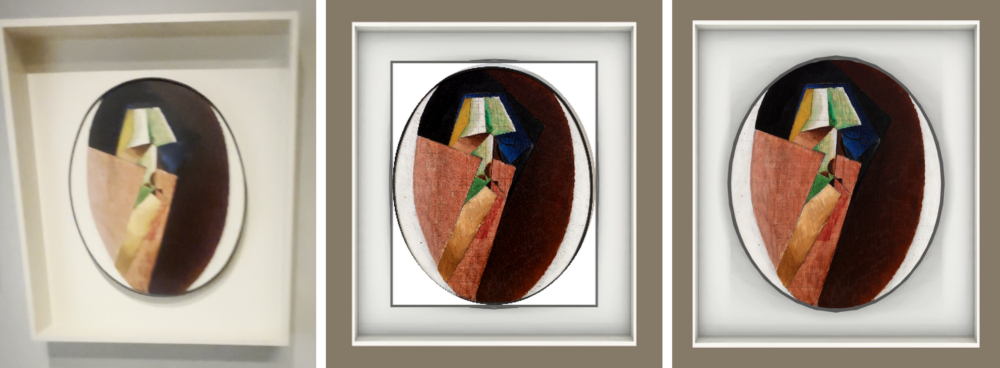

# Villon 70.058: oval frame without the rectangular border

Worker report for task `task_df7b41854ad8`, 2026-10-01. Collection prototype only (#182/#183). Nothing was generated, charged, baked, rendered on a GPU, committed or pushed.



Left: the source video still (`inventory-references/villon-frame-video-0.png`). Middle: the v48b native render with the wrong rectangle. Right: the patched assets laid flat on the CPU. **The right panel is a flat composite, not a native render**; it shows shape and pixels, not lighting.

## What was wrong

The v48 code built the Villon like a rectangular framed painting. It took the bounding box of the Muse oval as the "opening", cut a rectangle out of the frame face, and lined that rectangle with dark inner reveals. The oval artwork then sat on a white rectangular canvas behind it. Most of the Muse dark rim fell inside the cut-out and was thrown away.

A second fault sat under it: the crop of the official photograph was off-centre, so the oval took in part of the photographed black rim and backing at the top and right.

## What the patch does

1. **Room code** (`remodel_room.gd`): the box is one unbroken face from the Muse texture (`Painting.build_shaped`, rectangular outline). Nothing is cut out, so no reveals exist. The artwork is a second `build_shaped` slab, a 48-sided oval of the catalogue size, standing 4 mm proud of the backing. Four meshes before, four after, so later `AuthoredSurface` names do not shift.
2. **Box texture** (`prepare_remodel.py`): the Muse oval was drawn narrower (332 x 735 px) than the canvas (46.0 x 54.8 cm). The opening piece is widened to the catalogue aspect, and the Muse rim with its soft shadow is re-laid along the wider oval at its native thickness. Every texel comes from the Muse trial; nothing is drawn by hand.
3. **Artwork crop** (`prepare_remodel.py`): the crop changes from `(50,12,1280,1477)` to `(67,58,1242,1458)`, a catalogue-aspect ellipse that stays inside the photographed rim at every probed angle. Pixels inside the oval are the official ones, unresampled.

Other frames are untouched: against an unpatched run, only the Villon assets, `remodel_room.gd` and the manifest differ.

## The check

```bash
/usr/bin/python3 docs/evidence/collection-reconstruction/opus-villon-frame-20261001/check_villon_frame.py OUTPUT
```

`OUTPUT` is a project written by `prepare_remodel.py`. CPU only, about 4 seconds. It runs Godot headless (no renderer) to build the real room scene and read back the Villon meshes, importing `OUTPUT` first if needed (this writes `OUTPUT/.godot`).

| Run | Result | Log |
| --- | --- | --- |
| Patched project | 21 of 21 pass, `VILLON_FRAME_OK`, exit 0 | `check-patched.log` |
| Unpatched v48 base (byte-identical Villon assets to `lowpoly-room-v48b-modern-frames`) | 9 of 21 fail, exit 1 | `check-v48-base.log` |

What it proves on the patched project:

- **Pixels kept**: 0 of 1,292,020 pixels inside the oval differ from the official JPEG, which is byte-identical to the hashed catalogue source. The 48-sided oval the room draws shows only those pixels (99.71% of the ellipse). Aspect error against the catalogue canvas is -0.016%, so the artwork is not stretched.
- **Oval mask and rim**: the dark rim is one closed ring with one hole, 9 to 12 px wide all round (6.7 to 8.9 mm). In v48 it pinched to 2 px. The photographed rim starts 1 to 25 px outside the oval at 568 probed angles.
- **No rectangular border**: the box face is 2 triangles covering the whole frame area with nothing cut out. All 104 side triangles lie on the box outer edge (8) or the oval edge (96); 0 lie anywhere else. No vertex sits on the old canvas corners. v48 had 8 reveal triangles and 48 such vertices.

Repository checks: `git diff --check` is clean. `scripts/check.sh` prints `checks passed` once this fresh worktree has been imported (`godot --headless --import`); before the import it fails on un-imported Sketchbook and tab-strip images, which this patch does not touch.

## Not verified, and known limits

1. **No native render.** Lighting, texture filtering at the oval edge, the 4 mm separation at walking distance, and the shade of the box sides and oval edge are unseen. The coordinator's visual QA decides these.
2. **The box is now a flat 5 cm slab.** The recess and inner walls are painted in the Muse texture, not modelled; v48 had a 9 cm frame face. The real box is deep. Modelling it needs white inner walls, which `build_framed` cannot give (it shades reveals to 45%).
3. **The rim is a re-lay, not a Muse re-render.** It is Muse pixels moved by a bilinear resample. A Muse pass at the corrected geometry is still owed if fidelity matters; none was run.
4. **The crop is an inference.** The real canvas is slightly fuller than an ellipse, so the inscribed ellipse drops up to 25 px (about 10 mm) of canvas edge at the diagonals, 11 px at the median. No pixel is altered. Treating 46.0 x 54.8 cm as the canvas inside the rim is also an inference; the photographed outer rim has the same aspect. `oval_crop_alignment_accepted` stays `false`.
5. **The backing looks too narrow against the source.** The 8.5 cm margins come from `modern-frames-source-fit.json`, which I did not change. In the video still the box is roughly 1.7 times the oval's width; here it is 1.37. The same squeeze compresses the Muse box walls about 3.5 times sideways.
6. **A faint pink fringe** on the box's outer edge is chroma-key residue already present in v48.
7. **The bake must be redone.** A stale `room.lmbake` would swap the old Villon meshes back in.

## Hashes

HEAD in both checkouts: `12defc0446d5fa1bd4c50e9c598decfef7a7130d`. The base is the coordinator's uncommitted v48 files, copied at the start and re-verified unchanged after the work.

| File | sha256 |
| --- | --- |
| Base `prepare_remodel.py` | `b3d703b043ca25fed05d47d3c12cbbe4ed0e425e87ff5c7c389cf6ed5c4edbe1` |
| Base `remodel_room.gd` | `c52e6d912515c7b1a7097fcca80721244c6c94e2b382669fe3227a30f6eae6d8` |
| Base `modern-frames-source-fit.json` (unchanged) | `ae9ccb6f7b49689fab575ddc692c47ee9b0a58b5575458dad9f6a9401bf154e9` |
| `villon-frame.patch` | `7359c982ca94e6b19f7ad1b5131c53ce0e45f54c764cd76a199732d6f6d5b31d` |
| Patched `prepare_remodel.py` | `ccece665ff81f5c5ae950c02d266b7d95376cd54c2441a685c039528e17840ef` |
| Patched `remodel_room.gd` | `fca0ba47d2b3037696ff27e90aa80ce8a0416ab3a03597fb6d815da448c3d472` |
| `check_villon_frame.py` | `35b6b89e55d7b80ea59707ef2f3d7f4d9c01d5cb78241982948b9be3b0f1df37` |
| Muse trial `villon-frame-original.webp` (input, $0.01 already recorded, not re-run) | `bf97aec0c0ab01c74a307966c69fbef7b450bbd694ad862f266ddeb99dece9ae` |
| Official `villon-head-woman-zoom-0.jpg` (input) | `b272d80d04182e6d67ef36ae8ba6a229cd9f8e7330bab0c9a0e116621fe62509` |
| Output `assets/villon-frame.png` | `ce157fceb24b66f6e87b568641cbefcbddb5d28a08f4d5229a382de7b9409897` |
| Output `assets/painting-70.058.png` | `44c7b4e74b06d162d73d3802c845997a89b7a3b61b0821d8457a20ebf7258eed` |

## Applying it

```bash
cd /home/reidsurmeier/orca/workspaces/risd-godot/collection-reconstruction
git apply --check <this folder>/villon-frame.patch && git apply <this folder>/villon-frame.patch
```

The patch was applied to a clean copy of the base and reproduced the patched files byte for byte. It touches only `prepare_remodel.py` and `remodel_room.gd`.

How the evidence projects were made, without writing to the coordinator's checkout: a scratch tree held my two patched scripts and symlinks to the coordinator's `image-work/`, `gallery_walk4/` and other prototype scripts, and `prepare_remodel.py` was run from there into a scratch `OUTPUT` (about 10 seconds, CPU).

Files copied into this checkout for context only: the three dirty base files above, `trial/villon-frame-original.webp`, `inventory-references/villon-frame-video-0.png` and `villon-frame-review.json`.

Spend: none.
