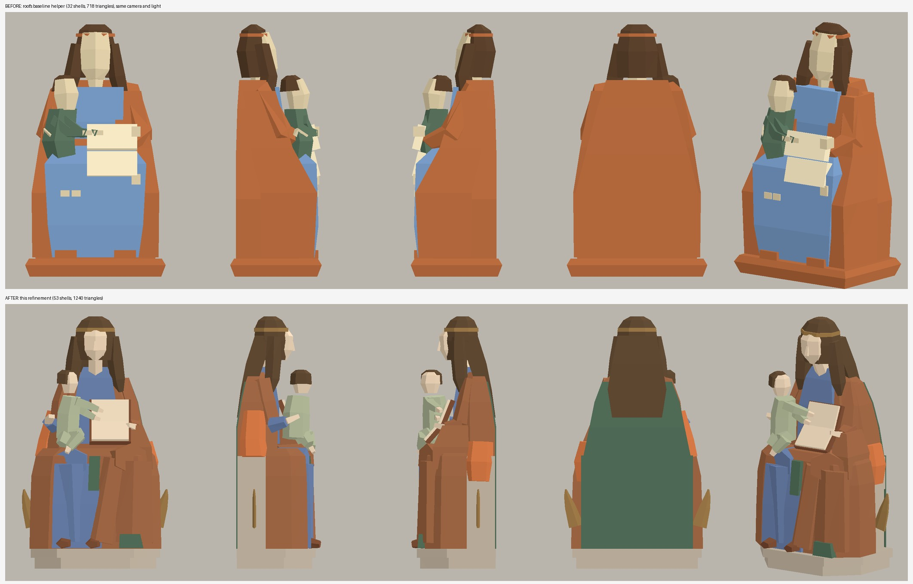
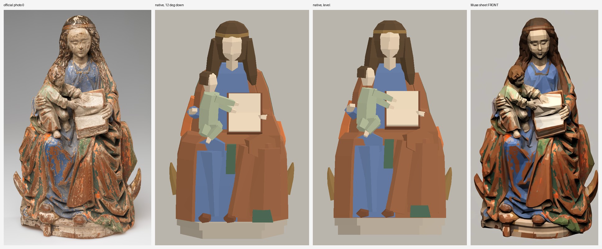
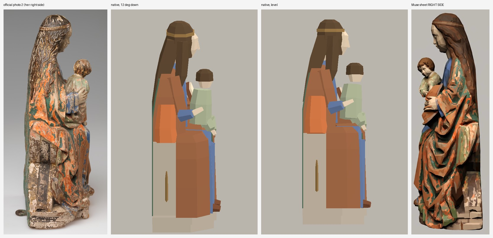
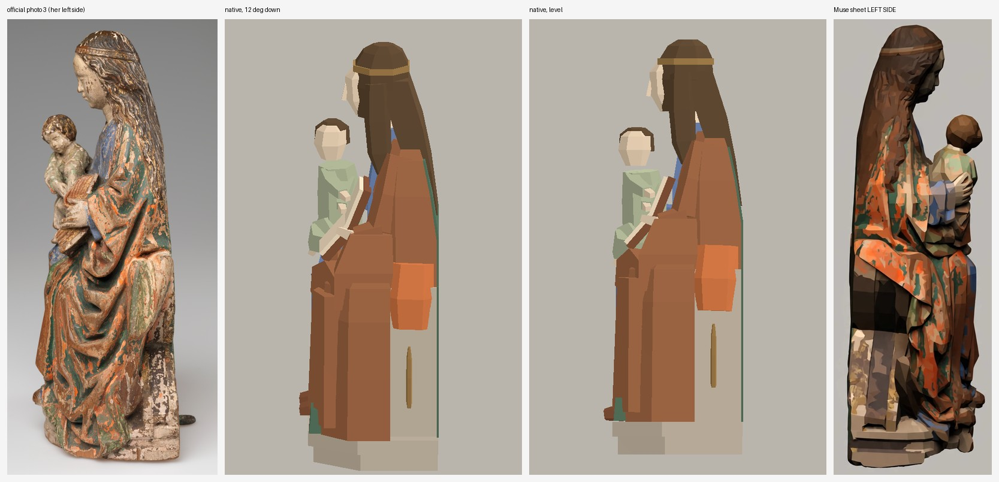
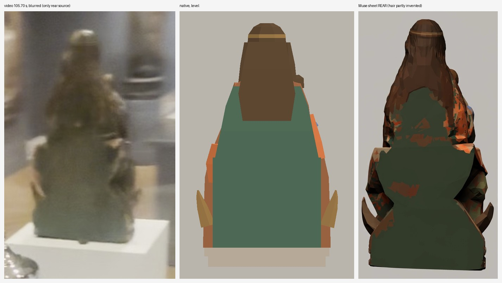
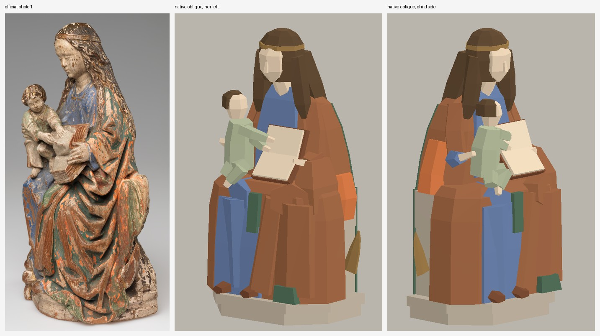

# Virgin and Child 15.108: review and refinement of the low-poly helper

Worker report, 2026-10-01. Collection prototype only, Issues #178 / #181 / #182 / #183.
Changed in my worktree only: one new file, `modules/shell/prototype/collection_reconstruction/virgin_child_asset.gd`, and this folder. Nothing was installed in a room, committed, pushed or written to the root workspace. No paid call, no GPU, no nested worker. Zero new spend.

**Verdict: improved, not accepted.** The figure now reads as a woman sitting on a bench with a child on her right knee and an open book, from the front and from both sides. It is still a block study: the faces are blank, the drapery has no folds and the paint is flat colour. The closed-shell check passes, and that is not a claim about likeness.

## Before and after

Root's baseline helper and this one, same camera and light:



## Against the sources

Each sheet: official photograph, native render from the photograph's height, native level render, Muse sheet.







## My review of root's baseline

- It reads as a standing column. One mantle slab runs from the base to the shoulders with a smooth taper, so there is no lap, no knee and no seat.
- The bench that shows at the back of both official side photographs is missing, and so are the two crescent horns that show at the sides in official photograph 0 and in the Muse sheet.
- Mary's head is small on a long neck; the photographs show a head about 6.9 cm wide with hair and a face about 4 cm wide.
- The base, mantle and circlet share one orange-brown; the child wears dark green where the photographs show a pale green tunic.
- Depth is 14.3 cm. The two official side photographs give about 12 cm from the back to the knees.

## What I changed

The helper keeps root's shape: `parts()` returns closed shells per material, `build()` returns one node, and it reuses `seated_woman_asset.gd`'s `shell`, `slab`, `limb`, `box`, `mesh` and `flat`. One six-line local function was added, `prism`, for a flat-backed block with canted front corners. 53 shells, 1,240 triangles (baseline 32 and 718).

| Part | Now | Read from |
| --- | --- | --- |
| Profile | Flat back, bench block behind, lap at 19 cm, knees forward, drapery dropping straight to the base | Photographs 2 and 3 |
| Upper body | Sloping shoulders, mantle hanging from her left forearm onto her thigh, blue bodice between the mantle edges, back leaning forward about 1 cm at the shoulders | Photographs 0, 2, 3 |
| Head | Larger, bowed forward of the back plane, faceted face with a nose ridge, circlet as its own band, hair over the shoulders and down the back to about 24 cm | Photographs 0, 2, 3 |
| Legs | Blue right thigh, knee and shin; mantle crossing from her left knee toward her right foot; two green lining patches; two shoes | Photograph 0 |
| Child | Sideways on her right knee, turned to the book, both arms over the page, bent leg, bare foot, pale green tunic | Photographs 0, 2 |
| Book | Two halves on a brown cover, spine across, leaning from her chest onto her left thigh | Photographs 0, 3 |
| Base and bench | Two-step base with a canted front; two-block bench; both in a stone colour | Photographs 0, 2, 3 |
| Crescent horns | Thin plates at each side, tips at 12.4 cm | Photograph 0, Muse sheet |
| Back | One flat green plane with the hair over it | **Inferred**: green back edge in photograph 2, the blurred 105.70 s frame |

Colours are medians of hue-selected pixels in official photographs 0, 2 and 3. **No Muse pixel is used.** The Muse sheet was a reading aid only, for the horns, the flat back and how far the hair falls; its rear hair detail was not copied.

## Check

```bash
godot --headless --editor --import --path <copy of this folder>
env LIBGL_ALWAYS_SOFTWARE=1 GALLIUM_DRIVER=llvmpipe DISPLAY=:99 godot --path <copy of this folder> --rendering-method gl_compatibility --script check.gd
```

Run it in a disposable copy; it writes the nine PNGs and `checks.json` beside itself. The two helper files in this folder are byte-identical to the module files.

| Check | Result |
| --- | --- |
| Every shell closed: each edge used once in each direction | Passed, 53 shells |
| No degenerate triangle; every shell outward-facing with positive volume | Passed, 1,240 triangles |
| Base at 0, crown at 0.394 m | Passed |
| Helper carries `visual_fidelity_accepted`, `rear_fidelity_accepted`, `placement_accepted`, all false | Passed |
| Negative control: one triangle removed from the base shell | Exit 1, "open, doubled or inconsistently wound edge" |
| Root's baseline through the same check | Its 32 shells pass the topology and height rules; exit 1 only because it has no `visual_fidelity_accepted` flag |
| Script parses; `scripts/check.sh`; `git diff --check` | Passed; "checks passed"; clean |

My first run of the new helper failed this check with two broken shells (a type error in `prism`); that log is kept in `trials/`.

## Measured deviations

`silhouette-vs-official.txt` compares the outline of the native renders with the outline of the official photographs, per 2 cm of height. The photographs are perspective views from slightly above with a cast shadow, so differences under about 0.7 cm are noise.

- **Front, photograph 0:** within 1.0 cm at every height except the bottom edge of the base (1.6 cm, where the photograph's perspective rounds it).
- **Her right side, photograph 2:** back within 0.5 cm except where the photograph shows the hook at the base; front within 0.9 cm except at the toes (1.6 cm short, the photograph includes a shadow there) and the base (1.2 cm).
- **Her left side, photograph 3:** front within 1.2 cm; the back of the head is 1.2 to 1.8 cm behind this photograph but within 0.4 cm of photograph 2. The two photographs disagree with each other there; I did not chase either.

## Dimension assumptions

| | Value | Basis |
| --- | --- | --- |
| Height | 0.394 m | Catalogue, exact |
| Width | 0.229 m over the horn tips, 0.206 m body | Photograph 0 outline scaled to the height. Unmeasured |
| Depth | 0.133 m with the toes, about 0.12 m back to knees | Photographs 2 and 3 outlines scaled to the height. Unmeasured |
| Horn depth | Against the bench end | Not seen in any side view. A guess |
| Hair length behind | To about 24 cm | Photograph 2 back edge |

## What is still wrong

- **Faces.** Mary and the child have no eyes or mouth. Mary's face is a faceted shield with a nose ridge.
- **Drapery.** The mantle is blocks. The deep diagonal folds that make the sculpture are not there.
- **Paint.** Flat colour. The worn, mottled orange, brown and green is not attempted. Applying Muse paint would need texture files outside the two paths I own, and I did not want a full-sheet projection again; root's failed projection stands as the record of that.
- **Child.** A doll: no chubby limbs, no curls, hands are stubs.
- **Book.** The thick block of page edges under the lower half is not distinguished from the pages.
- **Hands.** Four-sided stubs, no fingers.
- **Rear.** A flat green plane with a hair block. It is a guess from one blurred frame.
- **Left out on purpose:** the small peg under the front of the base, the hook at the back, surface damage and losses.

## For root

- The helper's interface is unchanged from the baseline, so `check.gd` in root's own evidence folder runs against it. Material names changed: `mantle, orange, lining, blue, tunic, skin, hair, paper, cover, stone, gold`.
- Review it by eye before installing. I have not marked the case, the room or the reconstruction done.
- `trials/` holds each earlier pass with the render or sheet that showed what was wrong with it.

## Files

- `virgin_child_asset.gd`, `seated_woman_asset.gd`, `project.godot`, `check.gd`: the runnable check
- `checks.json`, `native.log`, nine PNG views
- `compare-*.jpg`, `before-after.jpg`, `compare.py`
- `silhouette-vs-official.txt` and `.json`, `silhouette.py`
- `baseline-root-virgin_child_asset.gd`, `baseline-root-check.log`
- `negative-control-open-shell.log`, `parse-check.log`, `repo-check.log`
- `trials/`: passes 1 to 4
- `SHA256.json`: helper, baseline, sources and every file here
