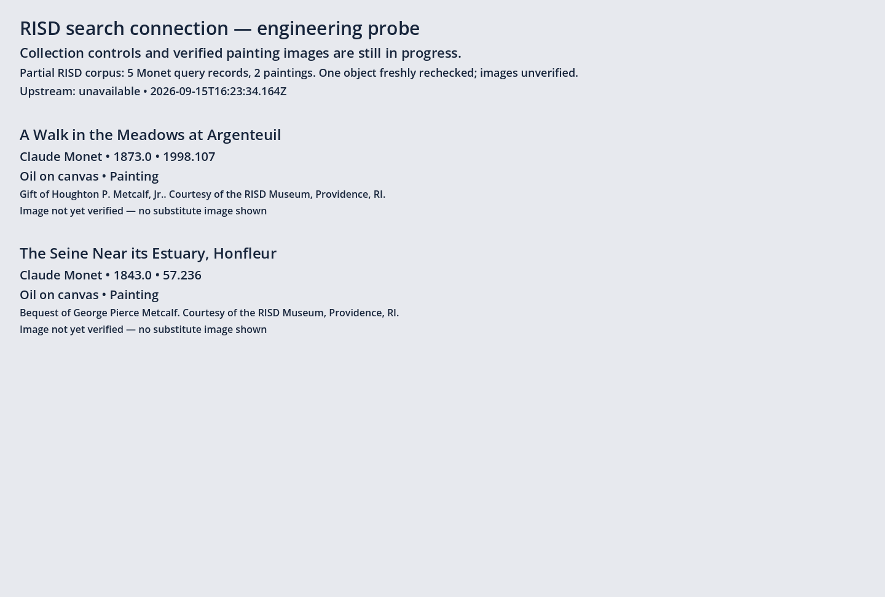
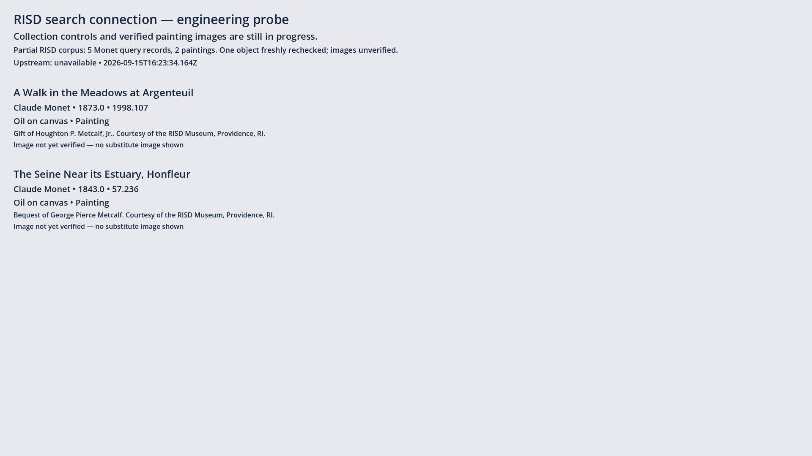

# Search connection checkpoint

Native Godot and a fresh standalone Web probe both query the same real HTTP
adapter and display the two Monet painting metadata records. This is not the
finished Collection UI, and no painting image ingestion is claimed.

The cached corpus contains five official search records, including two paintings;
coverage and upstream-unavailable status are displayed. The first painting was
rechecked through an official object-ID request. Request URL, response hash and
observed time are in source.json. Museum object pages returned 403, so neither
painting has an ingested display image. No substitute sculpture or guessed URL
was used. API publicDomain=null remains unknown.

The browser report records the served PCK hash and verifies it against the local
export, with zero page errors and a same-origin request to game and search route.
The loopback address in this machine evidence is not a user preview URL. The
share tool refused publication with Tailscale 401 (operator/root permission).

Checks: five server acceptance/regression tests; native injected-adapter seam;
malformed synchronous completion regression; real native and browser HTTP probe;
TypeScript strict typecheck; scripts/check.sh; git diff --check.

Independent Standards and Spec reviews found two correctness bugs: a synchronous
null callback hung pending state, and property order affected snapshot hashes.
Both were fixed with runnable regressions. Image-positive fixture and entity
normalization coverage were also added. Full issue acceptance remains open:
two verified images and actual image rendering, expanded transport failure probes,
and final review of complete ingestion. The image-verification gate deliberately
fails this metadata-only checkpoint. Product tenants and CRT are unchanged.
