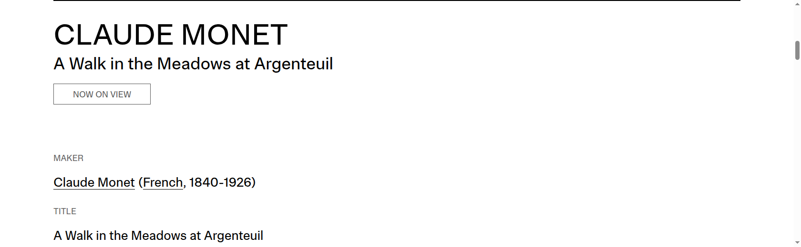
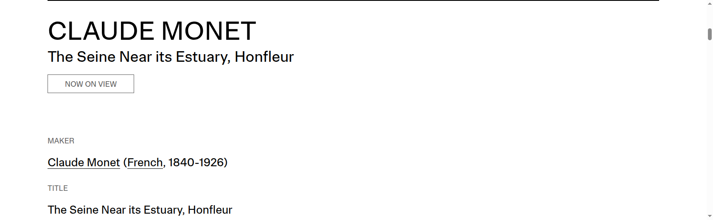
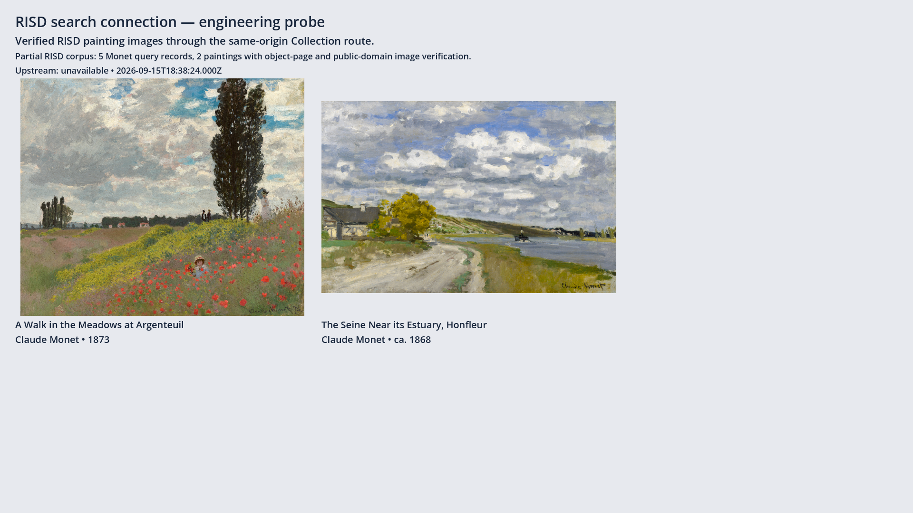
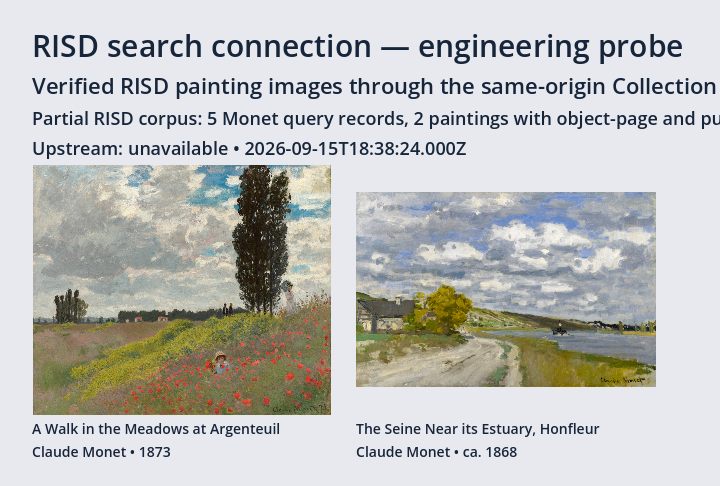

# Verified RISD painting route

Native Godot and a fresh standalone Web probe query the same real HTTP adapter,
fetch image bytes through the same-origin hash route, verify those bytes, decode
the JPEGs and display two Monet paintings. This completes the data-route probe;
the interactive Collection screen is owned by the next ticket.

## Source pages

The browser accessibility snapshots beside these images preserve the object-page
identity, carousel controls and the RISD page's Public Domain / CC0 statement.
`painting-images.json` records each object page, carousel ID, Picturepark URL,
downloaded hash, MIME and dimensions. Artwork rights remain unknown because the
official API says `publicDomain=null`; the public-domain finding applies to each
verified image manifest.

## Rendered result

The corpus is explicitly partial: five official Monet query records, including
two paintings. `source.json` records the fresh official metadata response and the
challenged broader query. The UI labels the cached corpus as upstream unavailable;
a challenge never becomes a successful empty result.

The reports record the two rendered image hashes. The browser report also compares
the served PCK hash with the local export and records zero page errors. The loopback
address in machine evidence is not a user preview URL.

Checks: five server acceptance/regression tests; native injected-adapter seam;
malformed synchronous completion regression; real native and browser HTTP probes;
two browser window sizes; `scripts/check.sh`; `git diff --check`; exact-candidate
Standards and Spec review. No substitute sculpture or guessed image URL is used.
