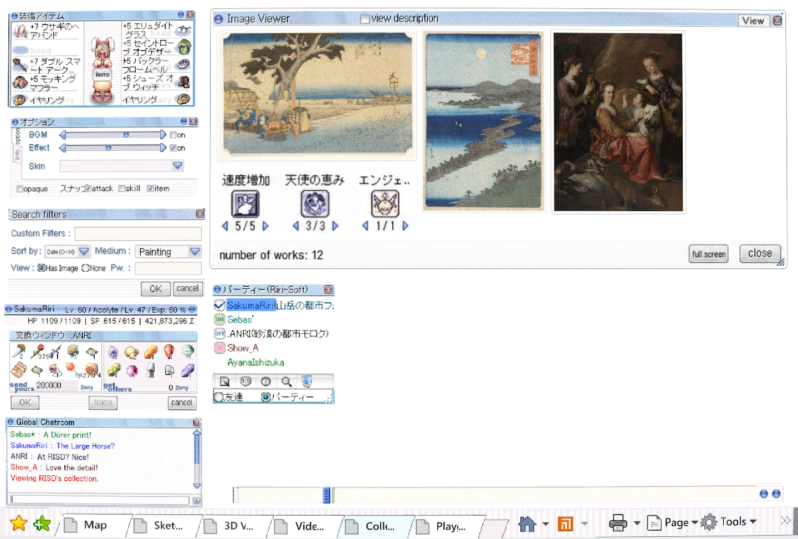
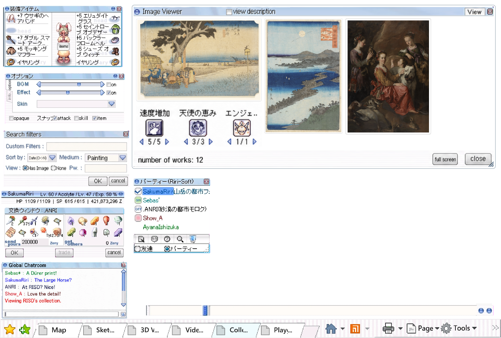
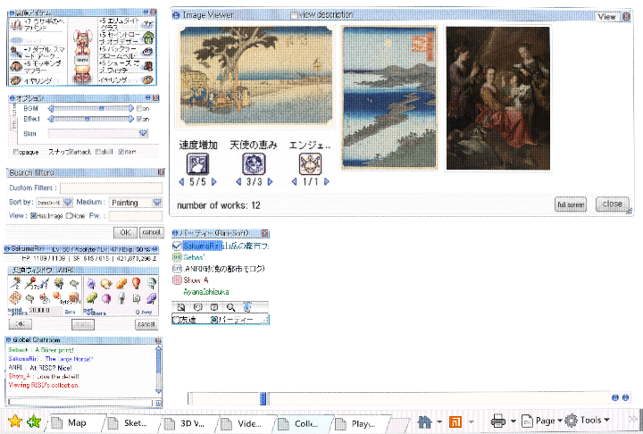
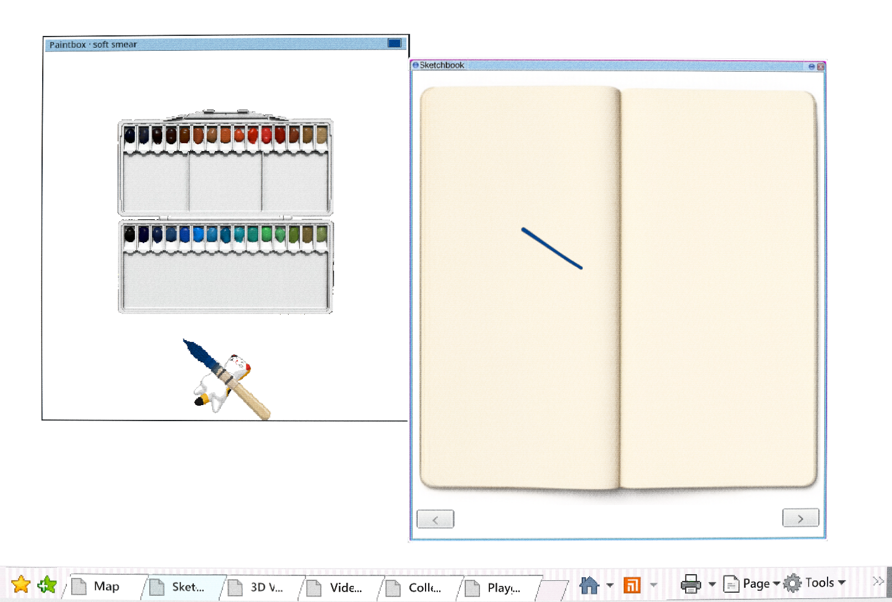

# Refined CRT across the Collection Browser — #64

The supplied Flight Simulator CRT reference guides fine neutral phosphor lines, soft detail and subtle static grain. This owner-requested display treatment leaves source images untouched. The final preset is a 30% neutral grille, .03-pixel colour separation, .20 grain strength and .018 curvature. Whites remain white, with no vignette, monitor casing or black surround. F8 toggles without recreating pages; crt=0 bypasses the effect.

The Shell demo presents its original content in a SubViewport and maps pointer positions through the same curve. A minimum-sized logical desktop scales uniformly to the browser, so the entire page and bottom bar remain reachable at smaller sizes. Entry/exit notifications preserve the tenants' hover behavior. All existing module interfaces, error types and frozen tests remain unchanged.

## Verification

- scripts/check.sh: checks passed (Godot 4.7.2 headless); git diff --check passed. Existing gdlint is not installed; no claim of clearing the separately tracked lint backlog.
- Godot Web import/export succeeded without script/shader errors.
- Focused browser run passed: six tabs, exact 35px window-drag destination within 2px, sketchbook stroke, F8 state preservation, Viewer idle/hover/idle pixels, crt=0 bypass, no console/runtime errors.
- Screenshots inspected at full and small sizes. Pure-white pixel difference is zero. Near-white mean linear luminance differs by 0.0929%. No dark edge bars at 1920x1080, 720x486 or 1200x600; the bottom bar remains clickable at every size.
- Live PCK SHA256 verified: `368b0ca7127cf107529127a73a9bc113e2e42769d6cabacf46fc4194dec2e893`.

Run: `PLAYWRIGHT_MODULE=/path/to/playwright/index.mjs node modules/shell/playtest/crt_browser.mjs URL`. This uses the already installed browser tooling; no dependency or paid generation was added. The preview is a tailnet-only Web export, not a tagged release.

## Review

### Standards

Independent review found missing SubViewport mouse-entry/exit notifications. Fixed with window exit forwarding and a guard against repeated entry; browser hover comparison now passes. No remaining hard standards findings.

### Spec

Independent review found coloured moire and insufficient near-white/pointer checks. Replaced the coloured grille with a neutral grille, lowered colour separation, added the near-white mean check and exact drag destination assertion. Updated screenshots reviewed; no remaining spec blockers. The revised browser run passed.

Source: Harrison Allen, CC0, [CRT with Luminance Preservation](https://godotshaders.com/shader/crt-with-luminance-preservation-no-scanlines/), adapted from the previously accepted painting prototype. No spend.

https://windows-wsl.taile06c45.ts.net/risd-game-crt-01a0a2b7/
