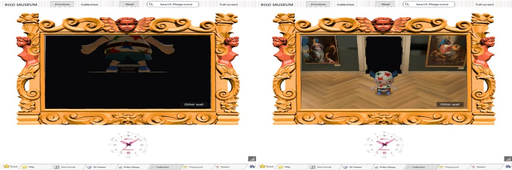
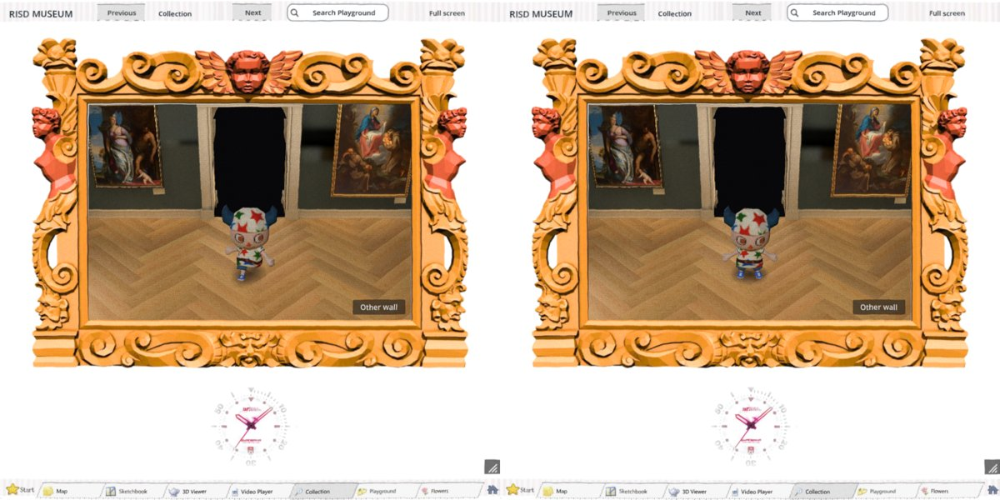

# First draw of the rooms, and the Hall's camera during the stepped build (#281)

Engine, GL Compatibility (`--rendering-driver opengl3`), `--fixed-fps 60`, 8 October 2026, on
the installed rooms of that day (15 areas, no Impressionist rooms yet). No browser run: an
export was out of scope for this work.

## What was measured

The shell is launched and the visitor stands in the Hall until the rooms are built. Then a
clicked route goes through the stone portal into the medieval room, on into the Renaissance
room, and back to the lion stair landing. Every frame over 100 ms from the first click on is
recorded with the stage drawn and the wipe's clock.

| Where | Before, three runs (ms) | After, three runs (ms) |
| --- | --- | --- |
| The wipe begins at the portal (wipe 0.00) | 220, 221, 224 | none over 100 |
| Medieval room first shown (wipe 1.33) | 519, 532, 614 | none over 100 |
| Renaissance room first shown (wipe 1.33) | 393, 332, 389 | none over 100; 126 and 132 once |
| Lion stair landing first shown (wipe 1.33) | 198, 266 | none over 100 |

The cost moves to the wait in the Hall: 15 areas drawn once, one a frame, while the visitor
stands still; five of those frames take 260 to 390 ms. If a doorway is reached first they are
drawn under the wipe's mark. Consecutive frames of the Hall's picture differ by 0.01 to 0.03
of 255 while they are drawn: nothing of them is seen.

One "after" run of three had a run of 110 to 517 ms frames while the wipe was closing in the
Hall; the two before it and the two after it had none, and one "before" run had the same in
the Renaissance room. Other agents were using the machine (load average 10). Read as noise.

## Not cured: one long frame about 107 frames after the rooms are in place

0.9 to 1.5 s, in every run, before and after, with the visitor standing still or walking.
It needs the rooms: with the build held off there is none. Nothing in the scene changes in
that frame (21 objects and 21 draw calls before and after, texture memory the same), no
viewport's measured render time rises (root 1.7 ms, the walk 3.1 ms), and the picture does
not change. The time is spent between the draw's start and its end outside any viewport,
which points at the driver (GL on D3D12 under WSL here). Whether a browser has it is not known.

## The Hall's camera during the stepped build

The room scene makes its own camera the picture's as it enters the tree
(`doorway_walk.gd`, `camera.current = true`). Built in one call it is freed before a frame is
drawn. Built in steps, with the visitor waiting in the Hall, it stayed the picture's camera
for every frame of the build (29 of 29): the Hall black, the visitor huge.

`_begin_rooms` now gives the picture back to the Hall's camera at once.

## Later the same day, on the rebuilt rooms (19 areas, 7,998 nodes)

### Can the build go on while the visitor walks? No.

The stepped build is 62 steps that must run in order: a step cannot be put off while a later
one runs. Each step timed once in the engine (ms), in order:

`831, 159, 402, 128, 29, 27, 160, 20, 25, 139, 149, 116, 17, 185, 43, 188, 54, 40, 222, 83,
328, 91, 176, 309, 64, 429, 289, 99, 650, 269, 143, 76, 311, 355, 54, 1531, 334, 2004, 794, 0,
179, 4, 1, 0, 0, 0, 1, 0, 1, 1, 0, 0, 1, 1, 1, 1, 0, 2304, 14, 1990, 9, 26`

15.9 s in all. Steps of 0.3 s or less add up to 3.3 s; the fourteen longer ones are 12.6 s.
The first step is 0.83 s and the third 0.40 s, so a walking visitor with no frame over 0.3 s
gets none of the build. Even if every short step could be run early, 12.6 s of the 15.9 s
would still be owed at the door: four fifths of the wait. Steps of 12 ms or less add up to
0.05 s. Getting under 5 s at the first doorway needs the long builders themselves cut up
(the baked scene 2.3 s, the surface renaming 2.0 s, the rooms and the sculpture rooms), which
is the room generator's work, not the walk's. `ROOMS_AT_LAUNCH` is left as it was found.

### The rooms built at launch: the first draw goes behind the loading screen

With `ROOMS_AT_LAUNCH` the rooms exist while the loading screen is still up, so every area is
drawn in one draw in the walk's first frame there, where one long frame is not seen
(`_warm_step(true)`). Measured with a stand-in loading screen held for 120 frames, then the
entrance, then the same clicked route. Two runs each, ms:

| Where | Before | After |
| --- | --- | --- |
| Under the loading screen, the frame after the build | 160, 161 | 3172, 3133 |
| The wipe begins at the portal | 219, 279 | none over 100 |
| Medieval room first shown | 1365, 716 | 244, 219 |
| Renaissance room first shown | 337, 336 | none over 100 |
| Lion stair landing first shown | 454, 438 | none over 100 |

The frame about 107 frames after the walk first runs with the rooms is here too, 0.45 to
0.7 s, sixteen frames into the first walk, before and after alike. It is not the stair hall's
reflection probe: with the probe hidden it is still there (504 ms).
