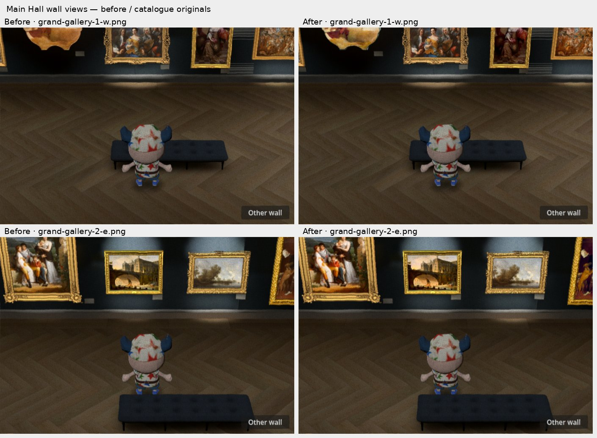
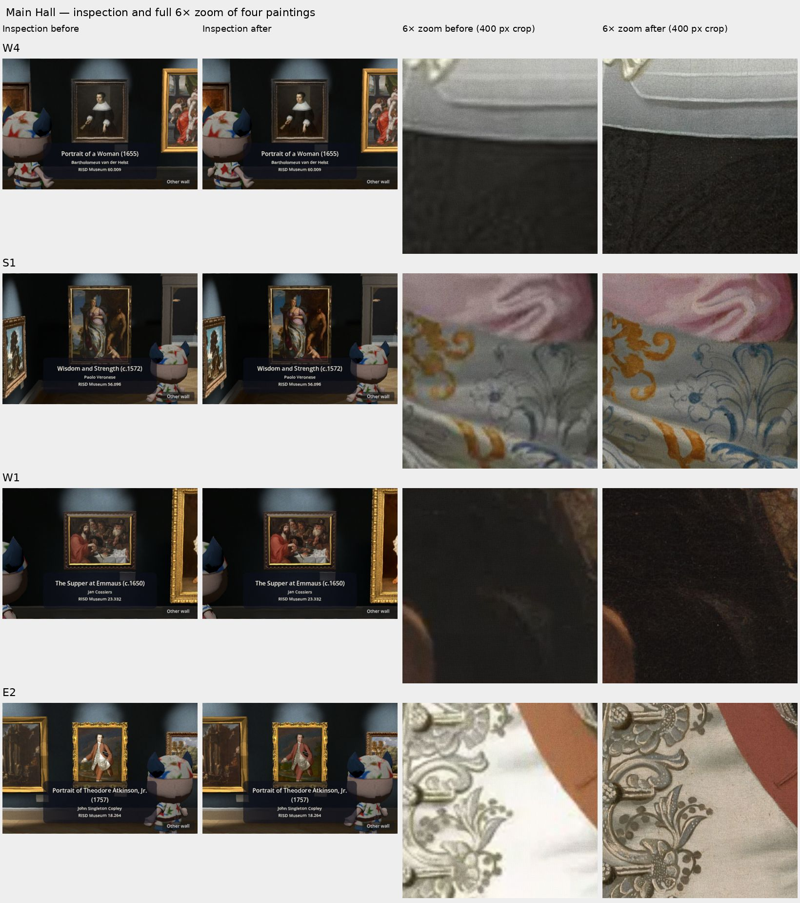
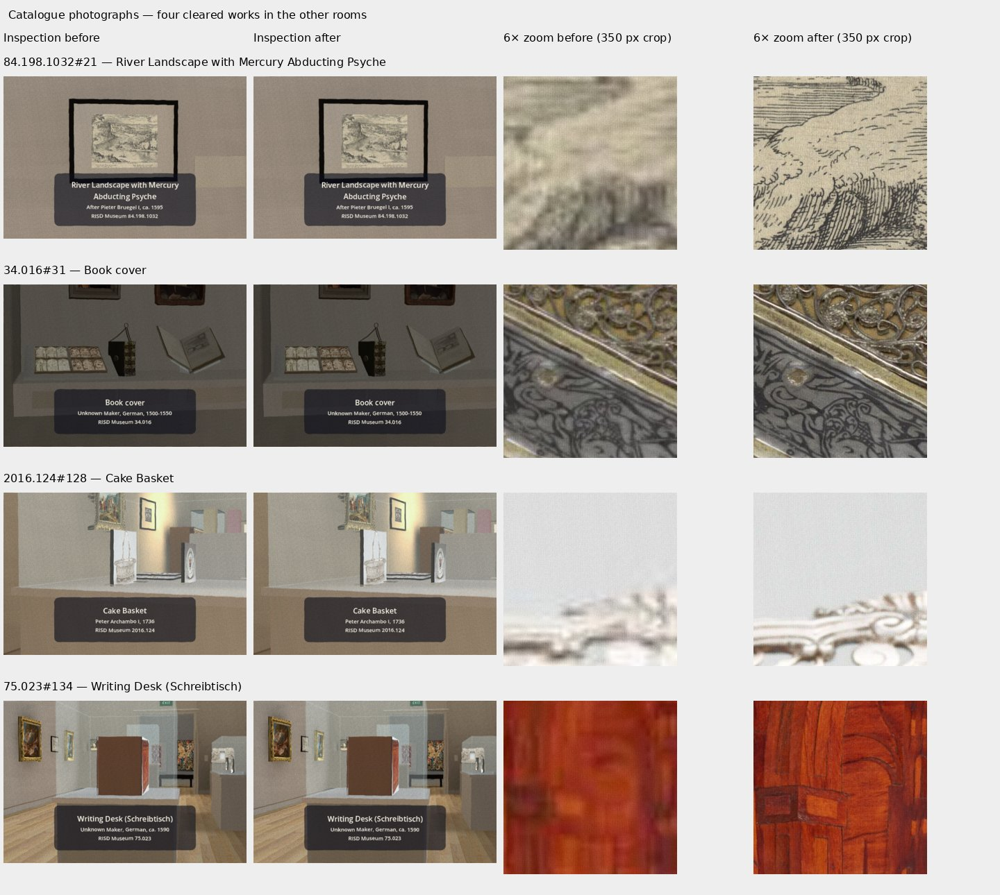
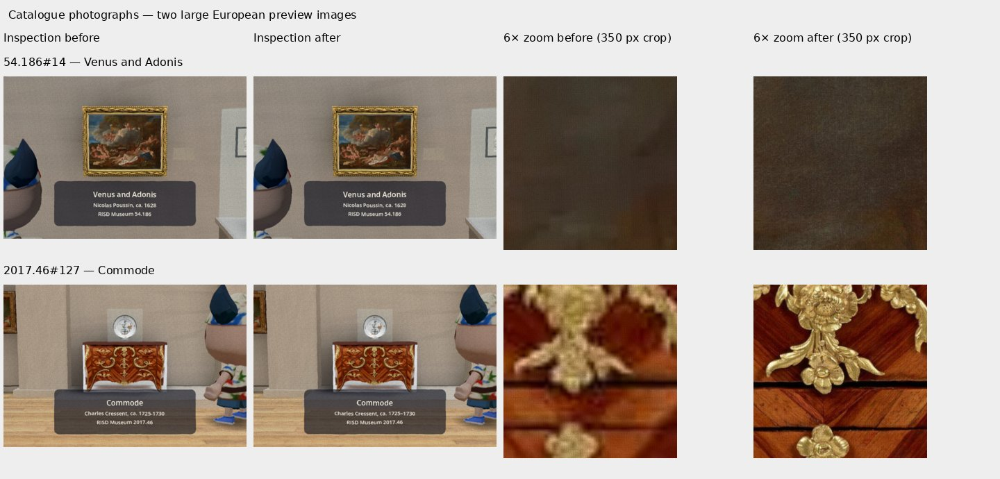
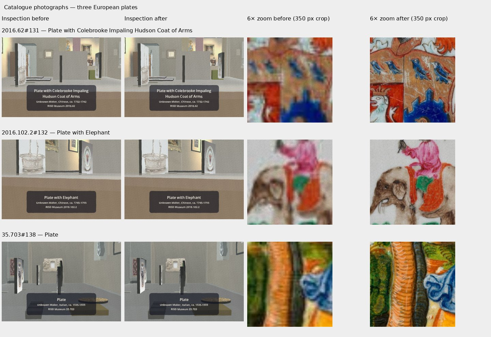
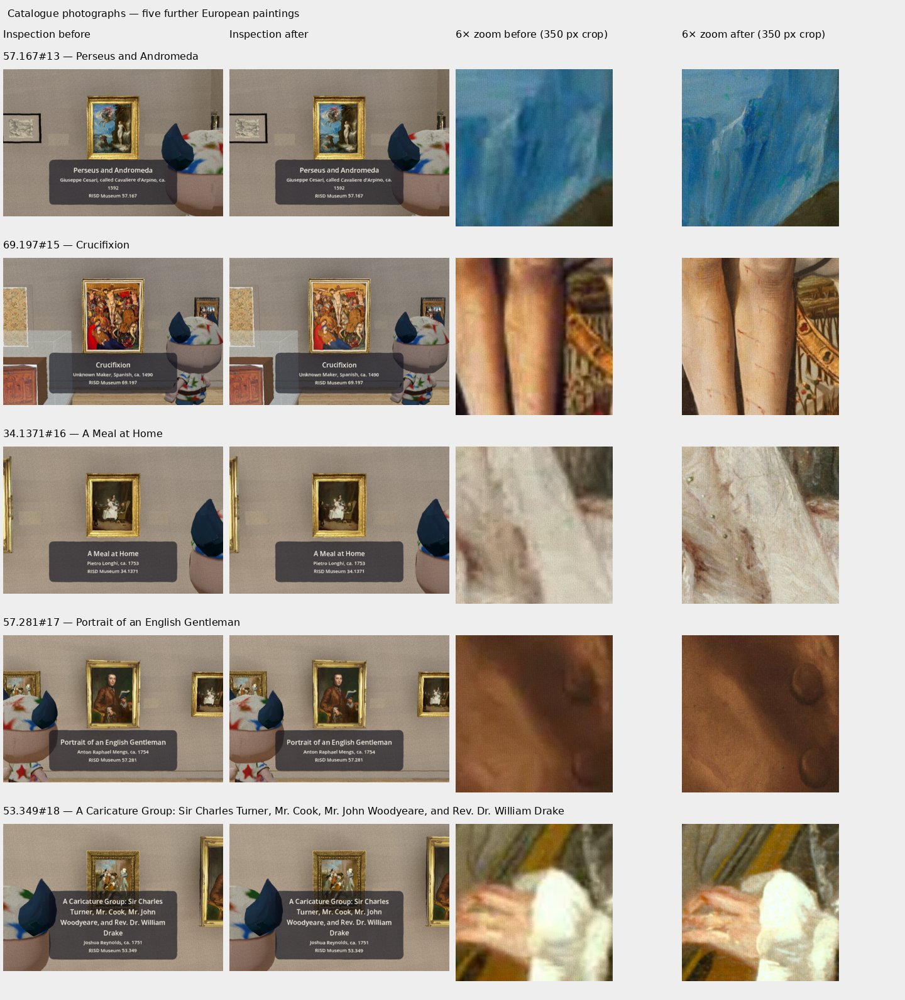
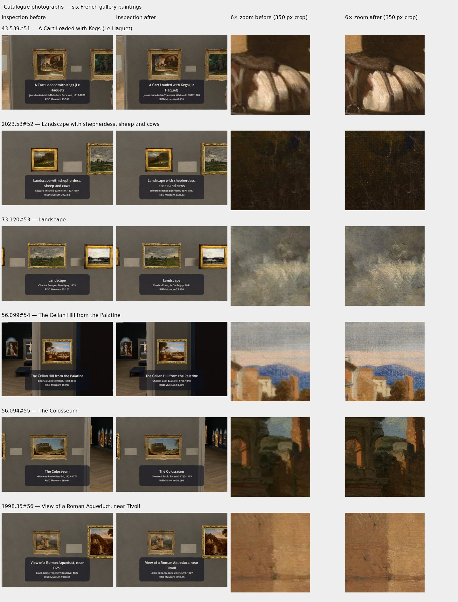

# Original catalogue photographs — #278

VERIFIED: 43 works replaced: Main Hall 23, European gallery 13, grey French gallery 6, Renaissance 1. This covers 26 of the 29 ledger flags; three works awaiting the owner's decision retain the build's prior images and records. Catalogue photographs only, no paid calls, no upscaling; downloaded masters remain outside git at `~/risd-godot-ingestion/catalogue-masters/`. Current replacement URLs, pixels, crops and SHA-256 are in Shell `PROVENANCE.md` and the two work registries.

VERIFIED: mounted Shell 1080×1080, framed 3D renderer 695×465. Hall canvas long sides cover 158–319 native pixels; walls use 256–448 px. French canvases cover 126–211 native pixels, measured separately from frames and blank labels; walls use 192–320 px. Other replaced objects use conservative complete-work extents (157–288 px) because their current inspection views include frames or show cards edge-on: walls 256–384 px. Copies round 1.25× coverage up to 64 px. Packed fitted previews use 896 px (at most 702 px displayed). Full 6× zoom draws 4087–4210 logical pixels; full copies are source-capped 3200–4210 px. TIFF native sizes were checked for Copley and three smaller European originals; Adobe RGB profiles are converted to sRGB. Book-cover rectification retains the original quad; geometry is unchanged.

VERIFIED: all 43 replacement full zoom photographs sit in the ignored `prototype/gallery_walk4/zoom/` directory. The export script copies them to `museum-images/` beside the pack; one is fetched when its page opens, retaining the fitted picture during the request. The private adapter resolves added-room captions by work key. Every packed replacement imports lossy at quality 0.8.

VERIFIED: imported texture delta −1,922,958 bytes (−1.834 MiB); 43 external JPEGs total 65,967,673 bytes. Recorded imported sizes match the current imported files. INFERRED: owner's 239 MiB baseline pack → 237.17 MiB, before small script/record overhead; exact size and Web loading are the orchestrator's export checks. No export or room rebuild was run here.

VERIFIED: the correction's one-time Godot 4.7.2 headless import, `scripts/check.sh` and `git diff --check` pass. `museum images: 43 works, 129 images, 0 failures`. The guard checks required sizes against native originals, hashes, runtime paths, lossy imports and exclusion of external full images from the pack. Earlier negative 64 px wall/zoom probes were rejected and restored. The retained Hall report has 23 objects, 20 views and 0 failures. The correction pass exercised W4, E2, 84.198.1032, 2016.124, 34.016 and 43.539 plus the three restored works: 9 objects, all inspected, zoomed and closed, 0 failures and no script errors. All 27 correction captures were visually inspected; the restored works show the prior build images. Raw correction logs and captures remain in ignored `build/full-size-images-278/clean-verification/`; published measurement reports and comparison sheets omit the held works.

VERIFIED: the clean branch is rebuilt from the current `origin/build/v0.1.0` in one new commit. The build's caption checks and movement changes are retained; only the later image measurements and catalogue zoom lookup are reapplied. The room composition script and the build's corrected caption records remain unchanged. The retained Foulem picture, both existing decal files and their source record match the build byte for byte.

VERIFIED, outside this ticket: ordinary Hall walking shots crop some painting tops; Hall walls are dark; the Writing Desk inspection shows its plain back; several European cards are edge-on and case geometry hides the Queens model. The existing Chihuly fails click selection before replacement. The Charger is nested inside the Commode and excluded from the click registry. Eastlake's existing provisional identification is retained. Pre-existing invalid-resource-UID and exit-leak warnings remain; final playtests contain no script errors. Current build caption corrections, including the Saldanha Platter, are preserved.

Next, in order: orchestrator export/Web verification (including all 43 beside-pack images); the owner's decision on the held photographs; remaining preview/512 px zooms; interaction/modelling for unregistered/untextured works. Room generators, Hall lighting/bakes, interfaces and errors were untouched. No merge or issue closure was run here.
