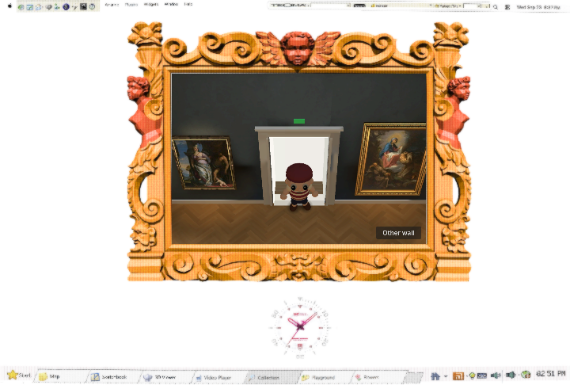
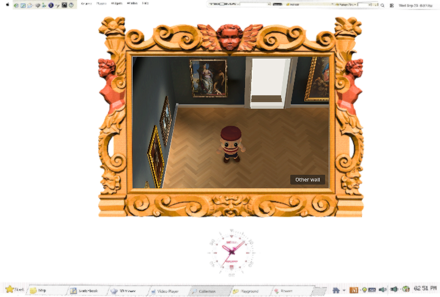
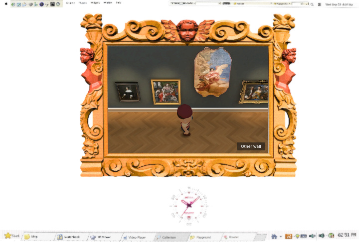
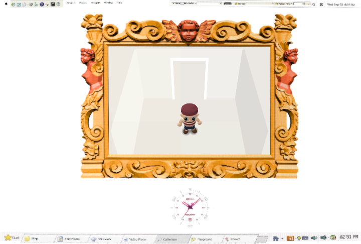
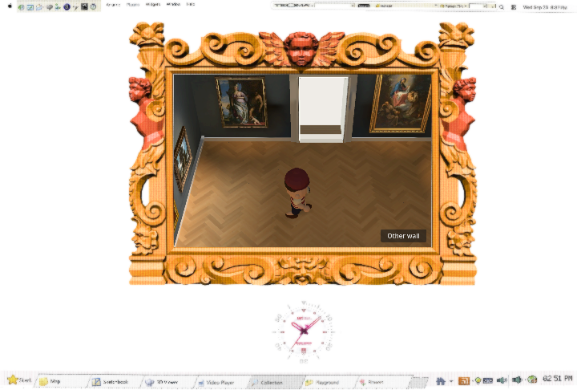
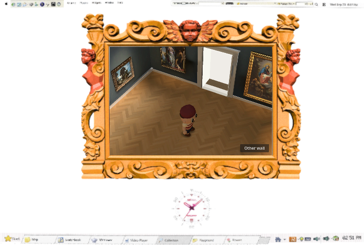
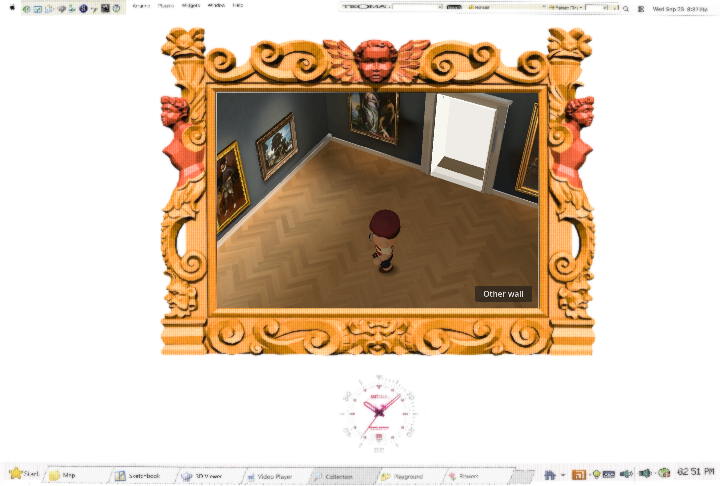
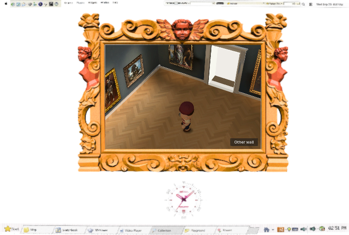

# Planted-sole shadow trial — rejected

The production 42° dollhouse view at `b1fa810` remains unchanged. In isolated candidate `773198d`, the same soft shadow texture and geometry used a stronger planted-sole alpha (0.85→1.0) and lighter broad-body/airborne alphas (0.25→0.10 and 0.22→0.10). No light, shader, generated pixel, animation, camera or room material changed.

| 720×486 actual Web view | Production | Candidate |
| --- | --- | --- |
| Entrance/doorway |  |  |
| Warm gallery |  |  |
| Painting wall |  |  |
| White room |  |  |
| Walking tick 60 |  |  |
| Turning tick 200 |  |  |
| Return walk tick 290 |  |  |

The browser's existing `?render_qa=1` fixture supplied identical positions, camera transforms and visitor pose hashes for every static and replay pair; [browser.json](browser.json) records them. Both exports ran on the D3D12 RTX 4070 SUPER renderer. Existing favicon 404 and GLES3/arrow-cursor warnings appeared in both; no JavaScript page exception was observed. These stills and the native contact-harness stride image show an extremely small change at the displayed 720 size. The candidate does not add visible planted weight or remove a clearly discernible floating blob.

An independent visual reviewer compared all seven pairs and found **no meaningful winner**; both variants already had compact shadows under the shoes. The reviewer initially received paths named `baseline` and `candidate` before the anonymous X/Y packet, so that assessment is **not a fully blind A/B**. It agrees with the direct actual-size inspection. No production integration is recommended.

Validation on the isolated candidate: native `rig/contact_check.gd` reported `SOLE_VISIBILITY_FAILURES 0` at 1152×720 and embedded 588×392, with its displaced-shadow negative control still zero. `rig/check.gd` reported 22 contacts, maximum stance drift `0.0000003934`, penetration `0.0000609704`, and `RIG_FAILURES 0`; `navigation_check.gd` reported `NAV_FAILURES 0`; `scripts/check.sh` and `git diff --check` passed. These prove the candidate did not break grounding/navigation, not that it improved the look. Mac M3 performance was not measured.
