# Cutaway corner diagnosis — retain production

Runtime examined: `105551c`, in isolated branch `Reid-Surmeier/gallery-cutaway-triangle`. No production code, geometry, material, lightmap, probe field, or generated image was changed. The one background-color trial was rejected on still-image evidence before browser/motion benchmarking.

The dark upper-right triangle is **WorldEnvironment background above the finite wall**. It is not a missing mesh triangle or a baked shadow. In the reproducible near-wall pose `(−4.45, 0, −2.56)`, yaw `2.65` radians, changing only the background to magenta changes the entire exposed triangle to magenta. The camera uses the existing 45° dollhouse pitch. This closely reproduces the reported corner; the original browser screenshot had no saved exact pose.

| Existing scene | Background sentinel |
| --- | --- |
| 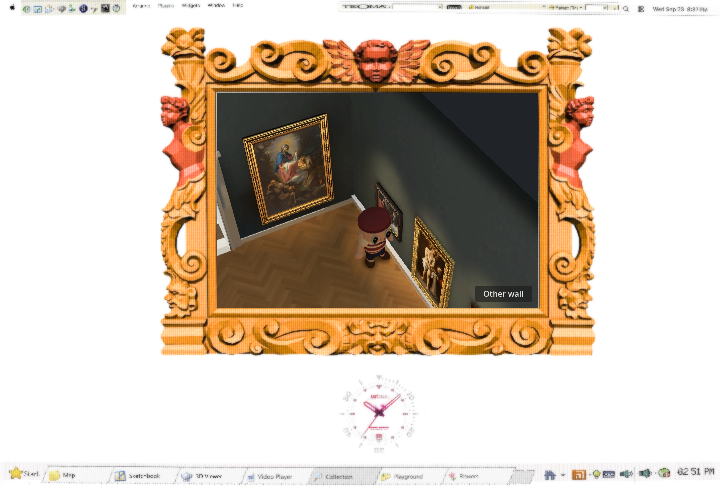 | 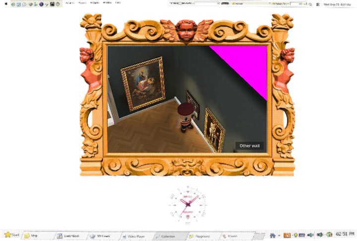 |

The single permitted color trial, `#343935`, came from nearby rendered wall samples (roughly R49–54, G53–58, B49–54), replacing gallery background `#20242a` in the diagnostic only. It reduces blue-black contrast but still reads as an unshaded triangle. At other near-wall angles it exposes a larger gray-green void. Keep the current background; fixing the composition requires a deliberate decision about camera framing and finite room extents.

| Existing background | Rejected background |
| --- | --- |
| 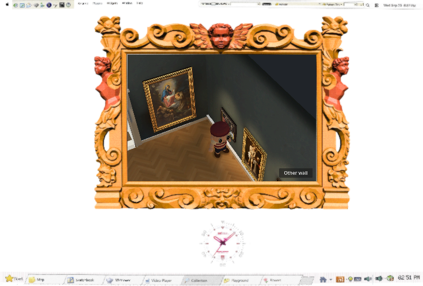 | 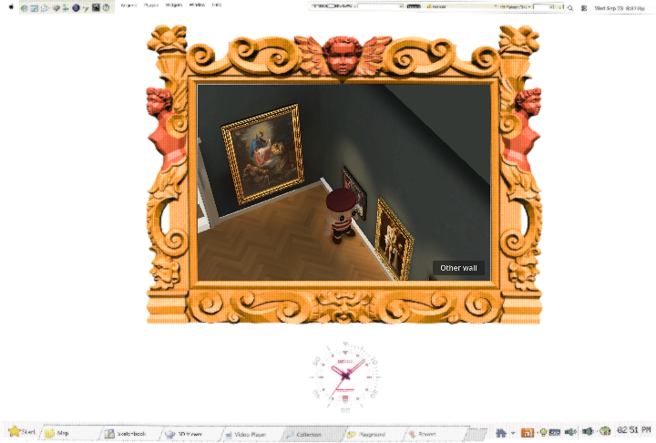 |

## Source trace

All paths below are under `modules/shell/prototype/gallery_walk4/`.

- `walk4.gd:317`, `_build_room()`: creates `WorldEnvironment` with `#20242a`, constructs six-metre long walls, then end walls, cornice and vault. The walls are complete quads; no runtime directional light or shadow is involved.
- `_ready()` calls `_build_room()`, `_build_paintings()`, `_partition_surfaces()`, then `_merge_static()`. `_partition_surfaces()` assigns upper geometry whose bounds center is above `H − 0.6` to layer32; west/east/end groups use2/4/8/16. `_merge_static()` includes layers in the batching key and preserves that layer in the merged mesh.
- `bake/prepare.gd` copies each source mesh's layers to the baked mesh. `_set_lighting()` instantiates `baked/room.tscn` and hides original source meshes. Thus the baked variant retains the same cutaway grouping.
- `_update_camera()` deliberately uses `(31 & ~hidden)` in gallery dollhouse views, excluding all layer32 roof/cornice geometry and the camera-side wall groups. With the visitor close to a remaining wall, the camera sees beyond its top into the environment. Original camera mode uses mask63 instead. The captured corner uses mask11, retaining west layer2 and arch layer8; logged `Surface001` and `Surface118` bounds both reach height6.
- Every production caller of `_update_camera()` is in `walk4.gd`: `_ready()`, `_enter_space()`, `_set_view()`, and `_process()`. The existing diagnostic/render/navigation harnesses also call it directly to set poses. `_partition_surfaces()` has only the `_ready()` production caller.
- `_enter_space()` separately chooses gallery `#20242a` or white-room `#ece9e2`. A future intentional background change would need both this site and `_build_room()`; the experiment respected that white-room selection.

Changing wall lighting cannot fill the outside region. Restoring the complete roof would obstruct the exterior dollhouse camera; extending/scaling a lightmapped wall would change architecture and lighting placement. Neither was attempted. No further geometry/lighting compensation is recommended from this diagnosis alone.

## Turn coverage and limits

The native Compatibility run captures eight fixed yaw angles (0°,45°,…315°), left-to-right then top-to-bottom, at each of corner, warm, art and white-room poses. Both controls use the same frozen visitor pose; the background is the sole deliberate intervention. These are actual 720×486 shell renders, cropped without rescaling for the sheets.

| Pose | Existing | Rejected candidate |
| --- | --- | --- |
| Corner | 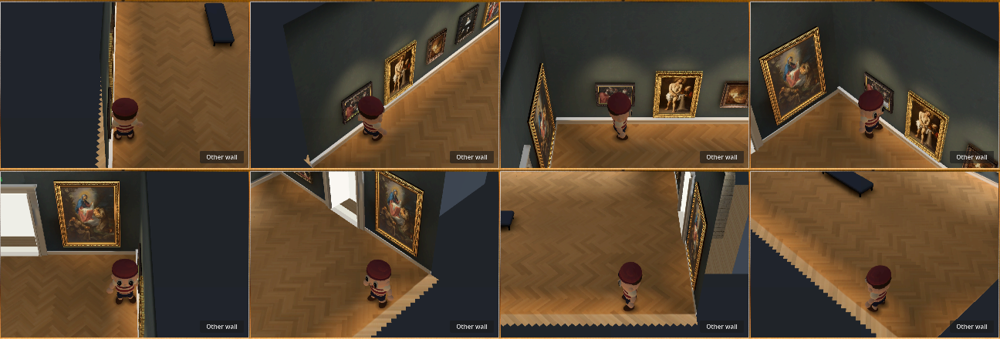 | 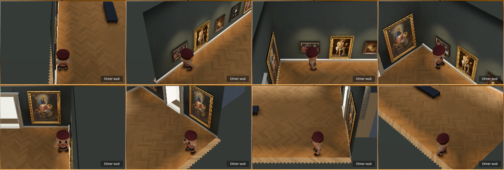 |
| Warm | 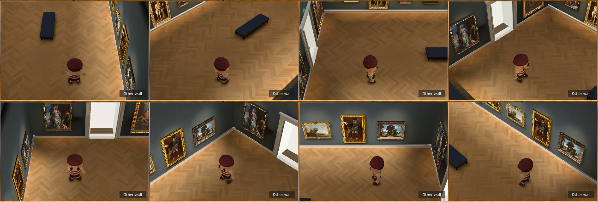 | 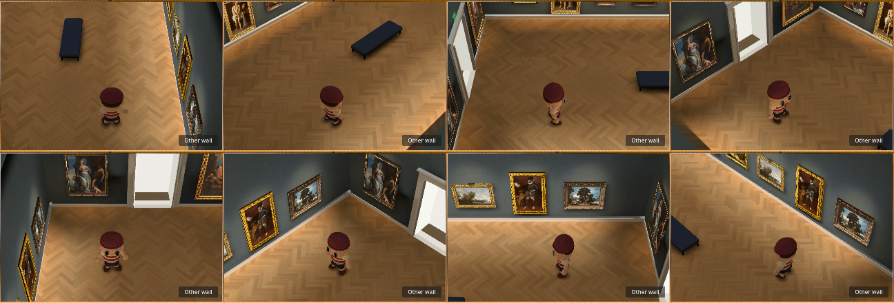 |
| Art | 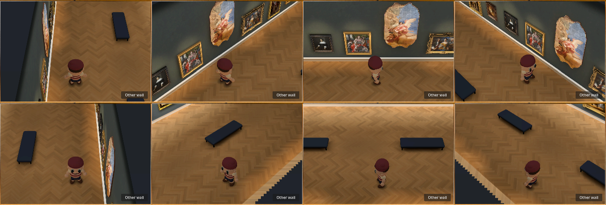 | 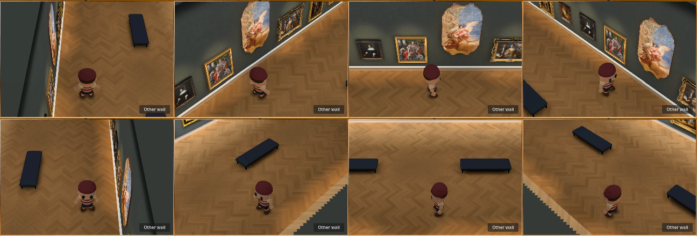 |
| White |  | 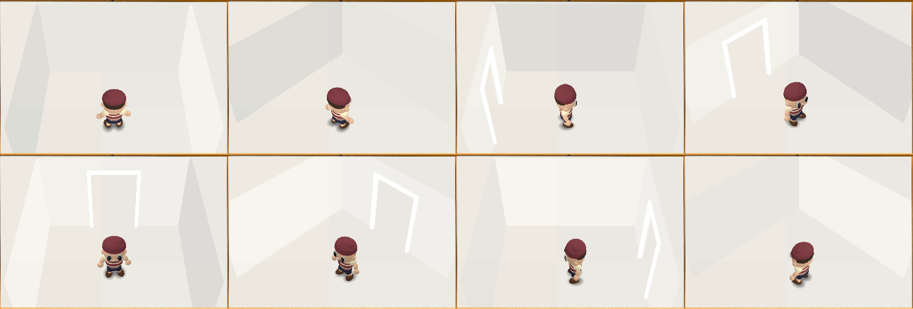 |

All eight white-room full-RGB comparisons contain **zero changed pixels**. The warm pools and paintings remain present because their materials/bake are untouched, but the background trial does not solve the visible cutaway edge. Near-wall turning also exposes finite floor edges in some directions; a constant backdrop cannot make those surfaces continue. `measurements.json` records changed-pixel counts and hashes of all raw captures; those counts are diagnostic, not a quality score. Small foreground edge differences can occur between render phases, so this report does not claim pixel identity of all gallery geometry.

Both runs logged the actual renderer **Microsoft D3D12, NVIDIA GeForce RTX4070SUPER, OpenGL ES3.1, Godot Compatibility** and zero runtime Light3D nodes. Logs are included. No performance gain, browser-delivery result, navigation acceptance, or continuous-motion certification is claimed: the candidate failed the visual gate before those stages and no production change is proposed. Existing production tests were not needlessly repeated for a rejected diagnostic-only trial. `git diff --check` passes.

## Reproduce

From this worktree, after the ordinary Godot asset import:

```bash
source /home/reidsurmeier/promo-lab/gpu-env.sh
godot --rendering-method gl_compatibility --path . --script res://docs/evidence/gallery-cutaway-diagnosis/sentinel.gd
godot --rendering-method gl_compatibility --path . --script res://docs/evidence/gallery-cutaway-diagnosis/background_trial.gd
```

The sentinel writes `/tmp/gallery-triangle-proof`; the comparison writes `/tmp/gallery-background-trial`. These scripts are evidence-only and excluded with `docs/*` from the web game pack. No new runtime options or test-only production seams were introduced.
