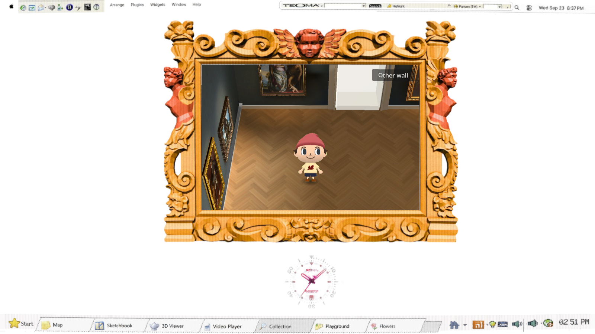
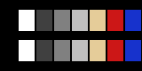

# Controlled GameCube display comparison — #140

Compared runtime: `9acb174`, based on `cde21b9`. Checkpoint code `9af800b` additionally keeps the next white-room diagnostic replay inside the room; that fixture adjustment is awaiting its browser comparison. The shader default remains RGB6 raster parity with copy strength **0.5**. Diagnostic controls isolate alternatives without changing scene assets, camera, lights or shell geometry. This comparison uses the existing sprite as a fixed control; the new 3D visitor must receive a final integrated visual/interaction pass.

## Evidence and decision

Initial packet was rejected by independent blind review because all matched variants were RGB-identical. Actual browser material readback found the cause: the shell inserts a shadow Control ahead of the SubViewportContainer, so `get_child(0)` changed the shadow material. The production shader was intact. The adapter now resolves the display through its viewport parent and checks actual class and shader path. A high-gradient chart inside the displayed viewport must change pixels between bypass and current before recording. Corrected runtime `9acb174` passes that preflight with202,199 changed pixels. Fresh independent visual decision pending. No variant has been selected, and the plain-six-bit versus parity round remains to run after that decision.

The native container probe already behaved correctly. Its initial RGBA `ImageChops.getbbox()` inspection was misleading because the unchanged alpha channel hid the RGB difference; explicit RGB comparison confirms15,458 changed pixels. No redraw workaround or shader change was needed.





Matched warm motion: [A](A-1600-warm.webm), [B](B-1600-warm.webm), [C](C-1600-warm.webm). White-room motion at720px: [A](A-720-white.webm), [B](B-720-white.webm), [C](C-720-white.webm).

Actual browser GPU: `ANGLE (Microsoft Corporation, D3D12 (NVIDIA GeForce RTX 4070 SUPER), OpenGL ES 3.1)`. Godot 4.7.2 Compatibility, 2× 3D MSAA. A 1600×900 browser gives a **584×391** native gallery; a 720×486 browser gives **641×429**. The native size follows the existing gallery window layout, not a fixed 480×320 target. All comparisons within each size use exactly the same native dimensions.

Twenty-four recordings cover three copy strengths, two window sizes and four poses: entrance, warm floor, art wall and white room. Each drives the actual navigation and camera with the same eight-second/480-tick input schedule: walk, stop, turn, reverse, stop. This fixture does not replace the separate production entrance/input check. Each record completed, retained 23 paintings, and ended outside replay. All 479 common recorded ticks match exactly in position, camera transform, camera yaw, space and viewport across variants. Warm-scene region pixels remain identical over a 500ms hold at both sizes in every variant. That static check does not prove absence of moving raster-phase crawl; the videos supply the motion evidence.

[Per-case timing and matched-path results](copy-summary.json) preserve all 24 outcomes. Browser requestAnimationFrame median is 16.7ms, p95 16.7–16.8ms. Godot post-draw interval medians remain near16.7ms (one candidate reaches17.0ms). Relative to control, the largest candidate median increase is 2.41%. One candidate has a34.45% post-draw p95 increase in the1600px art scene (28.1ms versus20.9ms); its white-room p95 also exceeds10%. The performance gate does not pass for that candidate on this observation. Repeat the affected matched scene if blind review prefers it before considering selection. These are one recording per case with shared browser/recording overhead, not isolated GPU execution timings or a population-level performance claim. The diagnostic adapter records actual Godot process delta and post-draw intervals separately from requestAnimationFrame; optional expensive viewport GPU queries were disabled for this run.

## Independent color check




The GPU test renders actual 3D unshaded and ambient-lit material cards with 2× MSAA, then passes the result through the finish. Black/white and both material rows survive; bypass differs by exactly zero. Plain-six-bit and parity outputs are within 0.001915 of their expected finished values. Nine quantization/filter combinations, quiet CRT/haze exclusion, and exclusion mapping refresh pass. Arithmetic checks validate implementation, **not** equivalence to Nintendo hardware.

The initial chart assumed material color `0.1` should produce byte 26. Actual Compatibility output is byte23 (~0.0902) in both lit and unlit rows. Godot's polynomial sRGB decode and approximate encode explain this engine/backend behavior ([primary engine source](https://github.com/godotengine/godot/blob/4.5/drivers/gles3/shaders/tonemap_inc.glsl)); an independently computed byte oracle matches the measured chart within 2.97e-8. No compensating gamma curve was added to the display shader. The oracle derives from the engine color path, not the shader under test.

## Verification

- [Repository checks](repo-check.log): passed; existing ObjectDB teardown warnings retained.
- [Native Compatibility checks](gallery-check.log): passed, 0 render/visitor/navigation assertions, all23 artworks and300 fuzz walks. Baked-scene stale UID warnings fall back to correct text paths; no ERROR lines.
- [Exported production browser controls](browser.json): all6 passed with no QA adapter mounted. Visible entrance, mouse drag, horizontal wheel in both directions, both other-wall directions, camera and lighting controls pass. Standing/walking/turning browser requestAnimationFrame median16.7ms andp9516.8ms; these are browser presentation proxies, separate from the Godot timings above.

The first browser attempts accidentally omitted the host hardware environment and selected Mesa llvmpipe. Their replays timed out while progressing slowly (about80ms per Godot frame); callback delivery was intact. Those captures are excluded from the comparison. The corrected run above identifies the actual hardware backend, and the capture harness now rejects software/unknown renderers when hardware mode is requested. GPU timing queries were initially suspected; no causal claim about them is supported.

The completed browser run retains a404 response plus pre-existing shell warnings about unavailable 2D MSAA and missing `arrow_cursor` metadata. No script parse or JavaScript runtime exceptions were reported; the404 remains in the attached log. Console output is not described as clean.

## Reproduce

```bash
source /home/reidsurmeier/promo-lab/gpu-env.sh
scripts/check.sh
scripts/check-gallery.sh /tmp/gallery-display-native
# Serve the exported build locally, then use its actual commit-named HTML.
node scripts/gallery-render-compare.cjs "$GALLERY_EXPORT_URL" /tmp/gallery-copy-comparison
RENDER_SCENES=warm,white node scripts/gallery-render-compare.cjs "$GALLERY_EXPORT_URL" /tmp/gallery-quantization current,rgb6-plain
node scripts/gallery-browser-check.cjs "$GALLERY_EXPORT_URL" candidate-display-finish
```

Optional `RENDER_WIDTHS` and `RENDER_SCENES` narrow a repeated diagnostic. `?final_render=bypass` preserves the input color and disables copy softening at the same viewport size; `copy-none`, `copy-full`, and `rgb6-plain` select isolated experiments. `original` still selects the historical legacy effect and is not a neutral bypass. `?render_qa=1` alone mounts the replay adapter; normal visitors receive no diagnostic node. `?render_gpu_times=1` additionally enables optional per-viewport profiling.

## Limits

This remains a post-composite approximation, after Godot shading/MSAA, rather than original GameCube per-fragment EFB quantization. The reference upload's capture/encoding chain is unknown. The museum's authored parquet frequency and lighting cannot be repaired by a global filter. Read the [primary-source plan](../../research/gamecube-reference-rendering-plan.md) for the console/game/capture distinctions. No added animated grain, warp, chromatic split, global tint, realtime light or shadow was introduced.
