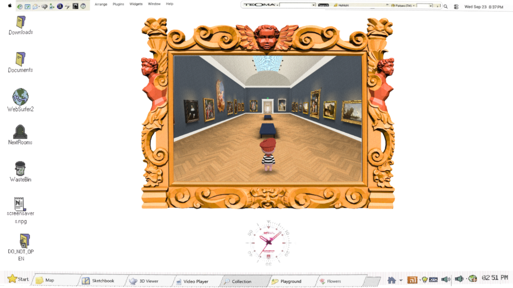
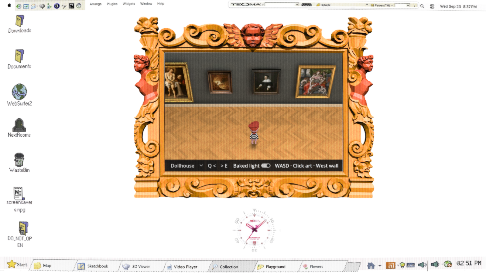

# Grand Gallery dollhouse prototype — #132

Runtime build: `7c23281`, compared with `84604cb`. No push, PR or release.
Owner visual reaction is still required; this record verifies the implementation,
not that the Animal Crossing resemblance has been accepted.

[Before movement](before.webm) · [After movement](after.webm) ·
[Same pose, old lighting](dollhouse-old-light.png) ·
[Same pose, baked lighting](dollhouse-baked.png) · [35° comparison](gallery-baked.png).

## What changed

45°/20° dollhouse camera with screen-relative movement and quarter-turn cutaways;
35°/30° and original cameras remain selectable. Existing approved materials now
have persisted meshes, independent lighting UVs and native offline LightmapGI.
119 meshes, zero runtime lights. Footstep timing follows the selected stride's
contact frames and actual distance moved. No new Muse generation; $0 spent.
The back-view character is explicitly retained as a placeholder for this camera decision.

## Verification

- `scripts/check-gallery.sh /tmp/gallery-verified`: exit 0. 23/23 artworks opened;
  hidden wall scenario executed; fixed camera motion and focus loss passed.
  Both bench routes finished; 300/300 random routes finished; partially visible E6 opened.
- `scripts/check.sh`: passed; `git diff --check`: passed.
- Native rebake: 119 users, 16.41 seconds. Save errors are checked; failed runs
  restore the previous scene, textures, lightmap and project settings.
- Negative controls: black-room setting, removed hidden-wall filter and pre-fix
  bake command each failed for the intended reason. Fixed versions pass.
- Chrome clicked the camera menu and selected Gallery, then toggled baked light;
  URL state confirmed both interactions. This independently covers the dropdown
  wiring; Godot harness camera selection is semantic public-control setup.
- Text-only Q/E labels corrected missing web-font glyphs. A focused run after
  semantic Original-menu setup printed `ORIGINAL_CAMERA_SETUP fov=58`, exit 0.

Chrome, 1600×900, ANGLE D3D12 NVIDIA RTX 4070 SUPER. Five seconds per phase;
recording runs afterwards. Both runs were warmed before measurement (baseline
55 seconds; candidate waits for tab warm-up plus 3 seconds). These are browser
requestAnimationFrame intervals, not GPU timestamps. Predeclared budget: median
and p95 no more than 10% above baseline; **passed**.

| Phase | Baseline median / p95 ms | Candidate median / p95 ms |
| --- | --- | --- |
| standing | 16.7 / 16.7 | 16.7 / 16.7 |
| walking | 16.7 / 16.7 | 16.7 / 16.7 |
| turning | 16.7 / 16.7 | 16.7 / 16.8 |

Load transfer: 143,032,320 → 148,211,930 bytes
(+3.6%). Candidate desktop Compatibility
reports 185,501,013 texture bytes for the mounted demo and 85 draw calls.
This is a desktop allocation proxy, not browser texture-memory proof; direct
browser texture allocation is still unmeasured. Both old and baked scene assets
remain loaded for the comparison.

The first Web export failed: both compressed texture formats had been disabled.
Desktop/mobile formats and mobile import are now enabled. The check waits for
actual tab warm-up and rejects missing resources before measuring. The failed
loading-screen run was discarded. Remaining favicon, MSAA and cursor-metadata
messages also occur in the baseline; the new resource errors are gone.
Godot's baker emits internal list/shutdown diagnostics despite saved valid data;
the saved scene and actual Web rendering, not its success line alone, were verified.
The repo headless check reports existing exit-time ObjectDB leaks.

## Standards

Three findings resolved: silent new controls now use the existing select cue;
scene save failures propagate; toolbar-order-coupled test setup uses visible
item names. Semantic setup is retained with actual Chrome interaction owning UI
wiring proof. No frozen module interface/error/acceptance file changed.

## Spec

Two findings resolved: failed bake restores the working assets, and a hidden-wall
negative case proves cutaway paintings cannot intercept selection. Review agent
verdict: DONE for implemented code. Browser texture-memory measurement remains
unavailable; back-view character and owner visual acceptance remain explicit limits.

## Ponytail (ultra)

Lean already. Native LightmapGI and existing room, collision, picking and harness
code are reused. No new dependency or framework.

ponytail: 0 findings, 0 fixed, 0 accepted

Counts: Standards 3 resolved; Spec 2 resolved; Ponytail 0.

## Repeat

`python3 modules/shell/prototype/gallery_walk4/bake/run.py`

`scripts/check-gallery.sh && scripts/check.sh && git diff --check`

`scripts/export-web.sh`

Browser check: source `~/promo-lab/gpu-env.sh`, then run
`node scripts/gallery-browser-check.cjs <served-build-url> candidate <baseline.json>`.
It uses the host's installed Puppeteer/Chrome/ffmpeg; `PUPPETEER_MODULE` can locate
another existing Puppeteer installation. No new package was installed.

The [bake README](../../../modules/shell/prototype/gallery_walk4/bake/README.md)
records the texture workflow and application of the requested
[OpenClaw test audit](https://github.com/openclaw/openclaw/blob/main/.agents/skills/test-audit/SKILL.md).
