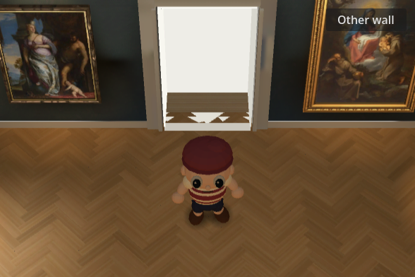
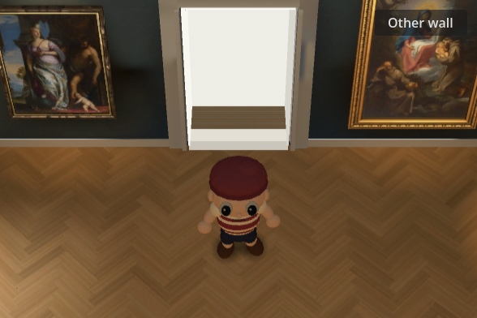
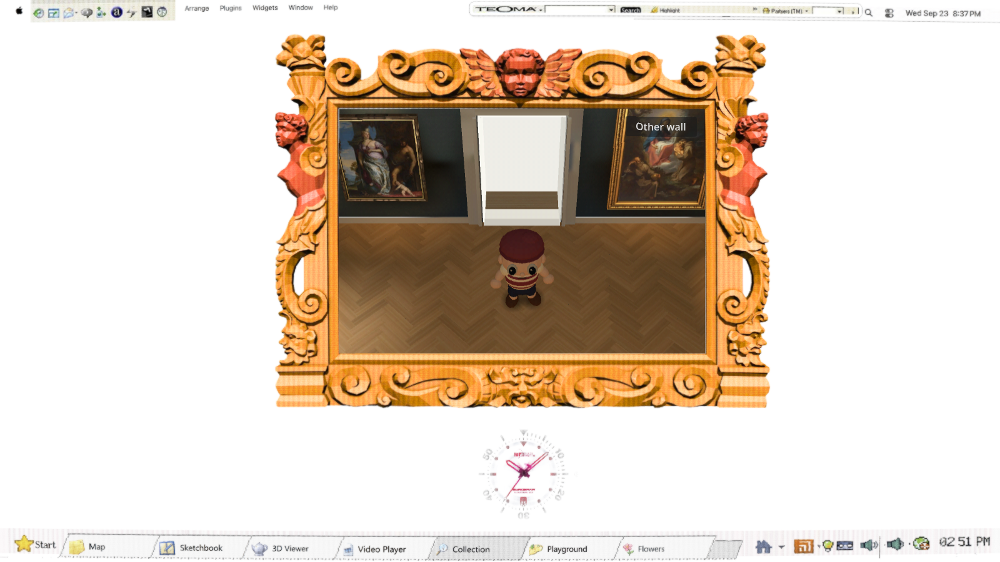
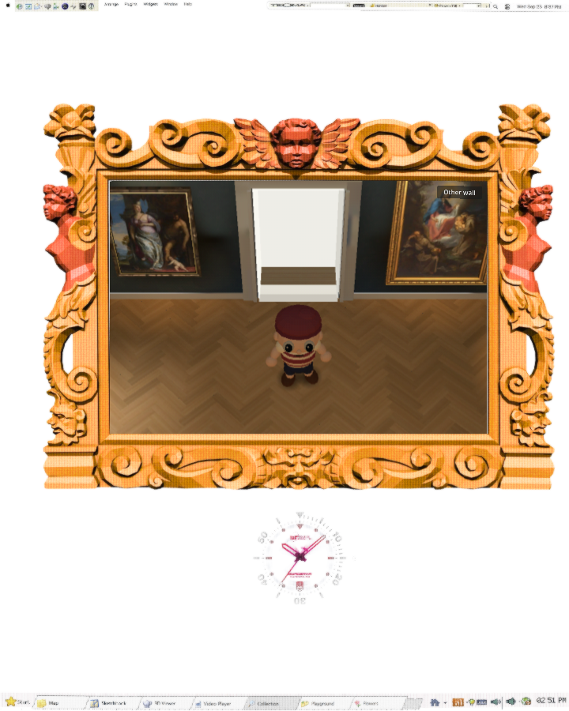

# Doorway floor fragments — #139 follow-up

The broken white strips and triangles were depth conflicts between two surfaces, not a directional arrow or a broken texture. The parquet builder emits whole planks whose corners extend past the end walls. Those planks overlapped the white doorway recess at the same y=0 floor plane. Camera movement changed which coplanar fragments won the depth test.





The baked oak shader and the original parquet shader now discard only floor fragments beyond the gallery's end planes, z=0 and z=-26.3. This retains the existing UVs, baked illumination, floor height, casing, deeper floor finishes, white-room transition, and all navigation. There is no raised floor, material depth override, camera change, new geometry or rebake. The original shader applies this only when `plank_seams` identifies the parquet; other museum surfaces are unaffected.

The deeper wooden strip in the arch passage and darker floor in the far passage remain intentional existing scenery. This change removes the overlapping parquet fragments at the front, rather than replacing those doorway finishes.

## Evidence

The Compatibility-rendered `doorway_check.gd` checks the visible passage floor from both ends at1152×720 and588×392, with baked and original lighting. Nine projected sample points in the arch's front strip must show its light floor; nine far-passage samples must remain visible rather than void. All eight configurations pass. The test's in-memory negative control removes the two clip statements without changing assets or adding a production flag; the baked arch falls to3/9 visible samples at both sizes and reproduces the triangular shards. The far passage remains intact in the negative control because its older floor finish already covers the overshoot.

Actual Chrome entry and both white-room round trips were tested at1600×900 and720×900. Screenshots and entry/portal videos are included, and `browser.json` records transitions. The author inspected the entry stills and sampled motion across the threshold; no triangular fragments remain in the inspected evidence. Existing cursor-metadata, MSAA and favicon messages remain; no new script error appeared. `scripts/check.sh` and diff checks pass. The focused rendered check is part of `scripts/check-gallery.sh`.





[Desktop entry/portal recording](1600-entry-portal.webm) · [Narrow entry/portal recording](720-entry-portal.webm)

```bash
source /home/reidsurmeier/promo-lab/gpu-env.sh
godot --rendering-method gl_compatibility --path . --script res://modules/shell/prototype/gallery_walk4/doorway_check.gd -- --out-dir=/tmp/gallery-doorway
godot --rendering-method gl_compatibility --path . --script res://modules/shell/prototype/gallery_walk4/doorway_check.gd -- --out-dir=/tmp/gallery-doorway-negative --negative
# The second command must exit1 and reproduce the overlap.
node modules/shell/prototype/gallery_walk4/doorway_browser_check.cjs <served-build-url> /tmp/gallery-doorway-browser
```

No generation or spending. This is a narrow doorway fix; it does not claim final character or reference-match acceptance.
