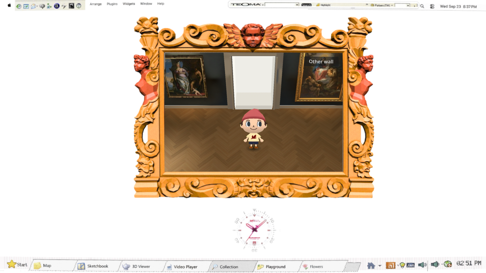
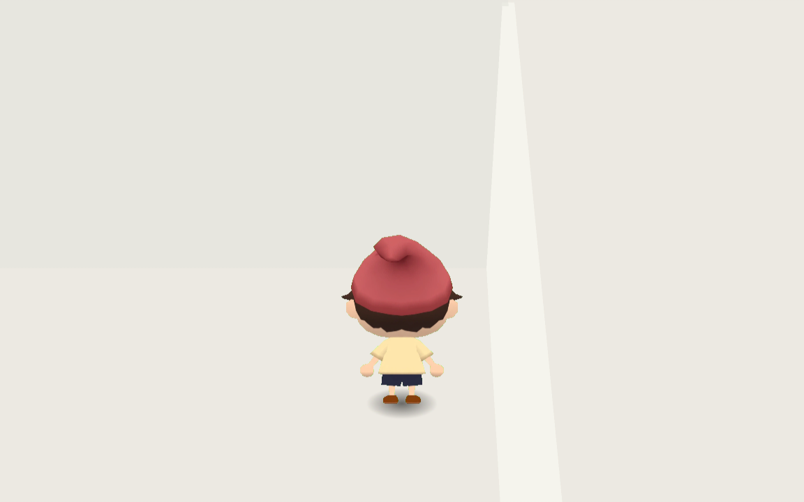

# Walk into the gallery and test both exits

Runtime **`fdd9b33`**, September 26, 2026. The viewer opens with the new visitor walking through the entrance after loading finishes. Both end doorways lead to plain white test rooms and allow returning to the gallery. Dragging or horizontal wheel input turns the view; the other-wall shortcut still gives access to the painting walls.





[Browser walking and turning recording](walk.webm) · [Small browser shell](browser-small.png) · [Drag result](browser-drag.png) · [Horizontal wheel result](browser-wheel.png) · [Arch-side white room](white-arch.png)

The recording is a later walking/turning pass, not a recording of the initial entrance. It contains no audio. The initial entrance has separate native frame-change checks and exported-browser completion evidence.

## Character and approval

Muse supplied the four-view character. Seedance supplied the motion; no motion was drawn or interpolated. The owner explicitly chose **“Use the reviewed cuts experimentally”** after the generated Run failed deterministic media verification. That exception covers these reviewed application cuts only:

| Playback | Source frames, zero-based | Imported frames | Directions |
|---|---|---:|---|
| Walk | 51–71, every frame | 21 full sheets | Front, back, left, right |
| Curious head look | 96–131, every second frame | 18 cropped cells at 12 fps | Front only |
| Raised-hand greeting | 132–179, every second frame | 24 cropped cells at 12 fps | Rear only |

The internal `wave` name means a raised-hand greeting, not a full waving loop. Side gestures were rejected. Moving or changing facing cancels a gesture. Fixed per-clip/view registration preserves the generated bob and foot lift. Small gait seam resets and shape drift remain; the stills use a relatively level character view against the steep gallery camera. **This is experimental sprite animation, not an exact Animal Crossing reproduction or a skeletal rig.**

The original Run remains **failed and uncertified**. It returned 960×960 / 193 frames instead of the requested 720×720 / 192 frames, and its trailing MP4 index failed the tool's pipe-only decoder despite complete seekable-file decoding. No original Run record was rewritten. `humanReviewed:false` is retained separately from owner authorization. [Failure diagnosis](../../research/seedance-character-media-mismatch.md), [independent motion review](independent-motion-review.md), and [application recovery record](recovery.json) preserve the distinctions.

Actual spend: **Muse $0.01 + Seedance $0.60795 = $0.61795**. Seedance exceeded its $0.35 per-run reservation; this is recorded, not hidden by the aggregate budget. Extraction, import, testing and this evidence pass added **$0**. No replacement generation was submitted.

## Verification

The [native suite](native-suite.log) passed on the integrated character/navigation/rendering work: GPU final-render checks report zero failures; the quiet CRT/haze region matches expected pixels; motion tests require 21/18/24 frames, reject empty/static controls, and verify direction restrictions and cancellation. Both doorway roundtrips pass, including delivered keyboard events and [real projected floor-click roundtrips](door-click-check.log). Every **23/23 painting** opens through real picking; **0/300** route stress walks fail. [Startup confirmation](startup-check.log) reran navigation after correcting the initial facing pose. [Repository checks](repo-check.log) passed; the export log identifies [runtime fdd9b33](export.log).

Chrome used ANGLE/D3D12 on the RTX 4070 SUPER, 1600×900, 300 samples per phase:

| Phase | Median frame time | 95th percentile |
|---|---:|---:|
| Standing | 16.7 ms | 16.7 ms |
| Walking | 16.7 ms | 16.7 ms |
| Turning | 16.7 ms | 16.8 ms |

This is approximately **60 fps on the tested machine**, not a device-independent performance promise. Measured resource transfer was 159,694,617 bytes. [Raw browser JSON](browser.json) and [browser log](browser.log) include successful visible-entrance completion, real mouse drag without a release click, horizontal wheel in both directions, both other-wall crossings and authoring camera/lighting controls.

The browser log retains existing nonblocking messages: a resource 404, unsupported GLES3 2D MSAA, and missing `arrow_cursor` metadata. Repository shutdown reports six ObjectDB leaks. These are not described as a clean console.

Independent browser-motion review inspected 28 gallery samples at 6 fps and 57 character crops at 12 fps from the 142-frame recording. It found no severe clipping, green-matte spill, body breakup or large room/display flicker in those samples. The discrete back-to-side change matches four-view playback. This was sampled-frame inspection, not continuous playback; fine temporal crawl and foot-contact synchronization remain unverified.

## Test-audit follow-through and limits

The earlier [test audit](test-audit.md) identified missing evidence. This pass adds actual browser drag/wheel transport, native entrance pixel changes rather than only a running timer, empty/static animation negative controls, keyboard and floor-click doorway roundtrips, and exported-shell captures at 1600×900 and 720×486. The GPU quiet-region test remains narrow arithmetic evidence; the shell screenshots add visual inspection without claiming complete aesthetic equivalence.

A **physical trackpad was not tested**; synthetic browser horizontal-wheel events exercise transport. Native doorway coverage does not establish every browser pointer route. Still screenshots and frame hashes do not certify a seamless gait, independently articulated hands/head, or exact source-game rendering. The approved experimental cuts retain these limits.

Reproduce with the existing repository commands:

```bash
scripts/check.sh
source /home/reidsurmeier/promo-lab/gpu-env.sh
scripts/check-gallery.sh /tmp/gallery-entry-check
node scripts/gallery-browser-check.cjs <served-fdd9b33-url> candidate-entry <baseline-json>
git diff --check
```
