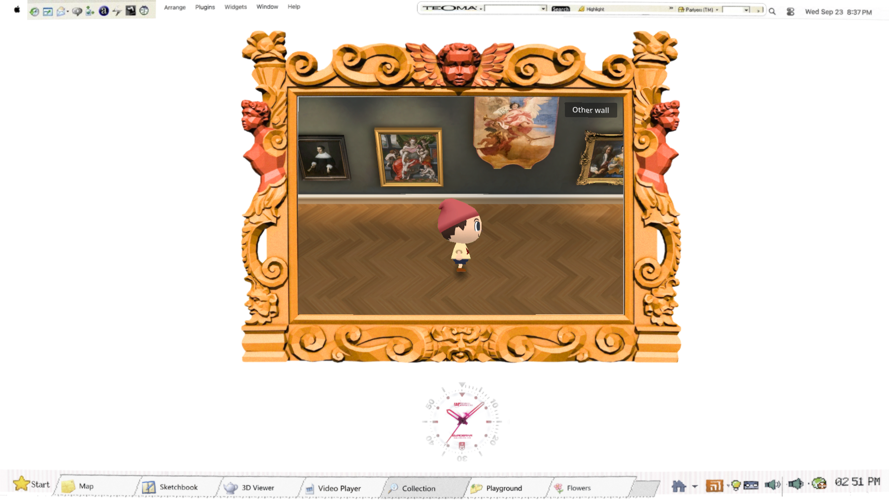
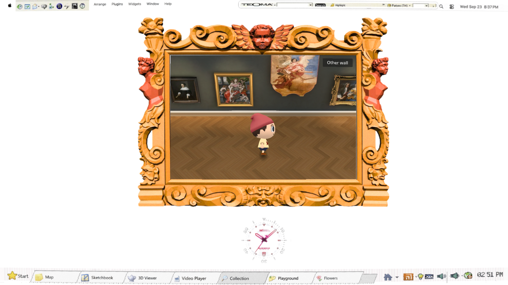
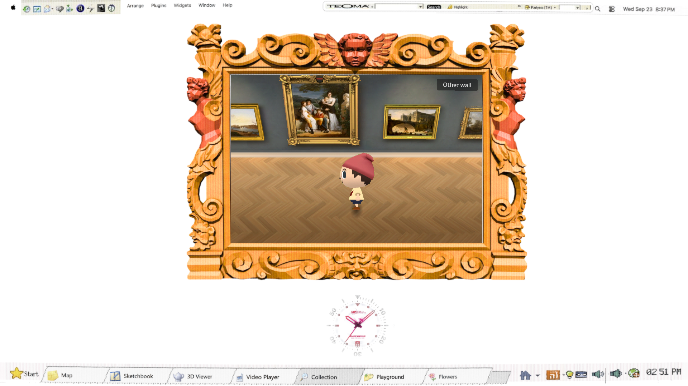
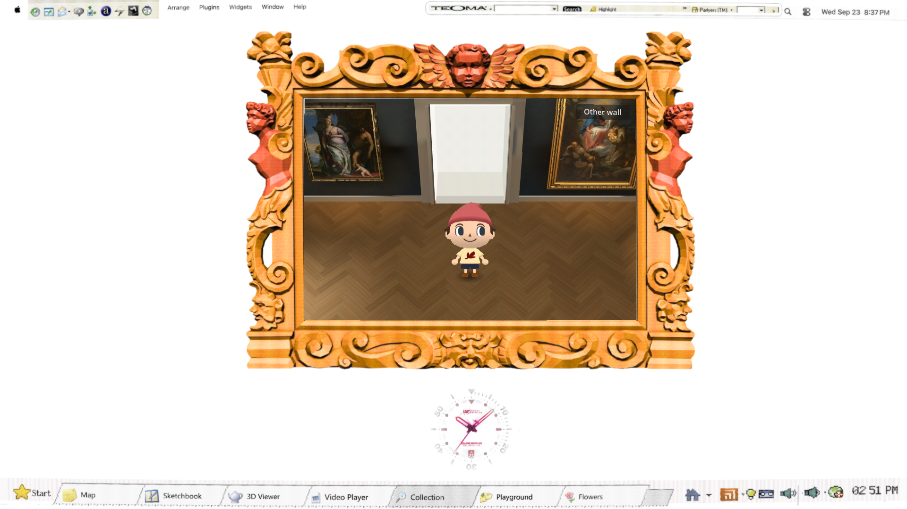
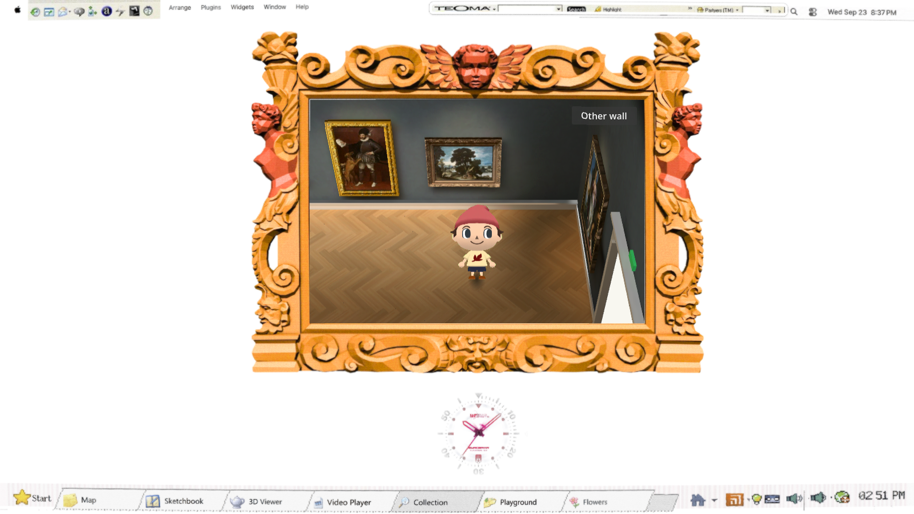

# Final lamp refinement

The final pass softens the repeated pale lamp caps above the paintings while retaining the warm floor pools and readable ivory trim. It changes two bake settings: spotlight energy 8→6 and the target from 0.3 m above each painting's center to its center. The room was rebaked with 118 lightmap users; runtime lights remain absent. The existing GameCube finish is retained after an independent review found no shader defect requiring another filter.

| Before | Selected result |
| --- | --- |
|  |  |
|  |  |

Independent blind review retained the result after inspecting all three fixed-pose pairs: the west wall's pale/olive cap is less conspicuous, the doorway preserves ivory face separation, and the east wall retains its warm floor and clear trim. The improvement is subtle; it is not an exact-match claim. No further lighting change was justified by these comparisons.

The owner-approved character is preserved: all 67 tracked visitor image, manifest and runtime files are byte-identical to approved commit `ed54e32c77c2144c5a8f07a9ccbe12691c46322e`. See [SHA256 comparisons](approved-character-hashes.json). No new image or motion generation was performed and this pass spent $0.

`scripts/check.sh` and `scripts/check-gallery.sh` passed against runtime `670e820` using the Compatibility renderer. [Repository output](repo-check.log), [rendered-suite output](gallery-check.log).

1. GPU quantizer/filter, CRT/haze exclusion and mapping refresh: zero failures; black/white preserved.
2. Visitor motion: 21 walk, 18 look and 24 greeting frames exercised; empty/static substitutions rejected, zero failures.
3. Both white rooms entered and exited by keyboard and floor clicks; entrance and drag/wheel controls passed.
4. All 23 paintings opened, both bench routes arrived, all 300 randomized routes passed, and a partially visible painting opened. Walking produced eight contacts in two seconds; blocked movement produced none.

The actual `670e820.html` export passed `scripts/gallery-browser-check.cjs` in Chrome at 1600×900 on ANGLE/D3D12 RTX4070SUPER. Standing, walking and turning each measured 16.7 ms median and 16.7 ms p95 (about 60 fps), passing the previous `fdd9b33` frame-time budget. Six browser checks passed: visible entrance, drag without accidental click, horizontal wheel in both directions, both wall directions, camera selection and lighting comparison. Transfer was 159,697,296 bytes, 2,679 bytes above the prior baseline. [Result](browser.json), [baseline](browser-baseline.json), [output](browser.log), [export log](export.log).

The [720px view](browser-720.png) keeps the character, trim and warm floor readable. The [30fps walking/turning recording](browser-motion.webm) is silent; it does not prove footstep audio alignment. Screenshots were inspected directly. The console contains the same baseline favicon404, unsupported 2D-MSAA and missing `arrow_cursor` metadata diagnostics; there were no resource-loader or RuntimeError failures. The repository check retains six pre-existing ObjectDB shutdown leaks. The [bake log](bake.log) retains the known editor teardown diagnostics as well as `BAKE_OK users118`; they are not hidden. [Shader review](shader-review.md) explains why the existing RGB6/filter finish remains unchanged.

The independent reviewer then inspected the fresh exported browser screenshots against the previous build and retained the pass: softer overhead halos survived export, warm floor and ivory-face separation remained, and the accepted visitor stayed intact. No new clipping or CRT/haze exclusion seam was visible at either reviewed window size. [Final visual verdict](blind-review.md). Scope complete for this refinement; exact Nintendo equivalence and audio synchronization are not claimed.
